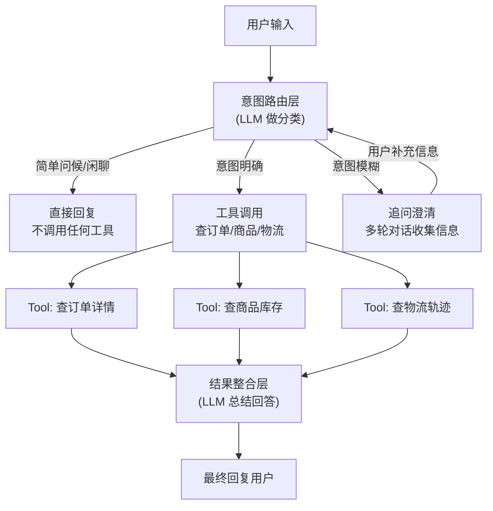
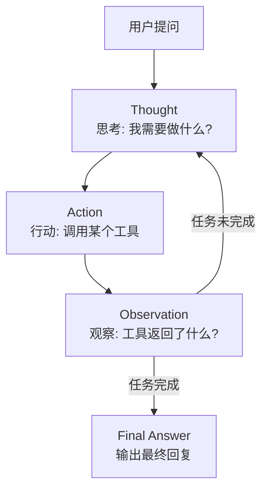
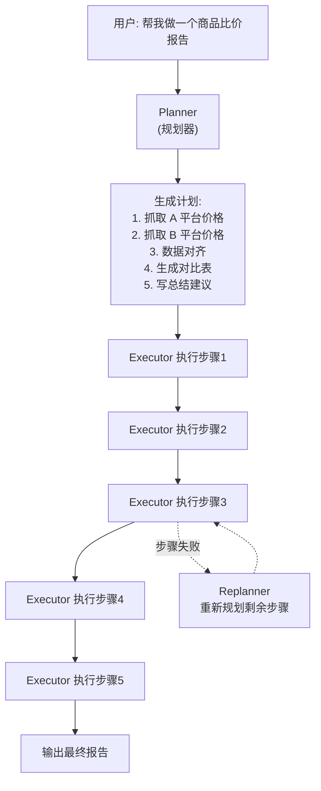
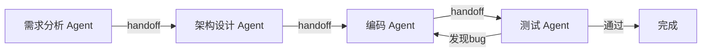
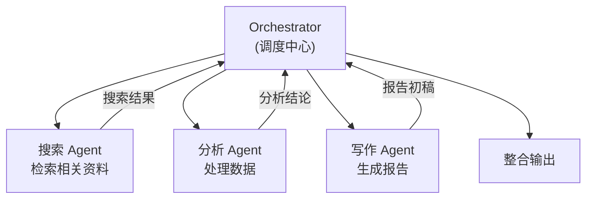

# Agent 四大设计范式（深度展开）

> 最后整理: 2026-05-21 | 来源: 从 agent-development-practice.md 拆分（原文 599 行 / 12 章节超阈值）

> 关联: [agent-development-practice](./agent-development-practice.md) — 范式选型、框架速查、学习路径、vs Java 对比（本文的导览页）
> 关联: [llm-agent-mcp](../大模型/llm-agent-mcp.md) — Agent 循环、MCP 协议、FC 机制的概念原理
> 关联: [openai-agents-sdk](./openai-agents-sdk.md) — Multi-Agent 范式的工业实现
> 关联: [agent-ops-and-resilience](./agent-ops-and-resilience.md) — 运维/SRE 视角（可观测性、成本、熔断、开源方案）

---

## 范式 1：意图路由（Router Pattern）

最简单也最常见的 Agent 范式。用一个电商客服答疑工具举例——用户发一句话，Agent 先判断意图，再决定怎么处理。

### 三层决策路由架构



### Prompt 即路由器

**核心洞察：意图识别不是独立模块，而是 System Prompt 的一部分。**

传统 NLP 需要训练分类模型 + 标注数据 + 单独部署。Agent 模式下，LLM 通过 Prompt 就能同时完成分类 + 参数提取 + 回复生成：

```python
SYSTEM_PROMPT = """你是一个电商客服助手。收到用户消息后，先判断意图类型：

## 意图分类规则
1. **直接回复** — 简单问候、闲聊、与业务无关的问题
2. **工具调用** — 用户在询问具体数据，且信息完整。例如：
   - "帮我查一下订单 2026050100123 的状态" → 调用 query_order
   - "这个商品还有货吗" → 调用 query_stock（需要商品ID）
3. **追问澄清** — 用户意图涉及业务，但信息不完整。例如：
   - "我要退货" → 缺少订单号，需要追问

## 可用工具
- query_order(order_id): 查询订单详情（状态、金额、物流）
- query_stock(product_id): 查询商品库存
- apply_refund(order_id, reason): 发起退款申请

## 行为要求
- 信息不完整时，友好追问缺少的字段，不要瞎猜
- 工具返回 JSON 后，用自然语言总结给用户
"""
```

### Function Calling 完整交互流程

一次交互拆解为两轮 LLM 调用：

```
用户: "帮我查一下订单 2026050100123 到哪了"

┌─ Round 1: LLM 推理 ────────────────────────┐
│ 输入: system_prompt + 用户消息 + tools 定义  │
│ LLM 内部思考: "要查订单物流，ID 完整"        │
│ LLM 输出（结构化 JSON，不是文字）:            │
│   { "tool_calls": [{                        │
│       "function": {                         │
│         "name": "query_order",              │
│         "arguments": "{\"order_id\":        │
│           \"2026050100123\"}" }}] }          │
└─────────────────────────────────────────────┘
         ↓ Agent 框架拦截，真正调用后端 API
┌─ Round 2: LLM 总结 ────────────────────────┐
│ 输入: 之前的对话 + API 返回的 JSON            │
│ LLM 输出: "您的订单已从杭州仓发出，          │
│   当前在北京分拣中心，预计明天送达。"          │
└─────────────────────────────────────────────┘
```

### 多轮追问：信息不完整时的自动澄清

```
用户: "我要退货"
LLM: "好的，请问您要退哪个订单？请提供订单号。"

用户: "上周买的那个手机壳"
LLM: "我帮您查了一下，您上周有两个订单：
      1. 订单 #0123 - 硅胶手机壳 ¥29
      2. 订单 #0456 - 钢化膜 ¥15
      请问要退哪一个？"

用户: "第一个"
LLM: → 调用 apply_refund(order_id="#0123", reason="用户主动退货")
     → "已为您提交退款申请，预计 1-3 个工作日到账。"
```

**追问不是写死的对话流程**，LLM 根据工具定义中的 `required` 字段自动判断缺什么就问什么。

### 和传统客服 Bot 的对比

| 维度 | 传统规则 Bot | Agent 模式 |
|------|-------------|-----------|
| **意图识别** | 分类模型（训练数据 + 规则） | LLM 通过 Prompt 理解 |
| **槽位填充** | 独立的 NER 模型 | LLM 从对话中自动提取 |
| **对话管理** | 有限状态机（写死流程） | LLM 自主决策下一步 |
| **工具调用** | if-else 硬编码 | Function Calling 动态路由 |
| **扩展新功能** | 加规则 + 改代码 + 重训练 | **加一个 tool 定义就行** |
| **处理模糊问题** | "对不起，我没听懂" | LLM 自然语言追问 |

---

## 范式 2：ReAct（推理 + 行动循环）

ReAct = **Re**asoning + **Act**ing。Agent 不是一次性决策，而是循环执行"思考→行动→观察"直到任务完成。

### 核心循环



### 和意图路由的区别

意图路由是**一次性判断**：分类 → 调一个工具 → 返回。ReAct 是**多步循环**：可能需要调多个工具、前一步的结果影响下一步的决策。

```
用户: "帮我比较一下 iPhone 16 和 Galaxy S26 哪个值得买"

Thought 1: 我需要先查两款手机的参数
Action 1:  search_product("iPhone 16") → 拿到价格、配置
Observation 1: iPhone 16, A18芯片, 6.1寸, ¥6,999

Thought 2: 再查另一款
Action 2:  search_product("Galaxy S26") → 拿到价格、配置
Observation 2: Galaxy S26, 骁龙8Gen4, 6.2寸, ¥6,499

Thought 3: 用户说"值得买"，可能关心性价比，我再查下评价
Action 3:  search_reviews("iPhone 16 vs Galaxy S26")
Observation 3: 综合评测数据...

Thought 4: 信息够了，可以给出对比建议
Final Answer: "两款手机对比如下：..."
```

**Claude Code 就是 ReAct 范式**——读代码 → 思考 → 改代码 → 跑测试 → 看结果 → 再改，循环直到完成。

### 实现要点

```python
# ReAct 的核心 Prompt 模板
REACT_PROMPT = """请按以下格式思考和行动：

Thought: 分析当前状况，决定下一步做什么
Action: 工具名(参数)
Observation: [工具返回结果，由系统填入]
... (可以重复多轮 Thought/Action/Observation)
Thought: 我已经有足够的信息了
Final Answer: 最终回复
"""
```

**框架支持**：LangChain 的 `create_react_agent`、LlamaIndex 的 `ReActAgent` 都内置了 ReAct 循环。

---

## 范式 3：Plan-and-Execute（先规划再执行）

面对复杂任务时，先让一个 Planner LLM 生成整体计划，再让 Executor 逐步执行。

### 架构



### 和 ReAct 的区别

| 维度 | ReAct | Plan-and-Execute |
|------|-------|-----------------|
| **决策方式** | 每一步都临场判断 | 先做全局规划，再逐步执行 |
| **适合任务** | 步骤不确定、需要灵活应对 | 步骤可预见、需要系统化执行 |
| **失败处理** | 重新思考下一步 | Replanner 重新规划剩余步骤 |
| **典型产品** | ChatGPT Plugins、Claude Code | Devin、AutoGPT |
| **类比** | 走迷宫时走一步看一步 | 先看地图规划路线再出发 |

### 实际例子：Devin 的工作方式

```
用户: "帮我搭建一个博客网站，要支持暗色模式"

Planner 输出:
  Step 1: 初始化 Next.js 项目
  Step 2: 安装 Tailwind CSS
  Step 3: 创建首页布局组件
  Step 4: 创建文章列表页
  Step 5: 创建文章详情页
  Step 6: 实现暗色模式切换
  Step 7: 添加 SEO 元数据
  Step 8: 本地运行验证

Executor 逐步执行:
  Step 1: ✅ npx create-next-app@latest blog
  Step 2: ✅ 安装 Tailwind（用 CLI 工具）
  Step 3: ✅ 创建 Layout.tsx
  Step 4: ❌ 文章列表接口报错
  → Replanner: 修改 Step 4 为"使用本地 markdown 文件代替 API"
  Step 4(重试): ✅ 读取 /posts/*.md 渲染列表
  Step 5-8: ✅ 逐步完成
```

---

## 范式 4：Multi-Agent（多 Agent 协作）

多个 Agent 各司其职，通过消息传递协作完成复杂任务。已有的 [OpenAI Agents SDK 笔记](./openai-agents-sdk.md) 详细讲了 Handoff 机制，这里总结两种常见编排模式。

### 编排模式 A：接力式（Pipeline）

Agent 之间线性传递，每个 Agent 完成自己的部分后移交给下一个：



**代表**：OpenAI Agents SDK 的 Handoff 机制。

### 编排模式 B：中心调度式（Orchestrator）

一个 Orchestrator Agent 负责分发任务，子 Agent 各自执行后汇报结果：



**代表**：Claude Code 的子 Agent 模式——主 session 分派任务给子 Agent，子 Agent 干完活回来汇报。

### 两种模式对比

| | 接力式 | 中心调度式 |
|------|--------|-----------|
| **上下文** | 完整对话历史传递 | 子 Agent 各自独立上下文 |
| **并行性** | 串行执行 | 可并行分派 |
| **适合** | 流程明确的流水线任务 | 需要多角色同时工作的任务 |

---

> 回到导览页：[agent-development-practice](./agent-development-practice.md) — 范式选型、主流框架速查、学习路径、Agent 开发 vs 传统 Java 应用六维对比
