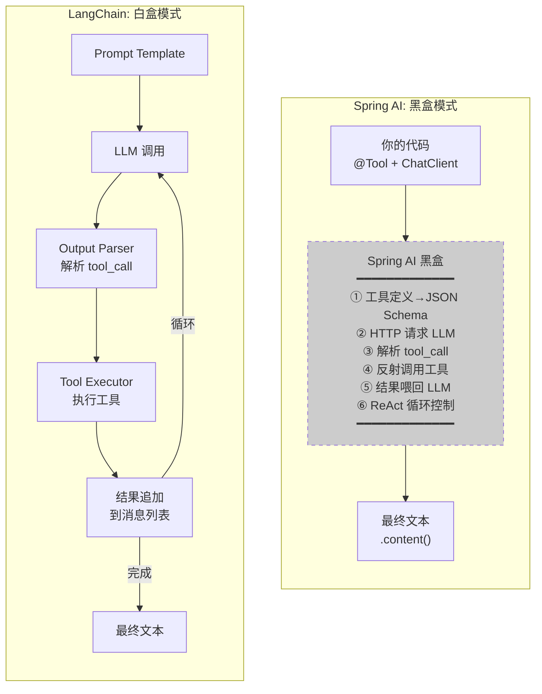

# Spring AI vs LangChain 深度对比

> 最后整理: 2026-05-26 | 来源: 对话讨论

> 关联: [agent-development-practice](./agent-development-practice.md) — Spring AI Agent 开发实战
> 关联: [langchain-agent-guide](./langchain-agent-guide.md) — LangChain Agent 开发指南
> 关联: [agent-patterns](./agent-patterns.md) — Agent 四大范式深度展开

---

## 1. 用一个 Java 开发者熟悉的类比建立直觉

```
Spring AI    ≈  Spring Data JPA
LangChain    ≈  JdbcTemplate

Spring Data JPA:
  你定义 interface UserRepository extends JpaRepository<User, Long>
  → findById(), save(), findAll() 自动生成
  → 不需要写 SQL，不需要管理连接，不需要处理 ResultSet
  → 代价: 复杂查询不好写，框架黑盒难调试

JdbcTemplate:
  你写 SQL: "SELECT * FROM users WHERE age > ?"
  你处理 ResultSet → User 映射
  你管理事务边界
  → 每一行都是你写的，完全可控
  → 代价: 代码量大，简单 CRUD 也要写一堆
```

映射到 Agent 开发：

| JPA vs JdbcTemplate | Spring AI vs LangChain |
|---------------------|------------------------|
| JPA 自动生成 CRUD | Spring AI 自动跑 ReAct 循环 |
| JdbcTemplate 手写 SQL | LangChain 手写 Chain/Agent 逻辑 |
| JPA 的 `@Query` 注解 | Spring AI 的 `@Tool` 注解 |
| JdbcTemplate 的 `RowMapper` | LangChain 的 `OutputParser` |
| JPA 不好调试内部机制 | Spring AI 黑盒难追踪 |
| JdbcTemplate 灵活但啰嗦 | LangChain 灵活但代码多 |

---

## 2. 同一个场景，两个框架的代码并排看

场景：用户说"查订单 123，如果已发货就退款"。

### Spring AI 版（你熟悉的）

```java
// ===== 你写的全部代码 =====
@Tool(description = "查询订单详情")
public OrderInfo queryOrder(@Param("订单号") String orderId) {
    return orderService.getById(orderId);  // ← 工具1
}

@Tool(description = "发起退款")
public RefundResult refund(@Param("订单号") String orderId) {
    return refundService.apply(orderId);  // ← 工具2
}

// Controller
@PostMapping("/chat")
public String chat(@RequestBody String msg) {
    return chatClient.prompt()
        .system("你是电商客服，先查订单再决定是否退款")
        .user(msg)
        .tools(tools)    // ← 注册工具
        .call()          // ← Spring AI 自动: 调LLM→解析tool_call→执行→喂回→循环
        .content();      // ← 拿最终结果
}

// 代码量: ~20 行 Java
// 可见性: 你只看到 call() 和 content()，中间发生了什么完全不知道
```

### LangChain 版（拆开给你看）

```python
# ===== 第 1 层: 定义工具（和 Spring AI 一样）=====
@tool
def query_order(order_id: str) -> str:
    """查询订单详情，包括状态、金额、物流"""
    return json.dumps({"orderId": order_id, "status": "已发货", "amount": 299})

@tool
def refund(order_id: str) -> str:
    """发起退款"""
    return f"退款成功: {order_id}"

# ===== 第 2 层: 定义 Prompt 模板（Spring AI 帮你写了）=====
prompt = ChatPromptTemplate.from_messages([
    ("system", """你是电商客服。按以下格式思考和行动:
    
    Thought: 分析当前状况
    Action: 工具名称
    Action Input: JSON 参数
    Observation: 工具结果（系统填入）
    ... (可重复)
    Final Answer: 最终回复

    可用工具: {tools}
    工具名称: {tool_names}
    """),
    ("placeholder", "{chat_history}"),      # ← 对话历史占位
    ("human", "{input}"),                   # ← 用户输入占位
    ("placeholder", "{agent_scratchpad}")   # ← ReAct 中间步骤占位
])

# ===== 第 3 层: 创建 LLM 实例（Spring AI 的 ChatModel）=====
llm = ChatOpenAI(model="deepseek-chat", temperature=0)

# ===== 第 4 层: 组装 Agent（Spring AI 的 ChatClient）=====
agent = create_react_agent(llm, [query_order, refund], prompt)

# ===== 第 5 层: 配置 Executor（Spring AI 的 call()）=====
executor = AgentExecutor(
    agent=agent,
    tools=[query_order, refund],
    max_iterations=10,           # ← 防止死循环
    verbose=True,                # ← 打印每步决策
    handle_parsing_errors=True   # ← LLM 输出格式错误自动重试
)

# ===== 第 6 层: 执行（Spring AI 的 content()）=====
result = executor.invoke({"input": "订单123如果已发货就退款"})
print(result["output"])

# 代码量: ~40 行 Python
# 可见性: 每一层都暴露在你面前，每一步都能替换
```

---

## 3. 架构图对比：黑盒 vs 白盒



**核心差异**：Spring AI 把那 6 步打包成一个 `.call()`；LangChain 把每一步拆成一个独立组件，你用管道符串起来。

---

## 4. 设计哲学

```
Spring 生态的核心哲学:
  "我们帮你做好了 90% 的决策，你只需要关心剩下 10% 的业务逻辑"
  
  体现: @SpringBootApplication 帮你做了组件扫描、自动配置、属性绑定
        ChatClient.call() 帮你做了 ReAct 循环、工具映射、结果喂回

LangChain 的核心哲学:
  "我们不做决策，我们只提供标准化的零件和接口，你自己决定怎么组装"
  
  体现: 没有"一键 Agent"，你必须显式定义 Prompt → LLM → Parser → Tool → Loop
        但每一步都可以换成你自己的实现
```

---

## 5. 什么时候选哪个

```
选 Spring AI 的场景:
  ✅ Java 团队，不想引入 Python
  ✅ 简单的 ReAct Agent（客服答疑、数据查询）
  ✅ 快速验证想法，先跑起来再说
  ✅ 已有 Spring Boot 基础设施（监控、日志、部署）

选 LangChain 的场景:
  ✅ 需要高度定制 Agent 行为（自定义 ReAct 策略、特殊路由逻辑）
  ✅ 需要 LangGraph 的复杂状态机编排
  ✅ 团队有 Python 能力或愿意引入 Python 微服务
  ✅ 需要 LangChain 生态的 50+ LLM 供应商支持

两者不互斥:
  最常见的是"Java 做工具层 + Python 做编排层"
  Spring Boot 暴露工具 API → LangGraph 通过 HTTP 调用 → 编排 Agent 流程
```

---

## 6. 对照学习映射表

你已有的 Spring AI 知识是很好的锚点。每学一个 LangChain 概念，做这个映射：

| Spring AI 概念 | LangChain 对应 | 区别 |
|---------------|---------------|------|
| `ChatModel` 接口 | `BaseChatModel` | 几乎一样，都是 LLM 抽象 |
| `ChatClient` | `AgentExecutor` | LangChain 的 Executor 是显式的，你配参数 |
| `FunctionCallback` | `@tool` 装饰器 | 几乎一样 |
| `.call().content()` | `executor.invoke()` | LangChain 要显式组装 Agent |
| `MessageChatMemoryAdvisor` | `ConversationBufferMemory` | LangChain 有多种策略可选 |
| `ChatClientObservationConvention` | Callbacks + Langfuse | LangChain 的 tracing 生态更成熟 |
| Spring Boot Auto-Configuration | 无 | LangChain 没有"自动配置"，全手动组装 |
| `@Tool` 注解 (MCP) | MCP Server (langchain-mcp-adapters) | 都支持 MCP 协议 |

---

> 关联: [agent-development-practice](./agent-development-practice.md) — Spring AI 路线（Java 原生）
> 关联: [langchain-agent-guide](./langchain-agent-guide.md) — LangChain Agent 完整开发指南
> 关联: [agent-patterns](./agent-patterns.md) — Agent 四大范式深度展开
