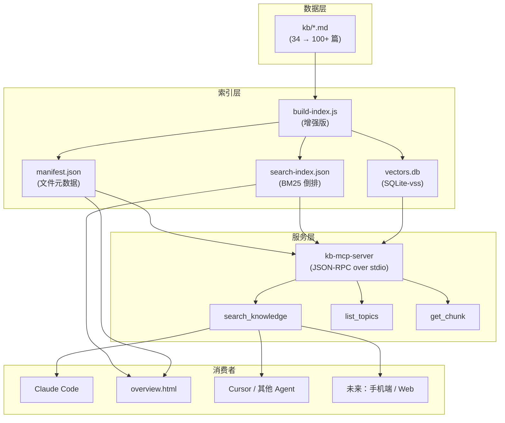

# 个人知识库接入 RAG 的规划

> 最后整理: 2026-05-19 | 来源: 对话分析 + 项目现状评估

> 关联: [llm-agent-mcp](<../大模型/Agent 与 MCP.md>) — Agent/MCP 基础
> 关联: [llm-prompt-rag](<../大模型/Prompt 与 RAG.md>) — Prompt 与 RAG 体系
> 关联: [mcp-protocol](<../大模型/MCP 协议：AI 界的 USB-C.md>) — MCP 协议实现

---

## §1 当前现状（2026-05-19 快照）

| 指标 | 数值 |
|------|------|
| 文件数 | 34 个 md |
| 总行数 | 9,641 行 |
| 总字符数 | ~383KB |
| 最大文件 | 599 行 |
| 平均每文件 | ~284 行 |

**结论：当前不需要 RAG。** 383KB 文本可以全量塞进 Claude 200K context（约 400-500KB 中文），搜索无瓶颈。

---

## §2 什么时候需要 RAG？（触发阈值）

| 信号 | 阈值 | 说明 |
|------|------|------|
| **文件数** | >80 篇 | 超过单次 context window 能全量读入的极限 |
| **总字符数** | >500KB | 同上，对应约 150K tokens |
| **搜索质量下降** | 频繁"我写过但找不到" | 关键词搜索失效，需要语义检索 |
| **跨文件关联推理** | 经常需要综合多篇 | BM25 不够，需要 embedding 相似度 |
| **对外服务需求** | API 化、多端访问 | 需要独立检索服务 |

**预估到达时间**：按当前增长速度（每月 8-12 篇），约 2026 年 Q3-Q4 到达 80 篇阈值。

---

## §3 渐进式实现路径

### 第一步：BM25 倒排索引（50 篇时实施）

**目标**：增强 overview.html 搜索精度，零成本。

```
当前: build-index.js → manifest.json (文件列表 + 标题/描述)
增强: build-index.js → manifest.json + search-index.json (BM25 倒排索引)
```

**实现思路**：
- 按 `##` 标题将每篇文件分 chunk
- 对每个 chunk 做中文分词（jieba-wasm 或简单正则）+ 提取关键词
- 建立倒排映射：`关键词 → [{file, chunkId, tf-idf权重}]`
- overview.html 搜索改为读 search-index.json 做 BM25 打分

**成本**：0（纯本地 Node 脚本）
**复杂度**：低（约 100-150 行 JS）

---

### 第二步：MCP Server 暴露知识库检索工具（80 篇时实施）

**目标**：让任何支持 MCP 的 Agent 能自动从知识库拉取相关上下文。

```typescript
// kb-mcp-server — 知识库检索 MCP 服务
tools:
  - search_knowledge(query, topK=5)  → 语义/关键词检索，返回相关 chunk
  - list_topics()                    → 列出所有主题和描述
  - get_chunk(file, chunkId)         → 获取特定段落全文
```

**消费者**：
- Claude Code（`.mcp.json` 配置即用）
- Cursor / 其他 MCP 兼容 Agent
- 未来自研工具

**成本**：0（本地 Node 进程）
**复杂度**：中（约 200-300 行 TS）

---

### 第三步：Embedding 向量检索（有语义搜索刚需时）

**目标**：支持"相关但不含关键词"的语义检索。

**技术选型**：

| 组件 | 推荐方案 | 理由 |
|------|---------|------|
| Embedding 模型 | BGE-M3 (本地) 或 text-embedding-3-small (OpenAI) | 中文效果好，成本极低 |
| 向量存储 | SQLite + sqlite-vss | 零依赖，一个 .db 文件，最适合个人项目 |
| 索引更新 | git hook / build-index.js 增量 | 文件变更时自动重建受影响 chunk 的向量 |

**流程**：
```
文件变更 → chunk 分段 → embedding 模型 → 存入 vectors.db
查询时 → query embedding → 余弦相似度 → topK → (可选)rerank
```

**成本**：BGE-M3 本地免费 / OpenAI 约 $0.02/1M tokens（知识库全量 embedding 一次 <$0.01）
**复杂度**：中高（需要引入 embedding 依赖）

---

## §4 架构全景（最终形态）



---

## §5 为什么现在不做？

1. **383KB 全量可读** — 当前 Claude 能一次读完所有文件，RAG 反而引入噪声（召回不全）
2. **投入产出不匹配** — 建设成本 > 当前收益，不如继续积累内容
3. **搜索没瓶颈** — `codebase_search` + overview.html 全文搜索在 34 篇规模下效果够好
4. **过早优化的代价** — 选型可能随技术发展过时（如更好的 embedding 模型、MCP 生态变化）

**核心原则：在需要的时候再建设，不提前过度工程。**

---

## §6 决策检查清单（未来用）

当以下条件满足 **任意两项** 时，启动第一步：

- [ ] 知识库文件数 > 50 篇
- [ ] 总字符数 > 400KB
- [ ] 出现 2 次以上"我写过但搜不到"的情况
- [ ] overview.html 搜索体验明显不足

当以下条件满足 **任意两项** 时，启动第二步：

- [ ] 知识库文件数 > 80 篇
- [ ] Claude Code 无法一次读完所有文件（session 开始时出现截断）
- [ ] 需要在非 Claude Code 环境中访问知识库
- [ ] 跨文件综合推理的需求频繁出现
