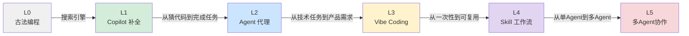
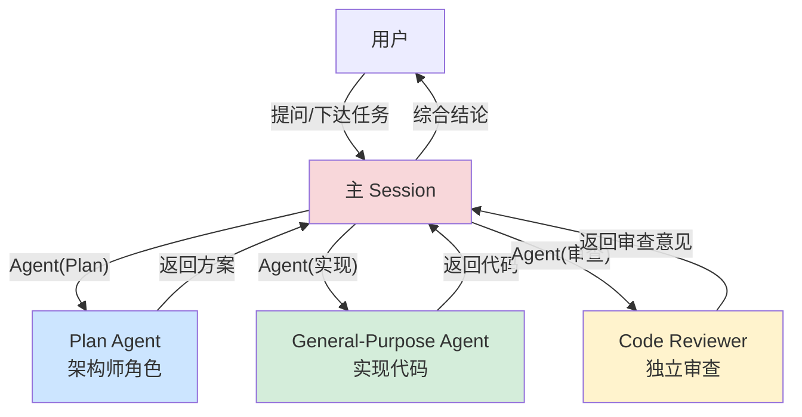
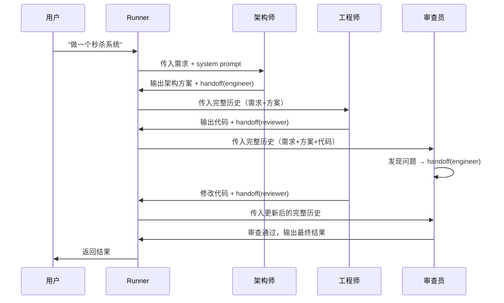

---

tags: [ai-coding, vibe-coding, agent, copilot, skill, multi-agent, 编程范式]
related:
  - kb/技术/ai/llm-agent-mcp.md
  - kb/技术/ai/openai-agents-sdk.md
  - kb/技术/ai/claude-code-architecture.md
  - kb/技术/ai/ai-coding-team-governance.md
description: "从古法编程到多Agent协作6个Level、程序员未来展望"
---

# AI 编程的递进路径：从古法编程到多 Agent 协作

> 最后整理: 2026-05-06 | 来源: 对话讨论

从"人写代码"到"人管 AI"，程序员利用 AI 的方式经历了 6 个递进层级。不是替代关系，而是能力分层——高 Level 的使用者往往同时使用低 Level 的能力。

## Level 概览



---

## Level 0: 古法编程（纯手工）

```
人 → 思考 → 手写代码 → 调试 → 完成
```

没有 AI 辅助。搜索引擎（Google + Stack Overflow）是唯一的"外挂"。IDE 最多帮你补全变量名、自动格式化。

**核心特征**：人既当架构师又当打字员，知识全部在脑子里。

**代表工具**：Vim、IntelliJ IDEA（不用 AI 插件的模式）

**适合场景**：学习编程语言基础、算法面试刷题、对性能有极致要求的底层代码。

---

## Level 1: Copilot（补全模式）

```
人思考 → 写注释/函数签名 → AI补全代码 → 人审查修改 → 完成
```

GitHub Copilot、Codeium、通义灵码都属于这一类。

**核心特征**：AI 是"更强的自动补全"。人在主导，AI 帮你在已有思路上加速。你写 `// 解析 JSON 中的用户信息`，它帮你补全实现。

**适用人群**：所有程序员。上手零成本，IDE 装个插件就行。

**局限**：AI 不理解整体架构，只会按上下文猜下一行代码。复杂逻辑还是需要人写。

---

## Level 2: Agent（代理模式）

```
人给任务 → Agent分解 → 调工具(读文件、运行、搜索) → 人审查 → Agent修改 → 完成
```

Claude Code、Cursor Agent Mode、Devin 属于这一类。

**核心特征**：AI 不再只补全一行代码，而是**独立执行多步骤任务**。你说"给这个函数加单元测试"，它自己读文件、理解逻辑、写测试、运行、修 failing 的测试。

### Agent 和 Copilot 的本质区别

| 维度 | Copilot | Agent |
|------|---------|-------|
| 交互方式 | 你写一行，它猜一行 | 你给目标，它自己干 |
| 人在循环中的位置 | 循环内（主导每一步） | 循环外（监督者/验收者） |
| 能力范围 | 补全当前光标附近的代码 | 跨文件修改、运行命令、搜索代码库 |
| 错误处理 | 人自己改 | 自己运行测试、修复、再运行 |
| 上下文理解 | 当前文件的前后几行 | 整个代码库的结构和语义 |

### Claude Code 的 Agent 机制

Claude Code 的 Agent 采用**中心控制 + 子 agent** 的模式：



每个子 Agent 启动时是**干净上下文**——看不到主 session 的对话历史，所以 review 是真正独立的"第二意见"。

---

## Level 3: Vibe Coding（感觉编程）

```
人描述"我想要什么" → AI生成完整应用 → 人试用 → "感觉不对，改一下X" → AI改 → 完成
```

Andrej Karpathy 提出的概念。用自然语言描述需求，不看代码，只管"感觉对不对"。

**核心特征**：**人彻底不碰代码**，甚至不需要懂编程。你说"帮我做一个记账小程序，要好看的"，AI 生成前端+后端+数据库，你在浏览器里试，说"这个按钮颜色太丑了"，AI 改。

**适用人群**：非程序员也能用。但程序员用它做原型极快。

**和 Agent 的区别**：
- Agent：你给的是**技术任务**（"重构这个函数的错误处理"）
- Vibe Coding：你给的是**产品需求**（"我想要一个好看的记账应用"），不涉及任何技术术语

**代表工具**：v0.dev、Lovable、bolt.new

---

## Level 4: Skill/Workflow（工作流编程）

```
人定义 Skill（规则+流程）→ AI自动执行 → 人持续优化 Skill → 持续交付
```

Claude Code 的 Skill 系统、Custom Instructions、AI 编程中的 MCP Server 都属于这一层。

**核心特征**：**编程的重心从"写一次代码"变成"定义一套规则"**。你不是让 AI 写一个函数，而是定义"每次遇到 X 情况时自动做 Y"。

### 典型例子

| Skill | 效果 |
|-------|------|
| TDD Skill | 每次实现功能前先写测试用例 |
| Security Review Skill | 每次提交前自动按清单做安全审查 |
| Project Context Skill | 每次新对话自动加载 CLAUDE.md 了解项目 |
| Code Review Skill | Review PR 时按固定检查清单逐项审查 |

### Skill 和 Agent 的区别

| 维度 | Agent | Skill |
|------|-------|-------|
| 生命周期 | 一次性任务执行 | 持久化的行为模式 |
| 触发方式 | 人显式调用 | 自动匹配触发条件 |
| 可复用性 | 每次手动启动 | 定义一次，反复自动触发 |
| 类比 | "帮我做 X" | "以后每次遇到 X 就自动做 Y" |

---

## Level 5: 多 Agent 协作（团队模式）

```
人定义角色和规则 → 架构师Agent设计 → 工程师Agent编码 → 审查员Agent审查 → 自动循环 → 人验收
```

OpenAI Agents SDK、MetaGPT 属于这一层。

**核心特征**：**人不再和单个 AI 对话，而是管理一个 AI 团队**。你定义角色、规则、交接流程，然后让它们自动协作。

### OpenAI Agents SDK 的 Handoff 机制



**关键设计**：每个 Agent 拿到的是**完整对话历史**，不是只拿到上一步的输出。所以审查员能看到最初需求、架构方案、工程师代码，综合起来 review。

### 循环 Review 模式（打回重改）

```python
engineer = Agent(
    name="工程师",
    instructions="根据架构方案编写代码",
    handoffs=[handoff(reviewer, tool_name="request_review")]
)

reviewer = Agent(
    name="审查员",
    instructions="""严格审查代码。
- 发现问题: handoff 回 engineer 要求修改
- 通过: 输出最终结果，不再 handoff
- 同一问题连续两轮未修复: 标记 FAIL""",
    handoffs=[handoff(engineer, tool_name="send_back_to_engineer")]
)
```

形成环形：`engineer → reviewer → engineer → reviewer → ... → 通过/超时`

必须设 `max_turns` 防止无限循环。

### 底层原理

Handoff 底层依赖 LLM 的 **Function Calling**：

1. 每个 `handoff` 实际上是一个 tool（函数）
2. LLM 生成 handoff 时，返回一个 tool_call
3. Runner 切换到目标 Agent，重新组装 prompt：`system(new.instructions) + messages(完整历史) + tools(new.tools)`
4. 调用新 Agent 对应的 LLM，继续循环

**本质上是 prompt 工程 + function calling 的组合拳**，不是多模型并行推理。

### 与 Claude Code 的对比

| 维度 | Claude Code | OpenAI Agents SDK |
|------|-------------|-------------------|
| 控制流 | 中心化：主 session 控制，子 agent 干完活回来 | 接力式：Agent 之间直接移交，无主从关系 |
| 上下文 | 子 agent 是干净的 | 下一个 Agent 继承完整对话历史 |
| 使用场景 | 人在终端交互，即时反馈 | 自动化 pipeline，一次跑完出结果 |
| 角色定义 | 预设类型（Plan、code-reviewer 等） | 任意字符串定义，数量不限 |
| 循环控制 | 主 session 决定 | max_turns 或 Agent 自行决定 |

---

## 6 个 Level 对比速查

| Level | 人的角色 | AI 的角色 | 输入 | 输出 | 代表工具 |
|-------|---------|-----------|------|------|---------|
| 0 古法 | 架构师+打字员 | 无 | 想法 | 手敲代码 | Vim/IDE |
| 1 Copilot | 主导者 | 补全助手 | 代码上下文 | 下一行代码 | Copilot, 通义灵码 |
| 2 Agent | 任务分配者 | 独立执行者 | 技术任务 | 完成的任务 | Claude Code, Cursor Agent |
| 3 Vibe | 产品经理 | 全栈开发者 | 自然语言需求 | 可用应用 | v0, Lovable |
| 4 Skill | 规则定义者 | 自动执行者 | 触发条件 | 自动化行为 | Claude Code Skills, MCP |
| 5 多Agent | 团队管理者 | AI团队 | 产品需求+角色定义 | 完整交付 | OpenAI Agents SDK, MetaGPT |

---

## Level 5 之后：还需要程序员吗？

### 短期：需要，但角色变了

**为什么还需要程序员**：

1. **AI 会犯低级错误** — 越抽象的层，底层 bug 越难定位。多 Agent 协作产出了一整个微服务，但线上出现了 OOM，谁来排查？AI 可以帮忙看日志，但它不知道你系统的业务约束、历史包袱、哪些 hack 是"不能动的"。

2. **需求本身是模糊的** — 你告诉 AI 团队"做一个电商系统"，这个描述在人类之间都能产生 10 种理解。谁来把模糊需求翻译成精确的技术约束？还是程序员。

3. **Agent 需要被设计** — Level 5 的核心不是"AI 自动干活"，而是**人定义角色、规则、边界、审查标准**。一个糟糕的 architect prompt 会产出一整个团队的垃圾代码。谁写这些 prompt？谁调试 Agent 的 handoff 逻辑？还是程序员。

4. **责任最终在人** — AI 产的代码出了生产事故，AI 不背锅。谁来为系统的可靠性、安全性、合规性负责？人。

### 中长期：程序员的定义在漂移

```
过去：程序员 = 会写代码的人
现在：程序员 = 会用 AI 写出正确代码的人
未来：程序员 = 知道什么代码需要存在、为什么存在、出了问题怎么修的人
```

你不需要关心每一行代码怎么写，但你需要关心：

- **架构决策**：为什么用 Redis 而不是 MySQL 做 session 存储？这个决策在业务规模变化时还成立吗？
- **边界条件**：AI 生成的鉴权逻辑有没有覆盖你的特殊场景（比如灰度发布期间的兼容期）？
- **故障排查**：线上出了 bug，你能读懂 AI 写的代码并定位问题吗？
- **技术债务**：AI 为了快速交付用了一个 dirty hack，三个月后谁会知道这里有个坑？

### AI 重新定义了"经验"的价值边界

美团 31 万行代码重构实践中的一个关键洞察：

```
过去:
  初级工程师 → 只能看见自己写的几千行代码
  高级工程师 → "泡三年"才能建立整个系统的代码全局感
  经验价值 = "能看全"

现在:
  AI 可以秒读整个 31 万行代码库
  → 任何人都能用 AI 获得代码全局感
  → 经验价值从"能看全"转移到"能判断什么重要"
```

一个具体例子：团队工程师利用 AI 短时间内精准定位了 **10 个隐藏极深的性能隐患**——不合理的缓存 TTL、循环内的 RPC 调用、缺失的批量接口。这些问题散落在 31 万行代码中，传统方式靠人工 Review 几乎不可能穷举。但 AI 能快速扫描全量代码找出可疑模式——**关键是"人要知道让 AI 找什么"**。

**这意味着**：资深工程师的价值不再是"我知道代码里有什么"，而是"我知道什么模式可能出问题，然后让 AI 去找"。这正好呼应了 Level 5 的核心——人的角色从执行者变为判断者。

> 关联: [AI Coding 团队治理](./ai-coding-team-governance.md) — 美团 31 万行代码重构完整实践

### 一个类比：从汇编到 AI

| 时代 | 程序员关心什么 | "淘汰"了什么 | 创造了什么 |
|------|---------------|-------------|-----------|
| 汇编 | 寄存器、内存地址、指令周期 | 手动编码员 | 汇编语言程序员 |
| C 语言 | 指针、内存管理、数据结构 | 汇编程序员 | 系统级程序员 |
| Java | OOP 设计、框架选型、GC 调优 | 底层内存管理 | 企业级应用开发者 |
| Python | 业务逻辑、API 设计、依赖管理 | 样板代码编写 | 全栈/数据科学家 |
| AI 时代 | 需求翻译、架构约束、质量验收 | 重复性编码 | AI 团队管理者 |

每一层抽象都"消灭"了上一层程序员的一部分技能，但同时也创造了新的工作。**不是程序员不需要了，而是"程序员"这个词的含义变了**。

### 现实时间线（个人判断）

| 时间维度 | 变化 | 应对 |
|---------|------|------|
| 现在-1年 | AI 帮你写 CRUD、单元测试、重构 | 学会用 Agent 模式提效 |
| 1-3年 | AI 能独立完成一个服务的端到端开发 | 你的价值在架构设计 + 跨服务协调 |
| 3-5年 | 多 Agent 能协作完成一个中等复杂度项目 | 你的价值在需求翻译 + 质量把控 + 技术决策 |
| 5年+ | 不好预测 | 但肯定有人在做"AI 团队的管理者"这个角色 |

### 核心结论

Level 5 不是"程序员失业"，而是"程序员升级"。你不再关心每一行代码，但你比任何时候都更需要**理解系统的全貌**。知道什么代码该存在、为什么存在、出了问题怎么修——这些能力比手写代码的能力更稀缺。

---

## 实践建议

不同 Level 对应不同场景，不是"越高越好"：

| 场景 | 推荐 Level | 原因 |
|------|-----------|------|
| 修一个线上 bug | L2 Agent | 快速定位+修复，人在审查 |
| 做产品原型 | L3 Vibe Coding | 速度优先，能跑就行 |
| 建团队规范 | L4 Skill | 定义规则，反复自动触发 |
| 复杂项目交付 | L5 多Agent | 多角色并行，加速端到端 |
| 学习算法 | L0 古法 | 理解底层逻辑，AI 帮不了你 |
| 写 CRUD | L1 Copilot | 补全模式足够，无需 Agent |

**核心原则**：根据任务选择合适的 Level，不要为了用 AI 而用 AI。

---

## 三种编程范式：Vibe Coding vs Spec Coding vs Agentic Coding

6 个 Level 讲的是"AI 能力递进"，但 2025-2026 年业界还浮现了另一个维度的讨论——**三种编程范式**，区别在于"人怎么和 AI 协作"。

### Vibe Coding（感觉编程）

> 来源: Andrej Karpathy, 2025-02 | 柯林斯词典 2025 年度词汇

```
你说"我想要一个好看的记账应用" → AI 生成完整应用 → 你试用 → "按钮太丑了" → AI 改 → 重复
```

Karpathy 原话：**"I 'Accept All' always, I don't read the diffs anymore."**

- **输入**：模糊自然语言
- **人的角色**：想法描述者 + 视觉验收官（不看代码）
- **AI 角色**：代码生成器（猜你的意图）
- **速度**：分钟级从想法到可运行 demo
- **致命缺陷**：代码质量低。研究显示 AI 生成代码 bug 比人写多 **1.7 倍**，安全漏洞多 **2.74 倍**
- **适合**：原型、Demo、Hackathon、一次性脚本
- **工具**：v0.dev、Lovable、bolt.new、Replit Agent

### Spec Coding（规格驱动编程）

> 来源: OpenAI 研究员 Sean Grove (AIEWF 2025), AWS/GitHub 推动, 2025 年中兴起

```
写详细规格文档 → AI 根据规格生成代码 → 用规格中的验收标准验证 → 规格和代码一起维护
```

**三个成熟度**：

| 级别 | 做法 | 规格生命周期 |
|------|------|------------|
| **Spec-first** | 先写规格 → AI 生成代码 → 规格丢弃 | 一次性 |
| **Spec-anchored** | 规格和代码共存，同步演进 | 长期维护 |
| **Spec-as-source** | 人只编辑规格，代码完全生成，永不手改 | 规格是唯一源 |

- **输入**：结构化规格文档（需求 + 设计 + 任务拆解 + 验收标准）
- **人的角色**：规格作者 + code reviewer
- **AI 角色**：规格执行器（按合同办事，不猜）
- **速度**：小时到天级（写规格占项目 30% 时间）
- **优点**：消除歧义、可验证、可审计、符合合规要求
- **适合**：生产系统、企业应用、合规场景
- **工具**：GitHub Spec Kit（`/speckit.specify` → `/speckit.plan` → `/speckit.implement`）、AWS Kiro、Tessl

### Agentic Coding（自主编程）

> 2026 年新兴范式，建立在 Vibe 和 Spec 之上

```
AI Agent 自主完成 Plan → Act → Observe → Fix 闭环，人从"驱动者"变为"监督者"
```

区别于前两者：Vibe 和 Spec 都是**人驱动 AI**（人发起、人判断），Agentic Coding 是 **AI 驱动自己**（AI 规划、AI 执行、AI 自查、AI 修复）。

### 三种范式对比

| 维度 | Vibe Coding | Spec Coding | Agentic Coding |
|------|------------|-------------|----------------|
| **输入** | "我想要个 X" | 结构化规格文档 | 目标 + 约束边界 |
| **谁主导** | 人描述，AI 猜 | 人定义规格，AI 执行 | AI 自主规划执行 |
| **代码质量** | 低-中 | 中-高 | 中-高（依赖反馈回路）|
| **门槛** | 极低（非程序员可用）| 中（需要写规格能力）| 高（需要设计 Harness）|
| **速度** | 分钟级 | 小时-天级 | 分钟-小时级 |
| **适合** | 探索、原型 | 生产交付 | 持续迭代的复杂项目 |
| **典型工具** | v0.dev, Lovable | GitHub Spec Kit, AWS Kiro | Claude Code, OpenAI Agents SDK |

### 怎么选：互补而非对立

```
探索阶段  → Vibe Coding   （快速验证想法能不能行）
硬化阶段  → Spec Coding    （把验证过的想法变成可靠代码）
维护阶段  → Agentic Coding （AI 自主迭代，人监督）
```

业界共识：**三者不是竞争关系，是同一个项目的不同阶段用不同范式。** "Vibe coding and spec-driven development aren't competing approaches; they're complementary."

### 和 6 Level 模型的关系

```
6 Level 模型 = AI 能力递进（从 Copilot 补全到多 Agent 协作）
三种范式     = 人机协作模式（人怎么定义需求、怎么验收）

它们是正交的：
  - 用 Spec Coding 的方式，可以在 L2（Agent）执行
  - 用 Vibe Coding 的方式，也可以在 L5（多 Agent）执行
  - 同一个项目中可能早上 Vibe 探索，下午 Spec 硬化
```

> 关联: [Harness Engineering](./harness-engineering.md) — Agentic Coding 的工程基础（六原则、机械约束、分离评估）
