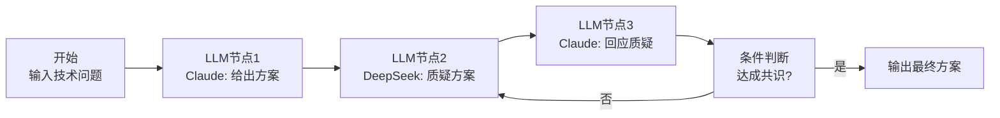
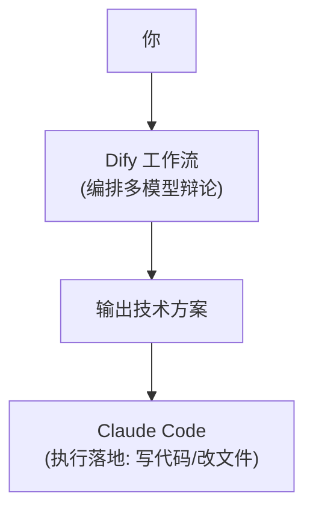
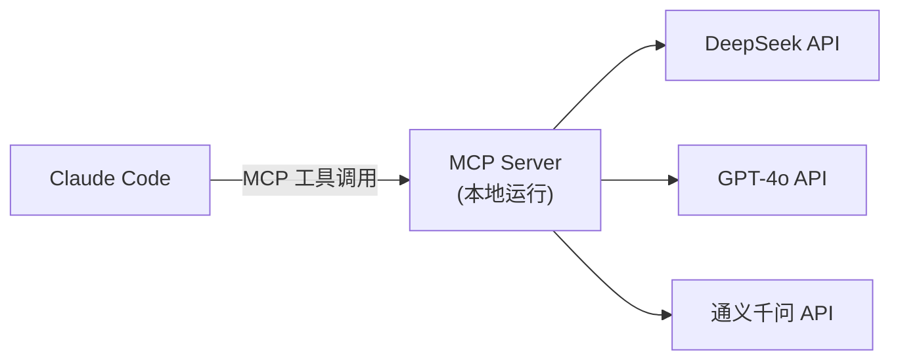

# AI 工作流平台：Dify、Coze 与 Claude Code 的组合

> 最后整理: 2026-05-14 | 来源: 对话讨论

## Dify 和 Coze 是什么

**一句话**：低代码 AI 工作流搭建平台——不用写代码，通过拖拽节点 + 填配置，搭出多模型协作流程。

```
类比:
  写代码实现 Agent  ≈  用 Java 从零写网站
  用 Dify/Coze 搭   ≈  用 WordPress 拖拽搭网站
```

### Dify vs Coze 对比

| | Dify | Coze（扣子） |
|------|------|------------|
| **出品方** | 开源社区（可自部署） | 字节跳动 |
| **部署** | 本地部署 or dify.ai 云端 | 纯云端 coze.cn |
| **费用** | 开源免费（API 费自付） | 有免费额度 |
| **模型支持** | 任意模型（OpenAI/Claude/DeepSeek/通义等） | 字节自有 + 部分第三方 |
| **核心能力** | 工作流编排 + RAG + Agent | 工作流 + Bot + 插件市场 |
| **适合** | 想完全掌控的开发者 | 想快速出活的用户 |

Dify 支持自部署（Docker 一键启动），所有数据和 API Key 在你自己机器上。

### 用 Dify 搭"技术方案辩论"工作流

打开 Dify 可视化画布，拖放节点配置：



每个节点就是画布上的方块，点击配置：
- **LLM 节点 1**：选模型 Claude，填 Prompt "你是架构师，给出方案"
- **LLM 节点 2**：选模型 DeepSeek，填 Prompt "你是评审专家，质疑方案"
- **条件判断**：如果质疑结果包含"LGTM"则结束，否则继续辩论

全程不写代码，只是填配置和选模型。

---

## Dify 和 Claude Code 的关系

这是一个关键认知——**它们是不同层面的东西，不能互相替代，但可以互补**。

| | Claude Code | Dify |
|------|-------------|------|
| **能做什么** | 读/写/改代码、跑命令、操作 Git | 串联多个 LLM、做 RAG、编排工作流 |
| **不能做什么** | 原生不能调用其他模型 | 不能操作本地文件系统和终端 |
| **灵活性** | 高——每次根据情况自主决策 | 低——工作流是固定的流程图 |
| **本质** | 一个有手有脚的 Agent | 一个 LLM 调度平台 |

```
Dify:  A → B → C → D → 输出（流程固定，每次走同样的路）
Claude Code: 自己决定先 grep → 读文件 → 分析 → 改代码 → 跑测试（每次不同）
```

### 三种组合方式

#### 方式 1：Dify 做编排，Claude Code 做执行（分工互补）



Dify 负责"想"（多模型讨论出方案），Claude Code 负责"干"（落地实现）。

#### 方式 2：Claude Code + MCP Server 调多模型（最正统）

写一个 MCP Server，把"调用其他模型"封装成工具，Claude Code 就能在对话中直接调用：



这样 Claude Code 能说"让我调一下 DeepSeek 看看它的意见"——通过 MCP 而非 bash。

**最优雅的方案**，但需要写一个简单的 MCP Server（Python/TypeScript 几十行）。

#### 方式 3：Claude Code 内 bash 调 API（最简单）

直接让 Claude Code 用 curl 调其他模型 API，不需要任何额外配置。粗糙但管用。

### 建议的工具栈搭配

```
现在:
  Claude Code → 知识库维护 + 编码（主力，够用）

想加多模型:
  优先 → 写一个 MCP Server（一劳永逸，Claude Code 内直接用）
  其次 → Dify 搭固定工作流（适合重复性任务如"内容校验"）
  
不建议:
  完全切到 Dify → 会失去 Claude Code 的本地操作能力
```

> 关联: [Harness Engineering](./harness-engineering.md) — 双 LLM 交叉校验的四种实现方式
> 关联: [Agent 开发实战](./agent-development-practice.md) — 四大设计范式
> 关联: [Claude Code 架构](./claude-code-architecture.md) — Claude Code 工具链与 REPL 循环
> 关联: [Agent 与 MCP](../大模型/llm-agent-mcp.md) — MCP 协议、自定义 MCP Server
