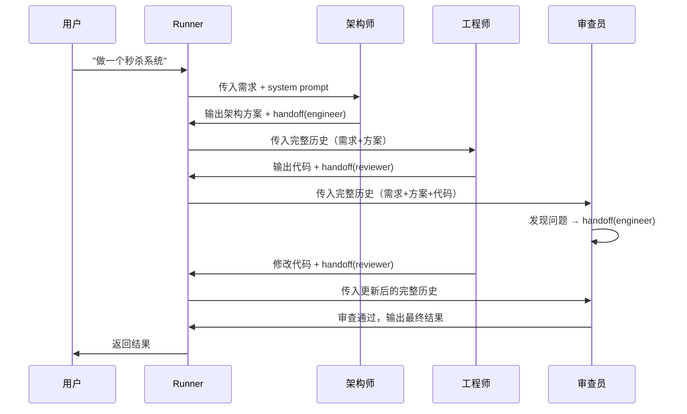
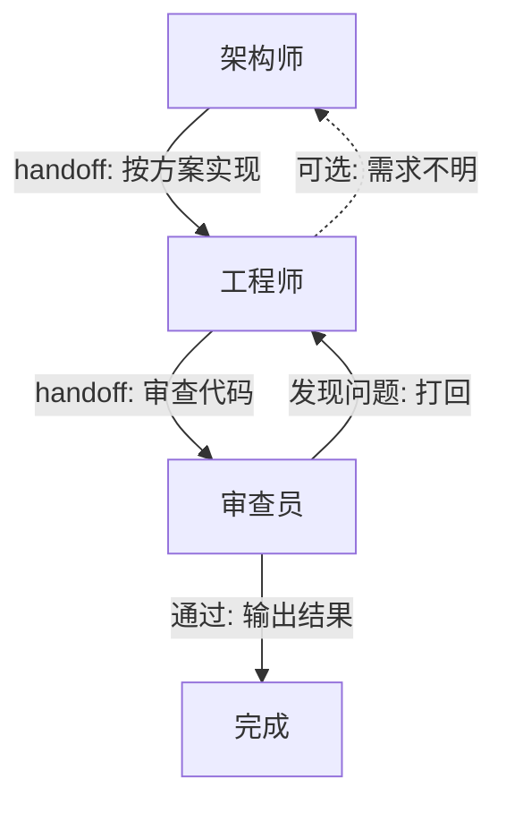

---

tags: [ai, multi-agent, openai, agent-sdk, handoff]
related:
  - kb/技术/ai/llm-agent-mcp.md
description: "多角色协作、Handoff机制、Agent编排、与Claude Code对比"
---

# OpenAI Agents SDK 与多角色协作

> 最后整理: 2026-05-06 | 来源: 对话讨论

## 什么是 OpenAI Agents SDK

OpenAI 开源的 **多 Agent 编排框架**（MIT 协议，[openai/openai-agents-python](https://github.com/openai/openai-agents-python)），核心能力是让多个 AI 角色自动协作完成软件开发等复杂任务。

典型场景：定义架构师、工程师、测试员、审查员等角色，让它们自动接力协作，无需人类在中间干预。

## 核心概念

### Agent（代理）

最基本的单元，本质上就是三样东西：

```
Agent = {
  name: "角色名",
  instructions: "system prompt（你想它扮演什么）",
  tools: [它能调用的工具],
  handoffs: [它可以移交给哪些其他 Agent]
}
```

`instructions` 是任意字符串，没有模板限制。写什么，它就是什么。

### Handoff（移交）

核心创新点。不是普通的函数调用，而是**把整个对话上下文移交给下一个 Agent**。



**关键**：每个 Agent 拿到的是完整的对话历史（用户需求 + 上一轮的输出），不是只拿到上一步的结果。所以审查员能看到最初的需求、架构方案、工程师的代码，综合起来 review。

### Runner（执行器）

调度引擎，负责循环执行：

```python
result = await Runner.run(
    starting_agent=architect,
    input="做一个秒杀系统",
    max_turns=15,  # 防止无限循环
)
```

Runner 的工作流程：
1. 调用当前 Agent 的 LLM
2. 解析 LLM 的返回（是回答、是调工具、还是要 handoff）
3. 如果是 handoff，切换到下一个 Agent，继续调用
4. 没有 handoff 了，工作流结束，返回最终结果

### 底层实现：Function Calling

Handoff 底层依赖 LLM 的 **Function Calling** 能力：

- 每个 `handoff` 实际上是一个 tool（函数）
- LLM 生成 handoff 时，返回一个 tool_call
- Runner 检测到 tool_call 后，切换到目标 Agent
- 重新组装 prompt：`system(new_agent.instructions) + messages(完整历史) + tools(new_agent.tools)`
- 调用新 Agent 对应的 LLM，继续循环

**本质上是 prompt 工程 + function calling 的组合拳**，不是多模型并行推理。

## 典型工作流



### 循环 Review 模式（打回重改）

```python
engineer = Agent(
    name="工程师",
    instructions="根据架构方案编写代码",
    handoffs=[handoff(reviewer, tool_name="request_review")]
)

reviewer = Agent(
    name="审查员",
    instructions="""严格审查代码。
- 发现问题: handoff 回 engineer 要求修改
- 通过: 输出最终结果，不再 handoff
- 同一问题连续两轮未修复: 标记 FAIL""",
    handoffs=[handoff(engineer, tool_name="send_back_to_engineer")]
)
```

形成环形流程：`engineer → reviewer → engineer → reviewer → ... → 通过/超时`

**必须设 `max_turns`** 防止无限循环。

## 与 Claude Code 的对比

| 维度 | Claude Code | OpenAI Agents SDK |
|------|-------------|-------------------|
| 控制流 | **中心化**：主 session 控制，子 agent 干完活回来 | **接力式**：Agent 之间直接移交，无主从关系 |
| 上下文 | 子 agent 是干净的（看不到主 session 对话） | 下一个 Agent 继承完整对话历史 |
| 使用场景 | 人在终端交互，需要即时反馈 | 自动化 pipeline，一次跑完出结果 |
| 角色定义 | 通过 `subagent_type` 预设（Plan、code-reviewer 等） | 任意字符串定义角色，数量不限 |
| 循环控制 | 主 session 决定是否继续 | 通过 `max_turns` 或 Agent 自行决定 |

## 模型兼容性

SDK 支持任何 **OpenAI 兼容 API** 的模型：

```python
# 使用 OpenAI 兼容 API 接入任意模型
import openai
from agents import set_openai_client

client = openai.OpenAI(
    base_url="https://your-provider.com/v1",
    api_key="your-api-key"
)
set_openai_client(client)
```

兼容的模型包括：
- OpenAI 官方模型（gpt-4o, gpt-4o-mini 等）
- Anthropic Claude（通过兼容 API）
- Google Gemini（通过兼容 API）
- 开源模型（vLLM、Ollama 本地部署）
- 国内大模型（智谱、通义、月之暗面等）

**注意**：非 OpenAI 模型需要支持 Function Calling，否则 handoff 机制无法工作。

## Demo 项目

本项目提供了一个可运行的 demo，位于 `demos/openai-agents-handoff/`：

```bash
cd demos/openai-agents-handoff
pip install openai-agents
export OPENAI_API_KEY="your-key"
export OPENAI_BASE_URL="https://your-provider.com/v1"  # 可选
export MODEL_NAME="gpt-4o"  # 可选
python demo.py
```

Demo 演示了架构师 → 工程师 → 审查员的多角色协作流程，支持 OpenAI 兼容 API，可以接入任意模型。

## 参考

- [OpenAI Agents SDK 官方仓库](https://github.com/openai/openai-agents-python)
- [OpenAI Agents 官方文档](https://platform.openai.com/docs/guides/agents-sdk)
- [OpenAI Agents 文档（官方）](https://openai.github.io/openai-agents-python/)
- 相关笔记: [[../大模型/llm-agent-mcp.md]]（Agent 与 MCP 协议）
