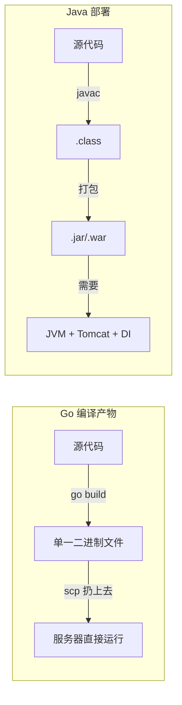
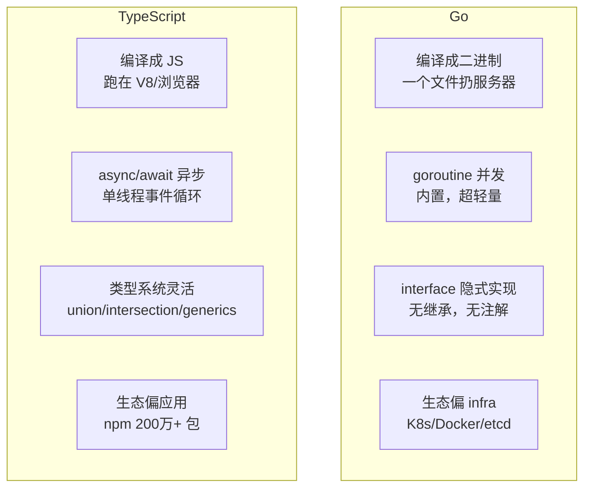
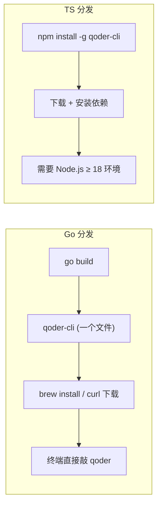

> 最后整理: 2026-06-04 | 来源: 与 Claude Code 对话

## 1. 快速入门

### Go（Golang）

Google 2009 年发布，定位 **C 的性能 + Python 的开发效率**。

从 Java 程序员视角：
- 没有 JVM，编译成**单一静态二进制文件**，扔服务器上直接跑
- 没有继承、泛型（早期）、注解、Spring DI 那一套
- 用 **goroutine + channel** 替代线程池和消息队列，并发是语言内建的

```go
// 起一个 goroutine 比 Java 线程轻量 ~100 倍
go func() {
    result := fetchFromAPI()
    ch <- result  // channel 安全传递
}()

// 等价于 Java: ExecutorService.submit() + BlockingQueue.put()
// 但不需要任何线程池配置
```



**代表项目：**

| 项目 | 说明 |
|------|------|
| Docker | 容器引擎，全是 Go |
| Kubernetes | 容器编排，全是 Go |
| etcd / Consul | 分布式配置中心 |
| Prometheus | 监控告警 |
| 腾讯 tRPC-Go / 字节 Kitex | 微服务框架 |

**典型场景**：CLI 工具、API 网关、微服务中间件、容器编排、网络代理、DevOps 工具链。一句话——**需要高性能、简单部署的 infra 层工具**。

### TypeScript（TS）

微软 2012 年发布，本质 **JavaScript + 类型系统**。编译后变纯 JS，跑在任何有 JS 引擎的地方。

从 Java 程序员视角：
- 类型系统和 Java 很像（interface、泛型、枚举），但**类型只在编译期存在**，运行时全擦除
- 没有 JVM，跑在 V8 引擎上（Node.js 环境）
- 生态 = 整个 npm（全球最大包管理器，200 万+ 包）

```typescript
// TS 的类型系统比 Java 更灵活
type Command = "build" | "test" | "deploy";  // 字面量联合类型
type Result<T> = { ok: true; data: T } | { ok: false; error: string };

function run(cmd: Command): Result<string> {
    if (cmd === "build") {
        return { ok: true, data: "built successfully" };
    }
    return { ok: false, error: "unknown command" };
}
```

**代表项目：**

| 项目 | 说明 |
|------|------|
| VS Code | 整个编辑器就是 TS 写的 |
| Figma | 设计工具的渲染引擎 |
| Notion | 前端 + 后端 |
| Cursor / GitHub Copilot | AI 编程工具的插件 |
| Prisma | ORM |
| Ant Design | 阿里前端组件库 |

**典型场景**：前端应用、CLI 工具、AI Coding 工具插件、VSCode 扩展、Web 服务、跨平台桌面（Electron）。一句话——**需要快速迭代、强类型约束、庞大生态的应用层工具**。

## 2. 核心对比



| 维度 | Go | TypeScript |
|------|-----|------------|
| 启动速度 | 瞬时（编译好的二进制） | 需要 JIT 预热 |
| 并发模型 | goroutine（抢占式） | 单线程 + 事件循环 |
| 包管理 | go mod | npm / yarn / pnpm |
| 部署 | 一个文件，scp 即可 | 需 Node.js 运行时 + node_modules |
| 类型"硬度" | 编译期强类型 | 类型擦除，运行时即 JS |
| 学习曲线 | 语法简单，并发思维难 | 类型系统深，JS 基础友好 |

## 3. Qoder CLI：为什么先选 Go 后又转 TypeScript？

> 背景：Qoder CLI 是阿里 @qoder-ai 团队开发的开源 AI 编程代理，基于 Qwen 大模型。团队早期用 Go 写，后来 30 天重构成了 TypeScript。

初看反直觉——既然最终要转 TS，为什么一开始选 Go？两条故事线分开说。

### 3.1 为什么一开始选 Go？

**A. CLI 工具的惯性选择**

Go 是 CLI 工具的事实标准：

| 工具 | 语言 |
|------|------|
| `kubectl` | Go |
| `docker` | Go |
| `gh` (GitHub CLI) | Go |
| `terraform` | Go |
| `helm` | Go |

对于"我们要做一个命令行工具"的团队，选 Go 几乎不需要讨论——这是肌肉记忆，就像 Java 程序员做微服务默认 Spring Boot 一样。

**B. 单一二进制分发 = 零安装门槛**



用户不需要装任何运行时，下载 10MB 二进制就能跑。TS 方案用户得先装 Node.js，再 `npm install -g`。

**C. 阿里的 Go 技术栈惯性**

Qoder 团队来自阿里，阿里是国内最大的 Go 用户之一：阿里云容器服务/函数计算全是 Go，蚂蚁中间件也是 Go，内部 CLI 工具几乎清一色 Go。第一版选 Go 是最快出活的选择——团队熟、基础设施现成。

**D. MVP 阶段 Go 足够好**

第一版 Qoder CLI 的功能：读取代码 → 调大模型 API → 输出建议。没有插件系统、不考虑编辑器集成、不需要 MCP 协议栈。Go 的 `net/http` + `encoding/json` + goroutine 并发扫文件，不需要任何第三方框架。

**E. goroutine 扫描代码库天然高效**

```
扫描代码库 → 找到相关文件 → 读取文件内容 → 构建 prompt → 调 API → 返回结果
    ↑_____________goroutine 并发扫描______________↑
```

几百个小文件的并发读+解析，goroutine 几乎是零成本。

### 3.2 为什么后来转 TS？

**A. 生态对齐是核心原因**

- **MCP 协议** — 大量 SDK 和参考实现是 TS 写的
- **VSCode 扩展 API** — 原生 TS/JS
- **npm 分发渠道** — `npm install -g` 是 CLI 工具的标准安装方式
- **AI 工具链** — Vercel AI SDK、OpenAI/Anthropic SDK、LangChain 等都是 TS 优先

> 用 Go 等于每个生态对接都要自己写一遍，用 TS 直接用现成的 SDK。

**B. 插件系统必须用 TS**

Qoder CLI 要和 VSCode、JetBrains、终端集成，插件/扩展层几乎只能用 TS/JS 写。用 Go 写核心再用 RPC 桥接 TS 插件层，架构复杂度翻倍。一体化的 TS 栈省掉了跨语言通信层。

**C. 快速迭代 > 极致性能**

瓶颈在等待大模型 API 返回，不在本地代码执行速度。Go 的"编译→部署"优势在每天发版的 SaaS/CLI 产品中不如 TS 的 `npm publish` 方便。

**D. 团队招聘和社区贡献**

TS/JS 是全球最大的开发者群体，开源项目想吸引社区贡献，TS 的门槛远低于 Go。

### 3.3 总结：infra 工具长成了生态平台

本质上是一个产品从"infra 工具"演化成"生态平台"的故事。Go 适合前者（单二进制、高性能、部署简单），TS 适合后者（插件生态、npm 分发、社区门槛低）。

> 类比 Java 体系里：一个内部工具一开始用 Spring Boot 单体写得飞快，后来发现要接 20 个外部 SDK 都是 Python 优先，慢慢就拆成了 Java 核心 + Python 胶水层。Qoder 团队只是干脆一步到位全切了。

30 天能重构完本身也说明 TS 的工程效率在应用层确实更高。

相关: [[../技术/AI/Claude-Code/从 Claude Code 看 AI 编程工具生态.md]] [[../技术/AI/应用/AI 工作流平台：Dify、Coze 与 Claude Code 的组合.md]]
