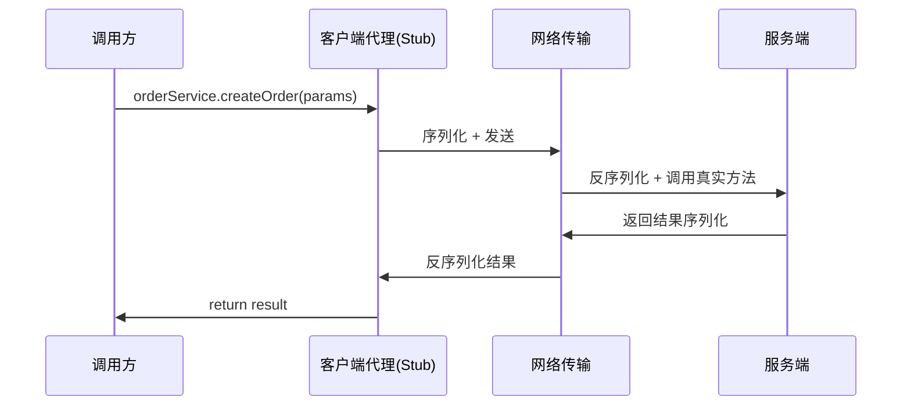
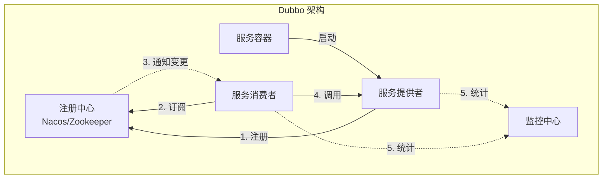
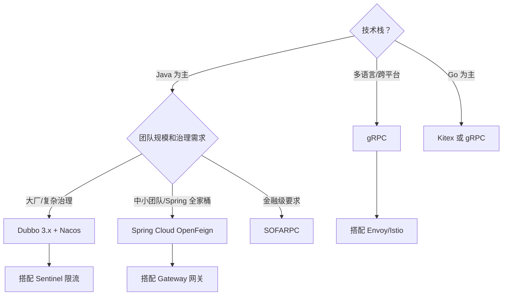

> 最后整理: 2026-07-08 | 来源: AI 对话自动沉淀

> 关联: [[./Spring IOC、DI 与 AOP 核心原理.md]] — §6.6 对比 Spring AOP 代理与 Dubbo RPC 代理（同源 JDK 动态代理，invoke 内部行为不同）

## 2026-05-21 - RPC 本质与 Dubbo 深度解析

### RPC 是什么？一图胜千言

RPC = 让调用远程服务像调用本地方法一样简单。


```mermaid
sequenceDiagram
    participant Client as 调用方
    participant Stub as 客户端代理(Stub)
    participant Net as 网络传输
    participant Server as 服务端
    
    Client->>Stub: orderService.createOrder(params)
    Stub->>Net: 序列化 + 发送
    Net->>Server: 反序列化 + 调用真实方法
    Server->>Net: 返回结果序列化
    Net->>Stub: 反序列化结果
    Stub->>Client: return result
```

代码里写 `orderService.createOrder(params)`，感觉像调本地方法，背后其实走了：代理 → 序列化 → 网络传输 → 反序列化 → 执行 → 原路返回。

---

### Dubbo 核心架构（五大角色）


```mermaid
graph TB
    subgraph DubboArch[Dubbo 架构]
        Registry["注册中心<br/>Nacos/Zookeeper"]
        Provider[服务提供者]
        Consumer[服务消费者]
        Monitor[监控中心]
        Container[服务容器]
    end
    
    Container -->|启动| Provider
    Provider -->|1. 注册| Registry
    Consumer -->|2. 订阅| Registry
    Registry -.->|3. 通知变更| Consumer
    Consumer -->|4. 调用| Provider
    Provider -.->|5. 统计| Monitor
    Consumer -.->|5. 统计| Monitor
```

| 角色 | 职责 |
|------|------|
| **Provider** | 暴露服务，启动时注册到注册中心 |
| **Consumer** | 订阅服务，从注册中心拿到 Provider 地址列表后直连调用 |
| **Registry** | 注册中心（Nacos/ZK），负责服务发现 |
| **Monitor** | 统计调用次数、耗时 |
| **Container** | Spring 容器，管理服务生命周期 |

### Dubbo 调用链路（一次 RPC 发生了什么）

```
Consumer 发起调用
  → Proxy（透明代理，JDK/Javassist）
    → Filter 链（限流、熔断、日志等，SPI 扩展）
      → Cluster（容错策略：Failover/Failfast/Failsafe）
        → LoadBalance（负载均衡：Random/RoundRobin/LeastActive/ConsistentHash）
          → Protocol（协议层：dubbo/triple/rest）
            → 序列化（Hessian2/Protobuf/JSON）
              → Netty 传输
                → Provider 端反向执行
```

### Dubbo 核心特性速查

| 特性 | 说明 |
|------|------|
| **协议** | Dubbo 协议（私有 TCP）、Triple（兼容 gRPC）、REST |
| **序列化** | Hessian2（默认）、Protobuf、Kryo、JSON |
| **注册中心** | Nacos（推荐）、Zookeeper、Redis、Consul |
| **负载均衡** | Random（加权随机）、RoundRobin、LeastActive（最少活跃）、ConsistentHash |
| **容错策略** | Failover（默认，重试其他节点）、Failfast（快速失败）、Failsafe（安全失败）、Forking（并行调用）|
| **SPI 扩展** | 几乎所有组件可通过 SPI 替换（Dubbo 自己的 SPI，非 JDK SPI）|
| **服务治理** | 限流、熔断、降级、灰度路由、动态配置 |
| **Triple 协议** | Dubbo 3.x 主推，兼容 gRPC，支持 Stream 流式调用 |

### Dubbo 3.x vs 2.x 关键变化

| 维度 | Dubbo 2.x | Dubbo 3.x |
|------|-----------|-----------|
| **服务发现** | 接口级（每个接口一条注册信息）| 应用级（一个应用一条，减少注册中心压力）|
| **协议** | dubbo 协议为主 | Triple（兼容 gRPC）为主推 |
| **云原生** | 不支持 | 支持 Kubernetes、Service Mesh、xDS |
| **流式调用** | 不支持 | 支持 Server/Client/Bi-directional Stream |

---

## 2026-05-21 - 主流 RPC 框架横评

### 全景对比表

| 框架 | 出品方 | 协议 | 语言 | 服务发现 | 特点 |
|------|--------|------|------|---------|------|
| **Dubbo** | Apache/阿里 | dubbo/triple/rest | Java 为主 | Nacos/ZK | 国内生态最强，SPI 扩展拉满 |
| **gRPC** | Google | HTTP/2 + Protobuf | 多语言全平台 | 无内置 | 跨语言首选，性能强，治理弱 |
| **OpenFeign** | Spring | HTTP/REST + JSON | Java | Eureka/Nacos | 开发体验好，性能一般 |
| **Thrift** | Apache/Facebook | 自有二进制 | 多语言 | 无内置 | 老牌跨语言，用的人越来越少 |
| **SOFARPC** | 蚂蚁金服 | bolt/triple | Java | SOFARegistry | 金融级，蚂蚁内部验证 |
| **Motan** | 新浪微博 | motan2 | Java/Go | ZK/Consul | 轻量 |
| **Kitex** | 字节跳动 | Thrift/Protobuf | Go | 内部发现 | Go 生态性能怪兽 |
| **Tars** | 腾讯 | tars 协议 | C++/Java/Go/Node | 内置 | 腾讯大规模使用 |

### 选型决策树


```mermaid
graph TD
    A{技术栈？} -->|Java 为主| B{团队规模和治理需求}
    A -->|多语言/跨平台| C[gRPC]
    A -->|Go 为主| D[Kitex 或 gRPC]
    
    B -->|大厂/复杂治理| E["Dubbo 3.x + Nacos"]
    B -->|中小团队/Spring 全家桶| F[Spring Cloud OpenFeign]
    B -->|金融级要求| G[SOFARPC]
    
    C --> H[搭配 Envoy/Istio]
    E --> I[搭配 Sentinel 限流]
    F --> J[搭配 Gateway 网关]
```

### 性能参考（单机 8C16G）

| 框架 | 协议 | 序列化 | QPS 参考 | 延迟 P99 |
|------|------|--------|---------|----------|
| Dubbo (triple) | HTTP/2 | Protobuf | ~50K-80K | ~2-5ms |
| gRPC | HTTP/2 | Protobuf | ~50K-80K | ~2-5ms |
| Dubbo (dubbo) | TCP 私有 | Hessian2 | ~80K-120K | ~1-3ms |
| OpenFeign | HTTP/1.1 | JSON | ~10K-20K | ~5-15ms |
| Kitex (Go) | TCP | Thrift | ~100K-200K | ~0.5-2ms |

**性能规律**：TCP 私有协议 > HTTP/2 > HTTP/1.1；Protobuf > Hessian2 > JSON。但 HTTP/2（triple/gRPC）是趋势——兼容云原生基础设施。

### 实战选型建议（2024-2026）

1. **Java + 有规模** → Dubbo 3.x + Triple + Nacos（阿里验证，Triple 兼容 gRPC 可扩展多语言）
2. **Java + 中小团队** → Spring Cloud + OpenFeign + Nacos（学习成本低，瓶颈通常在 DB 不在 RPC）
3. **跨语言** → gRPC + Protobuf（需自建治理或用 Istio）
4. **极致性能** → Dubbo dubbo 协议 或 Kitex（Go）

---

## 2026-05-21 - Dubbo SPI 机制深度解析

### JDK SPI 的两个致命问题

1. **只能遍历获取，无法按名取**：`ServiceLoader` 暴露的是 `Iterator<S>`，要拿到目标实现必须从头迭代——迭代过程中遇到的实现会被惰性实例化，**想跳过都不行**。所以如果实现类多、初始化重，"我只用其中一个" 也得付出"初始化前面 N 个" 的代价
2. **拿不到"名叫 xxx 的那个实现"**：配置文件只有实现类全限定名，没有 key，无法实现 `getExtension("random")` 这种按名查找的接口

### Dubbo SPI 三种扩展方式

```java
// 1. 普通扩展：按名获取
LoadBalance lb = ExtensionLoader.getExtensionLoader(LoadBalance.class)
    .getExtension("random");

// 2. 自适应扩展（@Adaptive）：运行时根据 URL 参数动态选择
LoadBalance adaptive = ExtensionLoader.getExtensionLoader(LoadBalance.class)
    .getAdaptiveExtension();

// 3. 包装扩展（Wrapper）：AOP 装饰器链，自动层层包装
```

### SPI 配置文件（key=value 格式，支持按名获取）

```
# META-INF/dubbo/org.apache.dubbo.rpc.cluster.LoadBalance
random=org.apache.dubbo.rpc.cluster.loadbalance.RandomLoadBalance
roundrobin=org.apache.dubbo.rpc.cluster.loadbalance.RoundRobinLoadBalance
leastactive=org.apache.dubbo.rpc.cluster.loadbalance.LeastActiveLoadBalance
consistenthash=org.apache.dubbo.rpc.cluster.loadbalance.ConsistentHashLoadBalance
```

### @Adaptive 底层原理：运行时动态生成代理类

```java
@SPI("random")
public interface LoadBalance {
    @Adaptive("loadbalance")  // 从 URL 参数取值决定实现
    <T> Invoker<T> select(List<Invoker<T>> invokers, URL url, Invocation invocation);
}

// Dubbo 运行时生成的代理类（伪代码）：
public class LoadBalance$Adaptive implements LoadBalance {
    public Invoker select(List invokers, URL url, Invocation invocation) {
        String extName = url.getParameter("loadbalance", "random");
        LoadBalance ext = ExtensionLoader.getExtensionLoader(LoadBalance.class)
            .getExtension(extName);
        return ext.select(invokers, url, invocation);
    }
}
```

核心思想：**延迟决策**——编码时不绑定具体实现，运行时根据 URL 参数动态路由。

### Wrapper 机制（AOP 装饰器链）

```java
// 构造函数参数是扩展接口本身 → Dubbo 自动识别为 Wrapper
public class ProtocolFilterWrapper implements Protocol {
    private Protocol protocol;
    public ProtocolFilterWrapper(Protocol protocol) { this.protocol = protocol; }
    
    public <T> Exporter<T> export(Invoker<T> invoker) {
        invoker = buildFilterChain(invoker);  // 前置逻辑
        return protocol.export(invoker);      // 委托真实实现
    }
}
// 加载顺序：真实实现 → FilterWrapper 包装 → ListenerWrapper 再包装
```

---

## 2026-05-21 - 负载均衡四大策略详解

### RandomLoadBalance（加权随机，默认）

```java
// Provider A 权重 5，B 权重 3，C 权重 2，总 = 10
// 随机数落在 [0,5)→A, [5,8)→B, [8,10)→C
int offset = random.nextInt(totalWeight);
for (Invoker invoker : invokers) {
    offset -= getWeight(invoker);
    if (offset < 0) return invoker;
}
```

### RoundRobinLoadBalance（平滑加权轮询，Nginx 同款）

```
// A(5) B(3) C(2)，不是 AAAAABBBCC 这样粗暴
// 而是 A B A C A B A B A C 平滑分布
// 算法：每轮 current += weight，选最大，最大 -= totalWeight
```

### LeastActiveLoadBalance（最少活跃数）

```java
// 活跃数 = 已发出未返回的请求数
// 调用前 active++，响应后 active--
// 慢节点积压多 → active 高 → 被选概率低
// 效果：自动"能者多劳"
```

### ConsistentHashLoadBalance（一致性哈希）

```java
// 相同参数永远打到同一个节点（如 userId=123 → 节点A）
// 每个 Provider 160 个虚拟节点防倾斜
TreeMap<Long, Invoker> ring = new TreeMap<>();
// 请求 → hash(args) → 环上顺时针找最近节点
```

| 策略 | 适用场景 |
|------|---------|
| Random | 通用默认 |
| RoundRobin | 灰度发布精确分流 |
| LeastActive | 后端节点性能差异大 |
| ConsistentHash | 有状态服务（本地缓存/Session） |

---

## 2026-05-21 - 代理类实现原理

### 两种代理方式对比

| 方式 | 原理 | 性能 |
|------|------|------|
| JDK 动态代理 | `Proxy.newProxyInstance()` + 反射 | 较慢 |
| **Javassist**（默认） | 运行时生成字节码，直接调用 | 快 10-30% |

### Javassist 生成的代理类（核心逻辑）

```java
public class OrderService$Proxy implements OrderService {
    private InvokerInvocationHandler handler;
    
    public Order createOrder(OrderRequest request) {
        Object[] args = new Object[]{request};
        RpcInvocation invocation = new RpcInvocation(
            "createOrder", new Class[]{OrderRequest.class}, args);
        return (Order) handler.invoke(this, invocation);
        // → Filter链 → Cluster → LoadBalance → 序列化 → Netty发送
    }
}
```

Javassist 无反射，编译后等价直接方法调用。

---

## 2026-05-21 - 网络通信 IO 设计

### 线程模型：IO 线程 + 业务线程分离

```
Netty Boss Group(接受连接) → Worker Group(读写+编解码)
                                    ↓ decode 完成
                            Dubbo 业务线程池(执行 ServiceImpl)
```

核心设计：**IO 线程只做编解码，不执行业务逻辑**，防慢业务阻塞 IO。

### 五种线程派发策略（Dispatcher）

| 策略 | IO 线程 | 业务线程 | 适用 |
|------|---------|---------|------|
| **all**（默认） | 编解码 | 所有事件 | 通用 |
| direct | 所有事件 | 不使用 | 心跳等简单操作 |
| message | 连接/断开 | 请求/响应 | 大多数 |
| execution | 响应/连接 | 仅请求 | Provider 推荐 |
| connection | 请求/响应 | 连接/断开 | 连接管理重 |

### 业务线程池类型

| 类型 | 行为 | 适用 |
|------|------|------|
| **fixed**（默认） | 固定大小，满则拒绝 | 生产（可预测） |
| cached | 无上限，空闲回收 | 开发测试 |
| limited | 只增不减 | 防抖动 |
| eager | 优先建线程而非放队列 | 低延迟 |

### 线程池耗尽实战案例

```java
// 报错：Thread pool is EXHAUSTED!
// 原因：200 线程都在等下游（DB 慢查询）
// 解决：
// 1. 加线程池（治标）: <dubbo:protocol threads="500" />
// 2. 设超时（治本）: <dubbo:service timeout="3000" />
// 3. 异步化（根治）: CompletableFuture<Order> future = service.createOrderAsync(req);
```

### 连接管理：单连接多路复用

```java
// 默认：Consumer 到每个 Provider 只建 1 条 TCP 长连接
// 通过 requestId 多路复用（类似 HTTP/2 的流）
// 心跳：60s 间隔，180s（3倍）超时判定，在 IO 线程处理
// 高并发可加连接：<dubbo:reference connections="3" />
```

> 关联: ./distributed-transaction.md | ./rocketmq-internals.md | [[./Spring IOC、DI 与 AOP 核心原理.md]]

---

## 2026-07-08 - 面试高频话题补充

### 容错策略（6 种 Cluster）

| 策略 | 行为 | 适用场景 |
|------|------|---------|
| **Failover**（默认） | 失败自动切换其他节点，默认重试 2 次 | 读操作（幂等） |
| **Failfast** | 快速失败，只调一次，失败立即报错 | 写操作（非幂等，如转账） |
| **Failsafe** | 失败安全，出错也忽略 | 日志记录（丢了没关系） |
| **Failback** | 失败自动恢复，定时重发 | 消息通知 |
| **Forking** | 并行调多个节点，一个成功就返回 | 实时性要求极高的读操作 |
| **Broadcast** | 广播调所有节点，任一失败则失败 | 通知所有节点更新缓存 |

**为什么写操作不能用 Failover**：

```
转账场景：Consumer → Provider A（超时）→ 重试 Provider B
  → A 可能已经执行成功了（只是响应超时）
  → B 又执行一次 → 转了两次！

解决：写操作必须用 Failfast + 业务幂等
```

### 服务治理——降级、限流、熔断

#### 降级（mock）

```java
// 配置 mock 实现
@DubboReference(mock = "com.example.OrderServiceMock")
private OrderService orderService;

public class OrderServiceMock implements OrderService {
    @Override
    public Order getOrder(Long id) {
        return new Order(id, "默认数据");  // 返回兜底数据
    }
}
```

#### 熔断（Circuit Breaker）

```
熔断器三种状态：
├── Closed（关闭）→ 正常调用
├── Open（打开）→ 快速失败，不调下游
└── Half-Open（半开）→ 放一个请求试探，成功→关闭，失败→打开

Dubbo 3.x 内置熔断配置：
dubbo:
  provider:
    circuit-breaker:
      enabled: true
      error-ratio-percentage: 50    # 错误率 50% 触发
      slow-request-threshold-ms: 1000  # 慢请求阈值 1s
```

### 优雅停机

```
Provider 停机流程：
├── 1. 从注册中心注销（其他 Consumer 不再发新请求）
├── 2. 等待存量请求处理完（默认 10s）
├── 3. 关闭网络连接
└── 4. 释放资源

Consumer 停机：
├── 1. 取消订阅（不再监听 Provider 变更）
├── 2. 等待正在进行的调用完成
└── 3. 关闭连接
```

配置：`dubbo.shutdown.wait: 10000`

### 序列化对比

| 序列化 | 性能 | 跨语言 | 兼容性 | 适用 |
|--------|------|--------|--------|------|
| **Hessian2**（Dubbo 默认） | 中 | Java 为主 | 字段增删兼容 | Dubbo 2.x 默认 |
| **Protobuf** | 高 | 全平台 | 字段增删兼容 | gRPC / Dubbo 3.x Triple |
| **Kryo** | 最高 | Java only | 字段增删不兼容 | 极致性能场景 |
| **JSON** | 低 | 全平台 | 字段增删兼容 | 调试 / HTTP 接口 |

**为什么 Dubbo 默认用 Hessian2**：历史原因（2011 年），Protobuf 需要写 .proto 文件生成代码，开发体验差。Dubbo 3.x Triple 协议已切换到 Protobuf。

### 服务版本控制

```java
// Provider 暴露两个版本
@DubboService(version = "1.0.0")
public class OrderServiceImpl implements OrderService { ... }

@DubboService(version = "2.0.0")
public class OrderServiceV2Impl implements OrderServiceV2 { ... }

// Consumer 指定版本
@DubboReference(version = "1.0.0")
private OrderService orderService;
```

灰度发布：Provider 同时暴露 v1 和 v2 → Consumer 逐步切换流量 → 验证无误后下线 v1。

### Dubbo vs Spring Cloud 架构对比

| 维度 | Dubbo | Spring Cloud |
|------|-------|--------------|
| **定位** | RPC 框架（底层通信） | 微服务全家桶（端到端） |
| **协议** | dubbo/triple（TCP） | HTTP/REST |
| **性能** | 高（私有协议 + 二进制） | 中（HTTP + JSON） |
| **学习成本** | 高（SPI、协议、序列化） | 低（注解驱动） |

选型：Dubbo 适合大厂/高性能/复杂治理；Spring Cloud 适合中小团队/Spring 全家桶。

### 超时陷阱——Consumer 超时但 Provider 还在执行

```
场景：Consumer timeout=3s，Provider 执行了 5s

时间线：
  T+0s:  Consumer 发起调用
  T+3s:  Consumer 超时，抛 TimeoutException
  T+5s:  Provider 执行完成（Consumer 已断开，结果丢弃）

问题：
  - Consumer 以为失败 → 触发重试（Failover）
  - Provider 其实成功了 → 重复执行 → 数据不一致！

解决：
  1. 写操作必须幂等（唯一键 / 状态机 / Token）
  2. Consumer timeout ≥ Provider 执行时间
  3. 写操作用 Failfast（不重试）
```

### Filter 链扩展

```java
// 自定义 Filter（类似 Servlet Filter）
@Activate(group = {CommonConstants.CONSUMER})
public class TraceFilter implements Filter {

    @Override
    public Result invoke(Invoker<?> invoker, Invocation invocation) throws RpcException {
        String traceId = UUID.randomUUID().toString();
        RpcContext.getContext().setAttachment("traceId", traceId);
        
        long start = System.currentTimeMillis();
        Result result = invoker.invoke(invocation);  // 继续调用链
        long elapsed = System.currentTimeMillis() - start;
        
        log.info("traceId={} method={} elapsed={}ms", 
                 traceId, invocation.getMethodName(), elapsed);
        return result;
    }
}
```

注册：`META-INF/dubbo/org.apache.dubbo.rpc.Filter` 加 `traceFilter=com.example.filter.TraceFilter`

常见用途：链路追踪、限流、权限校验、访问日志、指标采集。

### 服务暴露流程

```
Provider 启动：
├── 1. 解析 @DubboService → ServiceConfig
├── 2. 导出服务
│   ├── 本地暴露（InjvmProtocol，同 JVM 调用）
│   └── 远程暴露（DubboProtocol / TripleProtocol）
│       ├── 创建 Invoker（包装 ServiceImpl）
│       ├── 创建 Exporter（暴露端口）
│       └── 注册到注册中心
├── 3. 启动 Netty Server
└── 4. 等待调用

Consumer 启动：
├── 1. 解析 @DubboReference → ReferenceConfig
├── 2. 订阅服务
│   ├── 拉取 Provider 列表
│   ├── 监听变更
│   └── 创建 Invoker
├── 3. 创建代理（JDK/Javassist）
└── 4. 注入 Spring 容器
```
