# InnoDB 如何实现 ACID

> 最后整理: 2026-07-08 | 来源: 对话讲解

> 关联: [[./MySQL B+树索引实现原理.md]] — InnoDB 存储引擎的 B+ 树索引结构 | [[./分布式事务全景.md]] — 单机 ACID 是分布式事务（2PC/TCC）的基础

---

## §1 ACID 与 InnoDB 机制对应关系

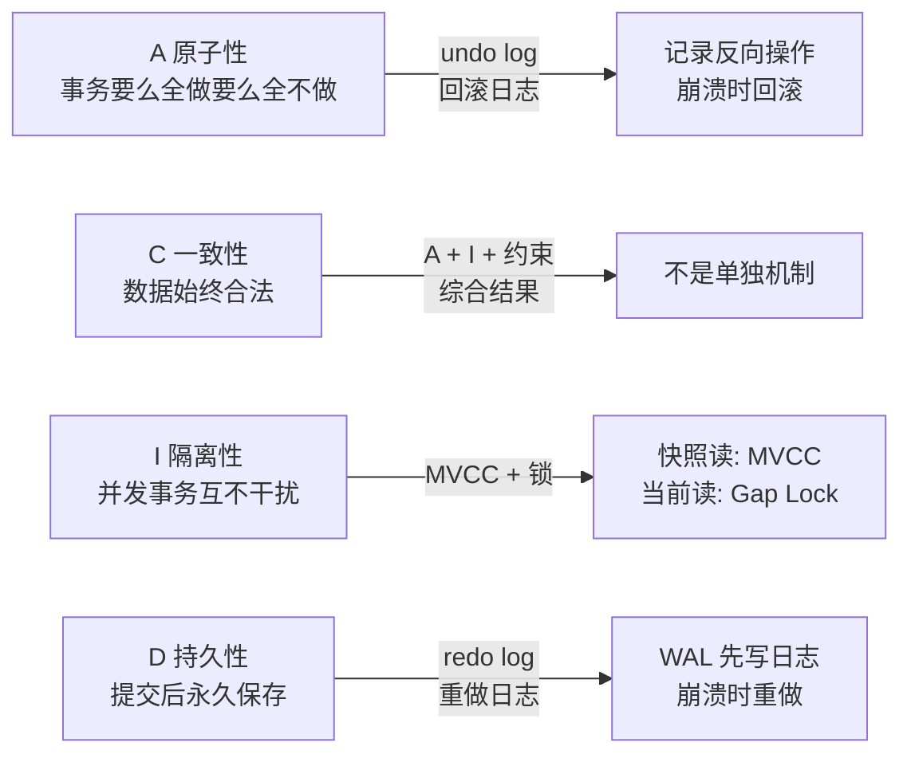

| ACID | 机制 | 日志类型 |
|------|------|---------|
| **A 原子性** | undo log | 逻辑日志（反向 SQL） |
| **D 持久性** | redo log | 物理日志（字节级变更） |
| **I 隔离性** | MVCC + 锁 | — |
| **C 一致性** | A + I + 约束 | 综合结果 |

---

## §2 A — 原子性：undo log

### 2.1 undo log 的本质

每次 DML 操作前，InnoDB 把"反向操作"记到 undo log：

| 你的操作 | undo log 记录 | 回滚行为 |
|---------|-------------|---------|
| `INSERT INTO users ...` | 记录新行的主键 | 回滚时 DELETE 这行 |
| `UPDATE users SET name='B' WHERE id=1`（旧值 'A'） | 记录旧值 name='A' | 回滚时 UPDATE 回旧值 |
| `DELETE FROM users WHERE id=1` | 记录完整行数据 | 回滚时重新 INSERT |

### 2.2 崩溃恢复流程

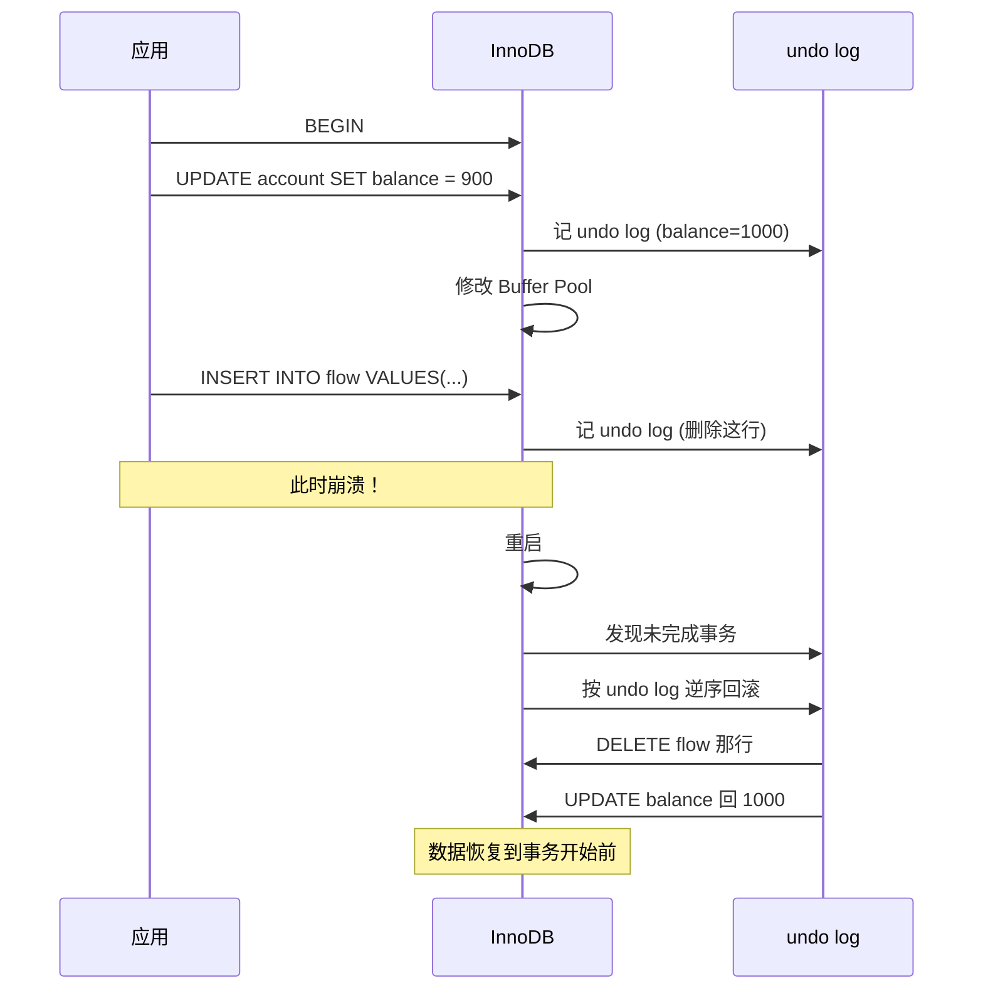

### 2.3 undo log 的特点

- **逻辑日志**：记录的是"反向 SQL"，不是物理字节
- **用于回滚**：事务崩溃时恢复到开始前状态
- **用于 MVCC**：多版本并发控制依赖 undo log 的版本链（见 §4）
- **可清理**：事务提交且没有活跃事务需要旧版本时，undo log 可被清理

---

## §3 D — 持久性：redo log

### 3.1 WAL（Write-Ahead Logging）

**核心思想**：先写日志，再改数据。即使脏页没刷盘，断电后也能用 redo log 恢复。

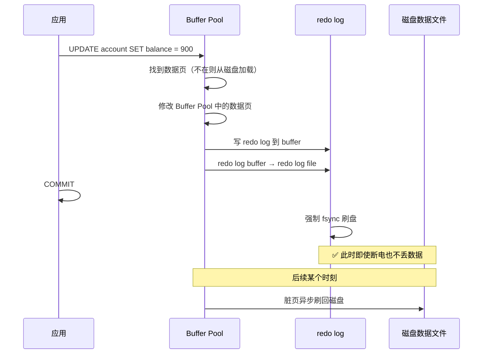

### 3.2 redo log 的结构

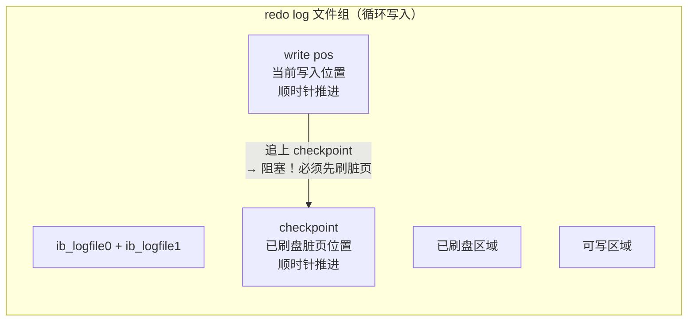

| 字段 | 说明 |
|------|------|
| write pos | 当前写入位置（顺时针推进） |
| checkpoint | 已刷盘的脏页位置（顺时针推进） |
| 可写区域 | checkpoint 和 write pos 之间的空间 |
| 阻塞条件 | write pos 追上 checkpoint → 必须先刷脏页腾出空间 |

### 3.3 redo log 的特点

- **物理日志**：记录"某个数据页的某个偏移量上改成了什么字节"
- **循环写入**：固定大小，首尾相连，写满后覆盖旧日志
- **WAL**：先写日志再改数据，保证 crash-safe
- **crash-safe**：MySQL 重启时扫描 redo log，把已 COMMIT 但没刷盘的事务重做一遍

### 3.4 刷盘时机参数

| innodb_flush_log_at_trx_commit | 行为 | 性能 | 安全性 |
|------|------|------|------|
| **0** | 每秒刷一次 | 最快 | 宕机丢 1s 数据 |
| **1**（默认） | 每次 COMMIT 都 fsync | 最慢 | 不丢数据 |
| **2** | 每次 COMMIT 写到 OS cache，每秒 fsync | 中 | 操作系统崩溃丢 1s |

---

## §4 I — 隔离性：MVCC + 锁

### 4.1 四种隔离级别

| 隔离级别 | 脏读 | 不可重复读 | 幻读 |
|---------|:----:|:--------:|:----:|
| READ UNCOMMITTED | ✅ | ✅ | ✅ |
| READ COMMITTED | ❌ | ✅ | ✅ |
| **REPEATABLE READ**（InnoDB 默认） | ❌ | ❌ | ⚠️ 部分解决 |
| SERIALIZABLE | ❌ | ❌ | ❌ |

### 4.2 MVCC（多版本并发控制）

MVCC 是 InnoDB 在 RR 级别下的核心隔离机制：**不加锁就能实现一致性读**。

#### 4.2.1 每行记录的隐藏字段

| 字段 | 大小 | 说明 |
|------|------|------|
| DB_TRX_ID | 6 字节 | 最近一次 INSERT/UPDATE 这行的事务 ID |
| DB_ROLL_PTR | 7 字节 | 回滚指针 → 指向 undo log 中的旧版本 |
| DB_ROW_ID | 6 字节 | 无主键时自动生成的行 ID |

#### 4.2.2 版本链

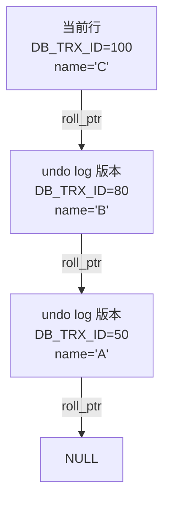

每次 UPDATE 都会把旧版本写入 undo log，并用 roll_ptr 串成链表。

#### 4.2.3 ReadView（读视图）

ReadView 决定你能看到版本链上的哪个版本：

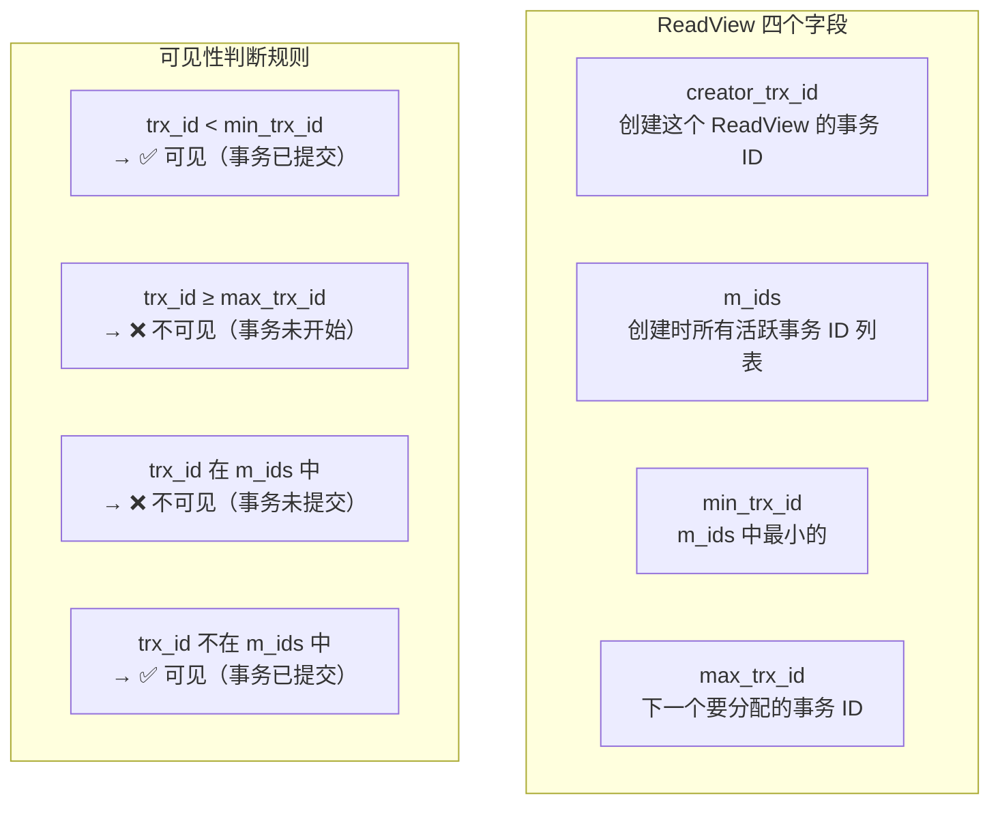

#### 4.2.4 RR vs RC 的本质区别

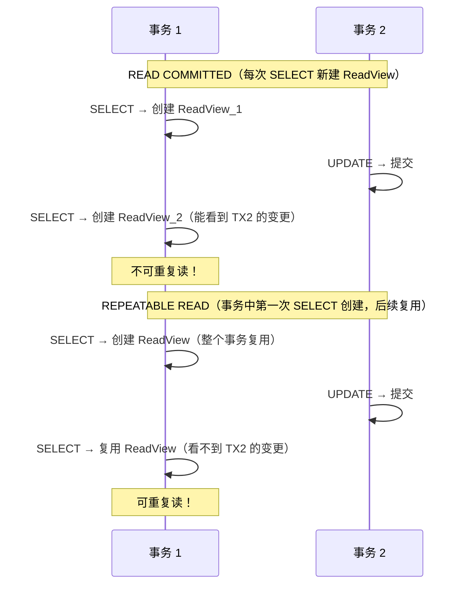

**关键区别**：
- **RC**：每次 SELECT 都重新创建 ReadView → 能看到其他事务在上次查询后提交的变更 → 不可重复读
- **RR**：事务中第一次 SELECT 时创建 ReadView，后续复用 → 看到的始终是同一个快照 → 可重复读

### 4.3 锁机制

MVCC 只能解决快照读的隔离。当前读（SELECT FOR UPDATE / INSERT / UPDATE / DELETE）需要靠锁。

| 锁类型 | 作用 |
|--------|------|
| 记录锁（Record Lock） | 锁住一行记录 |
| 间隙锁（Gap Lock） | 锁住索引间隙，防止其他事务在间隙中 INSERT → **解决幻读** |
| 临键锁（Next-Key Lock） | 记录锁 + 间隙锁的组合（InnoDB RR 默认） |

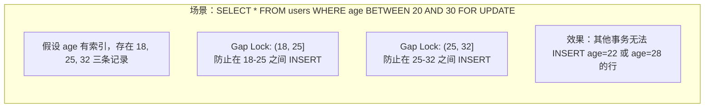

### 4.4 InnoDB 的 RR 级别下幻读是"部分解决"

| 场景 | 是否解决 |
|------|---------|
| 快照读（普通 SELECT） | ✅ MVCC 保证看不到其他事务的 INSERT |
| 当前读 + 范围内无数据 | ✅ Gap Lock 阻止 INSERT |
| 当前读 + 先快照读再当前读 | ❌ 可能看到"幻影行" |

---

## §5 C — 一致性：综合结果

一致性不是靠某个单一机制实现的，而是 **A + I + 约束** 的综合结果：

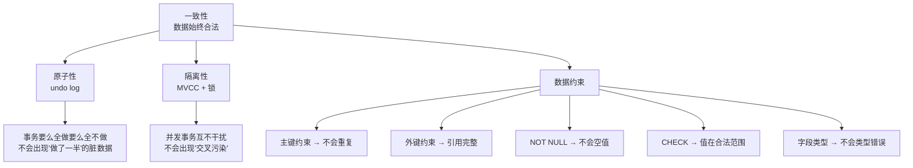

**注意**：如果业务逻辑本身有问题（比如转账金额没校验余额），即使 ACID 全满足，数据也不一致。**一致性最终是应用层的责任**，InnoDB 只保证数据库层面的约束不被破坏。

---

## §6 ACID 实现全景

### 6.1 一次完整事务的内部流程

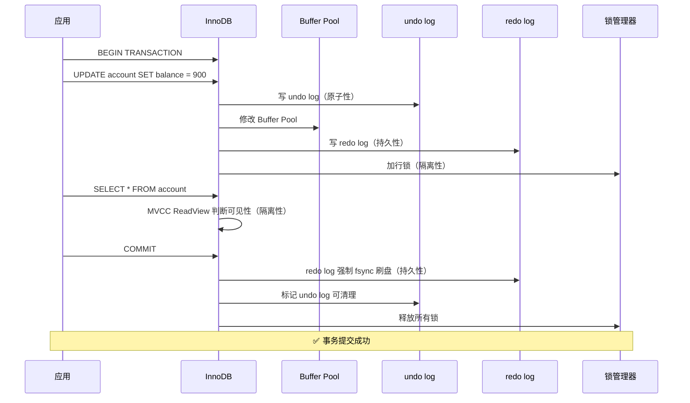

### 6.2 崩溃恢复流程

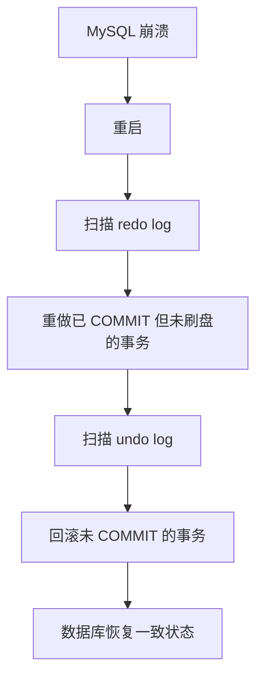

### 6.3 核心参数速查

| 参数 | 作用 | 推荐值 |
|------|------|--------|
| `innodb_flush_log_at_trx_commit` | redo log 刷盘时机 | 1（默认，最安全） |
| `innodb_buffer_pool_size` | Buffer Pool 大小 | 物理内存 70-80% |
| `innodb_log_file_size` | redo log 文件大小 | 256M-2G（根据写入量） |
| `innodb_log_buffer_size` | redo log buffer 大小 | 16M-64M |
| `transaction_isolation` | 默认隔离级别 | REPEATABLE-READ |

---

## §7 面试应答模板

> **面试官问**："InnoDB 怎么实现 ACID？"
>
> **答**：四个字母对应四个机制。原子性靠 undo log，记录反向操作用于回滚。持久性靠 redo log，用 WAL 策略先写日志再改数据，COMMIT 时强制 fsync。隔离性靠 MVCC 加锁——快照读用 MVCC 的 ReadView 判断版本可见性，当前读用 Gap Lock 防止幻读。一致性不是单独机制，而是原子性加隔离性加数据约束的综合结果。
