# JVM 内存模型与垃圾回收

> 最后整理: 2026-07-08 | 来源: 对话讲解

> 关联: [[./Spring IOC、DI 与 AOP 核心原理.md]] — Spring Bean 生命周期运行在 JVM 之上 | [[./热点账户高并发记账方案.md]] — 高并发场景下 JVM 调优实战

---

## §1 JVM 运行时数据区

### 1.1 全景图

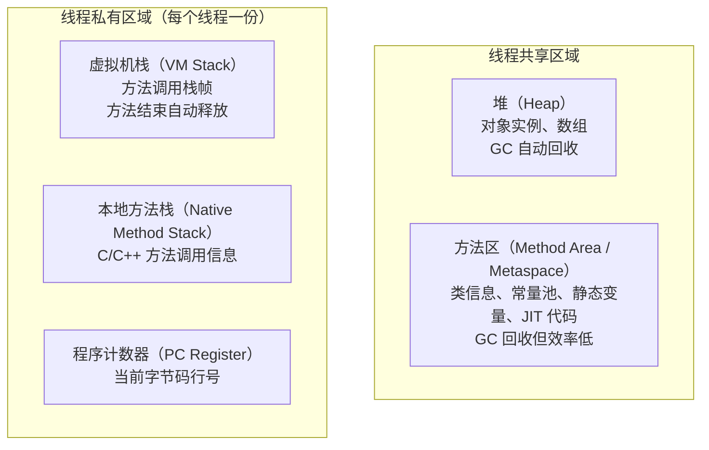

### 1.2 各区域详解

#### 堆（Heap）— 最重要的区域

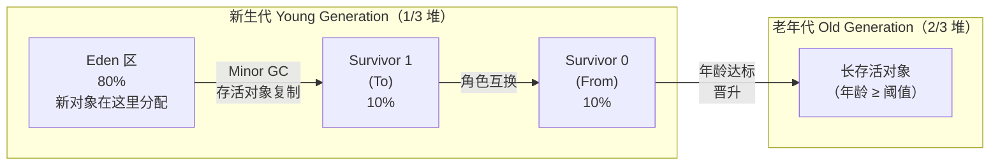

| 参数 | 默认值 | 说明 |
|------|--------|------|
| `-Xms` | 物理内存 1/64 | 堆初始大小 |
| `-Xmx` | 物理内存 1/4 | 堆最大大小 |
| `-Xmn` | 堆的 1/3 | 新生代大小 |
| `-XX:NewRatio` | 2 | 老年代:新生代 = 2:1 |
| `-XX:SurvivorRatio` | 8 | Eden:Survivor = 8:1 |

#### 方法区（Method Area）— 历史变迁

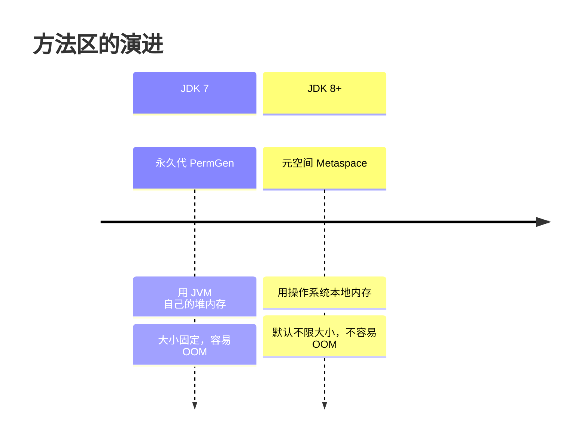

| JDK 版本 | 名称 | 内存来源 | OOM 风险 |
|---------|------|---------|---------|
| JDK 7 | 永久代（PermGen） | JVM 堆内存 | 高（`-XX:MaxPermSize` 限制） |
| JDK 8+ | 元空间（Metaspace） | 操作系统本地内存 | 低（默认不限，`-XX:MaxMetaspaceSize` 可选） |

#### 虚拟机栈（VM Stack）

每个方法调用 → 创建一个**栈帧**压入栈：

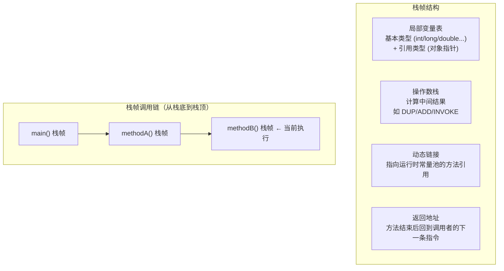

### 1.3 OOM 常见区域

| 区域 | OOM 场景 | 错误信息 |
|------|---------|---------|
| 堆 | 对象太多/太大 | `java.lang.OutOfMemoryError: Java heap space` |
| 元空间 | 加载的类太多 | `java.lang.OutOfMemoryError: Metaspace` |
| 虚拟机栈 | 递归太深 | `StackOverflowError` |
| 虚拟机栈 | 线程太多 | `OutOfMemoryError: unable to create new native thread` |
| 直接内存 | NIO DirectByteBuffer 太多 | `OutOfMemoryError: Direct buffer memory` |

---

## §2 如何判断对象是"垃圾"

### 2.1 引用计数法（Java 不用）

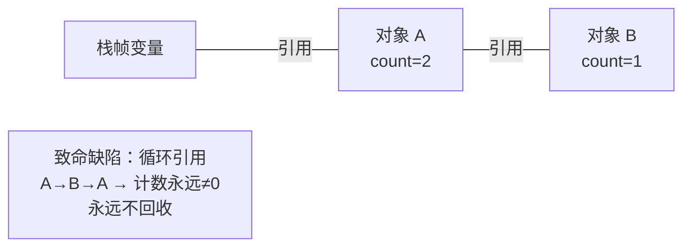

**Java 不采用引用计数的原因**：无法处理循环引用。Python 使用引用计数 + 循环垃圾检测双重机制。

### 2.2 可达性分析（Java 采用）

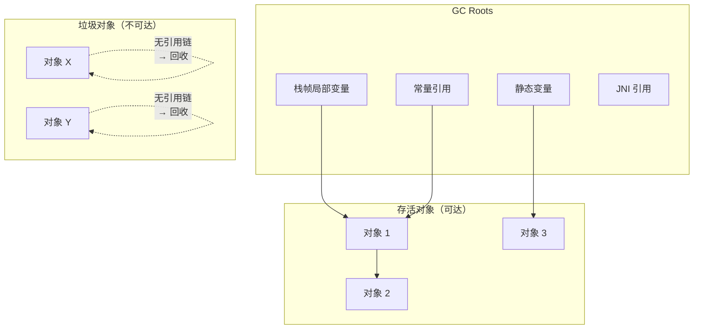

**GC Roots 包括**：
1. 虚拟机栈中引用的对象（栈帧中的局部变量）
2. 方法区中静态变量引用的对象
3. 方法区中常量引用的对象
4. 本地方法栈（JNI）中引用的对象
5. 被 `synchronized` 持有的对象

### 2.3 四种引用强度

| 引用类型 | GC 行为 | 典型用途 | API |
|---------|---------|---------|-----|
| **强引用** | 永远不回收 | 普通变量赋值 `Object o = new Object()` | — |
| **软引用** | 内存不足时回收 | 缓存 | `SoftReference` |
| **弱引用** | 下次 GC 就回收 | 防止内存泄漏（如 `WeakHashMap`） | `WeakReference` |
| **虚引用** | 随时回收，无法获取对象 | 跟踪 GC 活动 | `PhantomReference` |

---

## §3 垃圾回收算法

### 3.1 三种基础算法

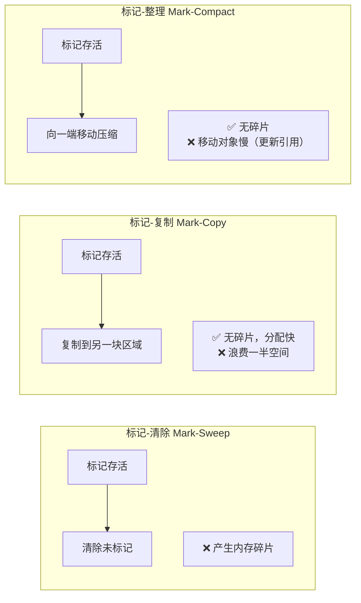

| 算法 | 碎片 | 空间浪费 | 速度 | 适用 |
|------|------|---------|------|------|
| 标记-清除 | 有 | 无 | 中 | 老年代（存活率高时） |
| 标记-复制 | 无 | 50% | 快（指针碰撞分配） | 新生代（存活率低时） |
| 标记-整理 | 无 | 无 | 慢（移动+更新引用） | 老年代 |

### 3.2 分代收集策略

**核心思想**：根据对象存活概率选择最优算法。

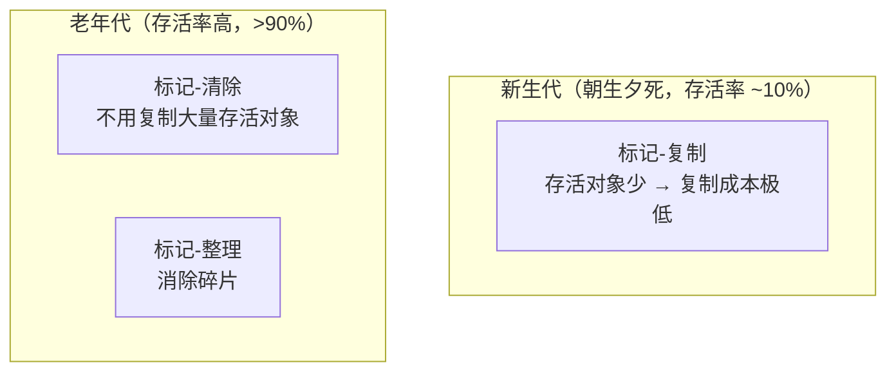

**弱分代假说**：绝大多数对象都是朝生夕死的。
**强分代假说**：熬过越多次 GC 的对象越难消亡。

---

## §4 分代收集详细流程

### 4.1 Minor GC 完整流程

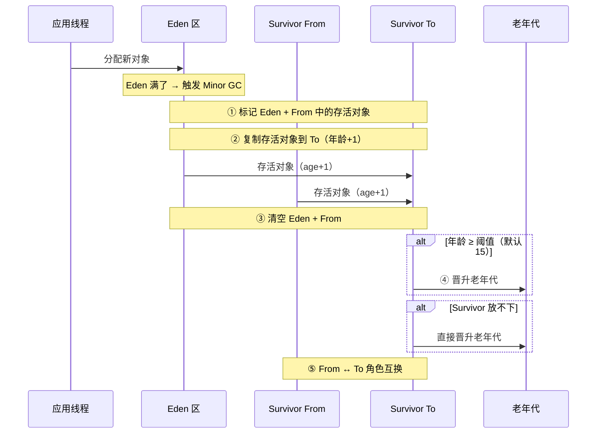

### 4.2 对象晋升老年代的条件

| 条件 | 说明 |
|------|------|
| 年龄达到阈值 | `-XX:MaxTenuringThreshold`，默认 15 |
| Survivor 放不下 | 存活对象 > Survivor 剩余空间 → 直接晋升 |
| 大对象 | `-XX:PretenureSizeThreshold`，大对象直接进老年代 |
| 动态年龄判断 | 相同年龄对象总大小 > Survivor 的一半 → 该年龄及以上直接晋升 |

### 4.3 Minor GC vs Full GC

| | Minor GC（Young GC） | Full GC（Major GC） |
|---|---|---|
| **范围** | 新生代 | 整堆 + 方法区 |
| **频率** | 高（每秒几次） | 低（几分钟一次） |
| **停顿** | 短（10-100ms） | 长（100ms-几秒） |
| **触发** | Eden 满 | 老年代满 / 方法区满 / Minor GC 后晋升空间不足 |

**空间分配担保**：Minor GC 前，JVM 检查老年代剩余空间是否 > 新生代所有存活对象总大小。如果是 → 安全；如果不是 → 看是否允许担保失败 → 允许则冒险 Minor GC，不允许则直接 Full GC。

---

## §5 主流垃圾收集器

### 5.1 收集器全景

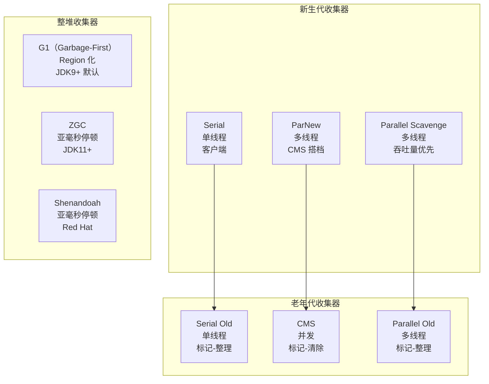

### 5.2 收集器对比

| 收集器 | 分代 | 算法 | 线程模型 | STW 停顿 | JDK 状态 |
|--------|------|------|---------|---------|---------|
| Serial | 新生代 | 复制 | 单线程 | 长 | 客户端模式可用 |
| ParNew | 新生代 | 复制 | 多线程 | 中 | CMS 搭档 |
| Parallel Scavenge | 新生代 | 复制 | 多线程 | 中 | JDK8 默认搭配 |
| Serial Old | 老年代 | 标记-整理 | 单线程 | 长 | 客户端模式 |
| CMS | 老年代 | 标记-清除 | 并发 | 短 | **JDK14 移除** |
| Parallel Old | 老年代 | 标记-整理 | 多线程 | 中 | JDK8 默认 |
| G1 | 整堆 | Region + 复制/整理 | 并发 | 可控 | **JDK9+ 默认** |
| ZGC | 整堆 | Region + 染色指针 | 并发 | <1ms | JDK11 引入 |
| Shenandoah | 整堆 | Region + Brooks 指针 | 并发 | <10ms | JDK12 引入 |

### 5.3 CMS 四阶段（面试高频）

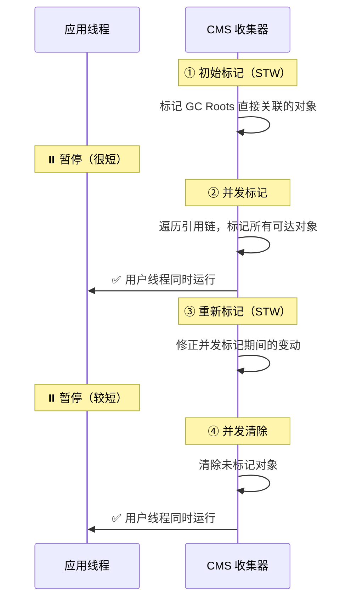

**CMS 的优缺点**：

| 优点 | 缺点 |
|------|------|
| 停顿时间短（①③ 很短） | CPU 敏感（并发阶段抢 CPU） |
| 适合低延迟场景 | 浮动垃圾（并发清除期间新垃圾下次清） |
| | 内存碎片（标记-清除的通病） |
| | JDK14 已移除 |

### 5.4 G1 收集器（JDK9+ 默认）

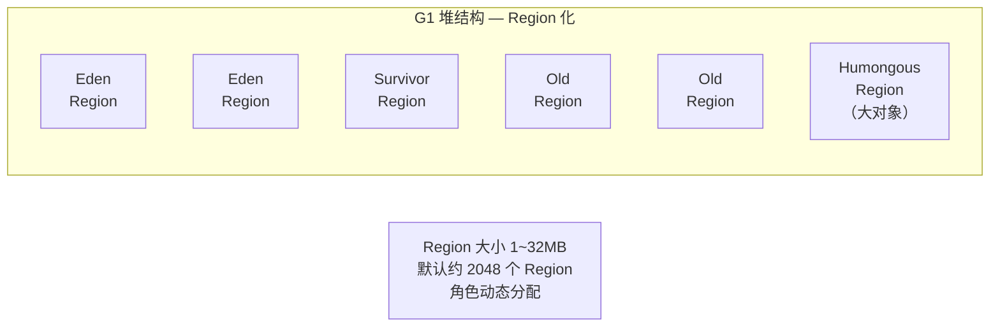

**G1 的工作模式**：

| GC 类型 | 回收范围 | 触发条件 |
|---------|---------|---------|
| Young GC | 所有 Eden + Survivor Region | Eden 满 |
| Mixed GC | 新生代 + 部分老年代 Region | 并发标记完成后 |
| Full GC | 整堆（退化场景） | Mixed GC 来不及回收 → 应尽量避免 |

**G1 关键参数**：

| 参数 | 说明 | 推荐值 |
|------|------|--------|
| `-XX:MaxGCPauseMillis=200` | 目标最大停顿时间 | 200ms（默认） |
| `-XX:G1HeapRegionSize=4m` | Region 大小 | 自动 |
| `-XX:InitiatingHeapOccupancyPercent=45` | 触发并发标记的堆占用率 | 45%（默认） |

### 5.5 ZGC — 亚毫秒停顿（JDK 11+）

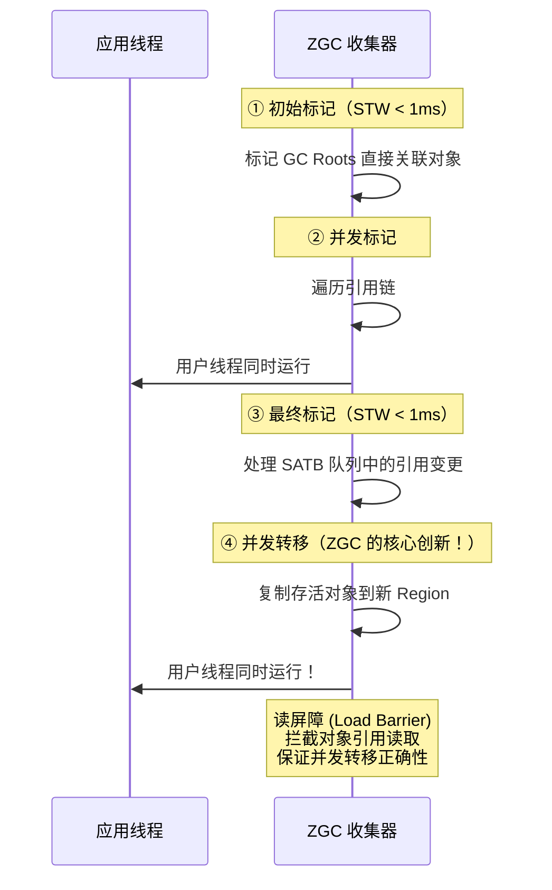

**ZGC vs G1 核心区别**：

| | G1 | ZGC |
|---|---|---|
| 转移阶段 | **STW**（必须暂停应用） | **并发**（应用同时运行） |
| 停顿时间 | 几十~几百 ms | < 1ms |
| 技术关键 | — | 染色指针 + 读屏障 |
| 堆大小 | 推荐 ≤ 8G | 支持 TB 级 |
| 吞吐量 | 高 | 略低（读屏障有开销） |

**ZGC 核心技术**：

| 技术 | 作用 |
|------|------|
| **染色指针（Colored Pointers）** | 在 64 位指针中嵌入标记位（Marked0/Marked1/Remapped/Finalizable），不需要 STW 就能标记 |
| **读屏障（Load Barrier）** | 读对象引用时拦截检查：如果对象正在被转移 → 自动修正指针 |
| **多重映射（Multi-Mapping）** | 同一物理内存映射到多个虚拟地址，减少染色指针的内存开销 |

---

## §6 GC 调优

### 6.1 三个核心指标

```mermaid
graph LR
    Throughput["吞吐量<br/>应用时间 /（应用时间 + GC 时间）<br/>越高越好 > 99%"]
    Latency["停顿时间<br/>GC 暂停应用的时间<br/>越短越好"]
    Memory["内存占用<br/>堆大小<br/>合理即可"]

    Throughput -.->|"三者不可兼得<br/>GC 调优的本质"| Latency
    Latency -.->|""| Memory
    Memory -.->|""| Throughput
```

### 6.2 常用 JVM 参数

| 参数 | 作用 | 生产推荐 |
|------|------|---------|
| `-Xms4g -Xmx4g` | 堆初始=最大 | 设成一样，避免扩容开销 |
| `-Xmn2g` | 新生代大小 | 堆的 1/3 ~ 1/2 |
| `-XX:+UseG1GC` | 使用 G1 | JDK9+ 默认 |
| `-XX:+UseZGC` | 使用 ZGC | JDK17+ 低延迟场景 |
| `-XX:MaxGCPauseMillis=200` | G1 目标停顿 | 200ms |
| `-Xlog:gc*:file=gc.log` | GC 日志 | **必须开启**，调优依据 |
| `-XX:+HeapDumpOnOutOfMemoryError` | OOM 时 dump 堆 | 生产环境必开 |
| `-XX:HeapDumpPath=/tmp/heapdump.hprof` | dump 路径 | 指定具体路径 |

### 6.3 调优决策树

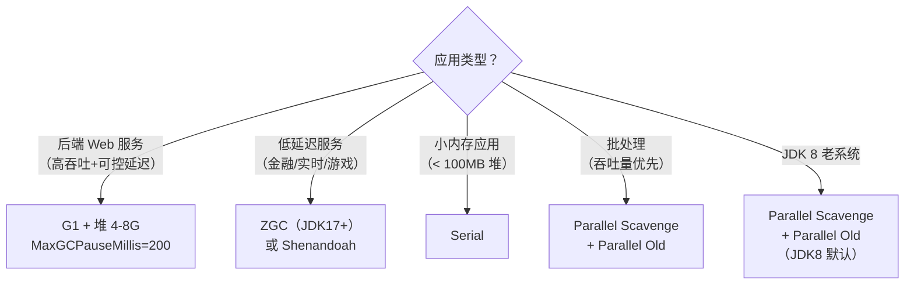

### 6.4 GC 日志分析工具

| 工具 | 说明 |
|------|------|
| **GCEasy**（gceasy.io） | 在线上传 GC 日志，可视化分析 |
| **GCViewer** | 开源本地工具 |
| **JFR + JMC** | JDK Flight Recorder，低开销生产级监控 |
| **Arthas** | 阿里开源 Java 诊断工具，`profiler` / `dashboard` 命令 |

### 6.5 常见 GC 问题排查

| 现象 | 可能原因 | 排查方向 |
|------|---------|---------|
| 频繁 Full GC | 老年代空间不足 / 内存泄漏 | Heap Dump + MAT 分析 |
| GC 后内存不释放 | 内存泄漏（静态集合、未关闭的资源） | MAT 找 GC Roots 最短路径 |
| 停顿时间过长 | 堆太大 / 老年代碎片 | 换 G1/ZGC |
| Young GC 频繁 | Eden 太小 / 对象创建速率高 | 加大 `-Xmn` |
