# JVM 内存模型与垃圾回收

> 最后整理: 2026-09-30 | 来源: 对话讲解

> 关联: [[./Spring IOC、DI 与 AOP 核心原理.md]] — Spring Bean 生命周期运行在 JVM 之上 | [[./热点账户高并发记账方案.md]] — 高并发场景下 JVM 调优实战 | [ThreadLocal 弱引用设计与内存泄漏](<./ThreadLocal 弱引用设计与内存泄漏.md>) — 弱引用（本文 §2.3）在并发工具上的典型工程应用

---

## §1 JVM 运行时数据区

### 1.1 全景图

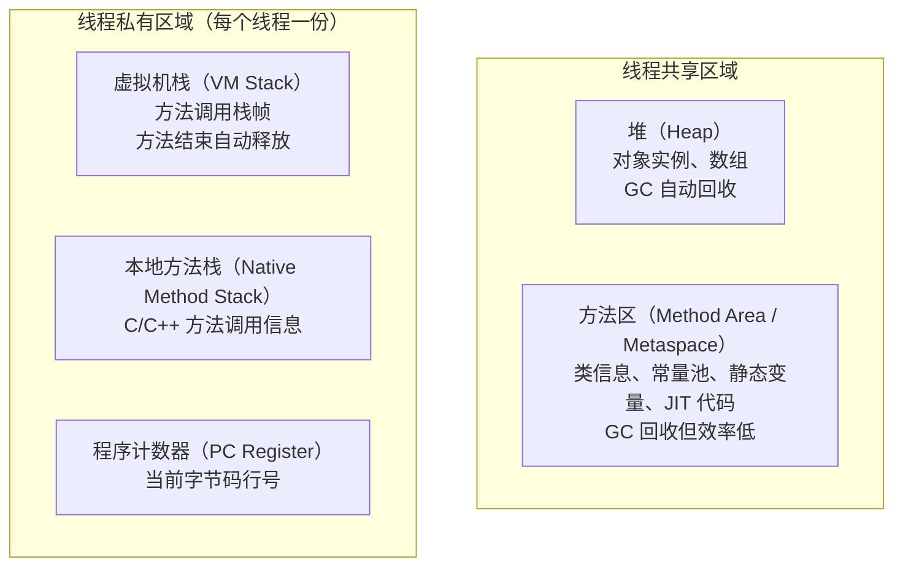
```mermaid
graph TB
    subgraph "线程共享区域"
        Heap["堆（Heap）<br/>对象实例、数组<br/>GC 自动回收"]
        MethodArea["方法区（Method Area / Metaspace）<br/>类信息、常量池、静态变量、JIT 代码<br/>GC 回收但效率低"]
    end

    subgraph "线程私有区域（每个线程一份）"
        VMStack["虚拟机栈（VM Stack）<br/>方法调用栈帧<br/>方法结束自动释放"]
        NativeStack["本地方法栈（Native Method Stack）<br/>C/C++ 方法调用信息"]
        PC["程序计数器（PC Register）<br/>当前字节码行号"]
    end
```

### 1.2 各区域详解

#### 堆（Heap）— 最重要的区域

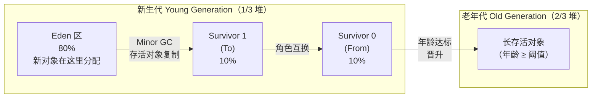
```mermaid
graph LR
    subgraph "新生代 Young Generation（1/3 堆）"
        Eden["Eden 区<br/>80%<br/>新对象在这里分配"]
        S0["Survivor 0<br/>(From)<br/>10%"]
        S1["Survivor 1<br/>(To)<br/>10%"]
    end

    subgraph "老年代 Old Generation（2/3 堆）"
        Old["长存活对象<br/>（年龄 ≥ 阈值）"]
    end

    Eden -->|"Minor GC<br/>存活对象复制"| S1
    S1 -->|"角色互换"| S0
    S0 -->|"年龄达标<br/>晋升"| Old
```

| 参数 | 默认值 | 说明 |
|------|--------|------|
| `-Xms` | 物理内存 1/64 | 堆初始大小 |
| `-Xmx` | 物理内存 1/4 | 堆最大大小 |
| `-Xmn` | 堆的 1/3 | 新生代大小 |
| `-XX:NewRatio` | 2 | 老年代:新生代 = 2:1 |
| `-XX:SurvivorRatio` | 8 | Eden:Survivor = 8:1 |

#### 方法区（Method Area）— 历史变迁

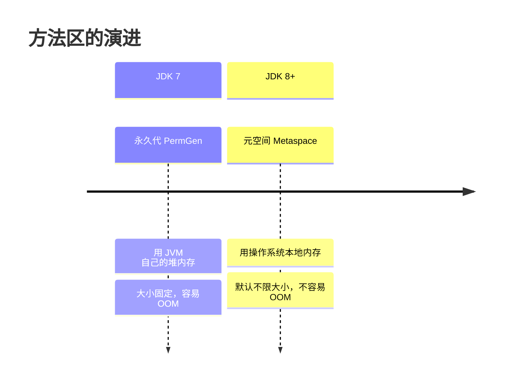
```mermaid
timeline
    title 方法区的演进
    section JDK 7
        永久代 PermGen : 用 JVM 自己的堆内存 : 大小固定，容易 OOM
    section JDK 8+
        元空间 Metaspace : 用操作系统本地内存 : 默认不限大小，不容易 OOM
```

| JDK 版本 | 名称 | 内存来源 | OOM 风险 |
|---------|------|---------|---------|
| JDK 7 | 永久代（PermGen） | JVM 堆内存 | 高（`-XX:MaxPermSize` 限制） |
| JDK 8+ | 元空间（Metaspace） | 操作系统本地内存 | 低（默认不限，`-XX:MaxMetaspaceSize` 可选） |

#### 虚拟机栈（VM Stack）

每个方法调用 → 创建一个**栈帧**压入栈：

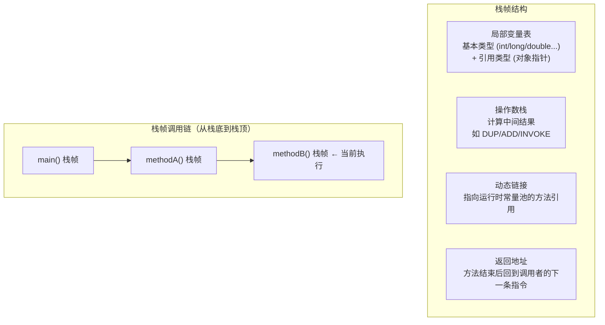
```mermaid
graph TB
    subgraph "栈帧结构"
        LVT["局部变量表<br/>基本类型 (int/long/double...)<br/>+ 引用类型 (对象指针)"]
        OpStack["操作数栈<br/>计算中间结果<br/>如 DUP/ADD/INVOKE"]
        DynLink["动态链接<br/>指向运行时常量池的方法引用"]
        RetAddr["返回地址<br/>方法结束后回到调用者的下一条指令"]
    end

    subgraph "栈帧调用链（从栈底到栈顶）"
        Main["main() 栈帧"]
        A["methodA() 栈帧"]
        B["methodB() 栈帧 ← 当前执行"]
    end

    Main --> A --> B
```

### 1.3 OOM 常见区域

| 区域 | OOM 场景 | 错误信息 |
|------|---------|---------|
| 堆 | 对象太多/太大 | `java.lang.OutOfMemoryError: Java heap space` |
| 元空间 | 加载的类太多 | `java.lang.OutOfMemoryError: Metaspace` |
| 虚拟机栈 | 递归太深 | `StackOverflowError` |
| 虚拟机栈 | 线程太多 | `OutOfMemoryError: unable to create new native thread` |
| 直接内存 | NIO DirectByteBuffer 太多 | `OutOfMemoryError: Direct buffer memory` |

---

## §2 如何判断对象是"垃圾"

### 2.1 引用计数法（Java 不用）

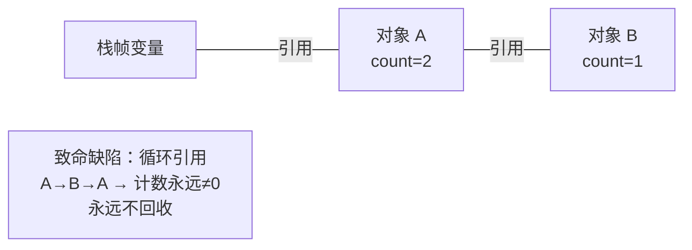
```mermaid
graph LR
    A["对象 A<br/>count=2"] ---|"引用"| B["对象 B<br/>count=1"]
    C["栈帧变量"] ---|"引用"| A

    Note["致命缺陷：循环引用<br/>A→B→A → 计数永远≠0<br/>永远不回收"]
```

**Java 不采用引用计数的原因**：无法处理循环引用。Python 使用引用计数 + 循环垃圾检测双重机制。

### 2.2 可达性分析（Java 采用）

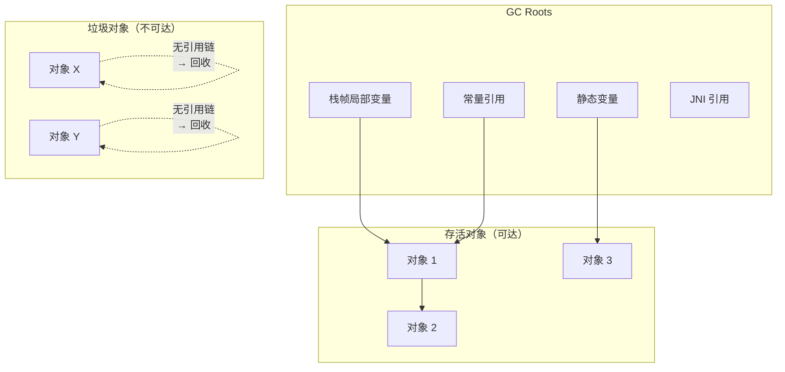
```mermaid
graph TB
    subgraph "GC Roots"
        R1["栈帧局部变量"]
        R2["静态变量"]
        R3["常量引用"]
        R4["JNI 引用"]
    end

    subgraph "存活对象（可达）"
        O1["对象 1"]
        O2["对象 2"]
        O3["对象 3"]
    end

    subgraph "垃圾对象（不可达）"
        G1["对象 X"]
        G2["对象 Y"]
    end

    R1 --> O1 --> O2
    R2 --> O3
    R3 --> O1

    G1 -.->|"无引用链<br/>→ 回收"| G1
    G2 -.->|"无引用链<br/>→ 回收"| G2
```

**GC Roots 包括**：
1. 虚拟机栈中引用的对象（栈帧中的局部变量）
2. 方法区中静态变量引用的对象
3. 方法区中常量引用的对象
4. 本地方法栈（JNI）中引用的对象
5. 被 `synchronized` 持有的对象

### 2.3 四种引用强度

| 引用类型 | GC 行为 | 典型用途 | API |
|---------|---------|---------|-----|
| **强引用** | 永远不回收 | 普通变量赋值 `Object o = new Object()` | — |
| **软引用** | 内存不足时回收 | 缓存 | `SoftReference` |
| **弱引用** | 下次 GC 就回收 | 防止内存泄漏（如 `WeakHashMap`） | `WeakReference` |
| **虚引用** | 随时回收，无法获取对象 | 跟踪 GC 活动 | `PhantomReference` |

**代码 Demo**：

```java
// 软引用做缓存 — 内存充足时保留，不足时自动回收
SoftReference<byte[]> cacheRef = new SoftReference<>(new byte[10 * 1024 * 1024]);
byte[] data = cacheRef.get();  // 可能返回 null（已被 GC 回收）
if (data == null) {
    data = loadFromDisk();  // 兜底：重新加载
}

// 弱引用防内存泄漏 — 配合 WeakHashMap
WeakHashMap<Object, String> map = new WeakHashMap<>();
Object key = new Object();
map.put(key, "value");
key = null;  // 断开强引用
System.gc();
// 下次 GC 后 key 被回收，map 中对应 entry 自动移除
// 对比普通 HashMap：key 被 map 强引用，永远不会被 GC → 内存泄漏
```

### 2.4 可达性阶梯：不是"四档开关"，而是一条逐级递归定义的链

JDK 官方文档（`java.lang.ref` 包文档）对"可达"的**操作性定义**是从强到弱**逐级递归**给出的——注意每一档都建立在"前一档不成立"的前提上：

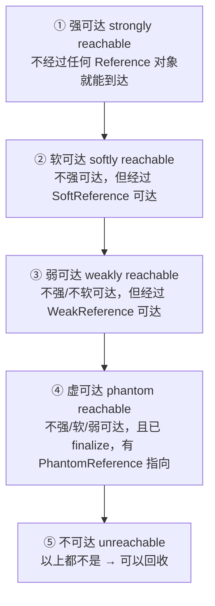
```mermaid
graph TB
    S["① 强可达 strongly reachable<br/>不经过任何 Reference 对象就能到达"] --> So["② 软可达 softly reachable<br/>不强可达，但经过 SoftReference 可达"]
    So --> W["③ 弱可达 weakly reachable<br/>不强/不软可达，但经过 WeakReference 可达"]
    W --> P["④ 虚可达 phantom reachable<br/>不强/软/弱可达，且已 finalize，有 PhantomReference 指向"]
    P --> U["⑤ 不可达 unreachable<br/>以上都不是 → 可以回收"]
```

| 等级 | 官方定义 |
|------|---------|
| 强可达 | 某个线程**不经过任何 Reference 对象**就能到达（新 new 出来的对象，对创建它的线程就是强可达） |
| 软可达 | **不是**强可达，但可以**经过一个软引用**到达 |
| 弱可达 | **既不是**强可达**也不是**软可达，但可以经过一个弱引用到达 |
| 虚可达 | 既不强、不软、不弱可达，**且已被 finalize**，但还有虚引用指向它 |
| 不可达 | 以上全不满足 → 可回收 |

**"逐级定义"这个结构本身就是最关键的要点**：一个对象属于哪一档，取决于**到它最强的那条路径**。所以"把强引用置 null，它就降到弱可达"这句话隐含了一个前提——**没有别的强引用路径**。这也是排查内存泄漏时"我以为它该被回收了"这类误判的总根源。

### 2.5 关键澄清：被"清掉"的不是 Reference 对象，而是它的 referent

这是理解弱引用时最容易搞混的一点。先看 `Reference` 的字段：

```java
public abstract class Reference<T> {
    private T referent;                          /* Treated specially by GC */
    volatile ReferenceQueue<? super T> queue;
    volatile Reference next;
    private transient Reference<?> discovered;
```

- **`Reference` 对象本身是个普普通通的 Java 对象**——它被谁强引用，就活多久。`new WeakReference<>(obj)` 出来的那个对象，**不会因为"弱引用"三个字而自己消失**。
- **被 GC 清掉的是 `referent` 字段**（指向你的业务对象的那条边），清掉后 `referent == null`，而 `WeakReference` 对象照旧活着。
- `referent` 看着是普通字段，但注释写着 `Treated specially by GC`——**它被 JVM 特殊对待**。这也解释了为什么 `clear()` 不是一次简单赋值，而是 native 方法：

```java
public void clear() { clear0(); }   // private native void clear0();
```

`clear()` 的文档把这件事说得很直白：

> This method is invoked only by Java code; **when the garbage collector clears references it does so directly, without invoking this method.**
> A simple assignment of the referent field won't do for some garbage collectors.

**推论（ThreadLocal 泄漏的全部根源就在这里）**：清 referent 只切断"**这一条**"边。referent 指向的那个对象、以及它内部引用的所有东西会不会被回收，**完全取决于还有没有别的强引用链**。切断一条边 ≠ 回收对端。

### 2.6 Reference 的四态状态机

`Reference` 对象不是"活着 / 被清"两态，而是有完整状态机（`Reference.java` 源码里那段长注释是权威描述）：

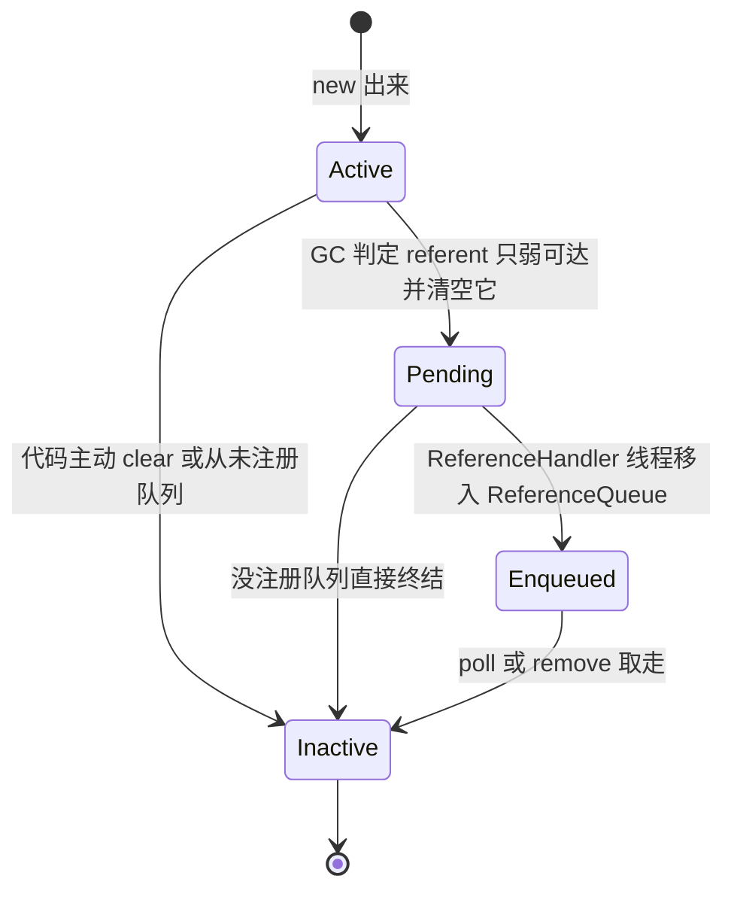
```mermaid
stateDiagram-v2
    [*] --> Active: new 出来
    Active --> Pending: GC 判定 referent 只弱可达并清空它
    Active --> Inactive: 代码主动 clear 或从未注册队列
    Pending --> Enqueued: ReferenceHandler 线程移入 ReferenceQueue
    Pending --> Inactive: 没注册队列直接终结
    Enqueued --> Inactive: poll 或 remove 取走
    Inactive --> [*]
```

| 状态 | referent | 含义 |
|------|---------|------|
| **Active** | 非 null | 交给 GC 特殊处理中；GC 一旦发现 referent 已弱可达，就把它"发现"并转入 Pending（或直接转 Inactive） |
| **Pending** | **已为 null** | 已被 GC 清空，挂在 JVM 内部的 pending 链表上（靠 `discovered` 字段串联），等 `ReferenceHandler` 处理 |
| **Enqueued** | null | 已进入你的 `ReferenceQueue`，等程序 poll/remove |
| **Inactive** | null | 终态（已被取走，或本来就没注册队列） |

三个必须知道的实现细节：

1. **"GC 清 referent"和"把 Reference 放进你的队列"是两个动作、两个执行者**。GC 只负责"清 + 挂到 JVM 内部 pending 链表"；把它真正搬进 `ReferenceQueue` 的是 **`ReferenceHandler` 这个守护线程**（`Reference.java` 里的 `processPendingReferences()` 死循环）。
2. **没注册队列的弱/软引用，就停在 Inactive，不会有任何通知**。想让程序知道"对象被回收了"，必须在构造时传入 `ReferenceQueue`。
3. **`Cleaner` 是特例**：`ReferenceHandler` 遇到 `Cleaner` 实例会**直接调它的 `clean()`**，而不走"入队"流程——这是 JDK 给清理动作开的直通车。

### 2.7 四种引用的精确语义

| 类型 | 让对象"降到" | GC 何时切断这条边 | `get()` 行为 |
|------|------------|-----------------|-------------|
| 强引用 | 不减档 | 永不（只要还有强引用链） | — |
| `SoftReference` | 软可达 | **由 GC 视内存需求自行裁量**；但抛出 OOM **之前保证**全部清掉 | 返回 referent 或 null |
| `WeakReference` | 弱可达 | GC 判定弱可达的**那一刻，原子地**清掉指向它的所有弱引用 | 返回 referent 或 null |
| `PhantomReference` | 虚可达 | 该对象已 finalize 之后 | **永远返回 null** |

**软引用的"视内存需求"是有策略的，不是随机的**：

```java
public class SoftReference<T> extends Reference<T> {
    private static long clock;    // GC 维护的"时钟"
    private long timestamp;       // 每次 get() 会刷新它，构造时初始化为 clock
```

`SoftReference.get()` 会顺手把 `timestamp` 刷新为当前 `clock`。GC 倾向于**优先清"最久没被访问过"的软引用**，且内存越紧张越激进。对应调优参数（本机 JDK 17 实测默认值）：

```text
$ java -XX:+PrintFlagsFinal -version | grep SoftRefLRU
     intx SoftRefLRUPolicyMSPerMB   = 1000   {product} {default}
```

直觉理解：**每 1 MB 空闲堆，允许软引用多存活约 1 秒**（值越大越"舍不得"清）。官方措辞是"**encouraged** to bias against clearing recently-created or recently-used"——是**鼓励**，不是强制，所以软引用做缓存**不能假设它一定在**。

**弱引用的措辞则非常强**（`WeakReference` 类文档）：

> At that time it will **atomically clear all weak references** to that object and all weak references to any other weakly-reachable objects from which that object is reachable through a chain of strong and soft references.

这就是"弱引用活不过下一次 GC"的准确出处——注意前提是"该对象**只**弱可达"。弱引用的设计目的正是"**不阻止** referent 被 finalize、被回收"，所以它才适合做"规范化映射"（canonicalizing mappings，如 `WeakHashMap`）。

**虚引用为什么 `get()` 恒为 null**：`PhantomReference` 直接覆写 `get()` 为 `return null`。这不是偷懒，而是**故意不让你拿到对象**——否则你就能在"对象已死"之后把它复活（resurrection），彻底破坏回收语义。所以虚引用的唯一用途是"**回收通知**"，且**必须**配 `ReferenceQueue` 才有意义。

> 一个容易混的点：**"不可达"不等于"立刻被回收"**。可达性只是给 GC 一个"可以回收"的许可，真正的时机由 GC 策略决定；弱引用也类似——"下次 GC 会清"里的"下次"指的是**下一次做了引用处理（reference processing）的 GC 周期**，而不是"你一松手就清"。

### 2.8 一个反直觉的坑：`get()` 会把对象"临时变强"

`Reference.get()` 的文档里有一句话值得单独拎出来：

> This method returns a **strong** reference to the referent. This may cause the garbage collector to treat it as **strongly reachable until some later collection cycle**. The `refersTo` method can be used to avoid such strengthening when testing whether some object is the referent of a reference object; that is, use `ref.refersTo(obj)` rather than `ref.get() == obj`.

翻译成人话：**你只是为了"检查一下"而调用 `get()`，却顺手把一条弱引用升级成了强引用**——GC 在后续某个回收周期之前会把它当强可达对待，于是它这一轮就活下来了。

这不是纸上谈兵，而是有直接工程后果的两件事：

- `WeakHashMap` 和 `ThreadLocalMap` 都从 JDK 16 起把 `e.get() == key` 改成了 **`e.refersTo(key)`**（`Reference.refersTo` 是 JDK 16 新增），正是为了消除这种"检查动作本身改变了可达性"的副作用。
- 这也解释了为什么在 `ThreadLocalMap` 源码里会看到 `refersTo` 和 `e.get()` **混用**：`getEntry`/`set`/`remove`/`cleanSomeSlots`/`expungeStaleEntries` 已切换成 `refersTo`，而 `expungeStaleEntry`、`resize` 里仍是 `e.get()`。

自己写弱引用代码时同理：**判断"是不是同一个对象"用 `refersTo`，不要用 `get() == obj`。**

### 2.9 通知机制：ReferenceQueue、Cleaner 与 finalize

**`WeakHashMap` 是"边访问边清理"的教科书范例**（JDK 包文档原文）：

> A tactic that often works well is to examine a reference queue in the course of performing some other fairly-frequent action. For example, a hashtable that uses weak references to implement weak keys **could poll its reference queue each time the table is accessed. This is how the `WeakHashMap` class works.**

源码完全对应（`WeakHashMap.java`）：

```java
private final ReferenceQueue<Object> queue = new ReferenceQueue<>();

private void expungeStaleEntries() {
    for (Object x; (x = queue.poll()) != null; ) {   // 每次 get/put 都顺手清一遍
        ...
    }
}
```

**对照 `ThreadLocalMap`：它刻意不注册 `ReferenceQueue`**，改为自己扫表。原因是它是**线程私有**的，扫表零同步；换成全局队列反而要在无锁的 map 里加入同步。两者解决同一个问题，选了不同的路——详见 [ThreadLocal 弱引用设计与内存泄漏](<./ThreadLocal 弱引用设计与内存泄漏.md>) §9。

**`Cleaner` 是现代替代 `finalize()` 的方案**，底层就是 `PhantomReference` + `ReferenceQueue`：

```java
Cleaner cleaner = Cleaner.create();
cleaner.register(resource, () -> releaseNativeHandle());   // 对象虚可达后执行清理
```

两条硬约束（`Cleaner` 文档明确写了）：

1. **清理动作（`Runnable`）绝对不能引用被清理的那个对象**，否则它永远无法变成虚可达，清理动作**永远不会执行**。所以清理逻辑要用**静态内部类或静态方法**封装——**不能用匿名内部类 / 非静态内部类**，它们会隐式持有外部实例的引用，正好踩中这个坑。
2. 清理动作**至多执行一次**，且抛出的异常会被吞掉（不影响 `Cleaner` 里的其他清理动作）。

`finalize()` 被淘汰的原因也在这套机制里：它由 JVM 在**不确定的时刻**调用（对象已不可达但回收被推迟），还允许对象"复活"，延迟和顺序都不可控。本机 JDK 17 源码里它已是 `@Deprecated(since="9")`，更高版本进一步标记为 `forRemoval`。

**最后一把"强制保活"的锁**：`Reference.reachabilityFence(obj)`（JDK 9+）。它的方法体是**空的**，但被 `@ForceInline` 标注，作用是告诉 JIT"执行到这里为止，`obj` 必须还是活的"，防止编译器把"看起来已经没用了"的对象提前判定为可回收。它主要用在依赖对象存活顺序的收尾代码里（如 JNI、池化资源）。

### 2.10 把地基接回 ThreadLocal

有了上面这套地基，ThreadLocal 的每一步都能对上号：

| 地基概念 | 在 ThreadLocal 里的体现 |
|---------|----------------------|
| 可达性 = 引用链的传递闭包 | `Thread → ThreadLocalMap → table → Entry → value` 全程强引用，所以 value 可达、绝不会被回收 |
| 被清的是 referent，不是 Reference 对象 | GC 清的是 `Entry` 的 referent（即 ThreadLocal 对象）；`Entry` 自己还被 `table` 数组强引用，活得好好的 |
| 清一条边 ≠ 回收对端 | 切断 key 这条边后，value 依然通过 Entry 可达 → **stale entry（僵尸条目）** |
| 弱引用不注册队列就没有通知 | `ThreadLocalMap` 不注册 `ReferenceQueue`，所以只能靠 get/set/remove **顺手扫表**清理 |
| 阶梯按"最强路径"定档 | ThreadLocal 对象只要还被 `static final` 强引用，就永远强可达、永远不会被清 |
| `get()` 会临时变强 | 这正是 `ThreadLocalMap` 改用 `refersTo` 的动机（见 §2.8） |

> 弱引用最经典的工程应用就是这个 `ThreadLocal`：它的 `Entry` **key 弱引用、value 强引用**，是一半弱一半强的非对称设计。完整展开（stale entry、四路清理、实测 demo、TTL/FastThreadLocal/ScopedValue）见 [ThreadLocal 弱引用设计与内存泄漏](<./ThreadLocal 弱引用设计与内存泄漏.md>)。

---

## §3 垃圾回收算法

### 3.1 三种基础算法

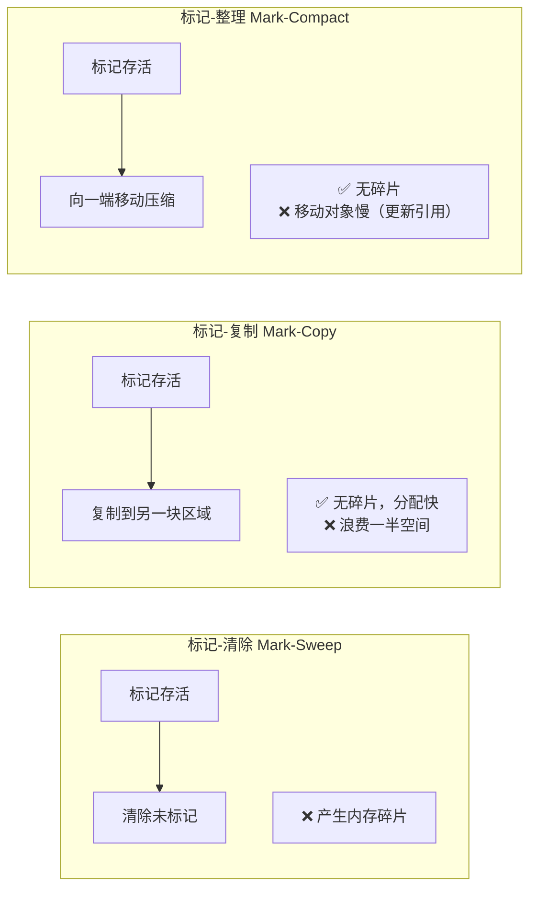
```mermaid
graph LR
    subgraph "标记-清除 Mark-Sweep"
        MS1["标记存活"] --> MS2["清除未标记"]
        MS3["❌ 产生内存碎片"]
    end

    subgraph "标记-复制 Mark-Copy"
        MC1["标记存活"] --> MC2["复制到另一块区域"]
        MC3["✅ 无碎片，分配快<br/>❌ 浪费一半空间"]
    end

    subgraph "标记-整理 Mark-Compact"
        MCp1["标记存活"] --> MCp2["向一端移动压缩"]
        MCp3["✅ 无碎片<br/>❌ 移动对象慢（更新引用）"]
    end
```

| 算法 | 碎片 | 空间浪费 | 速度 | 适用 |
|------|------|---------|------|------|
| 标记-清除 | 有 | 无 | 中 | 老年代（存活率高时） |
| 标记-复制 | 无 | 50% | 快（指针碰撞分配） | 新生代（存活率低时） |
| 标记-整理 | 无 | 无 | 慢（移动+更新引用） | 老年代 |

### 3.2 分代收集策略

**核心思想**：根据对象存活概率选择最优算法。

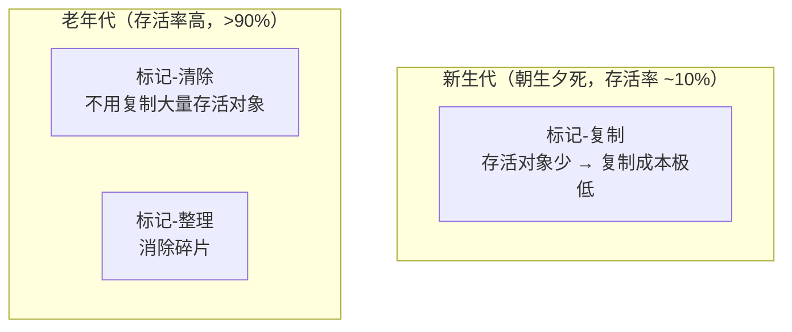
```mermaid
graph TD
    subgraph "新生代（朝生夕死，存活率 ~10%）"
        Y_Algo["标记-复制<br/>存活对象少 → 复制成本极低"]
    end

    subgraph "老年代（存活率高，>90%）"
        O_Algo1["标记-清除<br/>不用复制大量存活对象"]
        O_Algo2["标记-整理<br/>消除碎片"]
    end
```

**弱分代假说**：绝大多数对象都是朝生夕死的。
**强分代假说**：熬过越多次 GC 的对象越难消亡。

---

## §4 分代收集详细流程

### 4.1 Minor GC 完整流程

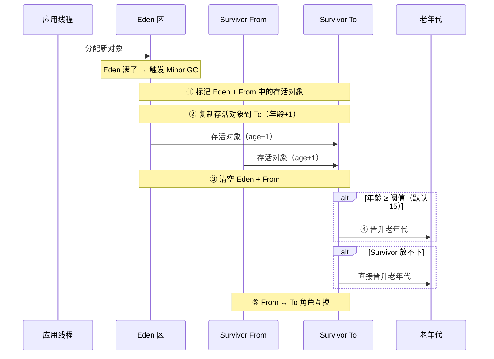
```mermaid
sequenceDiagram
    participant App as 应用线程
    participant Eden as Eden 区
    participant From as Survivor From
    participant To as Survivor To
    participant Old as 老年代

    App->>Eden: 分配新对象
    Note over Eden: Eden 满了 → 触发 Minor GC

    Note over Eden,To: ① 标记 Eden + From 中的存活对象
    Note over Eden,To: ② 复制存活对象到 To（年龄+1）
    Eden->>To: 存活对象（age+1）
    From->>To: 存活对象（age+1）

    Note over Eden,To: ③ 清空 Eden + From

    alt 年龄 ≥ 阈值（默认 15）
        To->>Old: ④ 晋升老年代
    end

    alt Survivor 放不下
        To->>Old: 直接晋升老年代
    end

    Note over From,To: ⑤ From ↔ To 角色互换
```

### 4.2 对象晋升老年代的条件

| 条件 | 说明 |
|------|------|
| 年龄达到阈值 | `-XX:MaxTenuringThreshold`，默认 15 |
| Survivor 放不下 | 存活对象 > Survivor 剩余空间 → 直接晋升 |
| 大对象 | `-XX:PretenureSizeThreshold`，大对象直接进老年代 |
| 动态年龄判断 | 相同年龄对象总大小 > Survivor 的一半 → 该年龄及以上直接晋升 |

### 4.3 Minor GC vs Full GC

| | Minor GC（Young GC） | Full GC（Major GC） |
|---|---|---|
| **范围** | 新生代 | 整堆 + 方法区 |
| **频率** | 高（每秒几次） | 低（几分钟一次） |
| **停顿** | 短（10-100ms） | 长（100ms-几秒） |
| **触发** | Eden 满 | 老年代满 / 方法区满 / Minor GC 后晋升空间不足 |

**空间分配担保**：Minor GC 前，JVM 检查老年代剩余空间是否 > 新生代所有存活对象总大小。如果是 → 安全；如果不是 → 看是否允许担保失败 → 允许则冒险 Minor GC，不允许则直接 Full GC。

---

## §5 主流垃圾收集器

### 5.1 收集器全景

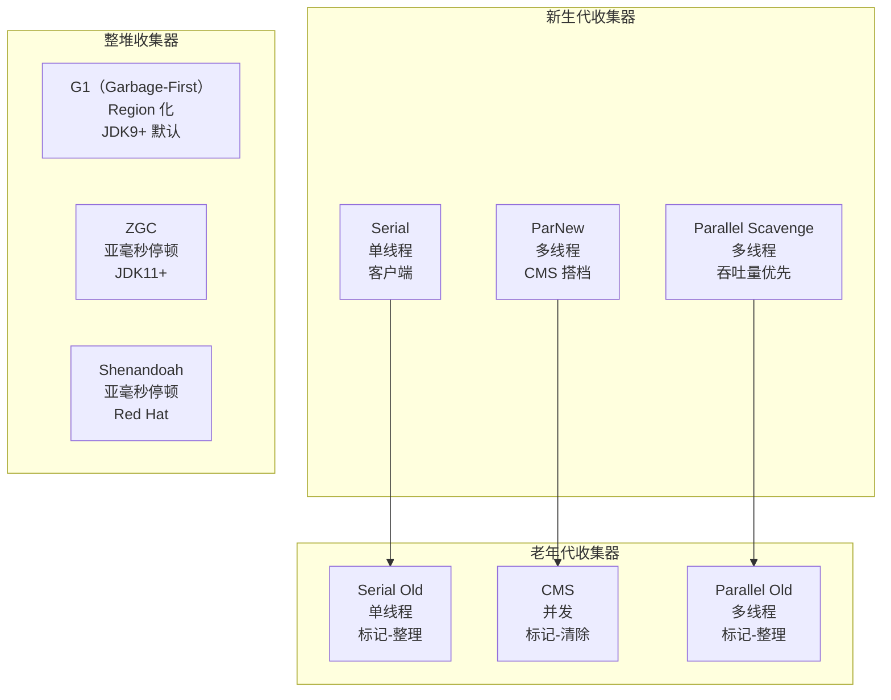
```mermaid
graph TB
    subgraph "新生代收集器"
        Serial["Serial<br/>单线程<br/>客户端"]
        ParNew["ParNew<br/>多线程<br/>CMS 搭档"]
        PS["Parallel Scavenge<br/>多线程<br/>吞吐量优先"]
    end

    subgraph "老年代收集器"
        SerialOld["Serial Old<br/>单线程<br/>标记-整理"]
        CMS_["CMS<br/>并发<br/>标记-清除"]
        ParOld["Parallel Old<br/>多线程<br/>标记-整理"]
    end

    subgraph "整堆收集器"
        G1_["G1（Garbage-First）<br/>Region 化<br/>JDK9+ 默认"]
        ZGC_["ZGC<br/>亚毫秒停顿<br/>JDK11+"]
        Shen["Shenandoah<br/>亚毫秒停顿<br/>Red Hat"]
    end

    Serial --> SerialOld
    ParNew --> CMS_
    PS --> ParOld
```

### 5.2 收集器对比

| 收集器 | 分代 | 算法 | 线程模型 | STW 停顿 | JDK 状态 |
|--------|------|------|---------|---------|---------|
| Serial | 新生代 | 复制 | 单线程 | 长 | 客户端模式可用 |
| ParNew | 新生代 | 复制 | 多线程 | 中 | CMS 搭档 |
| Parallel Scavenge | 新生代 | 复制 | 多线程 | 中 | JDK8 默认搭配 |
| Serial Old | 老年代 | 标记-整理 | 单线程 | 长 | 客户端模式 |
| CMS | 老年代 | 标记-清除 | 并发 | 短 | **JDK14 移除** |
| Parallel Old | 老年代 | 标记-整理 | 多线程 | 中 | JDK8 默认 |
| G1 | 整堆 | Region + 复制/整理 | 并发 | 可控 | **JDK9+ 默认** |
| ZGC | 整堆 | Region + 染色指针 | 并发 | <1ms | JDK11 引入 |
| Shenandoah | 整堆 | Region + Brooks 指针 | 并发 | <10ms | JDK12 引入 |

### 5.3 CMS 四阶段（面试高频）

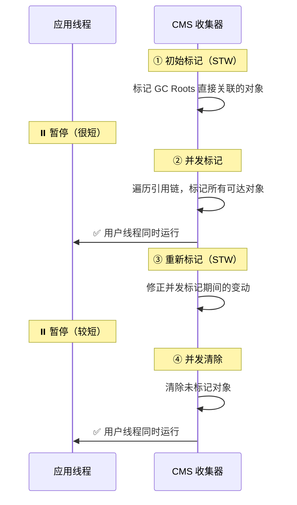
```mermaid
sequenceDiagram
    participant App as 应用线程
    participant CMS as CMS 收集器

    Note over CMS: ① 初始标记（STW）
    CMS->>CMS: 标记 GC Roots 直接关联的对象
    Note over App: ⏸️ 暂停（很短）

    Note over CMS: ② 并发标记
    CMS->>CMS: 遍历引用链，标记所有可达对象
    CMS->>App: ✅ 用户线程同时运行

    Note over CMS: ③ 重新标记（STW）
    CMS->>CMS: 修正并发标记期间的变动
    Note over App: ⏸️ 暂停（较短）

    Note over CMS: ④ 并发清除
    CMS->>CMS: 清除未标记对象
    CMS->>App: ✅ 用户线程同时运行
```

**CMS 的优缺点**：

| 优点 | 缺点 |
|------|------|
| 停顿时间短（①③ 很短） | CPU 敏感（并发阶段抢 CPU） |
| 适合低延迟场景 | 浮动垃圾（并发清除期间新垃圾下次清） |
| | 内存碎片（标记-清除的通病） |
| | JDK14 已移除 |

### 5.4 G1 收集器（JDK9+ 默认）

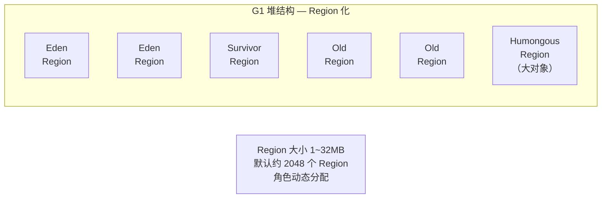
```mermaid
graph LR
    subgraph "G1 堆结构 — Region 化"
        E1["Eden<br/>Region"]
        E2["Eden<br/>Region"]
        S["Survivor<br/>Region"]
        O1["Old<br/>Region"]
        O2["Old<br/>Region"]
        H["Humongous<br/>Region<br/>（大对象）"]
    end

    Note["Region 大小 1~32MB<br/>默认约 2048 个 Region<br/>角色动态分配"]
```

**G1 的工作模式**：

| GC 类型 | 回收范围 | 触发条件 |
|---------|---------|---------|
| Young GC | 所有 Eden + Survivor Region | Eden 满 |
| Mixed GC | 新生代 + 部分老年代 Region | 并发标记完成后 |
| Full GC | 整堆（退化场景） | Mixed GC 来不及回收 → 应尽量避免 |

**G1 关键参数**：

| 参数 | 说明 | 推荐值 |
|------|------|--------|
| `-XX:MaxGCPauseMillis=200` | 目标最大停顿时间 | 200ms（默认） |
| `-XX:G1HeapRegionSize=4m` | Region 大小 | 自动 |
| `-XX:InitiatingHeapOccupancyPercent=45` | 触发并发标记的堆占用率 | 45%（默认） |

### 5.5 ZGC — 亚毫秒停顿（JDK 11+）

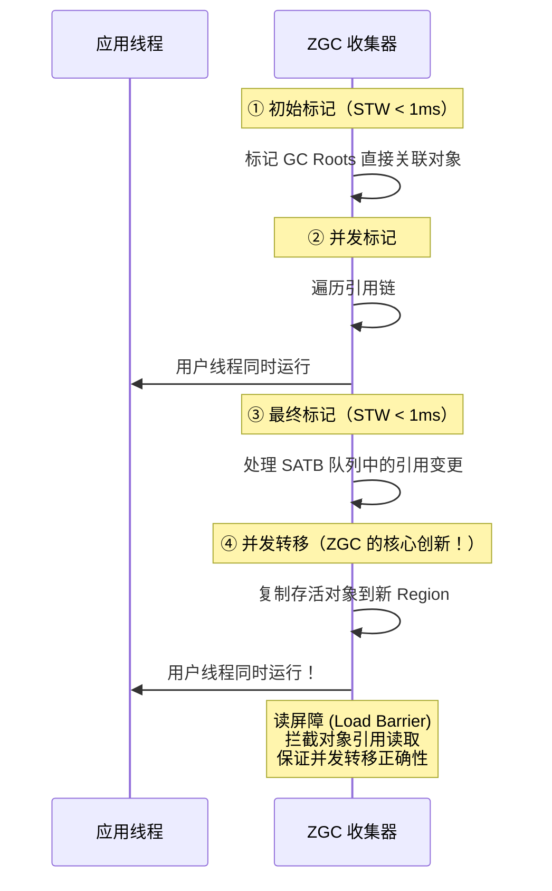
```mermaid
sequenceDiagram
    participant App as 应用线程
    participant ZGC as ZGC 收集器

    Note over ZGC: ① 初始标记（STW < 1ms）
    ZGC->>ZGC: 标记 GC Roots 直接关联对象

    Note over ZGC: ② 并发标记
    ZGC->>ZGC: 遍历引用链
    ZGC->>App: 用户线程同时运行

    Note over ZGC: ③ 最终标记（STW < 1ms）
    ZGC->>ZGC: 处理 SATB 队列中的引用变更

    Note over ZGC: ④ 并发转移（ZGC 的核心创新！）
    ZGC->>ZGC: 复制存活对象到新 Region
    ZGC->>App: 用户线程同时运行！
    Note over ZGC: 读屏障 (Load Barrier)<br/>拦截对象引用读取<br/>保证并发转移正确性
```

**ZGC vs G1 核心区别**：

| | G1 | ZGC |
|---|---|---|
| 转移阶段 | **STW**（必须暂停应用） | **并发**（应用同时运行） |
| 停顿时间 | 几十~几百 ms | < 1ms |
| 技术关键 | — | 染色指针 + 读屏障 |
| 堆大小 | 推荐 ≤ 8G | 支持 TB 级 |
| 吞吐量 | 高 | 略低（读屏障有开销） |

**ZGC 核心技术**：

| 技术 | 作用 |
|------|------|
| **染色指针（Colored Pointers）** | 在 64 位指针中嵌入标记位（Marked0/Marked1/Remapped/Finalizable），不需要 STW 就能标记 |
| **读屏障（Load Barrier）** | 读对象引用时拦截检查：如果对象正在被转移 → 自动修正指针 |
| **多重映射（Multi-Mapping）** | 同一物理内存映射到多个虚拟地址，减少染色指针的内存开销 |

### 5.6 Shenandoah — Red Hat 的亚毫秒收集器

Shenandoah 和 ZGC 目标一致（亚毫秒停顿），但技术路线不同。

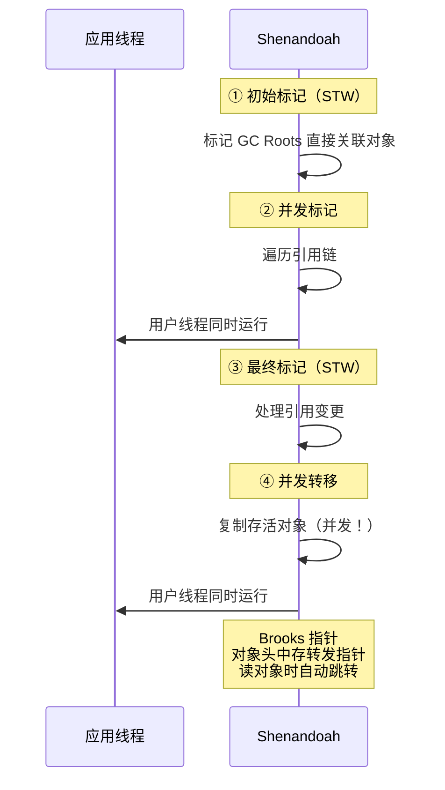
```mermaid
sequenceDiagram
    participant App as 应用线程
    participant Shen as Shenandoah

    Note over Shen: ① 初始标记（STW）
    Shen->>Shen: 标记 GC Roots 直接关联对象

    Note over Shen: ② 并发标记
    Shen->>Shen: 遍历引用链
    Shen->>App: 用户线程同时运行

    Note over Shen: ③ 最终标记（STW）
    Shen->>Shen: 处理引用变更

    Note over Shen: ④ 并发转移
    Shen->>Shen: 复制存活对象（并发！）
    Shen->>App: 用户线程同时运行
    Note over Shen: Brooks 指针<br/>对象头中存转发指针<br/>读对象时自动跳转
```

**ZGC vs Shenandoah 对比**：

| | ZGC（Oracle） | Shenandoah（Red Hat） |
|---|---|---|
| **并发转移实现** | 染色指针 + 读屏障 | Brooks 指针（对象头转发） |
| **读屏障开销** | 每次读引用都拦截 | 只在实际转移时跳转 |
| **对象头开销** | 无（标记在指针中） | 每个对象多 8 字节（转发指针） |
| **压缩指针兼容** | JDK 17+ 才支持 | 天然兼容 |
| **停顿时间** | < 1ms | < 10ms |
| **JDK 版本** | JDK 11+ | JDK 12+（OpenJDK 主线） |
| **生产成熟度** | JDK 17+ 推荐 | JDK 17+ 可用 |

**选型建议**：
- JDK 17+ 且追求极致低延迟 → ZGC
- 需要压缩普通对象指针（CompressedOops）→ Shenandoah
- JDK 11/12/13 → 都不推荐生产使用，用 G1

---

## §6 GC 调优

### 6.1 三个核心指标

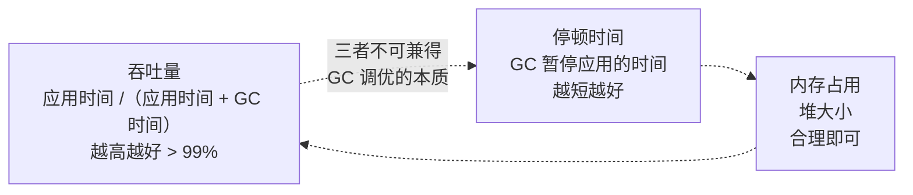
```mermaid
graph LR
    Throughput["吞吐量<br/>应用时间 /（应用时间 + GC 时间）<br/>越高越好 > 99%"]
    Latency["停顿时间<br/>GC 暂停应用的时间<br/>越短越好"]
    Memory["内存占用<br/>堆大小<br/>合理即可"]

    Throughput -.->|"三者不可兼得<br/>GC 调优的本质"| Latency
    Latency -.-> Memory
    Memory -.-> Throughput
```

### 6.2 常用 JVM 参数

| 参数 | 作用 | 生产推荐 |
|------|------|---------|
| `-Xms4g -Xmx4g` | 堆初始=最大 | 设成一样，避免扩容开销 |
| `-Xmn2g` | 新生代大小 | 堆的 1/3 ~ 1/2 |
| `-XX:+UseG1GC` | 使用 G1 | JDK9+ 默认 |
| `-XX:+UseZGC` | 使用 ZGC | JDK17+ 低延迟场景 |
| `-XX:MaxGCPauseMillis=200` | G1 目标停顿 | 200ms |
| `-Xlog:gc*:file=gc.log` | GC 日志 | **必须开启**，调优依据 |
| `-XX:+HeapDumpOnOutOfMemoryError` | OOM 时 dump 堆 | 生产环境必开 |
| `-XX:HeapDumpPath=/tmp/heapdump.hprof` | dump 路径 | 指定具体路径 |

### 6.3 调优决策树

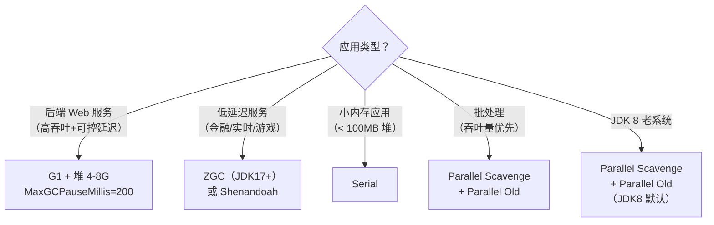
```mermaid
graph TD
    Q1{"应用类型？"}

    Q1 -->|"后端 Web 服务<br/>（高吞吐+可控延迟）"| G1["G1 + 堆 4-8G<br/>MaxGCPauseMillis=200"]

    Q1 -->|"低延迟服务<br/>（金融/实时/游戏）"| ZGC["ZGC（JDK17+）<br/>或 Shenandoah"]

    Q1 -->|"小内存应用<br/>（< 100MB 堆）"| Serial["Serial"]

    Q1 -->|"批处理<br/>（吞吐量优先）"| Parallel["Parallel Scavenge<br/>+ Parallel Old"]

    Q1 -->|"JDK 8 老系统"| PS["Parallel Scavenge<br/>+ Parallel Old<br/>（JDK8 默认）"]
```

### 6.4 GC 日志分析工具

| 工具 | 说明 |
|------|------|
| **GCEasy**（gceasy.io） | 在线上传 GC 日志，可视化分析 |
| **GCViewer** | 开源本地工具 |
| **JFR + JMC** | JDK Flight Recorder，低开销生产级监控 |
| **Arthas** | 阿里开源 Java 诊断工具，`profiler` / `dashboard` 命令 |

### 6.5 常见 GC 问题排查

| 现象 | 可能原因 | 排查方向 |
|------|---------|---------|
| 频繁 Full GC | 老年代空间不足 / 内存泄漏 | Heap Dump + MAT 分析 |
| GC 后内存不释放 | 内存泄漏（静态集合、未关闭的资源） | MAT 找 GC Roots 最短路径 |
| 停顿时间过长 | 堆太大 / 老年代碎片 | 换 G1/ZGC |
| Young GC 频繁 | Eden 太小 / 对象创建速率高 | 加大 `-Xmn` |
