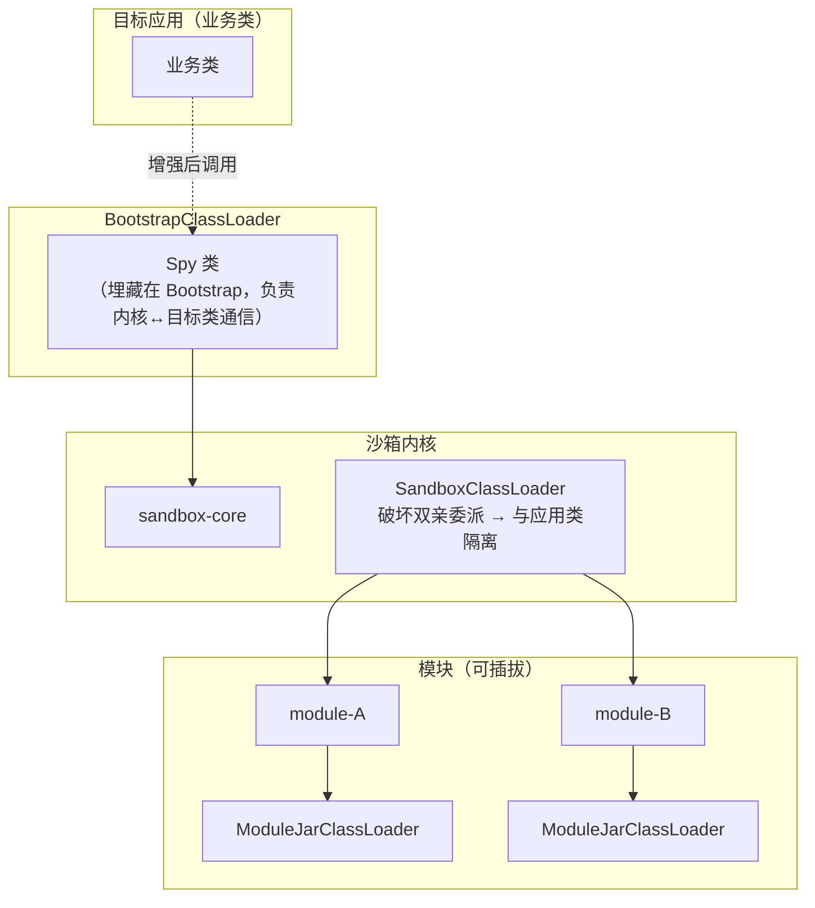

# JVM-Sandbox（阿里开源的运行期 AOP 容器）

> 最后整理: 2026-09-11 | 来源: 官方 README / wiki（alibaba/jvm-sandbox）+ jvm-sandbox-repeater 用户手册 + 仓库元数据核对

> 关联: [沙箱（Sandbox）：从进程隔离到 Agent 运行时](<../计算机基础/沙箱（Sandbox）：从进程隔离到 Agent 运行时.md>) — **同名不同义**，先看那篇的 §0 与本文 §8 | [Spring IOC、DI 与 AOP 核心原理](<./Spring IOC、DI 与 AOP 核心原理.md>) — 静态/动态编织与 CGLIB 的对照

## 0. 一句话定位

**JVM-Sandbox 是阿里开源的「JVM 沙箱容器」**——一个**非侵入式的运行期 AOP 框架**：不重启、不改代码，把工具（模块）动态挂到目标 JVM 上，用完卸载、不留痕迹。

> ⚠️ **先破除同名歧义**：这里的"沙箱"**不是安全隔离**。它隔离的对象是**工具/模块本身**（模块之间、模块与应用之间互不干扰），不是"不可信代码"。和 Docker/Seatbelt/chroot 那类安全沙箱只是共用了一个词。对照见 §8。

## 1. 它要解决什么问题

README 用五个"好想……"把需求讲得很直白：

1. BTRACE 很强，但想要更顺手的问题定位工具（线上链路排查 + 单机定位）；
2. 线上问题复现需要入参，但当时**没有任何日志**，想动态加日志并按业务 ID 过滤；
3. 系统**内**的异常模拟很麻烦（系统间好办），不想加开关、不想往业务代码里塞 AOP；
4. 想要**行调用链路**数据（做场景识别、覆盖率统计），现成覆盖率工具统计不准；
5. 上面这些工具**底层原理相同**——同时使用会互相干扰，怎么保证动态加载/卸载后互不影响、出问题能快速还原？

结论就是：需要的不是又一个工具，而是**一个能装工具的容器**。

## 2. 五个特性

| 特性 | 含义 |
|---|---|
| **无侵入** | 目标应用无需重启、无需感知沙箱存在 |
| **类隔离** | 沙箱与模块不会污染目标应用的类 |
| **可插拔** | 模块随时加载/卸载，不在目标应用留痕 |
| **多租户** | 同一目标应用可挂多个租户的沙箱，独立控制（namespace） |
| **高兼容** | 支持 JDK 6–11 |

**典型场景**：线上故障定位、线上流控、线上故障模拟、**方法请求录制和结果回放**、动态日志打印、安全信息监测与脱敏。

## 3. 核心原理一：事件驱动

沙箱的世界观里，任何一次 Java 方法调用都可以拆成三个环节——**BEFORE / RETURN / THROWS**：

```java
// BEFORE
try {
    // do something...
    // RETURN
    return;
} catch (Throwable cause) {
    // THROWS
}
```

三个环节各自产生事件，模块监听事件即可完成类 AOP 的动作：

1. 感知并**改变**入参；
2. 感知并**改变**返回值 / 抛出的异常；
3. **改变方法执行流程**——方法体执行前直接返回自定义结果（原方法不再执行）、返回前替换结果甚至改成抛异常、抛异常后改成正常返回。

> 这套"三段式 + 可改流程"的能力，就是后面录制回放/故障注入/动态日志全部能实现的根。

## 4. 核心原理二：Instrumentation 动态编织怎么绕过 JDK 约束

对比两组 AOP 实现：

| | 静态编织 | 动态编织（CGLIB 式） |
|---|---|---|
| 时机 | 字节码生成时插入 | 运行期增强 |
| 手段 | 编译期织入 | 重命名原方法 + 新建同签名方法做代理 |
| 边界 | 需重新编译 | **侵入性**（如 Spring 里必须是受管 Bean）、**固化性**（启动后无法再改） |

JDK 对运行期重定义类的硬约束是：

1. 不允许新增/修改/删除**成员变量**；
2. 不允许新增/删除**方法**；
3. 不允许修改**方法签名**。

JVM-Sandbox 的做法是**精心构造字节码增强逻辑**，在**不违反上面三条**的前提下，实现对目标方法运行期的无侵入拦截——这是它区别于普通动态代理框架的技术核心。

## 5. 核心原理三：双层类隔离 + Spy 通信



| 机制 | 作用 |
|---|---|
| **Spy 类** | 埋藏在 BootstrapClassLoader 中，负责**目标类 ↔ 沙箱内核**的通信（目标类被增强后调它） |
| **SandboxClassLoader** | 自定义加载器，**破坏双亲委派**约定，实现沙箱与目标应用的类隔离 |
| **ModuleJarClassLoader** | 每个模块独立加载器 → 模块之间、模块与沙箱、模块与应用**三者互不干扰** |

## 6. 使用形态与运维特性

**C/S 架构**：沙箱容器是服务端（暴露 REST 接口），`sandbox.sh` 是客户端（HTTP 调用）。

```shell
# 挂载到目标 JVM（进程 33342）
./sandbox.sh -p 33342
# 卸载
./sandbox.sh -p 33342 -S
```

挂载后会打印 `NAMESPACE / VERSION / MODE / SERVER_PORT / USER_MODULE_LIB ...` 等信息。

两个顺手的设计：

- **多租户**：用 `namespace` 区分，同一 JVM 可挂多套沙箱、独立控制；
- **热升级**：新版本容器启动后，用 `-S` 关掉旧容器即可切换，**不需要重启 JVM**。

**面向模块开发者的 API 关键词**：`Module`、`EventListener`、`AdviceListener`、`ModuleEventWatcher`。

## 7. 生态：jvm-sandbox-repeater 与"录制回放"平台

`jvm-sandbox-repeater` 是同一体系里最有名的一个模块，解决的是**流量录制回放**：

- 机制：给一次请求打上 `Repeat-TraceId` 录制，回放时用 `Repeat-TraceId-X` 触发"昨日重现"；
- **standalone 单机模式**：`~/.sandbox-module/cfg/repeater.properties` 里 `repeat.standalone.mode=true`，不依赖任何服务端与存储，本机即可完成录制/回放；
- **它只是能力层**：要做成"业务回归 / 实时监控 / 压测"平台，还需要三件套——
  1. **数据中心**（采集数据的加工、存储、搜索；官方 `repeater-console` 只是 demo）
  2. **模块管理平台**（管理 JVM-Sandbox 各模块的生命周期）
  3. **配置管理平台**（维护并推送 repeater 所需配置）
- **出处**：阿里集团淘系技术质量内部 2017 年起已成体系，支撑过 CI、建站、系统重构等质量保障任务。

同类思路的外部实现也不少（如 vivo 的 MoonBox，以及转转、酷家乐等团队的自研流量回放平台），说明"录制回放 + mock 隔离"是测试左移里的通用解法。

## 8. 辨析：三种"沙箱"不是一个东西

| | 安全沙箱（Docker/Seatbelt/chroot） | **JVM-Sandbox** | 业务环境沙箱（test/pre/联调） |
|---|---|---|---|
| 隔离什么 | 不可信代码的**系统调用/文件** | **工具模块**（模块↔应用↔模块） | 代码版本 / 流量 / 数据 / 凭证 |
| 谁执行 | 内核 | JVM Instrumentation + 自定义 ClassLoader | 部署、网关、RPC 路由、中间件 |
| 失败姿态 | fail-closed（拒绝执行） | 模块卸载即还原，不影响应用 | 容易 fail-open（串味） |
| 目的 | 防逃逸 | **不改代码就能动态插桩** | 不污染生产 |

一句话：**安全沙箱关的是"坏代码"，JVM-Sandbox 装的是"好工具"。**

## 9. 现状与选型提醒

- **主仓已基本停更**：`alibaba/jvm-sandbox` master 最后一次提交是 **2023-01-26**（最新 tag 1.4.0）；`jvm-sandbox-repeater` 最后提交 **2022-06-10**。
- **JDK 支持区间是 6–11**：项目宣称兼容上限为 JDK 11，**JDK 17/21 上直接用要自行验证**（Instrumentation 与字节码 API 都在演进）。
- 构建要求：**必须 JDK 1.8** 构建（工程与 maven 插件用了 `tools.jar`）、且在 Linux/Mac/Unix 下构建。
- 今天做同类事情，可选的替代：Arthas（诊断、命令式）、ByteBuddy + 自研 Java Agent（框架化）、各类 APM 的字节码增强能力。
- 贡献者：`pom.xml` 的 developers 只有两位——`luanjia` 与 **`vlinux`（邮箱 oldmanpushcart@gmail.com，GitHub 显示名 李夏驰）**；另有 `oldmanpushcart` 这一 GitHub 账号与之对应（注意拼写以 **pushcart** 结尾）。

## 10. 相关与延伸

- 仓库：[alibaba/jvm-sandbox](https://github.com/alibaba/jvm-sandbox)（README 与 wiki：模块研发者/沙箱研发者三条学习路径）
- 录制回放：[alibaba/jvm-sandbox-repeater](https://github.com/alibaba/jvm-sandbox-repeater) 及其 `docs/user-guide-cn.md`
- 背景文章：[JVM-SANDBOX：从阿里精准测试走出的开源贡献奖](https://developer.aliyun.com/article/707736)
- 对照阅读：[沙箱（Sandbox）：从进程隔离到 Agent 运行时](<../计算机基础/沙箱（Sandbox）：从进程隔离到 Agent 运行时.md>) — 安全语义的沙箱
