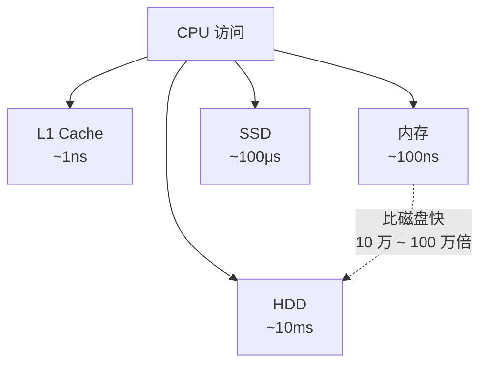
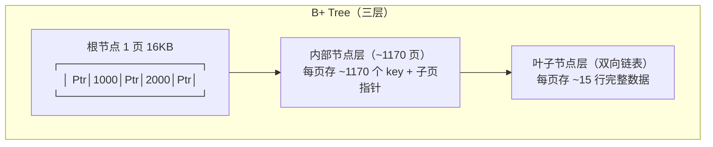
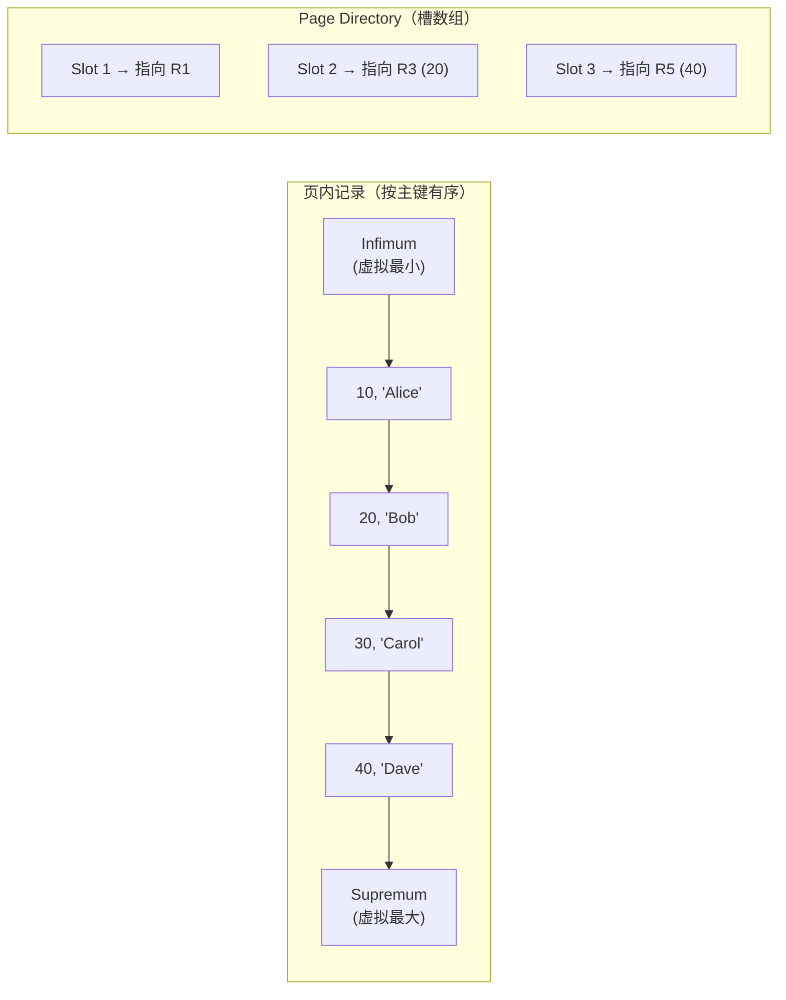
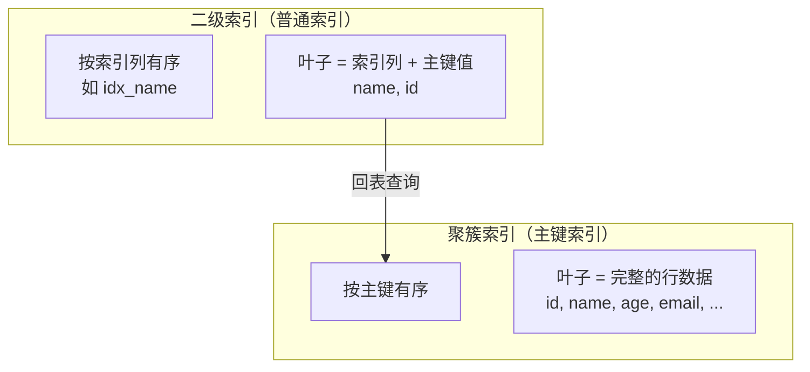
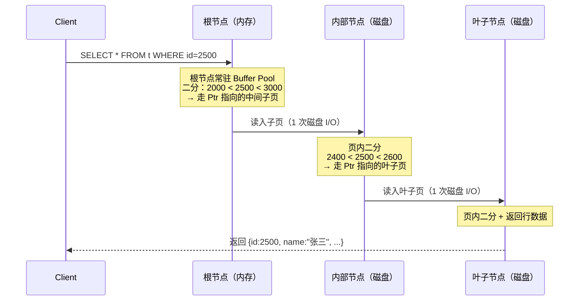
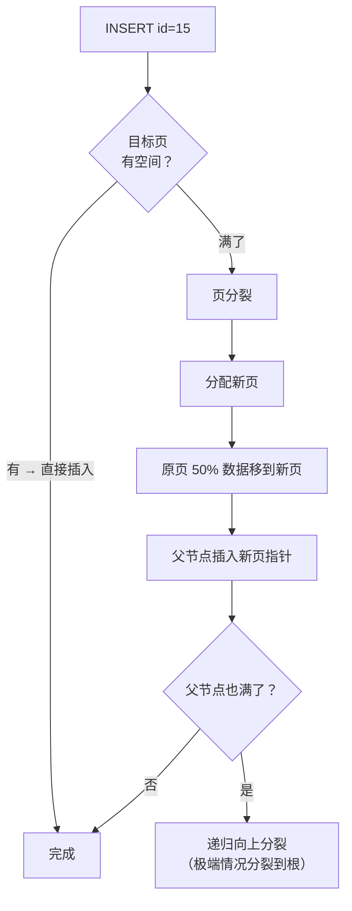

# MySQL B+树索引实现原理

> 最后整理: 2026-07-05 | 来源: 对话讲解

> 关联: [[./Redis 常用数据类型与使用场景.md]] — 跳表 vs B+树对比

---

## 1. 一句话总结

B+ 树是专门为**磁盘 I/O** 优化的多路平衡搜索树——一个节点存几百个 key，把树压到 ~3 层高，一次查询只需 1-3 次磁盘 I/O。数据只存在叶子节点，且叶子之间有双向链表用于范围扫描。

---

## 2. 为什么用 B+ 树？

### 2.1 磁盘 I/O 的物理约束



**核心矛盾**：CPU/内存和磁盘之间速度差距 5-6 个数量级。数据库索引设计的唯一目标 = **最小化磁盘 I/O 次数**。

### 2.2 递进推演：为什么不是其他数据结构？

| 数据结构 | 单次 I/O 读什么 | 问题 |
|----------|---------------|------|
| **二叉搜索树** | 一个节点 = 一个 key + 两个指针 ≈ 16B | 一次 I/O 16KB（一页）只用到 16B → 浪费 99.9%。千万行 → 树高 ~23 层 → 23 次 I/O |
| **红黑树** | 同上 | 同上，树高 ~2×logN |
| **哈希索引** | 一个 bucket | O(1) 等值查询完美，但**不支持范围查询 `BETWEEN`/`>`/`<`** |
| **跳表** | 一个节点一个值 | 被设计用于内存，节点离散存储 → 大量随机 I/O |

**B+ 树的核心洞见**：一次 I/O 读 16KB 是定死的（InnoDB 页大小），那就把一页全塞满 key → 一页 = 几百个 key → 每层能过滤几百倍的候选 → 3 层管够。

---

## 3. InnoDB 的 B+ 树结构

### 3.1 整体架构



**关键区分**：B+ 树 vs B 树最大的区别——**B+ 树的数据只存在叶子节点**，非叶节点只做导航。这带来两个好处：
1. 非叶节点更紧凑（不存行数据），每页能存更多 key → 树更矮
2. 叶子节点加双向链表 → 范围查询只要找到起点，沿着链表扫就行

### 3.2 页（Page）的内部结构

InnoDB 一页 16KB，内部结构如下：

```
┌─────────────────────────────────────┐
│ File Header (38B)                   │
│ Page Header (56B)                   │
│ Infimum + Supremum (26B)            │  ← 虚拟最小/最大记录
│ User Records (变长)                  │  ← 真正存数据/索引的地方
│ Free Space (变长)                    │
│ Page Directory (变长)                │  ← 槽数组，加速页内二分查找
│ File Trailer (8B, 校验和)            │
└─────────────────────────────────────┘
```

**Page Directory（页目录）**：



槽机制：把页内记录分成若干组（每组 4-8 条），每个槽存本组最大记录的指针。查 `id=25` → 二分查找槽数组 → 定位到 Slot 2 → 从 R3 往前扫 4-8 条 → 找到或判断不存在。不像"遍历整页 100 条记录"那么慢。

### 3.3 聚簇索引 vs 二级索引



**聚簇索引**：叶子存完整行数据。一个表只有一个聚簇索引（通常是主键，无主键则选第一个唯一非空索引，都没有则建隐藏的 `row_id`）。

**二级索引**：叶子存主键值。查完二级索引后需要**回表**——用主键值去聚簇索引再查一次，拿完整行。

**覆盖索引**：如果 SELECT 的列全在二级索引中 → 不回表。`SELECT id, name FROM users WHERE name='张三'` + `INDEX(name)` → name 索引叶子有 (name, id) → 一次搞定。

---

## 4. 核心操作

### 4.1 查询过程（以查 id=2500 为例）



**3 层树 = 2 次磁盘 I/O**（根节点常驻 Buffer Pool 不算 I/O）。

### 4.2 插入与页分裂



**这解释了为什么要用自增主键**：`INSERT` 总是在"最后一页"追加 → 只有最后一页满了才分裂。而随机主键（如 UUID）→ 插入位置随机 → 频繁在中间页分裂 → 大量页分裂 + 页利用率低（~65% vs ~93%）。

### 4.3 页分裂的连锁反应

```
插入 id=1500 到已满的页:
  分裂前: [1...1000], [1001...2000], [2001...3000]  ← 3 页
  分裂后: [1...1000], [1001...1500], [1501...2000], [2001...3000]  ← 4 页

  + 父节点也要加一个指针 → 父节点可能也满 → 递归分裂
  + 写 2 页新数据 + 改父节点 + redo log → 比普通 INSERT 慢 10-50 倍
```

---

## 5. 树高估算

```
假设：
  - 主键 bigint (8B)
  - 指针 6B
  - 每页 16KB，可用约 15KB

非叶节点每页可存 key 数：
  15000B ÷ (8B + 6B) ≈ 1071 个

叶子节点每页可存行数（假设行 ~1KB）：
  15000B ÷ 1000B ≈ 15 行

树高对应的最大行数：
  1 层: 15 行
  2 层: 1071 × 15 ≈ 1.6 万行
  3 层: 1071 × 1071 × 15 ≈ 1720 万行
  4 层: 1071³ × 15 ≈ 184 亿行
```

**生产环境千万级表 B+ 树高度 = 3 层，4 层就能覆盖百亿级。**

---

## 6. 为什么 MySQL 不用跳表、Redis 不用 B+ 树？


| 维度 | B+ 树（MySQL） | 跳表（Redis） |
|------|---------------|-------------|
| 设计目标 | 减少磁盘 I/O | 内存操作简单 |
| 节点大小 | 16KB 整页 | 一个值 + 指针 |
| 扇出 | 每节点 ~1000 key | 每节点 1 key |
| 高度 | 3-4 层（千万行） | ~log N（内存不在乎） |
| 范围查询 | 叶子双向链表 | Level 0 链表 |
| 代码量 | ~几千行 C | ~几百行 C |
| 插入成本 | 可能页分裂 | 只改相邻指针 |

---

## 7. 面试常见追问

**Q1：InnoDB 的表一定会建聚簇索引吗？**

会。一定有。优先级：用户定义的主键 → 第一个唯一非空索引 → InnoDB 自动建隐藏的 6 字节 `row_id`。

**Q2：二级索引存的是什么？**

索引列的值 + 主键值。所以 `SELECT * FROM t WHERE name='张三'` 的完整路径是：name 索引找到 `('张三', id=42)` → 用 `id=42` 回表查聚簇索引 → 拿到完整行。

**Q3：`SELECT COUNT(*)` 为什么有时走二级索引？**

二级索引比聚簇索引小得多（叶子只存索引列 + 主键，不存完整行），扫描二级索引的 I/O 量远小于扫描聚簇索引。优化器会选最小的索引来扫。

**Q4：为什么官方建议用自增主键？**

1. 插入总是在最后 → 页分裂少
2. 不会导致中间页分裂造成的页利用率下降（随机主键 ~65%，自增 ~93%）
3. 二级索引叶子存主键 → 主键越短，二级索引越小

---

## 2026-07-05 - 补充问答

### B+ 树存的是数据还是索引？

**两者一体。** InnoDB 中表数据 = 聚簇索引的叶子节点，不存在独立的"数据文件"。`.ibd` 文件 = 聚簇索引的 B+ 树（叶子 = 完整行，非叶 = 索引导航）+ 二级索引的 B+ 树（叶子 = 索引列 + 主键）。查主键就是直接走聚簇索引 B+ 树，查出来的既是"索引定位"也是"数据本身"。

### 删除数据后 MySQL 会重新整理吗？

**不会立刻整理。** 三步走：

```
① 标记删除: 页内记录打 delete_flag，不移动任何数据
② 惰性复用: 后续 INSERT 可以覆盖被标记的位置
③ 页合并: 当页内活跃记录占比 < MERGE_THRESHOLD（默认 50%），
           后台线程触发与相邻页合并，释放空页
```

为什么不立刻整理？删一行就重整整页 → 性能灾难。标记删除 + 惰性回收是磁盘存储的标准做法。

```sql
SHOW VARIABLES LIKE '%merge_threshold%';  -- 默认 50
```

### 行变大（2KB）后树高怎么算？

**内部节点不受影响，只有叶子层容量受影响。**

```
内部节点: 只存 key + 指针，不存行数据 → 不受行大小影响 → 每页仍 ~1070 key
叶子节点: 
  行 1KB  → 每页 ~15 行
  行 2KB  → 每页 ~7 行
  行 10KB → 每页 ~1 行（或溢出到溢出页）

行 2KB 时树高:
  2 层: 1070 × 7   ≈ 0.7 万行
  3 层: 1070² × 7  ≈ 800 万行  ← 树高还是 3
```

**树高由内部节点扇出主导（~1070 倍/层），叶子容量只影响存储密度和范围扫描的 I/O 次数，几乎不影响树高。**

> 例外：行含 TEXT/BLOB > 8KB → InnoDB 存到独立溢出页（Overflow Page），主记录只留 768B 前缀。

### 跳表和 B+ 树整体区别不大？

**表层都是 O(log N)，底层优化方向完全相反。**

| 根本差异 | B+ 树 | 跳表 |
|---------|-------|------|
| 存储介质假设 | 磁盘（顺序 I/O） | 内存（随机访问） |
| I/O 粒度 | 一次一页 16KB | 一次一个节点 |
| 扇出 | ~1070 key/节点 | 1 key/节点 |
| 插入/删除 | 页分裂/合并（可能递归） | 改相邻指针（简单） |
| 在磁盘上 | 优秀 | 灾难（每个节点一次随机 I/O） |
| 在内存中 | 过度设计 | 恰到好处 |
| 代码量 | 几千行 C | 几百行 C |

B+ 树的前身是文件系统，跳表的前身是内存有序集合——设计目标一开始就不同。不能因为"都是 O(log N)"就说区别不大。

### 跳表最末层是双向链表吗？

**是。** Redis 的 `zskiplistNode.backward` 指针连接 Level 0 的所有节点，支持反向遍历（`ZREVRANGE`）。高层 forward 是单向的，后退只能降到 Level 0 再往回走。这一点和 B+ 树叶子双向链表完全一致。
