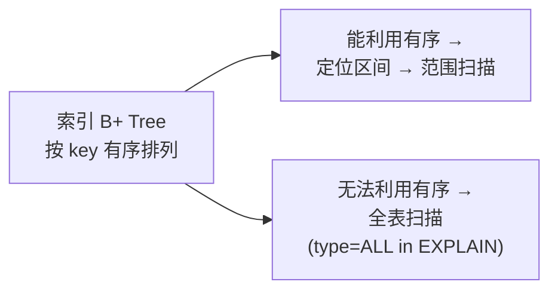
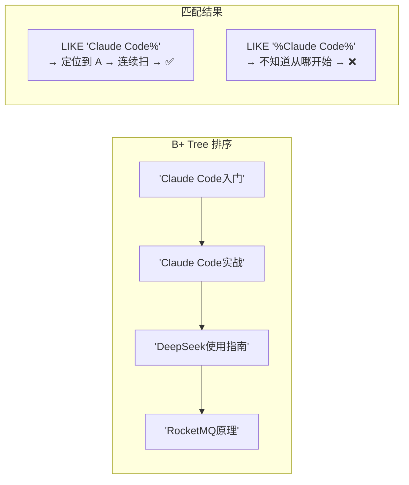
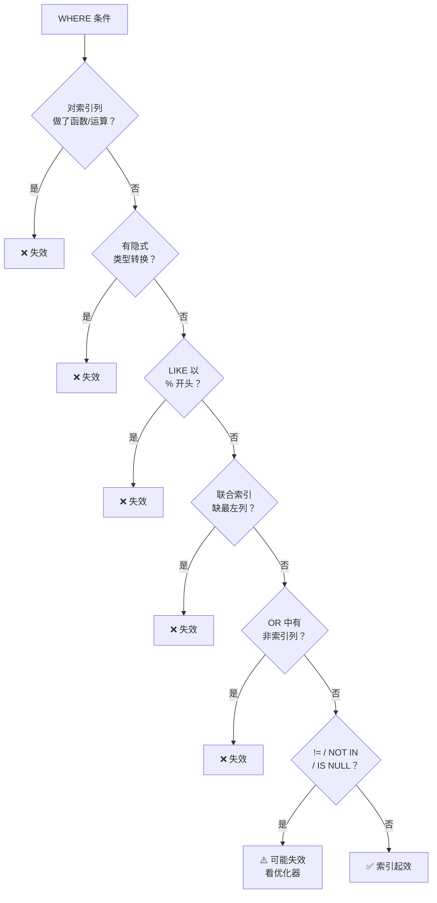

# MySQL 索引失效场景全解

> 最后整理: 2026-07-01 | 来源: 面试题拆解

> 关联: [[./MySQL B+树索引实现原理.md]] — B+ 树底层原理

---

## 1. 核心原则

**索引 = 有序查找结构（B+ 树）。一旦 MySQL 无法利用有序性来定位数据区间，就只能全表扫描。**



面试时可以先用这句话开头，然后逐条展开具体场景。

---

## 2. 经典失效场景

### 2.1 对索引列做函数/运算

```sql
-- ❌ 索引失效：WHERE 左边是计算结果
SELECT * FROM orders WHERE YEAR(created_at) = 2026;
SELECT * FROM users WHERE age + 1 = 19;

-- ✅ 让索引列保持"干净"
SELECT * FROM orders WHERE created_at >= '2026-01-01' AND created_at < '2027-01-01';
SELECT * FROM users WHERE age = 18;
```

底层原因：B+ 树按 `created_at` 原值有序，`YEAR(created_at)` 是计算结果，无法直接用树的顺序定位。

### 2.2 隐式类型转换

```sql
-- phone 列是 VARCHAR，有索引
-- ❌ 用了数字去查字符串列 → MySQL 对每行做 CAST
SELECT * FROM users WHERE phone = 13800138000;

-- ✅ 正确
SELECT * FROM users WHERE phone = '13800138000';
```

MySQL 执行时实际变为：

```sql
-- 等价于（每行都做转换，无法走索引）
SELECT * FROM users WHERE CAST(phone AS UNSIGNED) = 13800138000;
```

**注意方向**：字符串列 + 数字值 = 索引失效。反向（数字列 + 字符串值）不会失效——MySQL 会把字符串转数字，不影响索引列。

### 2.3 LIKE 以 `%` 开头

```sql
-- ❌ 索引失效：B+ 树按前缀有序，%在开头无法定位起点
SELECT * FROM articles WHERE title LIKE '%Claude Code%';

-- ✅ 前缀固定 → 可定位
SELECT * FROM articles WHERE title LIKE 'Claude Code%';

-- ✅ 全文索引替代方案（MySQL 5.7+）
ALTER TABLE articles ADD FULLTEXT INDEX ft_title(title);
SELECT * FROM articles WHERE MATCH(title) AGAINST('Claude Code' IN BOOLEAN MODE);
```



### 2.4 联合索引不满足最左前缀

```sql
-- 联合索引：(a, b, c)，按 a→b→c 排序
CREATE INDEX idx_abc ON t(a, b, c);

-- ✅ 全部生效
WHERE a = 1                      -- 用到 a
WHERE a = 1 AND b = 2            -- 用到 a, b
WHERE a = 1 AND b = 2 AND c = 3  -- 用到 a, b, c
WHERE a = 1 AND c = 3            -- 用到 a（b 跳过，c 失效）
WHERE b = 2 AND a = 1            -- 用到 a, b（优化器自动调序）

-- ❌ 索引失效（未命中最左列）
WHERE b = 2              -- 跳过 a
WHERE c = 3              -- 跳过 a, b

-- ⚠️ 部分失效：a 做范围查询后，b 只用于排序不过滤
WHERE a > 1 AND b = 2    -- a 范围扫描 + b 不用于过滤（但仍可避免 filesort）
```

**口诀**：
- `=` 可以乱序（优化器自动调整）
- 第一个范围查询（`>` `<` `BETWEEN` `LIKE 'x%'`）之后的列全失效（用于排序但不过滤）
- 跳过中间列时，只有前面的列生效

### 2.5 OR 条件中有非索引列

```sql
-- name 有索引，age 没有
-- ❌ OR 两边有一边没索引 → 全表扫描
SELECT * FROM users WHERE name = '张三' OR age = 25;

-- ✅ 改成 UNION 分别走各自的索引
SELECT * FROM users WHERE name = '张三'
UNION
SELECT * FROM users WHERE age = 25;
```

### 2.6 扫描比例过高 → 优化器放弃索引

```sql
-- 表中 99% 行 gender='男'
-- MySQL 估算回表代价 > 全表扫描代价 → 放弃索引
SELECT * FROM users WHERE gender = '男';
```

**阈值经验值**：通常扫描比例 > ~15-25% 时优化器倾向全表扫描。`EXPLAIN` 中的 `rows` 和实际 `status` 可能不一致（统计信息过期）。

### 2.7 `!=` / `<>` / `NOT IN` / `NOT EXISTS`

```sql
-- ❌ 否定条件无法利用有序性定位区间
SELECT * FROM users WHERE status != 'deleted';
SELECT * FROM orders WHERE id NOT IN (1, 2, 3);

-- ✅ 覆盖索引可以救（扫描索引比扫描全表便宜）
-- 如果 status 是二级索引 + SELECT 列都在索引中 → 走 index 扫描
```

### 2.8 `IS NULL` / `IS NOT NULL`

```sql
-- 老版本 MySQL：索引不存 NULL → 不走索引
-- MySQL 5.7+：部分支持，取决于优化器判断
SELECT * FROM users WHERE email IS NULL;

-- ✅ 覆盖索引 + IS NULL 通常可以走索引
SELECT id, email FROM users WHERE email IS NULL;
```

### 2.9 `ORDER BY` + `LIMIT` 选错索引

```sql
-- idx_create_time (create_time)
-- 优化器可能觉得"我要排序 + 只取 10 条，走 create_time 索引最优"
-- 实际过滤效果差 → 扫描 100 万行才凑够 10 条满足 WHERE 的
SELECT * FROM orders
WHERE status = 'paid'
ORDER BY create_time DESC LIMIT 10;

-- ✅ 纠正：FORCE INDEX 或建联合索引
CREATE INDEX idx_status_time ON orders(status, create_time);
```

---

## 3. EXPLAIN 验证索引是否生效

```sql
EXPLAIN SELECT * FROM users WHERE name = '张三';
```

| 字段 | 含义 | 关注值 |
|------|------|--------|
| **type** | 访问类型 | `ALL`（全表扫描，最差）→ `index` → `range` → `ref` → `const`（最佳） |
| **key** | 实际使用的索引 | NULL = 没走索引 |
| **rows** | 估计扫描行数 | 越大越差 |
| **Extra** | 额外信息 | `Using filesort`（额外排序，差）、`Using index`（覆盖索引，好）、`Using where`（在 server 层过滤） |

**典型失效 EXPLAIN 输出**：

```
+----+------+---------------+------+---------+------+--------+-------------+
| id | type | possible_keys | key  | key_len | ref  | rows   | Extra       |
+----+------+---------------+------+---------+------+--------+-------------+
|  1 | ALL  | idx_name      | NULL | NULL    | NULL | 100000 | Using where |
+----+------+---------------+------+---------+------+--------+-------------+
```

`type=ALL` + `key=NULL` = 索引完全没被使用。

---

## 4. 速查表



---

## 5. 面试应答模板

> "索引失效的核心是 B+ 树无法利用有序性定位数据区间。常见场景包括：(1)对索引列做函数或运算 `WHERE YEAR(col) = 2026`；(2)隐式类型转换如字符串列用数字查；(3)LIKE 以 % 开头无法定位前缀；(4)联合索引不满足最左前缀匹配；(5)OR 条件中混入没有索引的列；(6)!=、NOT IN 等否定条件无法定位区间；(7)扫描比例过高优化器放弃索引。可以用 EXPLAIN 的 type 和 key 字段验证。"

---

## 6. 一个易混淆的补充：`ORDER BY` 用到了索引 ≠ 索引生效

```sql
-- idx_a_b (a, b)
EXPLAIN SELECT * FROM t WHERE a > 1 ORDER BY a, b;
```

- **WHERE a > 1**：`a` 通过范围扫描拿数据，**过滤阶段索引生效**
- **ORDER BY a, b**：因为数据已经按 (a, b) 顺序从索引取出，**不需要额外排序**（`Extra` 无 `Using filesort`）

但如果 SQL 写成：

```sql
EXPLAIN SELECT * FROM t WHERE a > 1 ORDER BY b;
-- Extra: Using filesort ← 虽然 key=idx_a_b 显示走了索引，
-- 但 b 不是按索引顺序拿的，排序阶段没利用到索引
```

**结论**：`key` 不为 NULL 只说明"用到了索引"，不代表"所有操作都被索引优化"。需要结合 `Extra` 字段判断。
