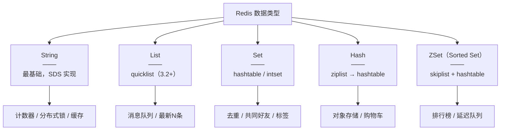
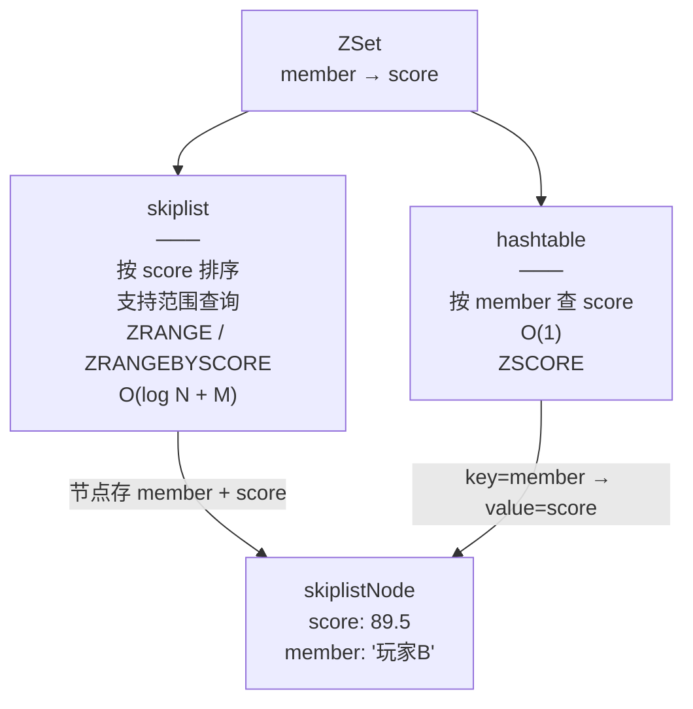

> 最后整理: 2026-06-07 | 来源: 与 Claude Code 对话

## 1. 五大基本类型概览



---

## 2. String — SDS 实现

底层是 **SDS**（Simple Dynamic String），不是 C 的 `char*`。特点：O(1) 取长度、二进制安全、预分配空间防频繁扩容。

```bash
SET user:1001:name "张三"
GET user:1001:name              # → "张三"
INCR article:42:views           # → 1, 2, 3...（原子自增）
SET lock:order:1001 1 NX EX 10  # 分布式锁（NX=不存在才设，EX=10秒过期）
```

### 使用场景

| 场景 | 命令 | 为什么用 Redis |
|------|------|---------------|
| 缓存 JSON | `SET key json EX 3600` | 替代 DB 查询，设置过期自动淘汰 |
| 计数器 | `INCR page:uv` | 原子操作，单线程无竞争 |
| 分布式锁 | `SET lock:xxx uuid NX EX 30` | 单线程 + NX 保证互斥 |
| 限流 | `INCR + EXPIRE` | 滑动窗口计数 |

### 内部实现细节

- **SDS vs C 字符串**：SDS 有 len 字段记录长度，`STRLEN` 是 O(1)；C 字符串要遍历到 `\0`，O(n)
- **编码**：`int`（整数且能用 long 表示）、`embstr`（≤44 字节的短字符串，一次内存分配）、`raw`（长字符串）
- **SDS 扩容**：小于 1MB 时翻倍扩容，超过 1MB 每次加 1MB，减少重新分配次数

---

## 3. List — quicklist 实现

底层在 **Redis 3.2 后统一为 quicklist**（`linkedlist` + `ziplist` 的混合体）。一个 quicklist 节点里挂一个 ziplist——兼顾内存紧凑和双向遍历性能。

```bash
LPUSH queue:tasks "task1" "task2"   # 左边进
RPOP queue:tasks                     # 右边出 → FIFO 队列
LRANGE news:latest 0 9              # 取最新 10 条
LTRIM news:latest 0 99              # 只保留最近 100 条
BLPOP queue:tasks 5                 # 阻塞等待，超时 5 秒
```

### 使用场景

| 场景 | 命令 | 说明 |
|------|------|------|
| 消息队列 | `LPUSH + RPOP` / `BLPOP` | `BLPOP` 支持阻塞等待，避免空轮询 |
| 最新动态/Timeline | `LPUSH + LTRIM` | 固定长度，自动淘汰旧数据 |
| 栈 | `LPUSH + LPOP` | 后进先出 |

### quicklist 设计思想

```
[quicklist]
   │
   ├── quicklistNode[0] → ziplist (存多个元素，连续内存)
   ├── quicklistNode[1] → ziplist
   └── quicklistNode[2] → ziplist
```

- **ziplist** 是紧凑的连续内存，元素少时节省指针开销
- **linkedlist** 双向指针，插入删除 O(1)
- quicklist 两者结合：每个节点是 ziplist，节点之间用指针相连
- `list-max-ziplist-size` 控制每个 ziplist 最多存多少元素

---

## 4. Set — hashtable / intset

底层：元素全为整数且数量少时用 **intset**（有序整数数组，二分查找），否则用 **hashtable**（value 全为 NULL 的字典）。

```bash
SADD user:1001:tags "java" "spring" "redis"
SADD user:1002:tags "java" "python" "redis"
SINTER user:1001:tags user:1002:tags  # → {"java", "redis"}  共同标签
SUNION user:1001:tags user:1002:tags  # → 全部标签
SDIFF user:1001:tags user:1002:tags   # → {"spring"} 差集
```

### 使用场景

| 场景 | 命令 | 说明 |
|------|------|------|
| 标签系统 | `SADD / SREM` | 一个用户多个标签 |
| 共同好友 | `SINTER` | 交集 O(N*M)，最坏 O(N²) 注意数据量 |
| 抽奖去重 | `SADD + SPOP` | `SPOP` 随机弹出一个，不重复 |
| 点赞用户列表 | `SADD / SCARD` | 记录谁点了赞，集合大小=点赞数 |

### 编码切换条件

- **intset → hashtable**：元素数量 > `set-max-intset-entries`（默认 512）或出现非整数元素
- intset 查询是二分 O(log N)，但插入要移动数组 O(N)，所以小集合用 intset

---

## 5. Hash — ziplist / hashtable

底层：字段少 + 值短时用 **ziplist**（连续内存，field-value 交替存），超出阈值转 **hashtable**。

```bash
HSET user:1001 name "张三" age 28 city "杭州"
HGET user:1001 name           # → "张三"
HINCRBY user:1001 age 1       # → 29（原子自增）
HGETALL user:1001             # 取全部字段
```

### 使用场景

| 场景 | 命令 | 说明 |
|------|------|------|
| 用户信息缓存 | `HSET / HGET` | 比 `String(JSON)` 省内存（ziplist），且支持按字段读写 |
| 购物车 | `HSET cart:1001 sku:123 2` | 用户→商品→数量 |
| 计数器分组 | `HINCRBY stats:20260607 pv 1` | 当天 PV/UV 存在同一个 key 下 |

### 内存优势

```
String 方式:  user:1001:name → "张三"    (一个 key 一个 value，元数据开销大)
              user:1001:age  → "28"
              user:1001:city → "杭州"

Hash 方式:    user:1001 → {name:"张三", age:28, city:"杭州"}  (一个 key，ziplist 紧凑)
```

小对象用 Hash 比 String 可节省 30-50% 内存。

### 编码切换条件

- **ziplist → hashtable**：字段数 > `hash-max-ziplist-entries`（默认 512）或单个 field/value 长度 > `hash-max-ziplist-value`（默认 64 字节）

---

## 6. ZSet（Sorted Set）— skiplist + hashtable

**底层双结构：skiplist（跳表）+ hashtable（字典）**，两者指向同一份节点对象。

```bash
ZADD leaderboard 100 "玩家A" 85 "玩家B" 92 "玩家C"
ZRANGE leaderboard 0 -1 WITHSCORES     # 按分数升序
ZREVRANGE leaderboard 0 2 WITHSCORES   # Top 3
ZRANK leaderboard "玩家A"              # 排名（升序）
ZSCORE leaderboard "玩家B"             # 查分 → "85"
```

### 使用场景

| 场景 | 命令 | 说明 |
|------|------|------|
| 排行榜 | `ZADD + ZREVRANGE` | 实时更新分数，按排名查询 |
| 延迟队列 | `ZADD delay_queue <时间戳> <任务ID>` | 按执行时间排序，轮询 `ZRANGEBYSCORE` 取到期任务 |
| 优先级队列 | 同延迟队列 | 分数=优先级 |
| 滑动窗口限流 | `ZADD + ZREMRANGEBYSCORE` | 用时间戳当 score，移除窗口外记录 |

### 跳表（skiplist）原理

#### 为什么用跳表而不是红黑树？

Redis 作者 antirez：跳表和红黑树性能都是 O(log N)，但**跳表实现简单、代码量少**，且天然支持范围查询（`ZRANGEBYSCORE`）。

#### 跳表结构

```
Level 2:  1 ───────────────────→ 9 ──────→ NULL
Level 1:  1 ─────→ 5 ──────────→ 9 ──────→ NULL
Level 0:  1 → 3 → 5 → 7 → 8 → 9 → 12 → NULL
```

- Level 0 是完整的有序链表
- Level 1 从每两个节点抽一个上来，组成"快车道"
- Level 2 进一步抽样

**查 7 的过程**：Level 2 从 1 跳到 9（> 7，过头了）→ 降一层 → Level 1 从 1 跳到 5（≤ 7，前进）→ 到 9（> 7，过头）→ 降一层 → Level 0 从 5 走到 7。3 步 vs 原始链表 5 步，数据量大时受益指数级放大。

**插入**：随机生成节点层数（每层 50% 概率升级，类似抛硬币），复杂度 O(log N)。

#### ZSet 的双结构设计



**两个数据结构指向同一个节点对象**，不浪费额外内存：
- 查分数 → 字典 O(1)
- 范围查询 / 排名 → 跳表 O(log N + M)，M 为返回元素数
- 查排名 → 跳表每个节点维护 span（跨度），累加得到 O(log N)

### 编码切换

- **ziplist → skiplist+hashtable**：元素数 > `zset-max-ziplist-entries`（默认 128）或 member 长度 > `zset-max-ziplist-value`（默认 64 字节）
- 少量元素时直接用 ziplist 省内存

---

## 7. 其他高频类型

| 类型 | 用途 | 典型场景 |
|------|------|---------|
| **Bitmap** | 位图，按位存 0/1，`SETBIT / BITCOUNT` | 用户签到（365 位=一年）、日活统计 |
| **HyperLogLog** | 基数统计，12KB 固定内存，`PFADD / PFCOUNT` | 页面 UV 去重计数（0.81% 标准误差） |
| **GEO** | 地理位置，底层=ZSet，`GEOADD / GEORADIUS` | 附近的人、门店搜索 |
| **Stream** | 持久化消息队列（5.0+），`XADD / XREAD / XACK` | 可靠消息队列，支持消费者组 + ACK，比 List 强在持久化 |

### Bitmap 示例

```bash
SETBIT sign:202606:1001 6 1   # 用户 1001 在 6 月 7 号签到
BITCOUNT sign:202606:1001     # 统计签到天数
```

### HyperLogLog 示例

```bash
PFADD uv:20260607 "user1" "user2" "user3"
PFCOUNT uv:20260607           # → 3（近似）
# 12KB 可以统计 2^64 个元素，适合亿级 UV
```

### GEO 示例

```bash
GEOADD shops 120.2 30.3 "星巴克杭州大厦"
GEORADIUS shops 120.2 30.3 5 km WITHDIST
# 底层：GEOADD 实际是把经纬度编码成 ZSet 的 score（Geohash），存入 ZSet
```

---

## 8. 选型速查

```
需要计数/缓存简单值？        → String
需要队列/最新列表？          → List
需要去重+集合运算？          → Set
需要存对象+按字段读写？      → Hash
需要排序+范围查询？          → ZSet（跳表）
需要统计大量用户的 UV？      → HyperLogLog
需要签到/在线状态？          → Bitmap
需要附近的人？               → GEO（底层 ZSet）
需要可靠消息队列？           → Stream
```

---

## 9. 底层实现速查表

| 数据类型 | 默认编码 | 内部编码（少量数据时） | 核心特点 |
|---------|---------|---------------------|---------|
| String | raw / embstr | int | SDS，二进制安全 |
| List | quicklist | — | ziplist + linkedlist 混合 |
| Set | hashtable | intset | 值全为 NULL 的字典 |
| Hash | hashtable | ziplist | field-value 交替存 |
| ZSet | skiplist + dict | ziplist | 双结构共享节点 |

相关：
- [[热点账户高并发记账方案.md]] — Redis 在高并发场景下的应用
