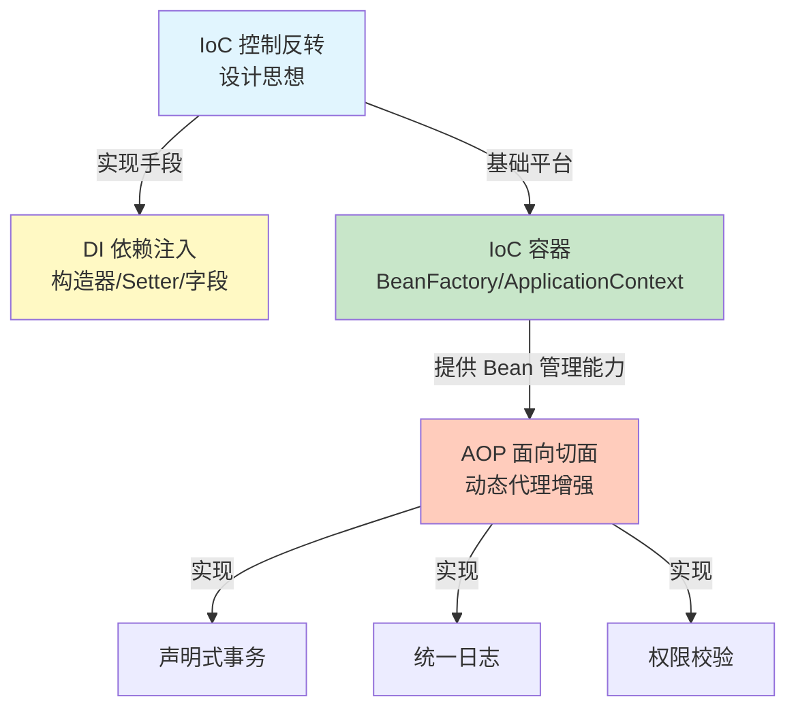
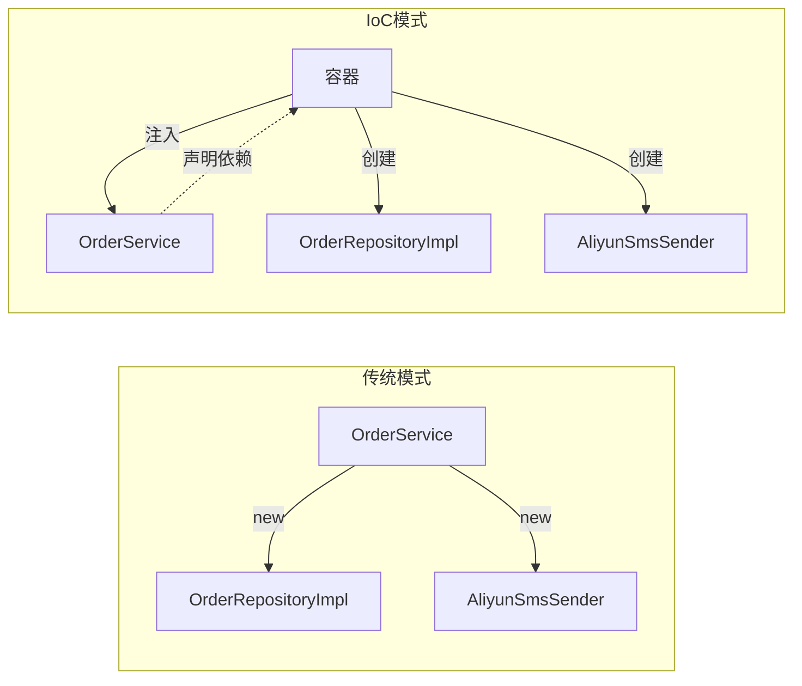
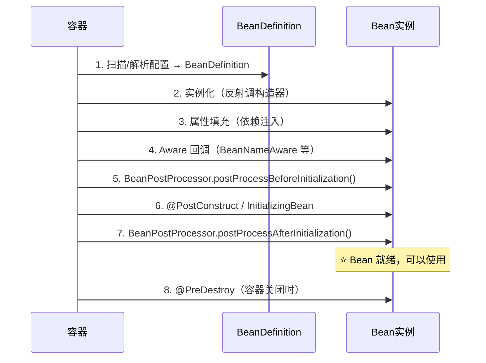
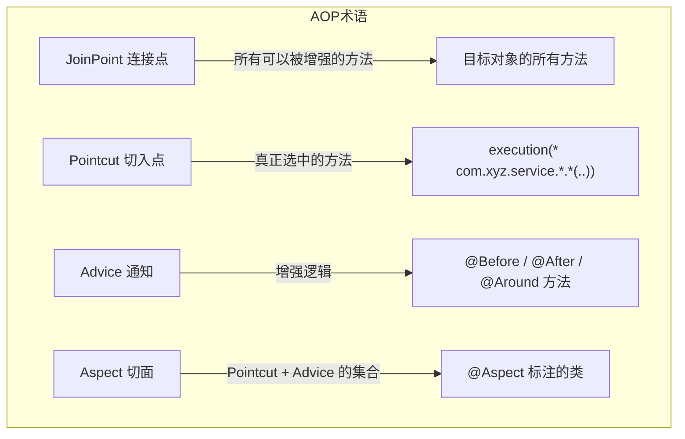
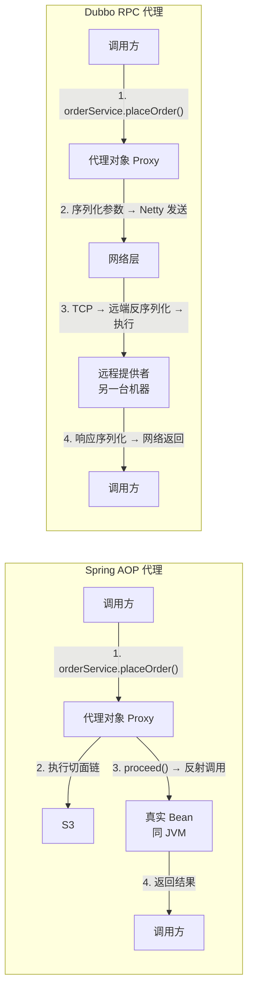
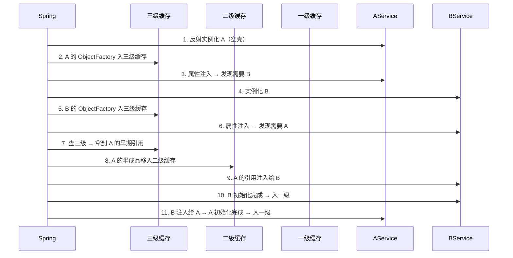

> 最后整理: 2026-06-07 | 来源: 与 Claude Code 对话

## 1. IOC、DI、AOP 关系概览

三者不是一个层面的东西：



- **IoC**：设计思想，把"谁来创建依赖"的控制权从业务代码手里拿走
- **DI**：实现 IoC 的具体手段，通过构造器/setter/字段注入依赖
- **AOP**：建立在 IoC 容器之上的横向增强，不修改源码织入逻辑

---

## 2. IoC：为什么需要控制反转

### 2.1 没有 IoC 的传统写法

```java
public class OrderService {
    private OrderRepository repo = new OrderRepositoryImpl();  // 自己 new
    private SmsSender smsSender = new AliyunSmsSender();        // 自己 new

    public void placeOrder(Order order) {
        repo.save(order);
        smsSender.send("下单成功");
    }
}
```

问题：OrderService 和具体实现绑死了。换短信服务商 → 改代码 → 重新编译 → 重新部署。

### 2.2 IoC 后的写法

```java
public class OrderService {
    private OrderRepository repo;
    private SmsSender smsSender;

    // 容器把实现塞进来，自己不 new
    public OrderService(OrderRepository repo, SmsSender smsSender) {
        this.repo = repo;
        this.smsSender = smsSender;
    }

    public void placeOrder(Order order) {
        repo.save(order);
        smsSender.send("下单成功");
    }
}
```

### 2.3 控制权反转的本质



传统：业务代码主动创建依赖 → **控制权在业务代码**
IoC：容器创建并注入依赖 → **控制权在容器**（反转了）

---

## 3. DI：三种注入方式

### 3.1 构造器注入（推荐）

```java
@Service
public class OrderService {
    private final OrderRepository repo;   // final，保证不可变
    private final SmsSender smsSender;

    // Spring 4.3+ 单构造器可省略 @Autowired
    public OrderService(OrderRepository repo, SmsSender smsSender) {
        this.repo = repo;
        this.smsSender = smsSender;
    }
}
```

**优点**：依赖不可变、方便单测 mock（直接 new 传参）、不依赖反射。

### 3.2 Setter 注入

```java
@Service
public class OrderService {
    private OrderRepository repo;

    @Autowired
    public void setRepo(OrderRepository repo) {
        this.repo = repo;
    }
}
```

适用：依赖可选（不注入时有默认值或降级逻辑）。

### 3.3 字段注入（常见但不推荐）

```java
@Service
public class OrderService {
    @Autowired
    private OrderRepository repo;  // 最省事但隐藏了依赖
}
```

日常开发中字段注入反而是最常见的写法，但"常见"不等于"好"。三个真实问题：

**问题一：单测没法干净地 mock**

```java
// 字段注入：单测必须启动 Spring 上下文（@SpringBootTest），或反射塞值
// 一个单测启动 5-10 秒 vs 构造器注入纯 new 的毫秒级

// 构造器注入的单测：纯粹 Java 对象，无框架依赖
var mockRepo = mock(OrderRepository.class);
var service = new OrderService(mockRepo);  // 干净
```

**问题二：依赖不可变，字段做不到 final**

```java
// 构造器注入：final 保证注入后不可重新赋值
@RequiredArgsConstructor
public class OrderService {
    private final OrderRepository repo;
}

// 字段注入：没有 final，任何地方都可能被改成 null
@Autowired
private OrderRepository repo;  // repo = null 是合法的
```

**问题三：依赖膨胀时字段注入会"悄悄"变大**

```java
// 字段注入：加依赖只要加一行 @Autowired，没有阻力
@Autowired private A a;
@Autowired private B b;
@Autowired private C c;  // ... 不知不觉 10 个了

// 构造器注入：参数越多越"扎眼"，自动提醒你该拆类了
public OrderService(A a, B b, C c, D d, E e, F f) {
    // ↑ 这行看起来就难受，逼你重构
}
```

**那为什么现实中字段注入最多？**两个原因：(1) 大部分 CRUD 项目不写单元测试（只写集成测试），字段注入完全够用；(2) Lombok `@RequiredArgsConstructor` + 构造器对新手不够直观。Spring 官方推荐构造器注入不是教条，是大型项目 + 单元测试踩过坑之后的选择。

### 3.4 有多个同类型 Bean 时的歧义处理

```java
// 方案 1：@Primary — 指定默认实现
@Primary
@Component
public class AliyunSmsSender implements SmsSender { }

// 方案 2：@Qualifier — 按名称精确指定
@Autowired
@Qualifier("aliyunSmsSender")
private SmsSender smsSender;

// 方案 3：@Resource — 按名称注入（JSR-250，非 Spring 特有）
@Resource(name = "aliyunSmsSender")
private SmsSender smsSender;
```

---

## 4. IoC 容器：BeanFactory vs ApplicationContext

容器本质是一个巨大的 `Map<String, Object>`，key 是 beanName，value 是 bean 实例。

```java
// 最底层的容器接口
public interface BeanFactory {
    Object getBean(String name);
    <T> T getBean(Class<T> requiredType);
    boolean containsBean(String name);
}

// ApplicationContext 继承 BeanFactory，加了更多企业级特性
public interface ApplicationContext extends BeanFactory, ... {
    // 事件发布、国际化 MessageSource、资源加载 ResourceLoader
}
```

| | BeanFactory | ApplicationContext |
|---|---|---|
| 实例化时机 | 懒加载（getBean 时才创建） | 预加载（启动时创建所有单例） |
| 功能 | 仅 DI | DI + AOP + 事件 + 国际化 + 资源加载 |
| 日常使用 | ❌ 几乎不用 | ✅ 默认 |

---

## 5. Bean 生命周期（AOP 代理的关键节点）



关键节点：
- **第 5 步**：AOP 代理在此创建（`AbstractAutoProxyCreator` 把 Bean 包成代理）
- **第 7 步**：此时 Bean 才算真正可用
- 第 5-6-7 步是面试最爱问的三个扩展点

### 实践 Demo：自定义 BeanPostProcessor

```java
@Component
public class MyBeanPostProcessor implements BeanPostProcessor {

    @Override
    public Object postProcessBeforeInitialization(Object bean, String beanName) {
        if (bean instanceof OrderService) {
            System.out.println("OrderService 初始化前，依赖已注入但 @PostConstruct 没执行");
        }
        return bean;  // 可以在这里返回代理对象
    }

    @Override
    public Object postProcessAfterInitialization(Object bean, String beanName) {
        if (bean instanceof OrderService) {
            System.out.println("OrderService 初始化后，可以安全使用");
        }
        return bean;  // AOP 就是在这里包代理
    }
}
```

---

## 6. AOP：不碰源码的横向增强

### 6.1 没有 AOP 时的横切逻辑问题

```java
public void transfer(Account from, Account to, BigDecimal amount) {
    tx.begin();                    // ← 事务
    log.info("开始转账");           // ← 日志
    checkPermission();             // ← 权限
    // ... 真正的业务逻辑只有两行
    from.debit(amount);
    to.credit(amount);
    log.info("转账成功");           // ← 日志
    tx.commit();                   // ← 事务
}
```

事务、日志、权限校验散布在每个方法里——修改一个横切逻辑要改 N 个文件。

### 6.2 AOP 核心术语



### 6.3 实战 Demo

```java
@Aspect
@Component
public class LoggingAspect {

    // Pointcut：匹配 service 包下所有方法
    @Pointcut("execution(* com.example.service.*.*(..))")
    public void serviceLayer() {}

    // Advice：Around 最强大，可以控制是否执行原方法
    @Around("serviceLayer()")
    public Object logExecutionTime(ProceedingJoinPoint joinPoint) throws Throwable {
        long start = System.currentTimeMillis();
        Object result = joinPoint.proceed();  // 执行原方法
        long elapsed = System.currentTimeMillis() - start;

        System.out.println(joinPoint.getSignature() + " 耗时: " + elapsed + "ms");
        return result;
    }
}
```

### 6.4 五种 Advice 对比

| 类型 | 执行时机 | 能阻止目标方法吗 | 能拿到返回值吗 |
|------|---------|:-:|:-:|
| `@Before` | 方法执行前 | ❌ | ❌ |
| `@AfterReturning` | 正常返回后 | ❌ | ✅ |
| `@AfterThrowing` | 抛异常后 | ❌ | ❌（能拿到异常） |
| `@After` | 方法结束后（finally 语义） | ❌ | ❌ |
| `@Around` | 前后都管，最强大 | ✅ 可以不调 proceed() | ✅ |

### 6.5 Spring AOP 底层：JDK 动态代理 vs CGLIB

```java
// JDK 动态代理：要求目标类实现接口
// 原理：Proxy.newProxyInstance(classLoader, interfaces, invocationHandler)
// 生成的代理类：$Proxy0 extends Proxy implements XxxService

// CGLIB：通过继承目标类生成子类
// 原理：Enhancer + MethodInterceptor，ASM 字节码增强
// 生成的代理类：XxxServiceImpl$$EnhancerBySpringCGLIB$$xxx extends XxxServiceImpl
```

对比：

| | JDK 动态代理 | CGLIB |
|---|---|---|
| 原理 | 反射 + 接口 | 字节码 + 继承 |
| 要求 | 必须实现接口 | 类和方法不能是 final |
| 性能（调用） | 反射调用，稍慢 | 直接调用（子类），更快 |
| 性能（创建） | 更快 | 生成字节码，稍慢 |
| Spring 默认 | Boot 1.x 默认 | **Boot 2.x+ 默认** |

为什么 Spring Boot 2.0 起切到 CGLIB？大部分项目不给 Service 抽接口，JDK 代理直接不可用。

### 6.6 Spring AOP 代理 vs Dubbo RPC 代理

两者底层用的是**同一套 JDK 动态代理机制（`InvocationHandler`）**，但 invoke 内部做的事情完全不同。



**都实现了同一个接口：**

```java
// JDK 动态代理的核心接口 — Spring AOP 和 Dubbo 都实现它
public interface InvocationHandler {
    Object invoke(Object proxy, Method method, Object[] args) throws Throwable;
}
```

**Spring AOP 的 invoke 内部：**

```java
// JdkDynamicAopProxy.invoke() 简化
public Object invoke(Object proxy, Method method, Object[] args) throws Throwable {
    // 1. 获取拦截器链（@Before, @Around, @After...）
    // 2. 逐个执行切面逻辑
    // 3. 最终 method.invoke(targetBean, args) → 反射调本地真实对象
    return invocation.proceed();
}
// 关键：targetBean 在同一 JVM 里，invoke 后直接拿结果
```

**Dubbo 的 invoke 内部：**

```java
// DubboInvoker.invoke() 简化
public Object invoke(Object proxy, Method method, Object[] args) throws Throwable {
    RpcInvocation inv = new RpcInvocation(method, args);
    Response future = client.request(inv, timeout);  // Netty 发到远端
    Result result = future.get();                     // 阻塞等响应
    return result.recreate();                         // 反序列化返回
}
// 关键：没有本地 targetBean！invoke 内部是网络调用
```

对比总结：

| | Spring AOP | Dubbo RPC |
|---|---|---|
| 代理目标 | 同 JVM 内的真实 Bean | 远程服务提供者（可能另一台机器） |
| invoke 内部 | 切面链 + 反射调本地方法 | 序列化 + Netty 网络传输 + 反序列化 |
| 失败原因 | 本地异常（NPE、业务异常） | 网络超时、序列化失败、远端宕机 |
| 对调用方透明 | ✅（拿到代理就能调） | ✅（拿到代理就能调，这是共同点） |
| 代理生成器 | JdkDynamicAopProxy / CglibAopProxy | JavassistProxyFactory / JdkProxyFactory |

**本质上**：都用了代理模式让调用方"感觉在调接口，其实背后有拦截"。**核心差异**：AOP 代理背后是"本地增强"（截住了最后还是调了本地方法），Dubbo 代理背后是"远程调用"（截住了就把你扔到网络上去）。

### 6.7 AOP 的常见应用场景

```mermaid
flowchart TD
    AOP --> TX[声明式事务<br/>@Transactional]
    AOP --> CACHE[缓存<br/>@Cacheable]
    AOP --> LOG[统一日志<br/>自定义注解]
    AOP --> RETRY[重试<br/>@Retryable]
    AOP --> ASYNC[异步<br/>@Async]
    AOP --> PERM[权限校验<br/>自定义切面]
```

`@Transactional` 就是 AOP 的典型应用——Spring 在 `postProcessAfterInitialization` 阶段检查 Bean 有没有 `@Transactional`，有就包一层事务代理。

---

## 7. 常见面试追问

### 7.1 Spring AOP 什么时候失效？

1. **同类内部调用**：`this.methodB()` 没走代理，AOP 不生效 → 解决：注入自己或抽到另一个 Bean
2. **方法非 public**：CGLIB 代理只能拦截 public 方法
3. **异常被吞**：`@Transactional` 只对 RuntimeException 回滚，checked exception 不回滚（除非指定 `rollbackFor`）

### 7.2 循环依赖与三级缓存

#### 7.2.1 什么场景产生

```java
@Service
public class AService {
    @Autowired
    private BService bService;  // A 需要 B
}

@Service
public class BService {
    @Autowired
    private AService aService;  // B 也需要 A
}
```

创建 A → 发现需要 B → 创建 B → 发现需要 A → 原点。不处理就会抛 `BeanCurrentlyInCreationException`。

#### 7.2.2 三级缓存

Spring 在 `DefaultSingletonBeanRegistry` 中维护三个 Map：

```java
/** 一级：成品 Bean（完全初始化好的） */
Map<String, Object> singletonObjects = new ConcurrentHashMap<>(256);

/** 二级：半成品引用（已实例化但属性未注入完） */
Map<String, Object> earlySingletonObjects = new HashMap<>(16);

/** 三级：ObjectFactory（提前暴露的工厂，能触发 getEarlyBeanReference） */
Map<String, ObjectFactory<?>> singletonFactories = new HashMap<>(16);
```

#### 7.2.3 A ↔ B 完整流程



#### 7.2.4 为什么必须有三级缓存（不是两级）

**两级缓存足够解决普通的循环依赖**。第三级是为 **AOP** 准备的。

```java
@Service
public class AService {
    @Autowired
    private BService bService;

    @Transactional  // ← A 最终需要是代理对象
    public void doSomething() { ... }
}
```

B 注入 A 时，到底拿原始对象还是代理对象？如果 A 有 `@Transactional`，必须拿到代理。**三级缓存的 ObjectFactory 通过 `getEarlyBeanReference()` 在这个节点判断是否需要提前生成代理**：

```java
// 三级缓存中 ObjectFactory 的内部逻辑（简化）
addSingletonFactory(beanName, () -> {
    // getEarlyBeanReference: 有 AOP 切面 → 返回代理；否则 → 返回原对象
    return getEarlyBeanReference(beanName, mbd, bean);
});
```

这就是为什么去掉三级缓存只剩两级不行——缺少一个"判断要不要提前代理"的触发点。`SmartInstantiationAwareBeanPostProcessor.getEarlyBeanReference()` 需要通过三级缓存被调用。

#### 7.2.5 构造器循环依赖无解

```java
public AService(BService bService) { }  // 构造器就要 B
public BService(AService aService) { }  // 构造器就要 A
```

构造器注入把"实例化"和"依赖注入"绑在一起——连构造器都走不完，实例都出不来，三级缓存放不进去。只能改设计：其中一个改成 Setter/字段注入，或引入中间层。

#### 7.2.6 其他无解场景

- **Prototype 作用域**：`@Scope("prototype")` — Spring 不缓存 prototype Bean，三级缓存无效
- **@Async + @Transactional 叠加**：两个切面可能产生两个不同代理，`getEarlyBeanReference` 创建的代理和最终版本不一致

### 7.3 @Autowired 和 @Resource 区别？

| | @Autowired | @Resource |
|---|---|---|
| 来源 | Spring | JSR-250（JDK） |
| 注入策略 | 默认 byType | 默认 byName |
| 配合 | @Qualifier | name 属性 |

---

## 8. 一句话总结

**IoC 是思想（别自己 new），DI 是手段（容器注入），容器是载体（管理 Bean 生命周期），AOP 是容器之上的高级玩法（不碰源码做增强）。**

相关：
- [[热点账户高并发记账方案.md]] — Spring 事务管理在高并发场景的应用
