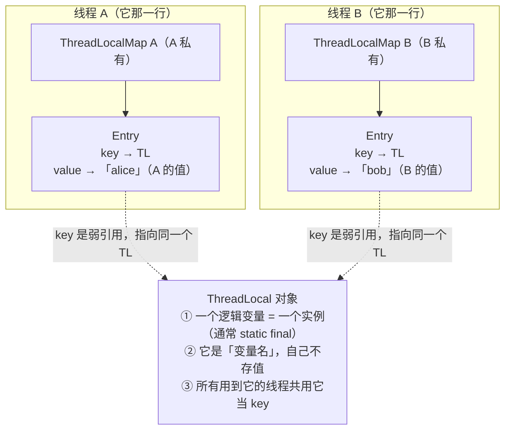
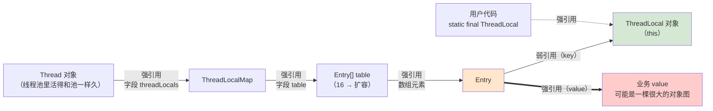
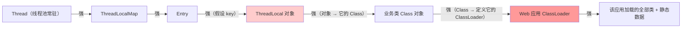
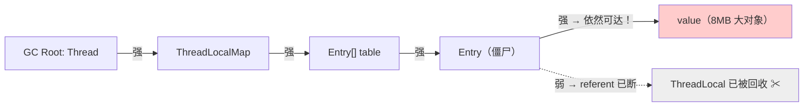

# ThreadLocal 弱引用设计与内存泄漏

> 最后整理: 2026-09-30 | 来源: 对话讲解（JDK 17 源码 + 本机实测 demo）

> 关联: [JVM 内存模型与垃圾回收](<./JVM 内存模型与垃圾回收.md>) — **建议先读该文 §2.4–§2.10**：可达性阶梯、Reference 状态机、`get()` 会临时变强等全部地基都在那里 | [沙箱（Sandbox）：从进程隔离到 Agent 运行时](<../计算机基础/沙箱（Sandbox）：从进程隔离到 Agent 运行时.md>) — 异步/线程池场景用 TransmittableThreadLocal 传递上下文（本文 §10.2 仅简介，实战细节见该文「链路染色」一节）

---

## §0 概念澄清：ThreadLocal、ThreadLocalMap、Entry、K、V 到底谁是谁

这一节是**概念地图**。把这几个问题理顺，后面所有机制都会顺理成章——因为绝大多数"看不懂"，卡的不是源码，是**没分清谁是谁、谁负责什么**。

### 0.1 先破一个误解：共享的是「变量名」，不是「值」

⚠️ **先破一个高频误解**：很多资料（也包括本笔记的早期版本）会写成"**ThreadLocal 只有一个**，它是变量的身份标识，被所有线程共享"——这句话是**错的**。一个应用里完全可以有几十个 ThreadLocal（几十个逻辑变量），"只有一个"没有道理。

正确的说法是：**一个逻辑变量 ↔ 一个 `ThreadLocal` 实例**；而"被所有线程共享"共享的**只是那个"变量名"身份，不是值**。

**用一张表格类比，立刻就清楚了**：

```text
                        ┌──────────────────────────────┬───────────────────────┐
                        │ CURRENT_USER (ThreadLocal ①) │ TRACE_ID (ThreadLocal ②) │  ← 列名：共享
      ┌─────────────────┼──────────────────────────────┼───────────────────────┤
      │ 线程 A 的 map   │  "alice"                     │  "trace-001"          │  ← A 那一行
      ├─────────────────┼──────────────────────────────┼───────────────────────┤
      │ 线程 B 的 map   │  "bob"                       │  "trace-002"          │  ← B 那一行
      └─────────────────┴──────────────────────────────┴───────────────────────┘
              ↑                        ↑
        每线程一行               每个格子 = 一个 Entry
```

| 表格里的东西 | ThreadLocal 世界里对应的东西 |
|------------|---------------------------|
| **列名**（`CURRENT_USER`） | **`ThreadLocal` 对象** —— 一整套列名，所有行共享 |
| **一行** | **`ThreadLocalMap`** —— 每个线程一行 |
| **行 × 列的格子** | **`Entry`** —— key 是列名，value 是"该行该列"的值 |

**关键就一句：共享的是"列名"，不是"格子里的值"。** 你当然不需要给每个线程发明一个新列名（列名一套就够），但每个线程都在自己那一行里填自己的值。

于是那两个看似矛盾的说法就各归其位了：

- **"所有线程共享一个 ThreadLocal"** = 大家拿**同一个对象当 key**（读它的哈希值来定位自己那一格）；
- **"值互相隔离"** = 值存在**各自的 map（各自那一行）**里，A 的 `"alice"` 和 B 的 `"bob"` 是两个不同的 Entry。

配上同一个数据结构视角：



这张图要看出三件事：

1. **`ThreadLocal` 只是"变量名"**：一个逻辑变量对应一个实例，它**自己不存任何值**，只提供"我是谁"（key 身份）和"值是什么类型"（泛型 `T`）。你 `tl.set(v)` 时，`v` 是塞进**当前线程那一行**的 Entry 里，**不是**塞进 `ThreadLocal` 对象里。
2. **`ThreadLocalMap` 每个线程一个**（就是 `Thread` 上的 `threadLocals` 字段），是这个线程的**私有储物柜**（也就是"表格的一行"）。
3. **同一个 ThreadLocal 在每个线程的 map 里各有一个 Entry**——所以"线程隔离"是靠"**每线程一张 map**"实现的，**不是**靠每个线程有不同的 key。

> 顺带把上一版含糊带过的 **"只读地用"** 说清楚：线程们拿 `ThreadLocal` 当 key，只**读取**它的 `threadLocalHashCode`（`private final int`，构造期就定死）来算槽位，**从不修改**这个对象。所以这个被多线程共享的对象**没有任何会被并发写的可变状态 → 自然不需要加锁**。
> （唯一的"写"发生在 `new ThreadLocal()` 时：对静态的 `nextHashCode` 做一次原子递增——那属于构造期，跟在多个线程里 `get`/`set` 无关。这也是 `ThreadLocal` 能在无锁前提下被所有线程共享的根本原因。）

### 0.2 对照表：ThreadLocal vs ThreadLocalMap

| 维度 | `ThreadLocal` | `ThreadLocalMap` |
|------|--------------|-----------------|
| 是什么 | **对外的 API 对象**，你代码里声明和使用的那个变量 | **内部的存储容器**，一张定制 hash 表 |
| 角色 | 逻辑上的「变量」＋ map 的 **key** | 某个线程的「储物柜」 |
| 数量 | 一个逻辑变量 = 一个实例（通常 `static final`） | **每个 Thread 一个** |
| 生命周期 | 由你（程序员）控制 | 跟着 Thread 走，线程退出时被置 null |
| 可见性 | `public`，随时可用 | **package-private**，是 `ThreadLocal` 的静态内部类，**用户代码拿不到** |
| 你会直接调用吗 | 会：`tl.get()` / `tl.set()` / `tl.remove()` | **永远不会** |

一句话：**`ThreadLocal` 是钥匙和变量，`ThreadLocalMap` 是每个线程自己的柜子。**

### 0.3 为什么 key 必须是 ThreadLocal

从「这个 map 到底要解决什么问题」倒推最清楚：

```text
map 的职责：给定「某个变量」，找出「它在本线程的值」
            ↓
所以 map 必须回答：这是「哪一个变量」？   ← 这就是 key 要承担的职责
            ↓
而「哪一个变量」的天然标识物，就是 ThreadLocal 实例本身
```

关键点：**`ThreadLocal` 没有重写 `equals` / `hashCode`**，所以它天生是**身份（identity）语义**——每个 `new ThreadLocal()` 出来的实例都独一无二，正好当「变量 ID」用。

再加上 §8 那个 `0x61c88647` 黄金分割哈希增量，`ThreadLocal` 对象自带一个 `threadLocalHashCode`，于是定位槽位只要一次位运算：

```java
int i = key.threadLocalHashCode & (table.length - 1);
```

**身份唯一 + 自带哈希 + 零冲突散列**，这就是「key 用 ThreadLocal」的全部理由。

### 0.4 为什么不用 String 名字做 key

一个自然的问题：用 `"userContext"` 这样的字符串当 key 不是更直观？不行：

| 维度 | 用 String 名字 | 用 ThreadLocal 实例 |
|------|--------------|-------------------|
| 唯一性 | 需要全局约定命名，可能撞名 | **天然唯一**（对象身份） |
| 哈希 | 要算字符串哈希，可能冲突 | 自带单调递增的黄金分割哈希 |
| 等价判断 | 字符串比较（`equals`） | **引用比较**（`refersTo`/`==`），近零成本 |
| 类型安全 | 只能拿到 `Object`，要强转 | 泛型 `ThreadLocal<T>`，**编译期类型安全** |
| 生命周期 | 字符串常量可能让 key 永不消失 | 可以被弱引用回收（§4 的整个动机） |

### 0.5 日常你只用 `ThreadLocal`：一次 `get()` 的完整调用链

```java
// 你写的代码（唯一入口）
private static final ThreadLocal<User> CURRENT_USER = new ThreadLocal<>();

User u = CURRENT_USER.get();
```

内部发生的事：

```text
CURRENT_USER.get()
  │
  ├─ 1. Thread t = Thread.currentThread()        // 找到「当前线程」
  ├─ 2. ThreadLocalMap map = t.threadLocals      // 拿到「这个线程的柜子」
  │         （这就是 §2 说的「所有权倒置」：柜子挂在 Thread 上）
  ├─ 3. map.getEntry(this)                       // 用 this（这个 ThreadLocal）当 key 去找
  │         int i = this.threadLocalHashCode & (len - 1)
  ├─ 4. 找到 Entry → 返回 entry.value             // 拿到「本线程的值」
  └─ 5. 没找到 → setInitialValue()               // 调 initialValue()/supplier，再 set 回去
```

**所以"使用 ThreadLocal"就是"使用 `ThreadLocal` 这个类"**；`ThreadLocalMap` 全程只是它的内部实现细节，业务代码里**永远不需要、也没法**直接 new 或引用它。

### 0.6 K 被清掉之后，V 到底怎么样

这是最核心的一问。答案藏在一个很多人没注意的事实里：

> **`Entry` 本身就是一个"弱引用对象"。**

```java
static class Entry extends WeakReference<ThreadLocal<?>> {   // ← Entry IS-A WeakReference
    Object value;                                            // ← 同时它自己还有 value 字段
    Entry(ThreadLocal<?> k, Object v) { super(k); value = v; }
}
```

所以"一个 KV"在内存里其实是**同一个对象里的两个字段**：

```text
Entry 对象（它本身就是一个 WeakReference 实例）
┌───────────────────────────────────────────────────────┐
│ 【继承来的部分】WeakReference<ThreadLocal<?>>          │
│    referent ────弱引用────> ThreadLocal 对象           │  ← 大家口中的 "K"
├───────────────────────────────────────────────────────┤
│ 【Entry 自己的字段】                                   │
│    value    ────强引用────> 你的业务对象                │  ← 大家口中的 "V"
└───────────────────────────────────────────────────────┘
              ▲
              │ 强引用（被 table 数组持有）
              │
        Entry[] table
```

GC 清弱引用时，**只做一件事**：`entry.referent = null`。

```text
K 被清掉之后：
┌───────────────────────────────────────────────────────┐
│    referent ────✂ null（ThreadLocal 已被回收）          │
├───────────────────────────────────────────────────────┤
│    value    ────强引用────> 业务对象   ★ 原封不动！     │
└───────────────────────────────────────────────────────┘
              ▲
              │ 依然是强引用
        Entry[] table
```

**V 不会跟着 K 一起消失**，因为：

- `value` 是 Entry 的**另一个字段**，GC 清 key 时根本没碰它；
- `Entry` 自己还被 `table` 数组**强引用**着 → Entry 可达 → `Entry.value` 可达 → **GC 没有任何理由回收 V**。

**V 的终点只有一个：Entry 被从数组里删掉的那一刻**（`expungeStaleEntry` 里的 `tab[i].value = null; tab[i] = null;`）。而"删 Entry"是**数据结构的责任**，GC 不会替你做——这就是 §1 说的**职责错配**。

### 0.7 ThreadLocal 什么时候真的被回收 + 两种完全不同的泄漏

**「ThreadLocal 对象被回收」需要同时满足两个条件**：

1. **没有任何强引用指向它** —— 注意：如果你写成 `static final`，这一条**永远不成立**；
2. **发生了一次做了引用处理（reference processing）的 GC** → 此时 GC 把 referent 置 null（即 §2.6 状态机里的 Active → Pending）。

于是泄漏分成**两种形态**，而且**弱引用只对第一种有用**：

| | 场景 A：ThreadLocal 是局部变量 / 动态创建 | 场景 B：`static final`（**正常写法**） |
|---|---|---|
| key 会变 null 吗 | 会（强引用一断，下次 GC 就清） | **永远不会**（被类静态字段强引用，永远强可达） |
| 会产生 stale entry 吗 | **会** → 僵尸条目 | **不会**，Entry 完全"健康" |
| JDK 清理机制帮得上忙吗 | 帮**一半**：get/set/remove 会顺手清，但不保证及时、不保证完整（§7 实测残留 4 个） | **完全帮不上**：Entry 不是 stale 的，那四路清理**根本不会碰它** |
| 泄漏的是什么 | value（被僵尸 Entry 拖着） | value（因为**你忘了 `remove()`**） |
| 可靠解法 | 别动态创建 ThreadLocal，改用 `static final` | **`try/finally` 里 `remove()`** |

**这里有个反直觉但极重要的结论**：

> 日常推荐的 `static final ThreadLocal` 写法，恰恰让**弱引用失去保护作用**——因为 key 永远不会死，Entry 就永远不会变成 stale entry，JDK 那套"顺手清理"一次都不会为它触发。**这时候只有 `remove()` 能救你。**

换句话说：

> **"弱引用能防 ThreadLocal 内存泄漏"这句话，只在你违反"用 `static final`"这条建议时才成立。** 按推荐写法写，防泄漏的唯一手段就是 `remove()`。

---

## §1 先把结论摆出来

很多人对 ThreadLocal 弱引用的记忆是一句"key 是弱引用，所以不会内存泄漏"——这句话**半对半错**。完整结论是三句话：

1. **结构上**：`ThreadLocalMap` 是 `Thread` 的字段，`Entry` 的 key（ThreadLocal 对象）是弱引用，value（业务对象）是**强引用**。这是一半弱、一半强的**非对称设计**。
2. **设计意图**：弱引用只负责让「ThreadLocal 对象本身」能被回收，**不负责回收 value**。value 只能靠 get / set / remove / rehash 顺手清理，或者用户显式 `remove()`。
3. **后果上**：JDK 的清理是"**尽力而为**"，不是保证。线程池 + 忘记 `remove()` = value（以及它可达的整个对象图）泄漏。

先看引用链全景，这是理解一切的地基：



关键点：**value 的引用链 `Thread → Map → table → Entry → value` 全程都是强引用**。所以只要那条线程活着，value 就绝无可能被 GC 回收——这和 key 是强是弱无关。弱引用只是切断了「key 被 Thread 绑架」这一条边。

---

## §2 根源：所有权倒置（map 为什么不挂在 ThreadLocal 上）

直觉的设计是「`ThreadLocal` 持有一个 `Map<Thread, Object>`」。JDK 偏偏反着来：**`Thread` 持有 `Map<ThreadLocal, Object>`**。为什么要倒置？

| 维度 | 挂在 ThreadLocal 上（直觉设计） | 挂在 Thread 上（JDK 实际） |
|------|------------------------------|--------------------------|
| 并发访问 | 一个 ThreadLocal 被 N 个线程共享 → 需要同步 map | 每个线程独占自己的 map → **天然无锁** |
| 取值成本 | 每次 get 要 hash + 可能的锁竞争 | 直接拿 `currentThread().threadLocals`，**极快** |
| 生命周期 | 线程死亡后条目仍留在 map 里 → 需要额外清理线程 | 线程死亡时 map 随 Thread 一起消失 |

代价就是**所有权倒置**：Thread 持有 map，map 又以 ThreadLocal 为 key——如果 key 是强引用，就形成了一条「Thread 强引用 ThreadLocal」的边。于是 ThreadLocal 对象的生命周期被**使用它的最长寿的那个线程**绑架了。这正是弱引用要解决的根源问题。

源码印证（`java.base/java/lang/Thread.java:190`）：

```java
public class Thread implements Runnable {
    /* ThreadLocal values pertaining to this thread. This map is maintained
     * by the ThreadLocal class. */
    ThreadLocal.ThreadLocalMap threadLocals = null;
```

```java
// ThreadLocal.java:253 — getMap 就是从当前 Thread 上取 map
ThreadLocalMap getMap(Thread t) {
    return t.threadLocals;
}
```

---

## §3 Entry：一半弱、一半强的非对称设计

`ThreadLocalMap.Entry` 的真身只有 8 行，但它就是整个机制的题眼（JDK 17 源码 `ThreadLocal.java:329`）：

```java
/**
 * The entries in this hash map extend WeakReference, using
 * its main ref field as the key (which is always a
 * ThreadLocal object).  Note that null keys (i.e. entry.get()
 * == null) mean that the key is no longer referenced, so the
 * entry can be expunged from table.  Such entries are referred to
 * as "stale entries" in the code that follows.
 */
static class Entry extends WeakReference<ThreadLocal<?>> {
    /** The value associated with this ThreadLocal. */
    Object value;

    Entry(ThreadLocal<?> k, Object v) {
        super(k);      // ← key 交给 WeakReference 托管
        value = v;     // ← value 是普通的强引用字段
    }
}
```

| 组成 | 引用类型 | 谁持有 | 被回收的条件 |
|------|---------|--------|-------------|
| key（ThreadLocal 对象） | **弱引用**（`WeakReference.referent`） | Entry 继承自 WeakReference | 除了这个 Entry 之外**没有**任何强引用它 → 下次 GC 即回收 |
| value（业务对象） | **强引用**（普通字段） | Entry.value | 只有 Entry 被移除/null 掉之后才可能回收 |

注意 `Entry` 用的是继承而非组合：`Entry extends WeakReference<ThreadLocal<?>>`，直接**把 WeakReference 的 referent 字段当作 key 用**，省掉一层对象头和一个字段（这是 JDK 里常见的空间优化手法）。

JDK 17 起，多数 key 判定改用 `e.refersTo(key)` / `e.refersTo(null)`（`Reference.refersTo` 是 JDK 16 新增的方法）——`getEntry`、`set`、`remove`、`cleanSomeSlots`、`expungeStaleEntries` 都已切换；但 `expungeStaleEntry` 与 `resize` 里**仍是 `e.get()`**（见 §6.1 的源码引用）。**老版本（JDK 8）则全部是 `e.get() == key`**。两种写法语义完全一致，面试按老写法答也正确。改用 `refersTo` 的真正动机是：**`get()` 会把 referent 临时"变强"**（可能被 GC 当作强可达直到后续某个回收周期），用 `refersTo` 才能"只检查、不改变可达性"——机制细节见 [JVM 内存模型与垃圾回收](<./JVM 内存模型与垃圾回收.md>) §2.8。

---

## §4 反证：如果 key 也用强引用会怎样

假设 `Entry` 的 key 是强引用，引用链就变成：



后果是**ThreadLocal 对象永远不会被回收**，而且它通常不是孤立的：一个 `static final ThreadLocal` 被回收的前提是它所属的 **ClassLoader 能被卸载**。在 Tomcat / Spring Boot 热部署这类容器里，Web 应用的 ClassLoader 会被应用内的所有对象钉住 → **整个 Web 应用的类和静态数据都无法卸载**，这就是经典的 `The web application appears to have started a thread but has failed to stop it` / Metaspace OOM 的成因之一。

所以这是一个**两害相权**的取舍：

| 方案 | 泄漏的东西 | 泄漏的严重性 |
|------|-----------|-------------|
| key 强引用 | ThreadLocal 对象 + 它钉住的 ClassLoader / 整个应用 | 💀 灾难级：Metaspace 泄漏，热部署彻底失效 |
| key 弱引用（JDK 选择） | value 对象图，且**有机会被顺手清掉** | ⚠️ 可控：通常只泄漏若干业务对象 |

**JDK 的取舍逻辑：宁可漏 value，也不漏 key。** 弱引用把"必然泄漏、体积不可控"降级成"可能泄漏、有机会自愈"。

---

## §5 弱引用留下的坑：stale entry

弱引用解决了 key 的泄漏，但顺手制造了一个新状态：**stale entry（僵尸条目）**——key 已经被 GC 置为 null，但 Entry 对象本身还牢牢躺在 `table` 数组里，它的 `value` 字段还是强引用。

为什么 GC 不把 value 一起收了？因为可达性分析的起点是 GC Roots：



**Entry 是被数组强引用的，所以 Entry 可达，value 也就可达——GC 没有任何理由回收它。** "key 为 null 就会顺带清 value" 是对弱引用最常见的误解。

而且线程死亡时其实是能整体释放的（`Thread.java:859`）：

```java
private void exit() {
    ...
    /* Aggressively null out all reference fields: see bug 4006245 */
    target = null;
    /* Speed the release of some of these resources */
    threadLocals = null;
    inheritableThreadLocals = null;
    ...
}
```

**所以"线程退出 → map 置 null → 一切释放"这条路是通的；会出问题的是长生命周期线程**——线程池线程、容器工作线程、常驻后台线程，乃至本文 §7 用来演示的 main 线程，都满足"线程不死 → map 不死 → 僵尸 entry 常驻"。其中**线程池最常见**，所以 ThreadLocal 泄漏几乎总和线程池绑定。

> ⚠️ 但别把结论扩大化：**stale entry 只解释了"场景 A"的泄漏**。如果你按推荐写法把 ThreadLocal 声明成 `static final`，它的 key **永远不会变 null**，也就**永远不会产生 stale entry**——此时泄漏纯粹是"忘了 `remove()`"造成的，和弱引用、僵尸条目都无关。两种场景的完整对照见 §0.7。

---

## §6 清理机制：四路入口 + 三级扫描

JDK 没有后台清理线程。JDK 源码注释里写得非常明确（`ThreadLocal.java:315-317`）：

> To help deal with very large and long-lived usages, the hash table entries use WeakReferences for keys. However, **since reference queues are not used, stale entries are guaranteed to be removed only when the table starts running out of space.**

即：**只有表快满的时候，才"保证"清理**。平时靠四个入口顺手清：

| 入口 | 触发路径 | 清理强度 |
|------|---------|---------|
| `get()` | `getEntry` → `getEntryAfterMiss` → 探测链上遇到 null key → `expungeStaleEntry(i)` | 较弱：撞到 stale 后调 `expungeStaleEntry` 会清到下一个 null 槽（含顺带 rehash），但**不做 backward 扫描、不跑 `cleanSomeSlots`** |
| `set()` | 探测链上遇到 null key → `replaceStaleEntry` → 清理整个 run + `cleanSomeSlots` | 中（清一整个 run） |
| `remove()` | `e.clear()` + `expungeStaleEntry(i)` | 强（精确清理自己，推荐手段） |
| 扩容前 `rehash()` | `expungeStaleEntries()` 全表扫描 → 清掉**所有** stale entry | 最强（但只在 size 逼近阈值时发生） |

### 6.1 expungeStaleEntry：清理的核心单元

这是所有清理路径最终都会调用的函数，它做两件事（`ThreadLocal.java:604`）：

```java
private int expungeStaleEntry(int staleSlot) {
    Entry[] tab = table;
    int len = tab.length;

    // ① 清掉自己：先断 value 再断 Entry，两步都不可少
    tab[staleSlot].value = null;
    tab[staleSlot] = null;
    size--;

    // ② 顺着探测链往下走，直到遇到 null 槽
    Entry e;
    int i;
    for (i = nextIndex(staleSlot, len); (e = tab[i]) != null; i = nextIndex(i, len)) {
        ThreadLocal<?> k = e.get();
        if (k == null) {
            // 顺路遇到的其他僵尸：一起清
            e.value = null;
            tab[i] = null;
            size--;
        } else {
            // 存活条目：如果它的理想槽位在前面（可能被刚才清空的槽"截断"了探测链）
            // 就把它往前搬 —— 这是开放寻址法删除元素必须做的 rehash
            int h = k.threadLocalHashCode & (len - 1);
            if (h != i) {
                tab[i] = null;
                while (tab[h] != null)
                    h = nextIndex(h, len);
                tab[h] = e;
            }
        }
    }
    return i;
}
```

两点必须理解：

- **"清理"和"重排"是绑定的**。ThreadLocalMap 是开放寻址 + 线性探测，查找靠"从 hash 槽往后一直走到 null 为止"。如果只是把中间某个槽简单置 null，后面那些**因为冲突被挤到更后面**的条目就永远找不到了。所以删除时必须把后面同类条目往前搬。这就是注释里引用的 Knuth《TAOCP》6.4 节算法 R。
- 注释特意说明"Unlike Knuth 6.4 Algorithm R, we must scan until null"——因为这里可能有**多个** stale entry，不能像 Knuth 那样找到一个就收工。

### 6.2 cleanSomeSlots：log₂(n) 的启发式

`set()` 末尾会调用它来"顺手扫一扫"（`ThreadLocal.java:664`）：

```java
private boolean cleanSomeSlots(int i, int n) {
    boolean removed = false;
    Entry[] tab = table;
    int len = tab.length;
    do {
        i = nextIndex(i, len);
        Entry e = tab[i];
        if (e != null && e.refersTo(null)) {
            n = len;                       // 一旦发现僵尸，重置计数 → 扩大扫描预算
            removed = true;
            i = expungeStaleEntry(i);      // 从僵尸位置开始连锁清理
        }
    } while ((n >>>= 1) != 0);             // 每次右移一位 → 扫 log2(n) 个槽
    return removed;
}
```

设计动机源码注释说得很清楚：**不扫 → 快但留垃圾；全扫 O(n) → 干净但让单次插入变成 O(n)**。折中方案是扫 `log₂(n)` 个槽；一旦发现僵尸，就把预算重置为 `len`（相当于"发现了就多扫点"）。这是一个典型的**摊销（amortized）+ 概率**策略。

### 6.3 rehash / expungeStaleEntries：全量兜底

```java
private void rehash() {
    expungeStaleEntries();                  // ← 全表逐槽清僵尸

    // Use lower threshold for doubling to avoid hysteresis
    if (size >= threshold - threshold / 4)  // 清理后 size 仍 ≥ 3/4 阈值才真扩容
        resize();
}
```

`expungeStaleEntries()` 就是简单的 `for (j = 0; j < len; j++) if (stale) expungeStaleEntry(j)`。`rehash` 先清理再判断扩容，是为了**用清理腾出的空间避免无谓扩容**（注释里的 hysteresis 迟滞）。`resize()` 把表翻倍并重新散列，同时把 stale entry 的 value 置 null（"Help the GC"）。

**结论：只有当僵尸多到把 size 顶到阈值时，全量清理才会发生。僵尸数量少时，它们可以长期驻留。**

---

## §7 实测：泄漏现场与清理时机

口说无凭，下面是在本机 JDK 17（Temurin 17.0.20）真实跑出来的输出。演示代码用一个 8MB 的 `Payload`，并通过反射直接窥探 `Thread.threadLocals`（需要 `--add-opens java.base/java.lang=ALL-UNNAMED`）：

```java
/** 在一个独立方法里创建 ThreadLocal，保证局部变量槽失效、强引用真正断开 */
static WeakReference<ThreadLocal<Payload>> createAndLeak() {
    ThreadLocal<Payload> tl = new ThreadLocal<>();
    tl.set(new Payload("被忘记 remove 的值"));
    return new WeakReference<>(tl);   // 只留弱引用，用来观测 ThreadLocal 自己是否被回收
}

public static void main(String[] args) throws Exception {
    Thread main = Thread.currentThread();

    // 阶段 1：正常持有
    ThreadLocal<Payload> keepAlive = new ThreadLocal<>();
    keepAlive.set(new Payload("正常使用的值"));
    dump(main, "  [阶段1]");

    // 阶段 2：断开 ThreadLocal 强引用 + GC
    WeakReference<ThreadLocal<Payload>> leakRef = createAndLeak();
    dump(main, "  [阶段2-创建后]");
    gc();
    System.out.println("  ThreadLocal 对象本身是否已被回收? " + (leakRef.get() == null));
    dump(main, "  [阶段2-GC后]");

    // 阶段 3：继续塞新 ThreadLocal，逼 ThreadLocalMap rehash
    for (int i = 0; i < 14; i++) {
        ThreadLocal<Payload> tl = new ThreadLocal<>();
        tl.set(new Payload("填充-" + i));
    }
    gc();
    dump(main, "  [阶段3-rehash后]");
}
```

**真实输出（原样摘录）**：

```text
=== 阶段 1：ThreadLocal 强引用存活，一切正常 ===
  [阶段1] -> table.length=16, size=1, 存活=1, 僵尸=0

=== 阶段 2：断开 ThreadLocal 强引用 + GC ===
  [阶段2-创建后] -> table.length=16, size=2, 存活=2, 僵尸=0
  ThreadLocal 对象本身是否已被回收? true
  [阶段2-GC后] -> table.length=16, size=2, 存活=1, 僵尸=1
      slot[5] key=null  value=Payload@a09ee92   <-- 僵尸 entry（value 还活着！）
  ^^^^ key 变 null 了，但 value 还在 map 里 —— 这就是泄漏

=== 阶段 3：继续塞新 ThreadLocal，逼 ThreadLocalMap rehash ===
      >>> [GC] Payload(被忘记 remove 的值) 被回收了
      >>> [GC] Payload(填充-1) 被回收了
      ...（共 11 个 Payload 陆续被回收）
  [阶段3-rehash后] -> table.length=16, size=5, 存活=1, 僵尸=4
      slot[0] key=null  value=Payload@3a71f4dd   <-- 僵尸 entry（value 还活着！）
      slot[2] key=null  value=Payload@7adf9f5f   <-- 僵尸 entry（value 还活着！）
      slot[7] key=null  value=Payload@85ede7b   <-- 僵尸 entry（value 还活着！）
      slot[9] key=null  value=Payload@5674cd4d   <-- 僵尸 entry（value 还活着！）
```

从输出能读出四条硬结论：

1. **阶段 2 是泄漏现场的铁证**：`ThreadLocal 对象本身是否已被回收? true` —— 弱引用 key 的设计**确实生效**了，ThreadLocal 对象被回收；但同一时刻 `slot[5] key=null value=Payload@a09ee92`，**8MB 的 value 还活着**。这就是"key 漏不了、value 会漏"的直接观测。
2. **`size` 把僵尸也计入**：阶段 2 显示 `size=2` 而"存活=1"，说明 stale entry 在 `size` 里直到被 expunge 才递减。这也解释了为什么僵尸堆积会**加速触发 rehash**（阈值判断用的是含僵尸的 size）。
3. **阶段 3 证明"清理完全依赖后续操作触发"**：塞 14 个新 ThreadLocal 逼出 rehash，而 `expungeStaleEntries` 是**全表扫描**，当场把已有僵尸清了（"被忘记 remove 的值"和 10 个"填充-*"被回收）；但**循环结束后**最后几个 `tl` 才变成垃圾，此时已没有任何 map 操作，它们的 key 被 GC 置 null 后就成了 **4 个永久驻留的僵尸**（`僵尸=4`）。**结论：清理只在"下一次操作发生"时才可能触发——线程池里若此后不再碰这个 ThreadLocal，泄漏的 value 就再没人来收。**
4. **表没扩容**（`table.length` 始终 16）：因为 rehash 先清理、size 掉下来了，`size >= threshold - threshold/4` 不成立 → 不 resize。这正是 §6.3 那个"迟滞"设计的实效。

---

## §8 哈希细节：为什么增量是 0x61c88647

```java
/**
 * The difference between successively generated hash codes - turns
 * implicit sequential thread-local IDs into near-optimally spread
 * multiplicative hash values for power-of-two table sizes.
 */
private static final int HASH_INCREMENT = 0x61c88647;

private static int nextHashCode() {
    return nextHashCode.getAndAdd(HASH_INCREMENT);
}
```

`0x61c88647 = 1640531527 = 2³² × (1 − 1/φ) = 2³² × (3 − √5)/2 ≈ 2³² × 0.381966 = 2³² − 0x9E3779B9`（φ = (√5 + 1)/2 即黄金分割比）。

⚠️ 这里容易记错：它是黄金分割常数的**补数**，而不是常被引用的 `0x9E3779B9 = 2³² × (√5 − 1)/2 = 2³² × 0.618...`。两者互为取反（`2³² − 0x9E3779B9 = 0x61c88647`），散列效果等价（都是奇常数乘法散列），但数值完全不同。这属于 Fibonacci hashing / 乘法散列：当容量是 2 的幂时，用黄金分割系常数作乘数能让**连续递增的输入**在表里散得最开。

效果：连续创建的 ThreadLocal（hash 依次为 `i × 0x61c88647`）取模 16 后会落在 `0, 7, 14, 5, 12, 3, 10, 1, 8, 15, 6, 13, 4, 11, 2, 9` ——**遍历全部 16 个槽且零冲突**。这是选择这个魔数的全部理由。

配套参数：`INITIAL_CAPACITY = 16`（必须是 2 的幂）、`setThreshold(len) = len * 2 / 3`（负载因子 2/3）、`nextIndex(i, len) = (i + 1 < len) ? i + 1 : 0`（环形线性探测）。

---

## §9 更深的权衡：为什么不用 ReferenceQueue

既然有弱引用，Java 的标准玩法是「弱引用 + `ReferenceQueue` + 后台线程 drain」。`WeakHashMap` 就是这么干的。ThreadLocalMap 却不用，源码注释明确承认了后果：

> （§6 已引同一句，此处再引一次以便本节独立阅读）**since reference queues are not used, stale entries are guaranteed to be removed only when the table starts running out of space.**

为什么放弃这个更"干净"的方案？

| 维度 | 用 ReferenceQueue（WeakHashMap 路线） | 就地扫描（ThreadLocalMap 路线） |
|------|-----------------------------------|------------------------------|
| 数据结构 | 全局队列，多个线程/多个 map 共享 | 每个线程私有的一张小表 |
| 同步成本 | 入队/出队需要同步 | 单线程访问，**零同步** |
| 清理时机 | 需要额外机制去 drain 队列 | 摊在 get/set/remove 的正常路径里 |
| 定位成本 | 从队列拿到 referent 后还要反查槽位 | 本来就是按索引扫描，**位置已知** |

核心原因是**架构匹配**：ThreadLocalMap 是线程私有的，直接扫自己的表**不需要任何同步**，而全局 ReferenceQueue 会把"无锁"这个最大优势破坏掉。代价就是清理不及时、不完整——JDK 选择用「弱引用 + 机会式清理 + 用户 `remove()` 纪律」三件套来兜。

---

## §10 正确用法与替代方案

### 10.1 使用纪律

```java
// ✅ 推荐：static final + try/finally remove
private static final ThreadLocal<SimpleDateFormat> SDF =
        ThreadLocal.withInitial(() -> new SimpleDateFormat("yyyy-MM-dd"));

public String format(Date d) {
    SimpleDateFormat sdf = SDF.get();
    try {
        return sdf.format(d);
    } finally {
        SDF.remove();          // ← 线程池场景下这一行是必须的，不是可选的
    }
}
```

| 纪律 | 原因 |
|------|------|
| 用 `static final` 声明 | 避免"每次调用都 new 一个 ThreadLocal"，那会疯狂制造僵尸 entry |
| 线程池里必须 `try/finally remove()` | 线程不死，map 不死，value 泄漏；靠 JDK 顺手清不可靠（§7 实测只有部分被清） |
| 别往 ThreadLocal 里塞大对象 | value 强引用，泄漏体积 = 整个对象图 |
| 用完即清，别当缓存用 | ThreadLocal 是"上下文传递"工具，不是缓存（缓存该用 `SoftReference`/Caffeine） |

### 10.2 异步 / 线程池传递：TransmittableThreadLocal

`InheritableThreadLocal` 只在 **`new Thread()` 的那一刻**把父线程的值拷贝给子线程。线程池的线程是**预先创建并复用**的 → 拷贝时机早就过去了 → 异步分支拿到的是脏值或 null。

解决方案是阿里开源的 **TTL（TransmittableThreadLocal）**：用 `TtlExecutors.getTtlExecutorService(pool)` 装饰线程池，在**任务提交时**抓快照、**任务执行时**回放、**执行完**恢复现场。这块的实战细节记在 [沙箱（Sandbox）：从进程隔离到 Agent 运行时](<../计算机基础/沙箱（Sandbox）：从进程隔离到 Agent 运行时.md>) 的链路染色一节，本文不展开。

### 10.3 性能替代：Netty FastThreadLocal

Netty 的 `FastThreadLocal` 换了思路：不用 hash map、不用弱引用，而是给每个 ThreadLocal 分配一个**自增数组下标**，值存在该线程的 `InternalThreadLocalMap.indexedVariables`（`Object[]`）数组里——`InternalThreadLocalMap` 才是持有该数组的类，`FastThreadLocalThread` 只是持有这个 map；读取是纯数组访问，比 ThreadLocal 快。代价是**必须配合 `FastThreadLocalThread`**，且**必须显式 `remove()`**（没有弱引用兜底）。适合框架内部高频路径。

### 10.4 未来方向：ScopedValue（虚拟线程时代）

ThreadLocal 的设计前提是"线程数量有限"（几百个）。虚拟线程可以有几百万个，**每个虚拟线程一份 ThreadLocalMap** 会让内存放大到不可接受；而且它"隐式跨方法传递 + 必须手动 remove"的模型与结构化并发不搭。

JDK 的对策是 **`ScopedValue`**（JEP 506，JDK 25 转正）：值绑定在**代码作用域**上而非线程上，作用域退出自动失效，无需 `remove()`，天然对虚拟线程友好：

```java
// 伪代码示意：值随作用域自动生效、自动消失
ScopedValue.where(USER, currentUser).run(() -> {
    handleRequest();   // 作用域内任意深度都能读到 USER
});                    // 离开作用域自动失效 —— 没有 remove，也就没有泄漏
```

---

## §11 面试速答模板 & 常见误区

**60 秒答题模板**：

> ThreadLocalMap 挂在 Thread 上（所有权倒置，换来无锁 + 随线程死亡释放）。Entry 的 key 是 ThreadLocal 对象的弱引用，value 是强引用。key 用弱引用是为了避免 Thread 强引用 ThreadLocal 造成 ThreadLocal 对象和它的 ClassLoader 无法回收——两害相权取轻。但弱引用不解决 value：key 被 GC 后 Entry 仍在数组里、value 仍被强引用，形成 stale entry。JDK 靠 get/set/remove/rehash 四条路径机会式清理（`expungeStaleEntry` + `cleanSomeSlots` 的 log₂n 启发式），源码注释明确说"只有表快满时才保证清理"。所以线程池里忘记 `remove()` 就会泄漏 value，标准做法是 `static final` + `try/finally remove()`；异步传递用 TTL，虚拟线程时代看 ScopedValue。

**五个高频误区**：

| # | 误区 | 纠正 |
|---|------|------|
| 1 | "key 用弱引用是为了让 value 能被回收" | ❌ 弱引用是为了回收 **key**（ThreadLocal 对象）；value 的回收靠清理机制和 `remove()` |
| 2 | "key 变成 null 后 value 会被 GC 回收" | ❌ Entry 被 `table` 数组强引用 → Entry 可达 → value 可达。必须显式清 Entry |
| 3 | "ThreadLocal 内存泄漏 = ThreadLocal 对象泄漏" | ❌ 恰恰相反：ThreadLocal 对象被弱引用保护、能正常回收；泄漏的是 **value** |
| 4 | "有了弱引用就不会泄漏，不用 remove" | ❌ 清理是"尽力而为"且不完整（§7 实测残留 4 个僵尸）；线程池场景 `remove()` 必须写 |
| 5 | "key 干脆用强引用更安全" | ❌ 那会钉住 ThreadLocal → ClassLoader → 整个应用，在容器热部署下是 Metaspace 级灾难 |

---

## 附：一句话记忆锚点

> **Thread 持有 map（无锁、随线程生死），Entry 的 key 弱、value 强；弱引用只救 key 不救 value；JDK 只在 get/set/remove/rehash 时顺手清、且表快满才保证清；所以线程池里 `remove()` 是纪律，不是优化。**
