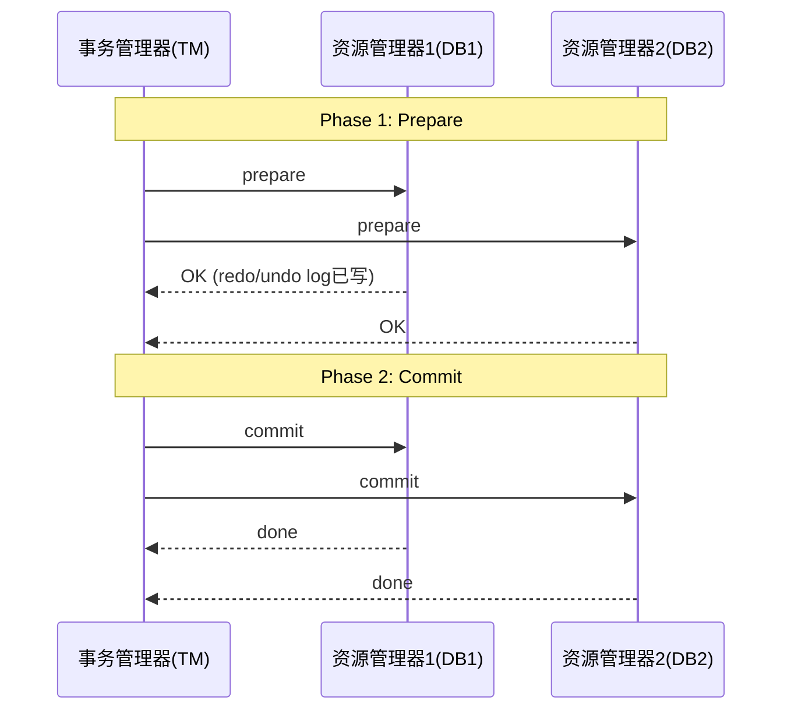
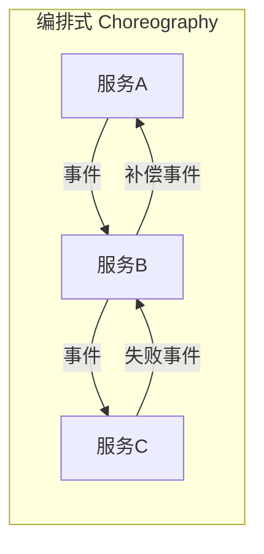
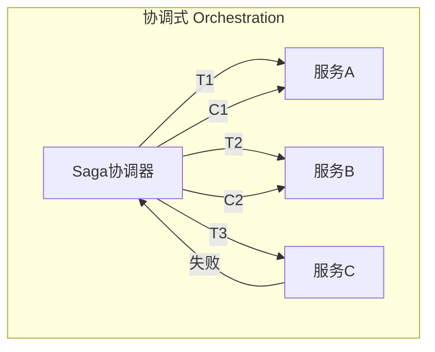
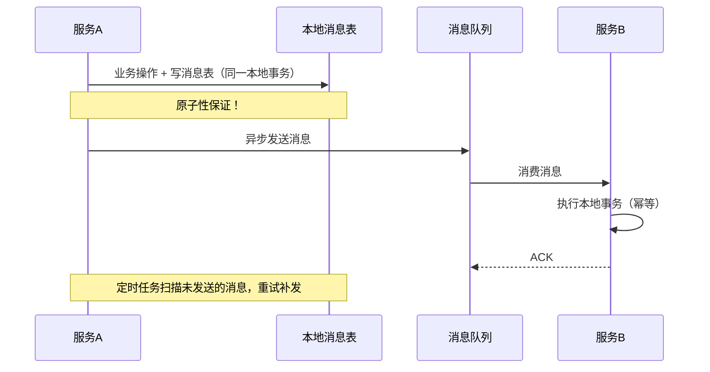
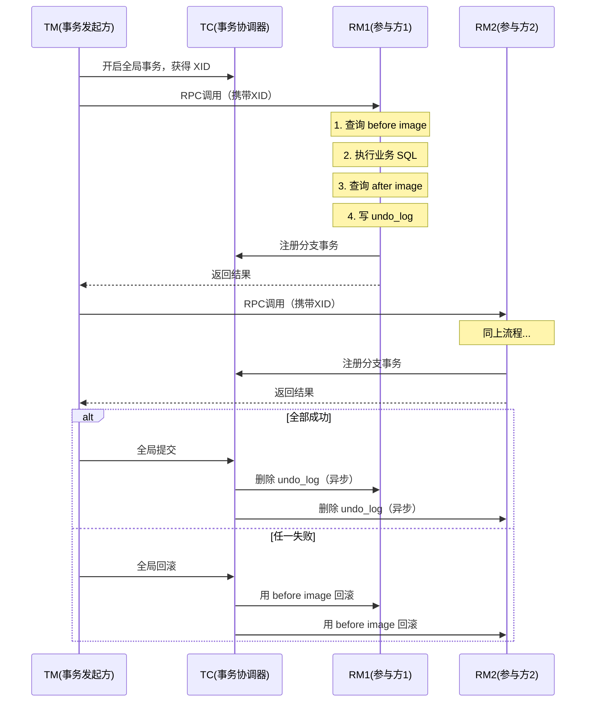
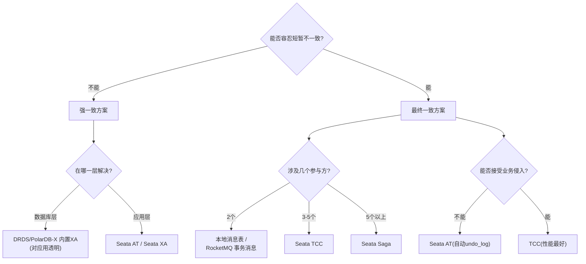

# 分布式事务全景

> 最后整理: 2026-05-20 | 来源: 对话讲解

> 关联: [rocketmq-internals](./rocketmq-internals.md) — 事务消息是分布式事务方案之一 | [rpc-dubbo-comparison](./rpc-dubbo-comparison.md) — 分布式服务调用的 RPC 层

---

## §1 为什么会遇到分布式事务？

单体应用时代，一个数据库连接 + `@Transactional` 就能搞定一切。但当你面对以下场景时，本地事务失效了：

| 场景 | 典型例子 |
|------|----------|
| **跨服务调用** | 订单服务扣库存 + 支付服务扣款，两个独立 DB |
| **分库分表** | 同一业务表按 userId 分到不同物理库，跨库更新 |
| **分布式数据库（DRDS/PolarDB-X）** | SQL 路由到不同 DN（数据节点），底层自动拆分 |
| **异构系统交互** | MySQL + Redis + ES + MQ 多存储介质需要一致 |

**核心矛盾**：CAP 定理告诉我们，分布式环境下不可能同时满足强一致性 + 可用性 + 分区容错性。所以分布式事务的本质是 **在一致性和可用性之间做 trade-off**。

---

## §2 理论基础：两个阵营

```
强一致（CP）                     最终一致（AP）
─────────────────────────────────────────────────
2PC / 3PC / XA                  TCC / Saga / 本地消息表 / 事务消息

特点：                           特点：
- 同步阻塞，等所有参与者        - 异步补偿，允许中间状态
- 性能差，但逻辑简单            - 性能好，但业务侵入大
- 适合：金融转账等0容忍场景      - 适合：电商、物流等大部分互联网场景
```

**黄金法则**：能用最终一致就不用强一致。互联网业务 90%+ 用最终一致性方案就够了。

---

## §3 XA / 2PC（两阶段提交）

### 3.1 原理



### 3.2 Java 中的实现

- **JTA 规范**（Java Transaction API）：`javax.transaction.UserTransaction`
- **Atomikos**：嵌入式 TM，Spring Boot Starter 直接集成
- **阿里云 DRDS/PolarDB-X 内置 XA**：对应用透明，SQL 层自动拆分 + 2PC

### 3.3 DRDS 分布式事务原理

```sql
-- 你写的 SQL
UPDATE account SET balance = balance - 100 WHERE user_id = 123;
UPDATE account SET balance = balance + 100 WHERE user_id = 456;

-- DRDS 内部自动做的事：
-- 1. 根据分片规则，路由到 DN1(user_id=123) 和 DN2(user_id=456)
-- 2. 对 DN1、DN2 分别执行 XA PREPARE
-- 3. 都返回 OK → 对两个 DN 执行 XA COMMIT
-- 4. 任一 PREPARE 失败 → 全部 XA ROLLBACK
```

**DRDS 事务模式选择**：

| 模式 | 特点 | 适用 |
|------|------|------|
| **强一致（XA）** | 默认模式，自动 2PC，对应用透明 | 跨分片写操作 |
| **柔性事务（最终一致）** | 基于 DRDS 全局事务日志 + 异步补偿 | 高并发、允许短暂不一致 |
| **单分片事务** | 路由到同一 DN 就是本地事务 | 单分片内操作 |

### 3.4 2PC 致命缺点

1. **同步阻塞**：Prepare 后所有资源被锁住，等 Commit
2. **单点故障**：TM 挂了，参与者一直持锁
3. **数据不一致**：Phase 2 部分 Commit 成功、部分网络断，出现脑裂
4. **性能杀手**：锁持有时间 = 整个 2PC 流程时间

---

## §4 TCC（Try-Confirm-Cancel）

### 4.1 核心思想

业务层面的 2PC，把数据库锁升级为业务锁：

```
Try:     预留资源（冻结库存、冻结余额）
Confirm: 确认执行（扣减冻结的资源）
Cancel:  取消预留（解冻）
```

### 4.2 Java 实现框架

- **Seata TCC 模式**
- **ByteTCC**
- **Hmily**

### 4.3 代码示例（Seata TCC）

```java
public interface InventoryService {

    @TwoPhaseBusinessAction(
        name = "deductStock",
        commitMethod = "confirm",
        rollbackMethod = "cancel"
    )
    boolean tryDeduct(BusinessActionContext context,
                      @BusinessActionContextParameter(paramName = "skuId") String skuId,
                      @BusinessActionContextParameter(paramName = "count") int count);

    boolean confirm(BusinessActionContext context);

    boolean cancel(BusinessActionContext context);
}

// Try: 冻结库存
@Override
public boolean tryDeduct(BusinessActionContext context, String skuId, int count) {
    // UPDATE inventory SET frozen = frozen + #{count}
    //   WHERE sku_id = #{skuId} AND available >= #{count}
    inventoryMapper.freeze(skuId, count);
    return true;
}

// Confirm: 真正扣减
@Override
public boolean confirm(BusinessActionContext context) {
    String skuId = (String) context.getActionContext("skuId");
    int count = (int) context.getActionContext("count");
    // UPDATE inventory SET frozen = frozen - #{count},
    //   stock = stock - #{count} WHERE sku_id = #{skuId}
    inventoryMapper.deductFrozen(skuId, count);
    return true;
}

// Cancel: 解冻
@Override
public boolean cancel(BusinessActionContext context) {
    String skuId = (String) context.getActionContext("skuId");
    int count = (int) context.getActionContext("count");
    // UPDATE inventory SET frozen = frozen - #{count} WHERE sku_id = #{skuId}
    inventoryMapper.unfreeze(skuId, count);
    return true;
}
```

### 4.4 TCC 三大难题

| 难题 | 场景 | 解法 |
|------|------|------|
| **空回滚** | Try 没执行就 Cancel（网络超时） | Cancel 检查 try 记录，没有则直接返回 |
| **幂等** | Confirm/Cancel 可能被重试 | 事务控制表 + 唯一键去重 |
| **悬挂** | Cancel 比 Try 先到，后来的 Try 不能再执行 | Try 前检查是否已有 cancel 记录 |

### 4.5 防御性代码

```java
// 用事务控制表防悬挂 + 空回滚
@Override
public boolean tryDeduct(BusinessActionContext ctx, String skuId, int count) {
    String xid = ctx.getXid();
    // 1. 查事务控制表，如果已有 cancel 记录 → 悬挂，直接返回
    if (txLogMapper.existsCancelRecord(xid)) {
        return false;  // 防悬挂
    }
    // 2. 插入 try 记录
    txLogMapper.insertTryRecord(xid);
    // 3. 冻结库存
    inventoryMapper.freeze(skuId, count);
    return true;
}

@Override
public boolean cancel(BusinessActionContext ctx) {
    String xid = ctx.getXid();
    // 1. 查事务控制表，如果没有 try 记录 → 空回滚
    if (!txLogMapper.existsTryRecord(xid)) {
        txLogMapper.insertCancelRecord(xid);  // 标记已 cancel，防后续悬挂
        return true;  // 空回滚，直接返回成功
    }
    // 2. 正常解冻
    inventoryMapper.unfreeze(...);
    return true;
}
```

---

## §5 Saga 模式

### 5.1 核心思想

长事务拆成多个本地事务，每个有对应的补偿操作。失败时逆序补偿：

```
正向：T1 → T2 → T3 → ... → Tn
T3 失败时逆序补偿：C2 ← C1
```

### 5.2 两种实现模式





- **编排式（Choreography）**：各服务通过事件驱动，无中心协调；简单场景适用
- **协调式（Orchestration）**：中心协调器（如 Seata Saga 状态机）编排流程；复杂流程推荐

### 5.3 适用场景与代价

**适用**：
- 业务流程长（跨 5+ 服务）
- 不想侵入业务接口（不像 TCC 要拆成三个方法）
- 可以接受短暂的中间状态可见

**代价**：
- 不隔离：中间状态对外可见（"脏读"）
- 补偿逻辑复杂：不是所有操作都能补偿（如：已发短信、已调外部接口）

---

## §6 本地消息表 + 最终一致

**最经典、最实用、落地最多的方案。**

### 6.1 流程



### 6.2 为什么是"最实用"

1. 不依赖任何分布式事务框架
2. 利用本地事务保证"业务+消息"的原子性
3. MQ 保证最终一定能投递
4. 下游幂等消费即可

### 6.3 核心表结构

```sql
CREATE TABLE local_message (
    id BIGINT AUTO_INCREMENT PRIMARY KEY,
    biz_key VARCHAR(128) NOT NULL,      -- 业务唯一键
    topic VARCHAR(64) NOT NULL,
    body TEXT NOT NULL,
    status TINYINT DEFAULT 0,            -- 0:待发送 1:已发送 2:已确认
    retry_count INT DEFAULT 0,
    next_retry_time DATETIME,
    create_time DATETIME DEFAULT NOW(),
    update_time DATETIME DEFAULT NOW(),
    UNIQUE KEY uk_biz_key(biz_key)
);
```

### 6.4 与 RocketMQ 事务消息的关系

本质就是**本地消息表的升级版**——把"消息表"托管给了 Broker：
- Half Message = 消息表的"待确认"状态
- Commit = 消息表的"已发送"状态
- 回查 = 定时任务扫描未确认消息

> 详见 [rocketmq-internals §5.2 事务消息](./rocketmq-internals.md)

---

## §7 Seata — 阿里开源分布式事务框架

### 7.1 四种模式对比

| 模式 | 原理 | 业务侵入 | 性能 | 适用 |
|------|------|----------|------|------|
| **AT** | 自动生成 undo_log，框架拦截 SQL | 无侵入 | 中 | 90% 的 CRUD 场景 |
| **TCC** | 业务自己写 Try/Confirm/Cancel | 高侵入 | 高 | 高并发 + 需要精细控制 |
| **Saga** | 状态机编排 + 补偿 | 中等 | 高 | 长流程 |
| **XA** | 标准 XA 协议 | 无侵入 | 低 | 强一致要求 |

### 7.2 AT 模式原理（最常用）



**核心流程**：
1. TM（事务发起方）开启全局事务 → 获得全局 XID
2. XID 通过 RPC 传播到各 RM（参与方）
3. RM 执行本地 SQL 前后分别生成 before/after image → 写入 undo_log 表
4. 全部成功 → TC 通知各 RM 异步删除 undo_log
5. 任一失败 → TC 通知各 RM 用 before image 做逆向回滚

### 7.3 使用示例

```java
// 使用极其简单，加一个注解
@GlobalTransactional(timeoutMills = 30000)
public void createOrder(OrderDTO dto) {
    // 1. 本地：创建订单
    orderMapper.insert(dto);

    // 2. RPC：扣库存（Seata 自动传播 XID）
    inventoryService.deduct(dto.getSkuId(), dto.getCount());

    // 3. RPC：扣余额
    accountService.debit(dto.getUserId(), dto.getAmount());
}
```

### 7.4 AT 模式的局限

- **写隔离问题**：全局锁粒度大，高并发下竞争严重
- **TC 单点**：TC Server 本身需要高可用部署（集群 + DB 持久化）
- **不支持 NoSQL**：只拦截 JDBC，Redis/ES 等无法自动纳入
- **长事务风险**：全局事务持续时间过长 → undo_log 堆积、锁占用过久

---

## §8 选型决策树



**极简版决策**：

| 场景 | 首选方案 |
|------|----------|
| 跨分片 SQL（DRDS） | 内置 XA，不用管 |
| 普通跨服务（2-3个） | 本地消息表 / 事务消息 |
| 高并发 + 精细控制 | TCC |
| 长流程编排（5+服务） | Saga |
| 快速接入、低侵入 | Seata AT |

---

## §9 核心认知纠偏

| 误区 | 真相 |
|------|------|
| "分布式事务 = 2PC" | 2PC 只是最古老的方案，互联网极少用 |
| "用了 Seata 就万事大吉" | Seata TC 本身也是单点，需要高可用部署 |
| "RocketMQ 事务消息 = 分布式事务" | 它只保证"本地事务 + 消息发送"的原子性，下游是否成功需要自己保证幂等 |
| "DRDS XA 没有性能问题" | 跨分片 XA 的锁等待时间 >> 单分片，需要关注热点分片 |
| "补偿一定能成功" | 已发短信、已调三方支付等操作不可逆，设计时要前置考虑 |
| "幂等 = 去重表" | 幂等方案多样：唯一键、状态机、版本号、Token |
| "最终一致 = 不一致" | 不是！是"一定会达到一致，只是有时间窗口" |

---

## §10 实战 Checklist

落地分布式事务前，逐项确认：

- [ ] **真的需要分布式事务吗？** 能否通过业务设计规避（如合并到同一服务/同一库）
- [ ] **一致性要求明确了吗？** 强一致 vs 最终一致，对业务影响评估了吗
- [ ] **幂等做了吗？** 所有被调方必须幂等（唯一键 / 状态机 / 版本号）
- [ ] **超时和重试策略定了吗？** 网络抖动必然发生
- [ ] **补偿逻辑可行吗？** 有没有不可逆操作（外部 API、短信、邮件）
- [ ] **监控报警做了吗？** 悬挂事务、长时间未完成事务的告警
- [ ] **降级方案有吗？** TC 挂了 / MQ 挂了，业务怎么兜底
