# RocketMQ 底层实现原理

> 最后整理: 2026-05-20 | 来源: 对话讲解

> 关联: [spring-ai](./spring-ai.md) — Java 技术栈

---

## §1 整体架构

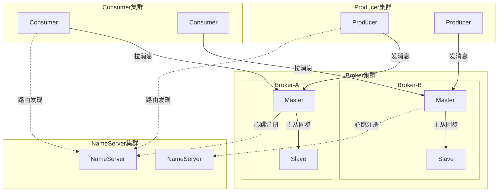

**四个角色**：

| 角色 | 职责 | 类比 |
|------|------|------|
| **NameServer** | 路由注册中心（无状态，互不通信） | 简化版 ZooKeeper |
| **Broker** | 消息存储和转发引擎 | 消息仓库 |
| **Producer** | 消息生产者 | 发货方 |
| **Consumer** | 消息消费者 | 收货方 |

**为什么不用 ZooKeeper？** RocketMQ 追求轻量：NameServer 无状态、无选举、无一致性协议。每个 NameServer 独立保存全量路由信息（Broker 每 30s 心跳上报），挂一个不影响其他的。

---

## §2 消息生产（Producer → Broker）

### 2.1 路由发现

```
Producer 启动:
  → 随机连一个 NameServer
  → 请求 Topic 路由信息: GET_ROUTE_INFO_BY_TOPIC
  → 拿到: Topic → [BrokerA-Queue0, BrokerA-Queue1, BrokerB-Queue0, BrokerB-Queue1]
  → 本地缓存，每 30s 刷新一次
```

### 2.2 发送流程

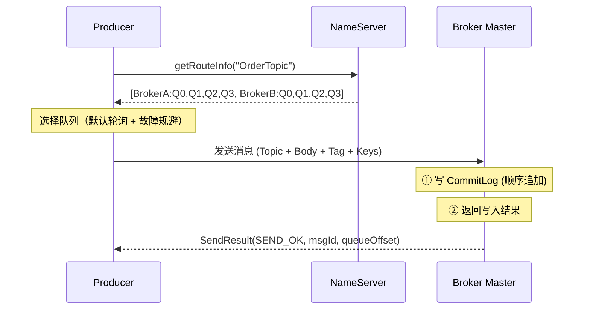

### 2.3 队列选择策略

```java
// 默认：轮询 + Broker 故障规避（latencyFaultTolerance）
int index = sendWhichQueue.getAndIncrement();  // 自增计数器
int queueIndex = Math.abs(index) % queues.size();

// 如果上次发送某 Broker 超时/失败，短时间内规避该 Broker
if (latencyFaultTolerance.isAvailable(brokerName)) {
    return queues.get(queueIndex);
}
```

### 2.4 三种发送模式

| 模式 | 可靠性 | 性能 | 适用场景 |
|------|--------|------|---------|
| **同步发送** | 高（等 ACK） | 中 | 订单、支付 |
| **异步发送** | 中（回调通知） | 高 | 日志、统计 |
| **单向发送** | 低（不等回复） | 最高 | 日志收集、不重要的监控 |

---

## §3 Broker 内部存储（核心！）

这是 RocketMQ 最精华的设计——**CommitLog + ConsumeQueue + IndexFile 三层存储**。

### 3.1 存储架构

```
store/
├── commitlog/           ← 所有消息的物理存储（顺序写）
│   ├── 00000000000000000000   (1GB 一个文件)
│   ├── 00000000001073741824
│   └── ...
├── consumequeue/        ← 逻辑队列索引（消费用）
│   └── OrderTopic/
│       ├── 0/          ← Queue 0
│       │   └── 00000000000000000000  (每条 20 字节定长)
│       ├── 1/
│       └── ...
└── index/               ← 消息 Key 索引（查询用）
    └── 20260520120000   (按时间戳命名)
```

### 3.2 CommitLog：消息的物理存储

**设计核心：所有 Topic 的消息混在一起，顺序追加写。**

```
CommitLog 文件结构（每条消息变长）:
┌──────────────────────────────────────────────────┐
│ MsgLen(4B) │ MagicCode(4B) │ BodyCRC(4B)         │
│ QueueId(4B) │ Flag(4B) │ BornTimestamp(8B)       │
│ BornHost(8B) │ StoreTimestamp(8B)                │
│ StoreHost(8B) │ ReconsumeTimes(4B)               │
│ PreparedTransOffset(8B) │ BodyLength(4B)         │
│ Body(变长) │ TopicLength(1B) │ Topic(变长)        │
│ PropertiesLength(2B) │ Properties(变长)           │
└──────────────────────────────────────────────────┘
```

**为什么所有 Topic 混写？**

→ **顺序写磁盘的吞吐量远高于随机写。** 即使 HDD，顺序写也能达到 600MB/s+，接近内存速度。如果按 Topic 分文件存，消息交替写入不同文件 → 磁头跳来跳去 → 随机写 → 性能崩塌。

**单个 CommitLog 文件大小 = 1GB**，写满后创建新文件，文件名是该文件第一条消息的全局物理偏移量。

### 3.3 ConsumeQueue：逻辑消费索引

**问题**：所有 Topic 消息混在一起，Consumer 怎么只消费自己 Topic 的消息？

**答案**：异步构建 ConsumeQueue——一个轻量级的定长索引。

```
ConsumeQueue 每条记录固定 20 字节:
┌─────────────────────────────────────┐
│ CommitLog Offset (8B)  │  消息在 CommitLog 中的物理偏移量
│ Message Size (4B)      │  消息长度
│ Tag HashCode (8B)      │  用于 Tag 过滤
└─────────────────────────────────────┘
```

**为什么是定长 20B？** → 可以直接通过 `offset * 20` 算出文件中任意一条的物理位置，实现 **O(1) 随机读取**。

**构建流程**：

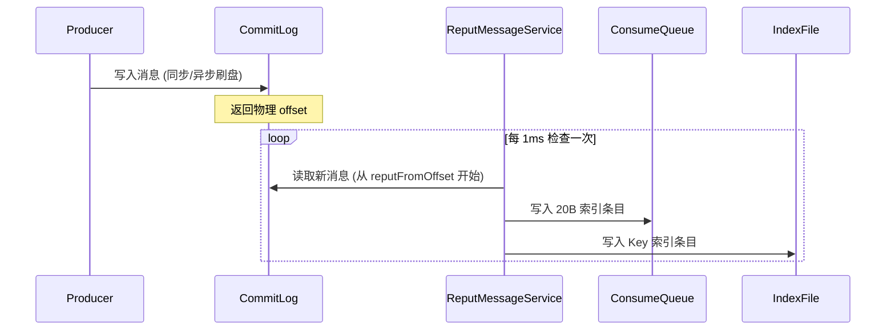

**ReputMessageService**（异步线程）：
- 不断扫描 CommitLog 中的新消息
- 为每条消息在对应的 `Topic/QueueId/` 下追加一条 20B 索引
- 同时更新 IndexFile（按 Message Key 建的哈希索引，用于消息查询）

### 3.4 写入过程的内存映射（MappedFile）

RocketMQ 不是直接用 `FileOutputStream` 写文件，而是用 **mmap（内存映射文件）**：

```java
// 核心代码简化
MappedByteBuffer mappedByteBuffer = fileChannel.map(
    FileChannel.MapMode.READ_WRITE, 0, fileSize  // 1GB
);

// 写消息 = 写内存（OS 异步刷到磁盘）
mappedByteBuffer.put(messageBytes);
```

**好处**：
- 写消息 = 写内存页，极快
- OS 的 Page Cache 机制自动管理脏页刷盘
- 读消息时如果在 Page Cache 中 → 零拷贝，不走磁盘

### 3.5 刷盘策略

| 策略 | 实现 | 可靠性 | 性能 |
|------|------|--------|------|
| **同步刷盘** | 每条消息写完 → `force()` | 极高（断电不丢） | 低（受限于磁盘 IOPS） |
| **异步刷盘**（默认） | 后台线程每 500ms 批量 flush | 可能丢最近几百ms | 高 |

生产环境通常：**异步刷盘 + 主从同步** → 兼顾性能和可靠性。

---

## §4 消息消费（Consumer ← Broker）

### 4.1 两种消费模式

| 模式 | 特点 | 适用场景 |
|------|------|---------|
| **Push 模式**（实际是长轮询） | Broker hold 住请求，有消息立刻返回 | 99% 的场景 |
| **Pull 模式** | Consumer 主动拉，自己控制节奏 | 大数据批处理 |

**Push 的本质是长轮询（Long Polling）**，不是真的 Broker 主动推：

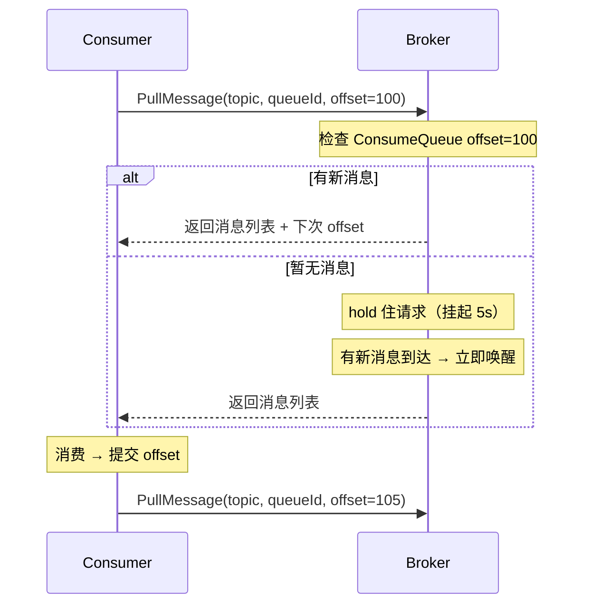

### 4.2 Consumer 负载均衡（Rebalance）

**问题**：一个 Topic 有 8 个 Queue，4 个 Consumer 实例，怎么分配？

```
Topic: OrderTopic
  Queue: [Q0, Q1, Q2, Q3, Q4, Q5, Q6, Q7]

ConsumerGroup: order-service
  Instances: [C1, C2, C3, C4]

默认分配算法（AllocateMessageQueueAveragely）:
  C1 → [Q0, Q1]
  C2 → [Q2, Q3]
  C3 → [Q4, Q5]
  C4 → [Q6, Q7]
```

**触发 Rebalance 的条件**：
- Consumer 数量变化（上线/下线/宕机）
- Queue 数量变化（扩容）
- 每 20s 定时检查一次

**关键约束：一个 Queue 在同一个 ConsumerGroup 内只能被一个 Consumer 消费。** 所以 Consumer 实例数 > Queue 数时，多余的 Consumer 会闲置。

### 4.3 消费位点（Offset）管理

```
广播模式: offset 存本地文件 (consumer 各自维护)
集群模式: offset 存 Broker (RemoteBrokerOffsetStore)
         → Broker 内存 Map + 定期持久化到 consumerOffset.json
```

**消费流程**：
1. Consumer 拉消息（带当前 offset）
2. 消费业务逻辑
3. 消费成功 → 提交新 offset 到 Broker
4. 消费失败 → 不提交 → 下次重新拉到这条（至少一次语义）

### 4.4 消费失败与重试

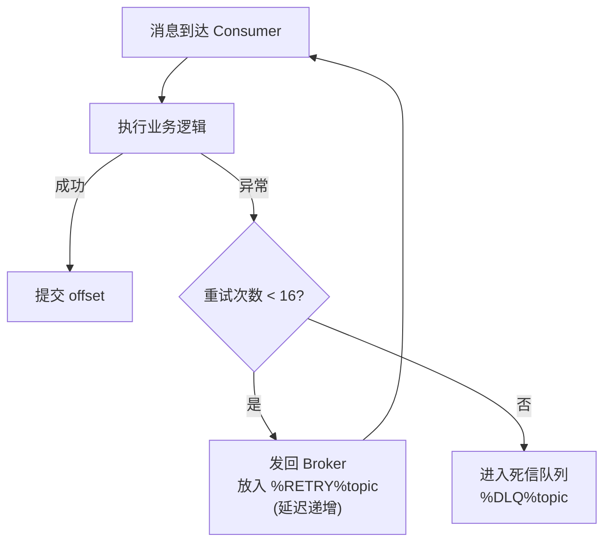

**重试延迟递增表**（对应 delayLevel 3~18）：

| 重试次数 | 延迟 | 重试次数 | 延迟 |
|---------|------|---------|------|
| 1 | 10s | 9 | 7min |
| 2 | 30s | 10 | 8min |
| 3 | 1min | 11 | 9min |
| 4 | 2min | 12 | 10min |
| 5 | 3min | 13 | 20min |
| 6 | 4min | 14 | 30min |
| 7 | 5min | 15 | 1h |
| 8 | 6min | 16 | 2h |

超过 16 次 → 进入 **死信队列（DLQ）**：`%DLQ%ConsumerGroup`，需要人工介入处理。

---

## §5 关键机制补充

### 5.1 消息过滤

```
两级过滤:
  第一级: Broker 端 — ConsumeQueue 中的 Tag HashCode 过滤（高效，在索引层过滤）
  第二级: Consumer 端 — 拉到消息后精确比对 Tag 字符串（防 hash 碰撞）
```

### 5.2 事务消息（Half Message）

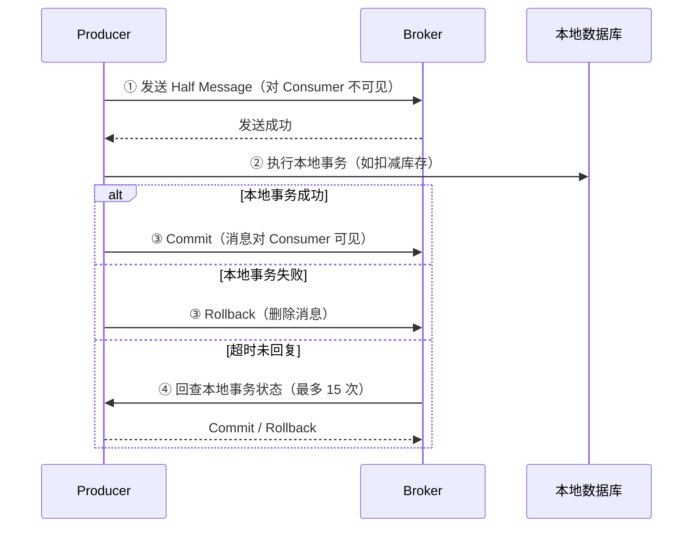

**Half Message 存储**：内部转存到 `RMQ_SYS_TRANS_HALF_TOPIC`，Commit 后才把真实 ConsumeQueue 索引建好。

#### 回查机制详解（TransactionalMessageCheckService）

**核心问题**：如果 Producer 发完 Half Message 后宕机，既没有 Commit 也没有 Rollback，消息就永远"悬挂"在 Half Topic 中。Broker 必须主动回查。

**Op Message（操作记录）**：

```
RMQ_SYS_TRANS_HALF_TOPIC  ← 存放 Half Message（待决消息）
RMQ_SYS_TRANS_OP_HALF_TOPIC  ← 存放 Op Message（已决操作记录）

Op Message 内容 = Half Message 在 Half Queue 中的 offset
作用: 标记哪些 Half Message 已经被 Commit 或 Rollback 处理过
```

**回查流程**：

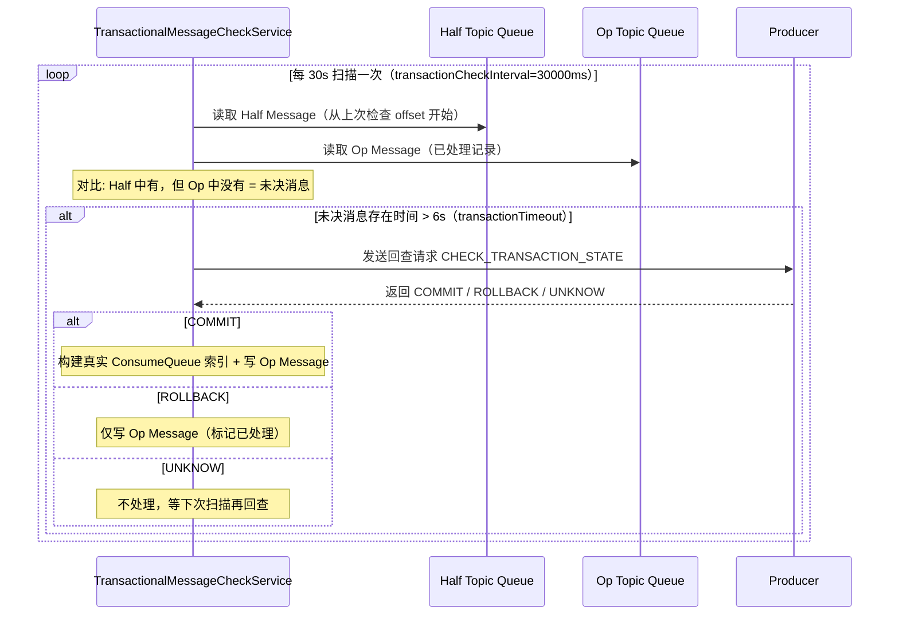

**关键配置参数**：

| 参数 | 默认值 | 含义 |
|------|--------|------|
| `transactionCheckInterval` | 30s | 回查线程扫描间隔 |
| `transactionTimeout` | 6s | Half Message 存活超过此时间才触发回查 |
| `transactionCheckMax` | 15 次 | 单条消息最多回查 15 次 |

**回查超过 15 次仍返回 UNKNOW**：该 Half Message 会被标记为已处理（写 Op Message）但不 Commit → 消息永久丢弃 + 打印 WARN 日志。业务侧需要通过对账机制发现这类异常。

#### Commit 和 Rollback 的本质操作

```
Commit:
  ① 从 Half Topic 读出原始消息
  ② 恢复真实 Topic 和 QueueId（类似延迟消息的恢复逻辑）
  ③ 重新写入 CommitLog（这次 Topic 是真实的）
  ④ 写一条 Op Message 标记该 Half 已处理

Rollback:
  ① 仅写一条 Op Message 标记该 Half 已处理
  ② 不恢复真实 Topic → Consumer 永远看不到这条消息
  （Half Message 本身不删除，等文件过期自然清理）
```

### 5.3 延迟消息（深度实现原理）

#### 为什么只有固定级别？

RocketMQ 4.x 不支持任意延迟时间，只支持 **18 个固定延迟级别**：

```
Level:  1   2   3    4    5   6   7   8   9   10  11  12  13   14   15  16  17  18
Delay:  1s  5s  10s  30s  1m  2m  3m  4m  5m  6m  7m  8m  9m  10m  20m  30m  1h  2h
```

**为什么不支持任意延迟？** 如果支持任意时间（如"延迟 3 天 7 小时 22 分"），需要对每条消息建立独立的定时器或排序队列，在海量消息（百万级）场景下内存和 CPU 开销不可控。固定级别 = 固定数量的定时队列 = 开销可控。

> 注：RocketMQ 5.x 已支持任意延迟（基于 TimerWheel 时间轮实现），但 4.x 生产环境仍是主流。

#### 核心数据结构

```
store/
├── commitlog/                        ← 原始消息（Topic 被替换为 SCHEDULE_TOPIC_XXXX）
└── consumequeue/
    └── SCHEDULE_TOPIC_XXXX/
        ├── 0/   ← 对应 delayLevel=1 (1s)
        ├── 1/   ← 对应 delayLevel=2 (5s)
        ├── 2/   ← 对应 delayLevel=3 (10s)
        └── ...  ← 共 18 个 Queue，每个对应一个延迟级别
```

**关键设计：每个延迟级别独享一个 Queue。** 同一个 Queue 内的消息延迟时间相同 → 天然按到期时间有序 → 只需检查队头。

#### 完整生命周期

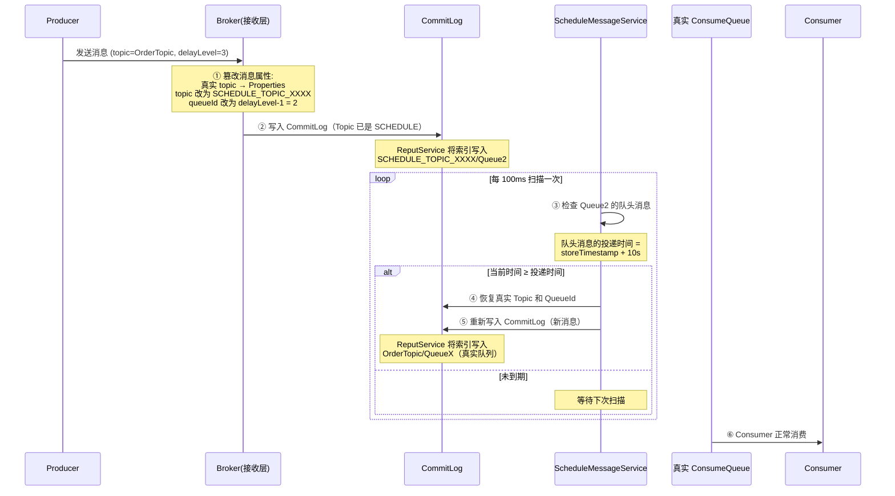

#### 关键源码逻辑

```java
// ScheduleMessageService.java — 每个 delayLevel 一个 Timer 线程
class DeliverDelayedMessageTimerTask implements Runnable {

    @Override
    public void run() {
        // 1. 从 SCHEDULE_TOPIC 的 ConsumeQueue 按 offset 顺序取消息
        ConsumeQueue cq = findConsumeQueue(SCHEDULE_TOPIC, delayLevel - 1);

        for (SelectMappedBufferResult bufferCQ = cq.getIndexBuffer(currentOffset); ...) {
            long tagsCode = bufferCQ.getLong();  // tagsCode 存的是"投递时间戳"

            // 2. 判断是否到期
            long deliverTimestamp = tagsCode;  // 特殊：延迟消息的 tagsCode = 投递时间
            long countdown = deliverTimestamp - System.currentTimeMillis();

            if (countdown <= 0) {
                // 3. 到期：从 CommitLog 读出原始消息
                MessageExt msgExt = lookMessageByOffset(physicOffset, physicSize);

                // 4. 恢复真实 Topic 和 QueueId（从 Properties 中取回）
                MessageExtBrokerInner msgInner = messageTimeup(msgExt);

                // 5. 重新投递到 CommitLog（这次 Topic 是真实的 OrderTopic）
                putMessageResult = this.brokerController.getMessageStore()
                    .putMessage(msgInner);
            } else {
                // 未到期 → 等到它到期的精确时间再扫描
                scheduleNextTimerTask(countdown);
                break;  // 同 Queue 后面的消息必然更晚到期，可以 break
            }
        }
    }
}
```

#### 核心设计巧妙点

| 设计 | 为什么这么做 |
|------|-------------|
| **tagsCode 复用为投递时间戳** | ConsumeQueue 的 20B 结构中最后 8B 是 tagsCode，延迟消息不需要 Tag 过滤，所以复用这 8B 存投递时间戳 → 无需额外存储 |
| **同 Queue 天然有序** | 同一延迟级别的消息，先进先出 → 到期时间单调递增 → 只需检查队头 → O(1) |
| **break 优化** | 队头未到期 → 后面所有消息都未到期 → 直接 break，不用继续扫描 |
| **两次写 CommitLog** | 第一次写（存入 SCHEDULE）+ 到期后第二次写（恢复真实 Topic）→ 简单粗暴但有效，复用了已有的 CommitLog → ConsumeQueue 管道 |

#### 延迟精度

- **理论精度**：100ms（Timer 扫描间隔）
- **实际精度**：100ms ~ 1s（受 CommitLog 写入 + ReputService 延迟影响）
- **极端情况**：Broker 重启后从 ConsumeQueue 恢复进度，可能有秒级延迟

---

### 5.4 顺序消息（实现原理）

#### 问题定义

普通消息：Producer 轮询发到不同 Queue，Consumer 并行消费 → **无法保证顺序**。

顺序消息需求示例：
```
订单流程: 创建订单 → 扣减库存 → 支付成功 → 发货通知
必须保证: 消息 A 在消息 B 之前被消费
```

#### 两种顺序级别

| 级别 | 保证范围 | 实现难度 | 适用场景 |
|------|---------|---------|---------|
| **分区有序**（常用） | 同一个 Queue 内有序 | 低 | 同一订单的消息有序 |
| **全局有序** | 整个 Topic 全有序 | 高（性能极差） | 几乎不用 |

**生产环境 99% 用分区有序**——只需要"同一业务 Key 的消息有序"，不需要跨 Key 全局有序。

#### 分区有序的完整实现

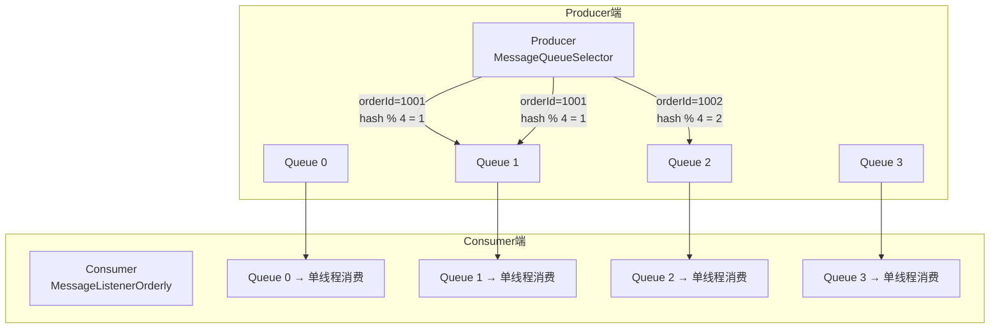

**关键：同一 orderId 的消息始终落在同一个 Queue → 同一个 Queue 内 FIFO → 顺序保证。**

#### Producer 端：MessageQueueSelector

```java
// Producer 发送顺序消息 — 用业务 Key 选择固定 Queue
SendResult result = producer.send(msg, new MessageQueueSelector() {
    @Override
    public MessageQueue select(List<MessageQueue> mqs, Message msg, Object arg) {
        // arg = orderId，用 hashCode 对 Queue 数取模
        String orderId = (String) arg;
        int index = Math.abs(orderId.hashCode()) % mqs.size();
        return mqs.get(index);
    }
}, orderId);  // orderId 作为 arg 传入
```

**为什么必须同步发送？**
- 异步发送无法保证网络层的到达顺序
- 必须等上一条 ACK 回来再发下一条（或者至少用 FIFO 队列串行化发送）

#### 易混淆点：串行消费 ≠ 一次一条

**单 Queue FIFO 不等于"一次只能消费一条消息"。** 实际是"批量拉取 + 本地串行处理"：

```
Consumer 线程（每 Queue 独占一个线程）:
  ① 一次从 Broker 拉 32 条消息（pullBatchSize=32，网络层批量）
  ② 放入本地 ProcessQueue（TreeMap 按 offset 排序）
  ③ 逐条传给 MessageListenerOrderly（consumeMessageBatchMaxSize 默认=1）
  ④ 处理完一条再处理下一条（串行保序）
  ⑤ 32 条都处理完 → 提交 offset → 再拉下一批
```

**性能对比**：

| 策略 | 网络请求次数（1亿条） | 单 Queue 吞吐 |
|------|---------------------|--------------|
| 每次只拉 1 条 | 1 亿次 | ~200 TPS（受网络 RT 瓶颈） |
| 每次拉 32 条（默认） | 312.5 万次 | ~6400 TPS |
| 每次拉 64 条 | 156 万次 | ~12800 TPS |

**批量拉取把网络 RT 成本摊薄了 32 倍。瓶颈在业务处理耗时 × 消息数，不在网络 IO。**

还可以调大 `consumeMessageBatchMaxSize`（如 16），让 Listener 一次收到 16 条消息，减少 Listener 调用开销（但循环内仍串行处理）。

#### Broker 端：天然保证

Broker 不需要额外逻辑——**CommitLog 本身就是顺序追加的**。同一个 Queue 的 ConsumeQueue 索引天然按写入顺序排列。只要 Producer 保证同一 Key 打到同一 Queue，Broker 侧无需任何特殊处理。

#### Consumer 端：MessageListenerOrderly

这是顺序消息的**核心难点**——如何保证消费端单线程有序消费？

```java
// Consumer 注册顺序消费监听器
consumer.registerMessageListener(new MessageListenerOrderly() {
    @Override
    public ConsumeOrderlyStatus consumeMessage(
            List<MessageExt> msgs, ConsumeOrderlyContext context) {
        for (MessageExt msg : msgs) {
            // 业务逻辑：保证同一 Queue 内串行执行
            processOrder(msg);
        }
        return ConsumeOrderlyStatus.SUCCESS;
    }
});
```

**与 `MessageListenerConcurrently` 的区别**：

| | MessageListenerConcurrently | MessageListenerOrderly |
|--|----------------------------|----------------------|
| 消费线程 | 多线程并发消费同一 Queue | **每个 Queue 独占一个线程** |
| 锁机制 | 无 | **分布式锁 + 本地锁** |
| 失败处理 | 发回重试 Queue | **本地重试（不换 Queue）** |
| 性能 | 高 | 低（串行化代价） |

#### Consumer 端的锁机制（保证有序的关键）

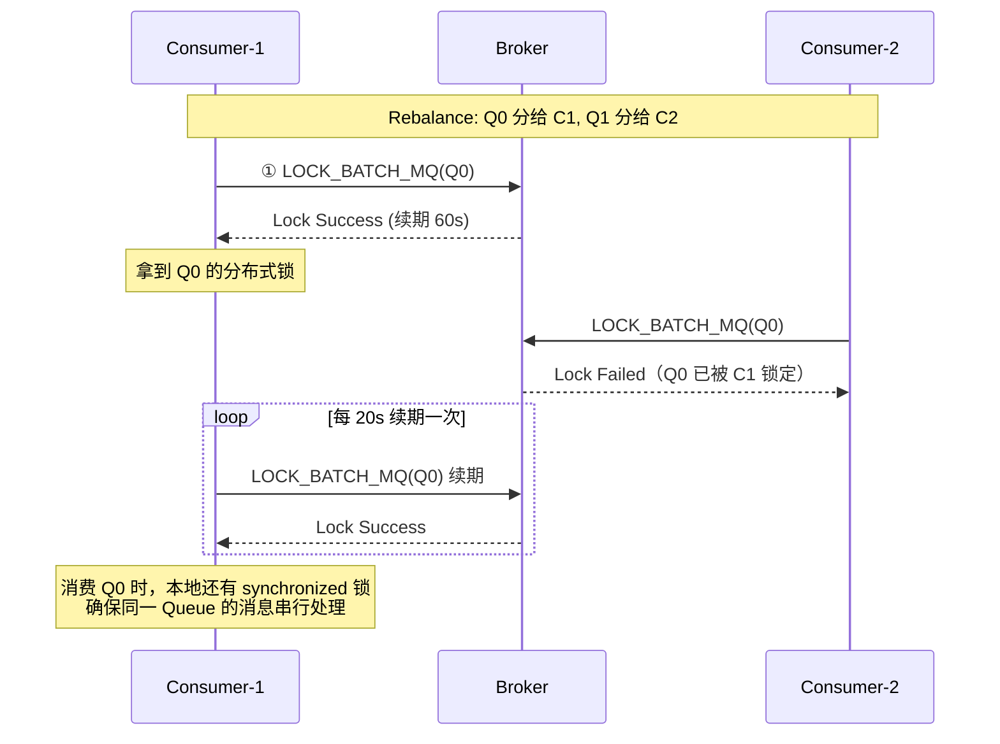

**两层锁保证顺序**：

| 层级 | 作用 | 机制 |
|------|------|------|
| **分布式锁（Broker 端）** | 防止 Rebalance 时两个 Consumer 同时消费同一 Queue | Consumer 启动 + 每 20s 向 Broker 申请 Queue 锁，Broker 内存中维护 `Map<Queue, ClientId>` |
| **本地锁（Consumer 端）** | 保证同一 Queue 的消息串行进入 Listener | `synchronized(objLock)` 每个 ProcessQueue 一把锁 |

#### 消费失败时的处理差异

**并发消费失败**：消息发回 Broker 的 `%RETRY%` Topic → 换 Queue → 不保证顺序

**顺序消费失败**：

```java
// ConsumeMessageOrderlyService.java 核心逻辑
if (status == ConsumeOrderlyStatus.SUSPEND_CURRENT_QUEUE_A_MOMENT) {
    // 不发回 Broker！在本地暂停当前 Queue 消费 1s 后重试
    // 保证同一 Queue 内的后续消息不会被跳过
    this.submitConsumeRequestLater(processQueue, messageQueue, 1000);
}
```

**为什么不能发回 Broker？** 如果消息 A 消费失败被发回 Broker，消息 B 可能先被消费 → 顺序被打破。所以顺序消费失败时只能本地重试（阻塞当前 Queue 的后续消费）。

#### 单条消息卡死导致整个 Queue 阻塞（重要场景）

**默认行为**：顺序消费的 `maxReconsumeTimes = Integer.MAX_VALUE`（无限重试），`suspendCurrentQueueTimeMillis = 1000`（每次间隔 1s）。如果某条消息一直消费失败（如查上游单据报错），**该 Queue 永远卡住**，后续所有消息全部堆积。

```
Queue 0: [A] [B] [C] [D] [E] ...
                ↑ B 消费失败（上游查询报错）
B 重试第 1 次 → 失败 → suspend 1s
B 重试第 2 次 → 失败 → suspend 1s
B 重试第 N 次 → 失败 → ...
→ C、D、E 全部在等 B → 整个 Queue 停滞
```

**解法 1：设置最大重试次数 + 业务层跳过**

```java
consumer.setMaxReconsumeTimes(5);

@Override
public ConsumeOrderlyStatus consumeMessage(List<MessageExt> msgs, 
        ConsumeOrderlyContext context) {
    for (MessageExt msg : msgs) {
        if (msg.getReconsumeTimes() >= 5) {
            // 超限 → 记日志 + 写异常表 + 跳过
            log.error("顺序消费超限，跳过: msgId={}", msg.getMsgId());
            saveToExceptionTable(msg);
            return ConsumeOrderlyStatus.SUCCESS;  // 跳过，Queue 继续流动
        }
        try {
            processOrder(msg);
        } catch (Exception e) {
            return ConsumeOrderlyStatus.SUSPEND_CURRENT_QUEUE_A_MOMENT;
        }
    }
    return ConsumeOrderlyStatus.SUCCESS;
}
```

**解法 2：区分暂时性故障 vs 确定性失败**

| 类型 | 表现 | 处理 |
|------|------|------|
| **暂时性故障** | 超时、网络抖动、限流 | 重试（有次数上限） |
| **确定性失败** | 单据不存在、参数非法、状态已终态 | 直接跳过 + 记录异常表 |

确定性失败无论重试多少次都不会成功 → 应立即跳过，避免无意义阻塞。

**解法 3：失败消息转异常 Topic**

```java
if (msg.getReconsumeTimes() >= maxRetry) {
    producer.send(new Message("ORDER_EXCEPTION_TOPIC", msg.getBody()));
    return ConsumeOrderlyStatus.SUCCESS;  // 主 Queue 继续
}
// 异常 Topic 由专门的 Consumer 处理（可并发消费，不需要有序）
```

**解法 4：监控 + 告警兜底**

- consumerOffset 长时间不推进（>1min）→ 告警
- 单条消息 `reconsumeTimes > 3` → 告警
- 人工兜底：`resetOffsetByTimestamp` 跳过问题消息

**本质 tradeoff**：有序性保证 ↔ 阻塞风险，跳过消息 = 局部打破有序，但保全了 Queue 的整体流动性。

#### 全局有序（了解即可）

```
实现方式：Topic 只设 1 个 Queue
代价：
  - Producer 只能发到 1 个 Queue → 单 Broker 瓶颈
  - Consumer 只能 1 个实例消费 → 无法水平扩展
  - 吞吐量：几千 TPS（vs 分区有序的几十万 TPS）
结论：几乎不用，除非业务量极小且强制全局有序
```

#### 顺序消息的代价与限制

| 限制 | 原因 |
|------|------|
| 消费吞吐量下降 | 每个 Queue 串行消费，并发度 = Queue 数（而非线程数） |
| 单点故障影响大 | Queue 所在 Broker 挂了 → 该 Queue 消息暂停消费（等切换） |
| 消费失败阻塞后续 | 一条消息卡住 → 整个 Queue 阻塞（需要设置最大重试次数） |
| 扩缩容要谨慎 | Queue 数变化 → hash 结果变化 → 短暂乱序 |

**最佳实践**：
- Queue 数 = 预期最大 Consumer 数的 2-4 倍（留扩容空间）
- 设置 `maxReconsumeTimes`（如 5 次），超限进死信队列，避免永久阻塞
- 只对需要有序的业务 Key 使用顺序消息，不要整个 Topic 都顺序

#### 高基数 Key 场景分析（如 2000 万 Key / 1 亿消息）

**结论：完全可以实现。** `hash(key) % queueCount` 只关心最终映射到哪个 Queue，不关心 Key 有多少种。

##### 并发度瓶颈

```
2000 万 Key → hash % 16（默认 Queue 数）→ 每个 Queue 平均 125 万 Key
1 亿条消息 → 每个 Queue 平均 625 万条
消费端每个 Queue 串行 → 并发度 = Queue 数 = 16
```

| Queue 数 | 每 Queue 消息数 | 消费耗时(5ms/条) | 需 Consumer 数 |
|---------|---------------|-----------------|--------------|
| 16 | 625 万 | 8.7h | 16 |
| 64 | 156 万 | 2.2h | 64 |
| 256 | 39 万 | 32min | 256 |

**实践中 64-256 个 Queue 是合理区间。** 过多会导致 ConsumeQueue 文件数爆炸 + 磁盘随机写增加。

##### 热点倾斜问题

Key 数量均匀不代表消息量均匀：

```
均匀: 2000万 Key 每个 5 条消息 → 每 Queue 均匀 → ✅
倾斜: 1000 个头部 Key 产生 50% 消息 → 部分 Queue 堆积 → ⚠️
```

**解法**：
- 监控每 Queue 堆积量（`brokerOffset - consumerOffset`）
- 热点 Key 二次 hash：`hash(orderId + shardSuffix) % queueCount`（牺牲部分有序性换负载均衡）

##### 扩缩容乱序

```
扩容前: hash("key_123") % 16 = 5   → Queue 5
扩容后: hash("key_123") % 32 = 21  → Queue 21
→ Queue 5 老消息未消费完 + Queue 21 新消息已开始 → 短暂乱序
```

**解法**：停写扩容（暂停 Producer → 消费完 → 扩容 → 恢复）或提前规划好 Queue 数。

##### 存储压力

```
1 亿条 × 1KB/条 ≈ 100GB CommitLog（100 个文件）
1 亿条 × 20B/条 ≈ 2GB ConsumeQueue
结论：完全在 RocketMQ 设计承载范围内（单机 TB 级）
```

##### 工程 Checklist

| 关注点 | 是否有问题 | 建议 |
|--------|-----------|------|
| Key 数量多 | ❌ 不是问题 | hash 只关心 Queue 数 |
| 并发度 | ⚠️ Queue 数决定 | 设 64-256 |
| 热点倾斜 | ⚠️ 取决于业务分布 | 监控 + 二次 hash |
| 存储 | ❌ 不是问题 | 100GB 常规规模 |
| 扩缩容 | ⚠️ 短暂乱序 | 提前规划 Queue 数 |
| Consumer 数 | ⚠️ 不能超 Queue 数 | 多余的会闲置 |

---

### 5.5 主从同步（HA 机制）

#### 两种复制模式

| 模式 | 实现 | 数据安全 | 性能 |
|------|------|---------|------|
| **同步复制**（SYNC_MASTER） | Master 等 Slave 写完才返回 ACK | 高（主从一致） | 低（多一次网络 RT） |
| **异步复制**（ASYNC_MASTER，默认） | Master 写完立即返回，Slave 异步追 | 中（切换可能丢最近几百ms数据） | 高 |

#### 底层通信架构（HAService）

```
Master 端                                 Slave 端
┌─────────────────────┐                 ┌─────────────────────┐
│ HAService           │                 │ HAService           │
│  ├─ AcceptSocketService│◄── TCP ──►│  ├─ HAClient          │
│  │  (监听 10912 端口)  │                │  │  (主动连 Master)    │
│  └─ HAConnection[]    │                │  └─ 拉取 CommitLog    │
│     ├─ ReadSocketService│              └─────────────────────┘
│     └─ WriteSocketService│
└─────────────────────┘
```

**关键端口**：Broker 的 `listenPort + 1`（默认 10911 + 1 = 10912），专门用于主从数据同步。

#### 同步流程

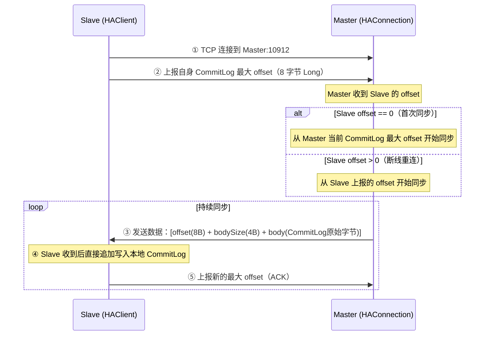

#### 同步复制时 Producer 如何等待

```java
// GroupCommitService — 同步复制等待机制
// Producer 线程写完 Master CommitLog 后:
public void handleHA(AppendMessageResult result, MessageExt msg) {
    if (SYNC_MASTER == this.brokerConfig.getBrokerRole()) {
        HAService service = this.brokerController.getMessageStore().getHaService();
        // 等待 Slave ACK 到 Producer 写入的 offset
        boolean flushOK = service.waitForSlaveAck(
            result.getWroteOffset() + result.getWroteBytes(),
            5000  // 超时 5s（haSlaveTimeout 配置）
        );
        if (!flushOK) {
            // 超时：Slave 没在 5s 内确认 → 返回 SLAVE_NOT_AVAILABLE
            // Producer 收到此状态后可选择重试
        }
    }
}
```

**同步复制超时策略**：
- 默认超时 `haSlaveFallbehindMax = 5s`
- 超时后 Producer 收到 `SLAVE_NOT_AVAILABLE` 状态
- 不会阻塞 Master 写入，只是通知 Producer "Slave 可能丢数据"

#### Slave 追赶机制

```
Slave 落后场景:
  Master CommitLog offset: 100GB
  Slave  CommitLog offset: 95GB（落后 5GB）

追赶过程:
  Slave 上报 offset=95GB → Master 从 95GB 开始批量发送
  每次传输: 32KB 一批（transferBatchSize 默认 32KB）
  网络带宽 1Gbps 时: 追赶 5GB ≈ 40s
```

#### 主从切换

**RocketMQ 4.x**：不支持自动主从切换，需人工介入（运维修改配置 + 重启）。

**RocketMQ 4.5+ Dledger 模式**：基于 Raft 协议实现自动选举

```
DLedger 集群（3 节点）:
  Node-1: Leader (Master)
  Node-2: Follower (Slave)
  Node-3: Follower (Slave)

Leader 宕机 → Follower 触发选举 → 新 Leader 自动升级为 Master
选举耗时: 通常 < 3s
数据安全: Raft 多数派写入 → 已确认的消息不丢
```

| 方案 | 自动切换 | 数据一致性 | 性能开销 | 适用场景 |
|------|---------|-----------|---------|---------|
| 传统 Master-Slave | ❌ 人工 | 异步复制可能丢 | 低 | 对可用性要求不极端 |
| Dledger (Raft) | ✅ 自动 | 多数派确认不丢 | 高（三副本 + Raft 日志） | 金融级可靠性 |

---

## §6 性能关键设计总结

| 设计 | 解决什么问题 | 原理 |
|------|-------------|------|
| **CommitLog 顺序写** | 写吞吐量 | 顺序写磁盘 ≈ 内存速度（600MB/s+） |
| **mmap 内存映射** | 写延迟 | 写消息 = 写内存页，OS 异步刷盘 |
| **ConsumeQueue 定长索引** | 读效率 | 20B 定长 → O(1) 定位 → 页缓存友好 |
| **Page Cache** | 读消息免磁盘 IO | 最近写入的消息在内存中，Consumer 读 = 读内存 |
| **零拷贝（mmap+write）** | 网络传输 | mmap 映射文件到用户态内存 → write 直接从 Page Cache 发送，减少一次内核态到用户态的数据拷贝（注：Kafka 用 sendfile，RocketMQ 用 mmap+write，因为 RocketMQ 有小块数据随机读需求） |
| **长轮询** | 实时性 vs CPU | 不是死循环拉，而是 hold 住等通知 |
| **批量拉取** | 网络 RT 摊销 | 一次拉 32 条，减少网络往返 |
