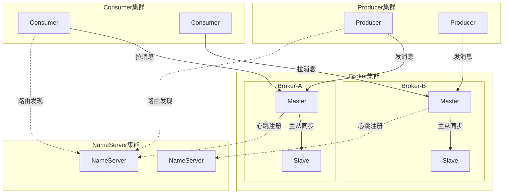
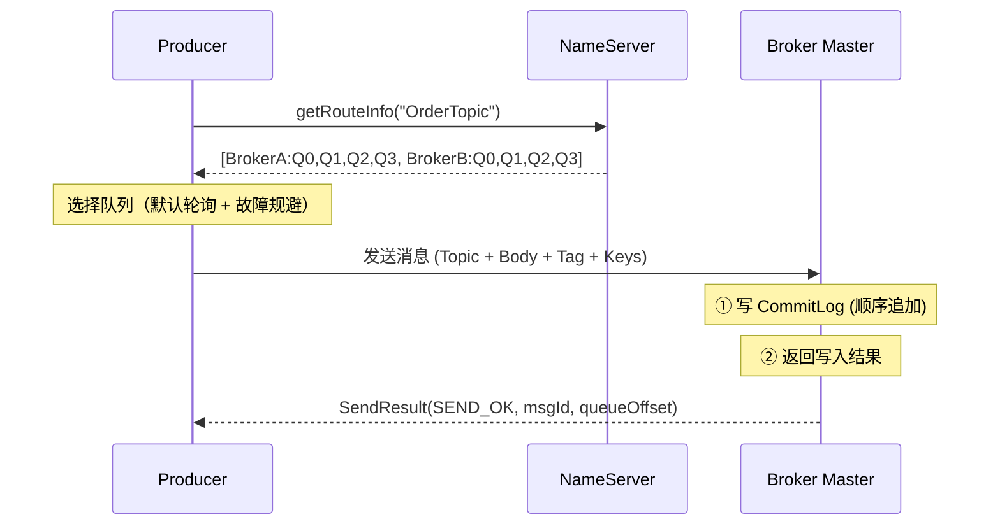
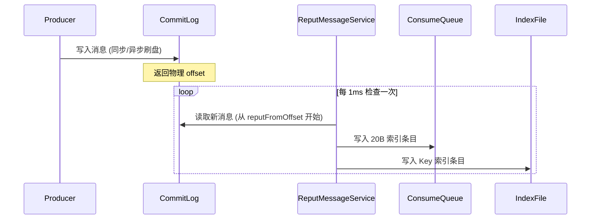
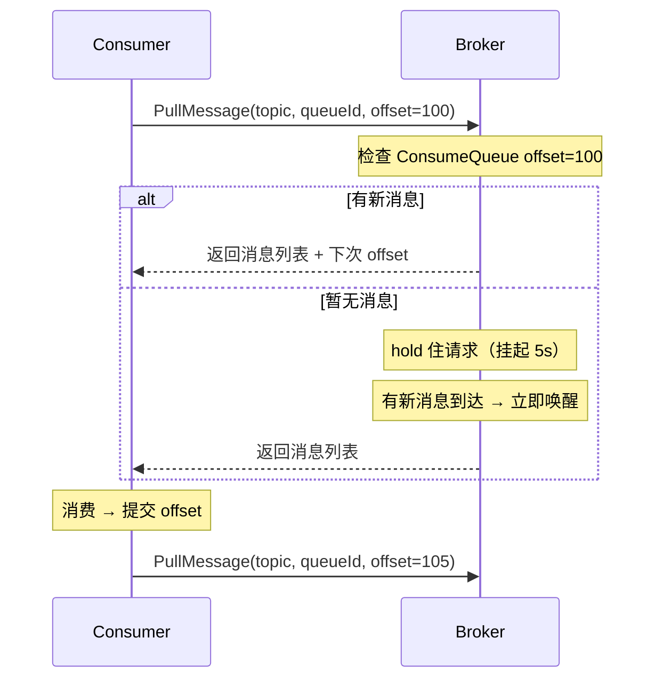
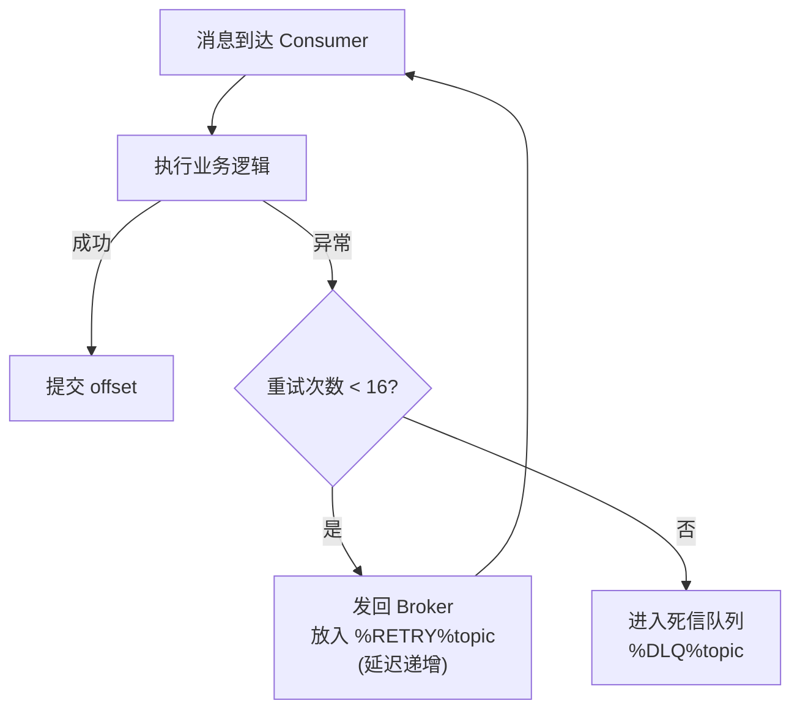
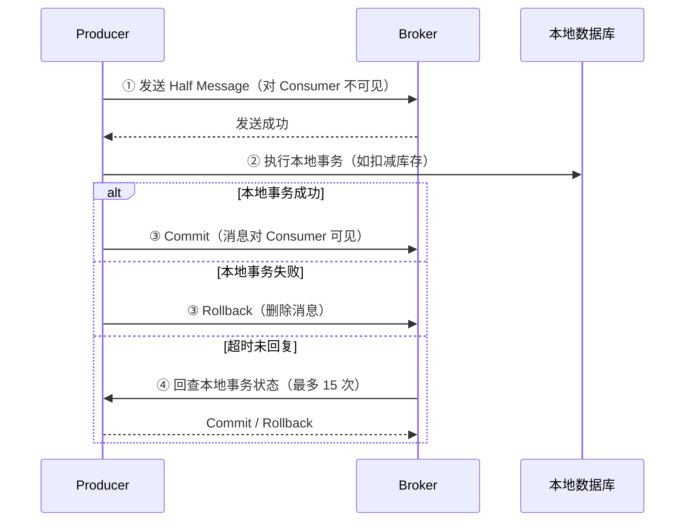

# RocketMQ 底层实现原理

> 最后整理: 2026-05-20 | 来源: 对话讲解

> 关联: [spring-ai](./spring-ai.md) — Java 技术栈

---

## §1 整体架构



**四个角色**：

| 角色 | 职责 | 类比 |
|------|------|------|
| **NameServer** | 路由注册中心（无状态，互不通信） | 简化版 ZooKeeper |
| **Broker** | 消息存储和转发引擎 | 消息仓库 |
| **Producer** | 消息生产者 | 发货方 |
| **Consumer** | 消息消费者 | 收货方 |

**为什么不用 ZooKeeper？** RocketMQ 追求轻量：NameServer 无状态、无选举、无一致性协议。每个 NameServer 独立保存全量路由信息（Broker 每 30s 心跳上报），挂一个不影响其他的。

---

## §2 消息生产（Producer → Broker）

### 2.1 路由发现

```
Producer 启动:
  → 随机连一个 NameServer
  → 请求 Topic 路由信息: GET_ROUTE_INFO_BY_TOPIC
  → 拿到: Topic → [BrokerA-Queue0, BrokerA-Queue1, BrokerB-Queue0, BrokerB-Queue1]
  → 本地缓存，每 30s 刷新一次
```

### 2.2 发送流程



### 2.3 队列选择策略

```java
// 默认：轮询 + Broker 故障规避（latencyFaultTolerance）
int index = sendWhichQueue.getAndIncrement();  // 自增计数器
int queueIndex = Math.abs(index) % queues.size();

// 如果上次发送某 Broker 超时/失败，短时间内规避该 Broker
if (latencyFaultTolerance.isAvailable(brokerName)) {
    return queues.get(queueIndex);
}
```

### 2.4 三种发送模式

| 模式 | 可靠性 | 性能 | 适用场景 |
|------|--------|------|---------|
| **同步发送** | 高（等 ACK） | 中 | 订单、支付 |
| **异步发送** | 中（回调通知） | 高 | 日志、统计 |
| **单向发送** | 低（不等回复） | 最高 | 日志收集、不重要的监控 |

---

## §3 Broker 内部存储（核心！）

这是 RocketMQ 最精华的设计——**CommitLog + ConsumeQueue + IndexFile 三层存储**。

### 3.1 存储架构

```
store/
├── commitlog/           ← 所有消息的物理存储（顺序写）
│   ├── 00000000000000000000   (1GB 一个文件)
│   ├── 00000000001073741824
│   └── ...
├── consumequeue/        ← 逻辑队列索引（消费用）
│   └── OrderTopic/
│       ├── 0/          ← Queue 0
│       │   └── 00000000000000000000  (每条 20 字节定长)
│       ├── 1/
│       └── ...
└── index/               ← 消息 Key 索引（查询用）
    └── 20260520120000   (按时间戳命名)
```

### 3.2 CommitLog：消息的物理存储

**设计核心：所有 Topic 的消息混在一起，顺序追加写。**

```
CommitLog 文件结构（每条消息变长）:
┌──────────────────────────────────────────────────┐
│ MsgLen(4B) │ MagicCode(4B) │ BodyCRC(4B)         │
│ QueueId(4B) │ Flag(4B) │ BornTimestamp(8B)       │
│ BornHost(8B) │ StoreTimestamp(8B)                │
│ StoreHost(8B) │ ReconsumeTimes(4B)               │
│ PreparedTransOffset(8B) │ BodyLength(4B)         │
│ Body(变长) │ TopicLength(1B) │ Topic(变长)        │
│ PropertiesLength(2B) │ Properties(变长)           │
└──────────────────────────────────────────────────┘
```

**为什么所有 Topic 混写？**

→ **顺序写磁盘的吞吐量远高于随机写。** 即使 HDD，顺序写也能达到 600MB/s+，接近内存速度。如果按 Topic 分文件存，消息交替写入不同文件 → 磁头跳来跳去 → 随机写 → 性能崩塌。

**单个 CommitLog 文件大小 = 1GB**，写满后创建新文件，文件名是该文件第一条消息的全局物理偏移量。

### 3.3 ConsumeQueue：逻辑消费索引

**问题**：所有 Topic 消息混在一起，Consumer 怎么只消费自己 Topic 的消息？

**答案**：异步构建 ConsumeQueue——一个轻量级的定长索引。

```
ConsumeQueue 每条记录固定 20 字节:
┌─────────────────────────────────────┐
│ CommitLog Offset (8B)  │  消息在 CommitLog 中的物理偏移量
│ Message Size (4B)      │  消息长度
│ Tag HashCode (8B)      │  用于 Tag 过滤
└─────────────────────────────────────┘
```

**为什么是定长 20B？** → 可以直接通过 `offset * 20` 算出文件中任意一条的物理位置，实现 **O(1) 随机读取**。

**构建流程**：



**ReputMessageService**（异步线程）：
- 不断扫描 CommitLog 中的新消息
- 为每条消息在对应的 `Topic/QueueId/` 下追加一条 20B 索引
- 同时更新 IndexFile（按 Message Key 建的哈希索引，用于消息查询）

### 3.4 写入过程的内存映射（MappedFile）

RocketMQ 不是直接用 `FileOutputStream` 写文件，而是用 **mmap（内存映射文件）**：

```java
// 核心代码简化
MappedByteBuffer mappedByteBuffer = fileChannel.map(
    FileChannel.MapMode.READ_WRITE, 0, fileSize  // 1GB
);

// 写消息 = 写内存（OS 异步刷到磁盘）
mappedByteBuffer.put(messageBytes);
```

**好处**：
- 写消息 = 写内存页，极快
- OS 的 Page Cache 机制自动管理脏页刷盘
- 读消息时如果在 Page Cache 中 → 零拷贝，不走磁盘

### 3.5 刷盘策略

| 策略 | 实现 | 可靠性 | 性能 |
|------|------|--------|------|
| **同步刷盘** | 每条消息写完 → `force()` | 极高（断电不丢） | 低（受限于磁盘 IOPS） |
| **异步刷盘**（默认） | 后台线程每 500ms 批量 flush | 可能丢最近几百ms | 高 |

生产环境通常：**异步刷盘 + 主从同步** → 兼顾性能和可靠性。

---

## §4 消息消费（Consumer ← Broker）

### 4.1 两种消费模式

| 模式 | 特点 | 适用场景 |
|------|------|---------|
| **Push 模式**（实际是长轮询） | Broker hold 住请求，有消息立刻返回 | 99% 的场景 |
| **Pull 模式** | Consumer 主动拉，自己控制节奏 | 大数据批处理 |

**Push 的本质是长轮询（Long Polling）**，不是真的 Broker 主动推：



### 4.2 Consumer 负载均衡（Rebalance）

**问题**：一个 Topic 有 8 个 Queue，4 个 Consumer 实例，怎么分配？

```
Topic: OrderTopic
  Queue: [Q0, Q1, Q2, Q3, Q4, Q5, Q6, Q7]

ConsumerGroup: order-service
  Instances: [C1, C2, C3, C4]

默认分配算法（AllocateMessageQueueAveragely）:
  C1 → [Q0, Q1]
  C2 → [Q2, Q3]
  C3 → [Q4, Q5]
  C4 → [Q6, Q7]
```

**触发 Rebalance 的条件**：
- Consumer 数量变化（上线/下线/宕机）
- Queue 数量变化（扩容）
- 每 20s 定时检查一次

**关键约束：一个 Queue 在同一个 ConsumerGroup 内只能被一个 Consumer 消费。** 所以 Consumer 实例数 > Queue 数时，多余的 Consumer 会闲置。

### 4.3 消费位点（Offset）管理

```
广播模式: offset 存本地文件 (consumer 各自维护)
集群模式: offset 存 Broker (RemoteBrokerOffsetStore)
         → Broker 内存 Map + 定期持久化到 consumerOffset.json
```

**消费流程**：
1. Consumer 拉消息（带当前 offset）
2. 消费业务逻辑
3. 消费成功 → 提交新 offset 到 Broker
4. 消费失败 → 不提交 → 下次重新拉到这条（至少一次语义）

### 4.4 消费失败与重试



**重试延迟递增表**（对应 delayLevel 3~18）：

| 重试次数 | 延迟 | 重试次数 | 延迟 |
|---------|------|---------|------|
| 1 | 10s | 9 | 7min |
| 2 | 30s | 10 | 8min |
| 3 | 1min | 11 | 9min |
| 4 | 2min | 12 | 10min |
| 5 | 3min | 13 | 20min |
| 6 | 4min | 14 | 30min |
| 7 | 5min | 15 | 1h |
| 8 | 6min | 16 | 2h |

超过 16 次 → 进入 **死信队列（DLQ）**：`%DLQ%ConsumerGroup`，需要人工介入处理。

---

## §5 关键机制补充

### 5.1 消息过滤

```
两级过滤:
  第一级: Broker 端 — ConsumeQueue 中的 Tag HashCode 过滤（高效，在索引层过滤）
  第二级: Consumer 端 — 拉到消息后精确比对 Tag 字符串（防 hash 碰撞）
```

### 5.2 事务消息（Half Message）



**Half Message 存储**：内部转存到 `RMQ_SYS_TRANS_HALF_TOPIC`，Commit 后才把真实 ConsumeQueue 索引建好。

### 5.3 延迟消息

RocketMQ 不支持任意延迟时间，只支持 **18 个固定延迟级别**：

```
1s 5s 10s 30s 1m 2m 3m 4m 5m 6m 7m 8m 9m 10m 20m 30m 1h 2h
```

**实现**：
1. Producer 设置 `delayLevel=3`（对应 10s）
2. Broker 收到后不放真实 Topic，而是转存到 `SCHEDULE_TOPIC_XXXX`
3. 定时线程每秒扫描到期消息 → 恢复原 Topic → Consumer 才能消费到

### 5.4 主从同步

| 模式 | 实现 | 数据安全 | 性能 |
|------|------|---------|------|
| **同步复制** | Master 等 Slave 写完才返回 ACK | 高 | 低（多一次网络 RT） |
| **异步复制**（默认） | Master 写完立即返回，Slave 异步追 | 中（切换可能丢） | 高 |

---

## §6 性能关键设计总结

| 设计 | 解决什么问题 | 原理 |
|------|-------------|------|
| **CommitLog 顺序写** | 写吞吐量 | 顺序写磁盘 ≈ 内存速度（600MB/s+） |
| **mmap 内存映射** | 写延迟 | 写消息 = 写内存页，OS 异步刷盘 |
| **ConsumeQueue 定长索引** | 读效率 | 20B 定长 → O(1) 定位 → 页缓存友好 |
| **Page Cache** | 读消息免磁盘 IO | 最近写入的消息在内存中，Consumer 读 = 读内存 |
| **零拷贝（mmap+write）** | 网络传输 | mmap 映射文件到用户态内存 → write 直接从 Page Cache 发送，减少一次内核态到用户态的数据拷贝（注：Kafka 用 sendfile，RocketMQ 用 mmap+write，因为 RocketMQ 有小块数据随机读需求） |
| **长轮询** | 实时性 vs CPU | 不是死循环拉，而是 hold 住等通知 |
| **批量拉取** | 网络 RT 摊销 | 一次拉 32 条，减少网络往返 |
