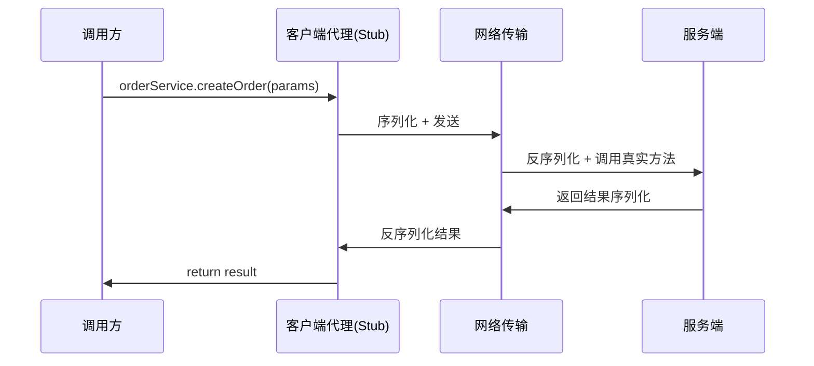
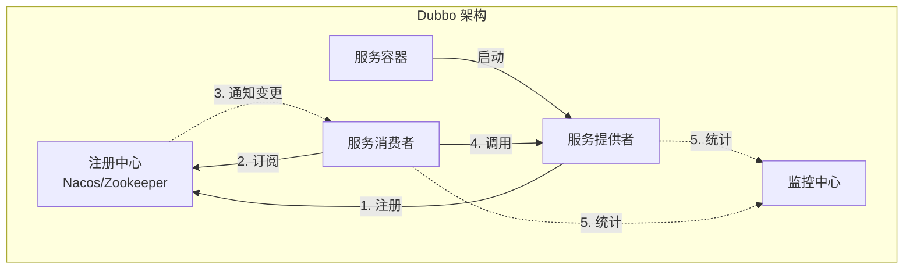
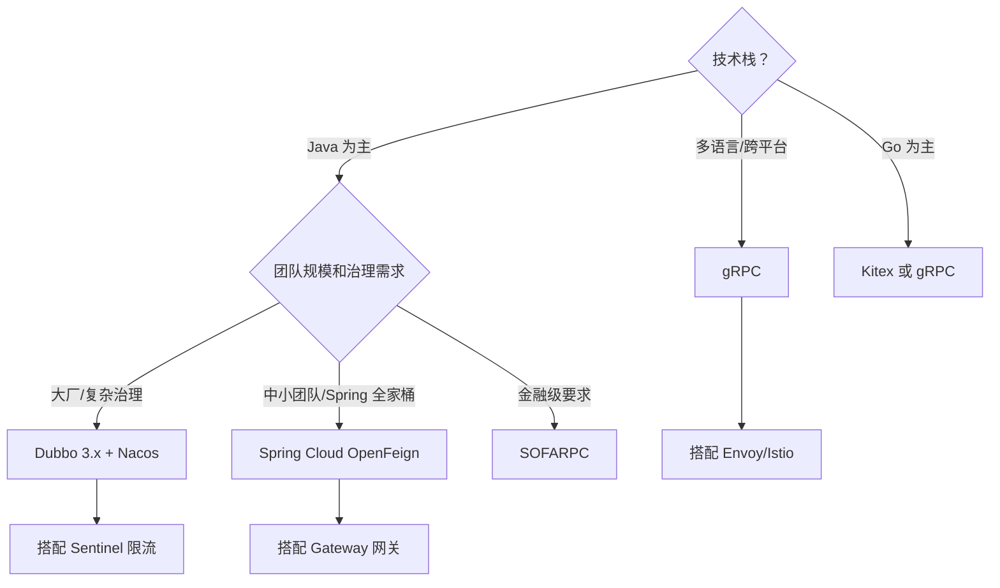

> 最后整理: 2026-05-21 | 来源: AI 对话自动沉淀

## 2026-05-21 - RPC 本质与 Dubbo 深度解析

### RPC 是什么？一图胜千言

RPC = 让调用远程服务像调用本地方法一样简单。



代码里写 `orderService.createOrder(params)`，感觉像调本地方法，背后其实走了：代理 → 序列化 → 网络传输 → 反序列化 → 执行 → 原路返回。

---

### Dubbo 核心架构（五大角色）



| 角色 | 职责 |
|------|------|
| **Provider** | 暴露服务，启动时注册到注册中心 |
| **Consumer** | 订阅服务，从注册中心拿到 Provider 地址列表后直连调用 |
| **Registry** | 注册中心（Nacos/ZK），负责服务发现 |
| **Monitor** | 统计调用次数、耗时 |
| **Container** | Spring 容器，管理服务生命周期 |

### Dubbo 调用链路（一次 RPC 发生了什么）

```
Consumer 发起调用
  → Proxy（透明代理，JDK/Javassist）
    → Filter 链（限流、熔断、日志等，SPI 扩展）
      → Cluster（容错策略：Failover/Failfast/Failsafe）
        → LoadBalance（负载均衡：Random/RoundRobin/LeastActive/ConsistentHash）
          → Protocol（协议层：dubbo/triple/rest）
            → 序列化（Hessian2/Protobuf/JSON）
              → Netty 传输
                → Provider 端反向执行
```

### Dubbo 核心特性速查

| 特性 | 说明 |
|------|------|
| **协议** | Dubbo 协议（私有 TCP）、Triple（兼容 gRPC）、REST |
| **序列化** | Hessian2（默认）、Protobuf、Kryo、JSON |
| **注册中心** | Nacos（推荐）、Zookeeper、Redis、Consul |
| **负载均衡** | Random（加权随机）、RoundRobin、LeastActive（最少活跃）、ConsistentHash |
| **容错策略** | Failover（默认，重试其他节点）、Failfast（快速失败）、Failsafe（安全失败）、Forking（并行调用）|
| **SPI 扩展** | 几乎所有组件可通过 SPI 替换（Dubbo 自己的 SPI，非 JDK SPI）|
| **服务治理** | 限流、熔断、降级、灰度路由、动态配置 |
| **Triple 协议** | Dubbo 3.x 主推，兼容 gRPC，支持 Stream 流式调用 |

### Dubbo 3.x vs 2.x 关键变化

| 维度 | Dubbo 2.x | Dubbo 3.x |
|------|-----------|-----------|
| **服务发现** | 接口级（每个接口一条注册信息）| 应用级（一个应用一条，减少注册中心压力）|
| **协议** | dubbo 协议为主 | Triple（兼容 gRPC）为主推 |
| **云原生** | 不支持 | 支持 Kubernetes、Service Mesh、xDS |
| **流式调用** | 不支持 | 支持 Server/Client/Bi-directional Stream |

---

## 2026-05-21 - 主流 RPC 框架横评

### 全景对比表

| 框架 | 出品方 | 协议 | 语言 | 服务发现 | 特点 |
|------|--------|------|------|---------|------|
| **Dubbo** | Apache/阿里 | dubbo/triple/rest | Java 为主 | Nacos/ZK | 国内生态最强，SPI 扩展拉满 |
| **gRPC** | Google | HTTP/2 + Protobuf | 多语言全平台 | 无内置 | 跨语言首选，性能强，治理弱 |
| **OpenFeign** | Spring | HTTP/REST + JSON | Java | Eureka/Nacos | 开发体验好，性能一般 |
| **Thrift** | Apache/Facebook | 自有二进制 | 多语言 | 无内置 | 老牌跨语言，用的人越来越少 |
| **SOFARPC** | 蚂蚁金服 | bolt/triple | Java | SOFARegistry | 金融级，蚂蚁内部验证 |
| **Motan** | 新浪微博 | motan2 | Java/Go | ZK/Consul | 轻量 |
| **Kitex** | 字节跳动 | Thrift/Protobuf | Go | 内部发现 | Go 生态性能怪兽 |
| **Tars** | 腾讯 | tars 协议 | C++/Java/Go/Node | 内置 | 腾讯大规模使用 |

### 选型决策树



### 性能参考（单机 8C16G）

| 框架 | 协议 | 序列化 | QPS 参考 | 延迟 P99 |
|------|------|--------|---------|----------|
| Dubbo (triple) | HTTP/2 | Protobuf | ~50K-80K | ~2-5ms |
| gRPC | HTTP/2 | Protobuf | ~50K-80K | ~2-5ms |
| Dubbo (dubbo) | TCP 私有 | Hessian2 | ~80K-120K | ~1-3ms |
| OpenFeign | HTTP/1.1 | JSON | ~10K-20K | ~5-15ms |
| Kitex (Go) | TCP | Thrift | ~100K-200K | ~0.5-2ms |

**性能规律**：TCP 私有协议 > HTTP/2 > HTTP/1.1；Protobuf > Hessian2 > JSON。但 HTTP/2（triple/gRPC）是趋势——兼容云原生基础设施。

### 实战选型建议（2024-2026）

1. **Java + 有规模** → Dubbo 3.x + Triple + Nacos（阿里验证，Triple 兼容 gRPC 可扩展多语言）
2. **Java + 中小团队** → Spring Cloud + OpenFeign + Nacos（学习成本低，瓶颈通常在 DB 不在 RPC）
3. **跨语言** → gRPC + Protobuf（需自建治理或用 Istio）
4. **极致性能** → Dubbo dubbo 协议 或 Kitex（Go）

> 关联: ./distributed-transaction.md | ./rocketmq-internals.md
