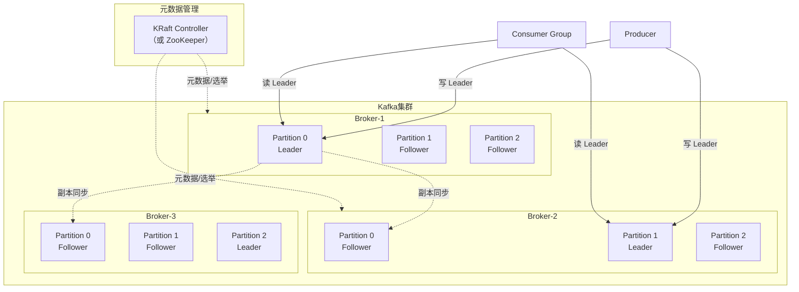
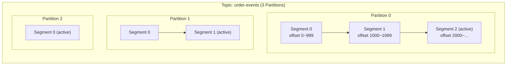
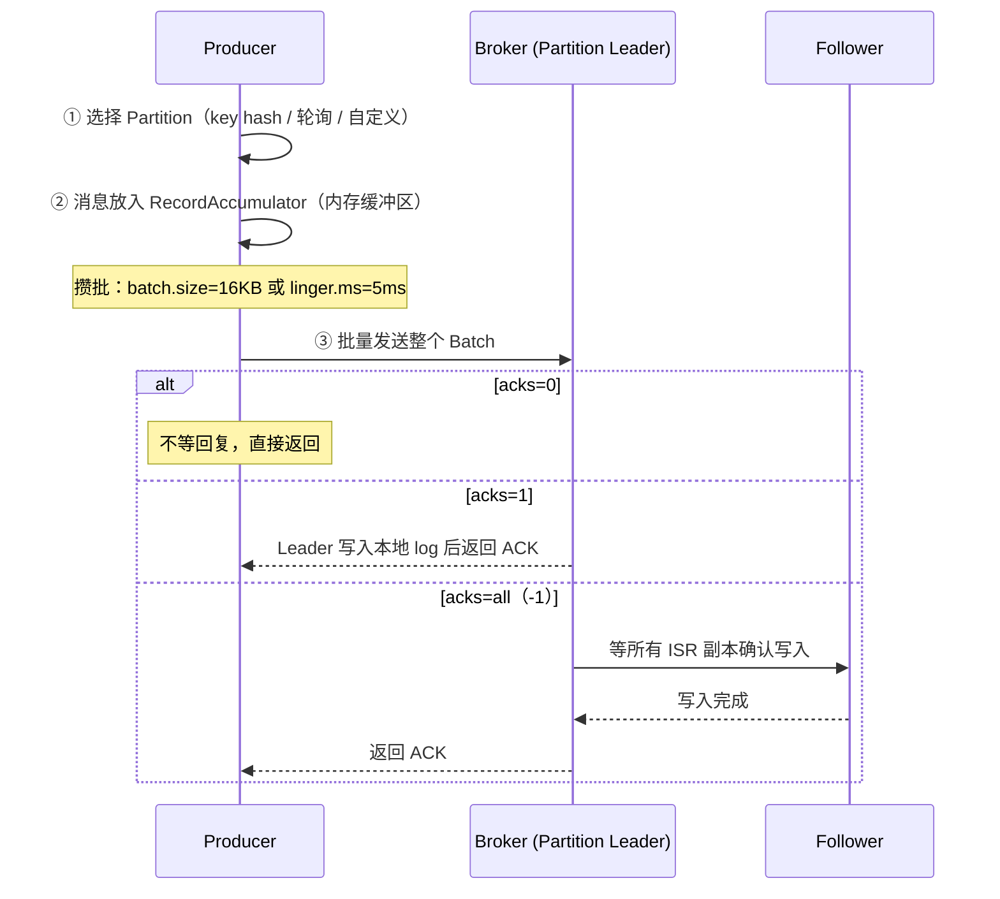
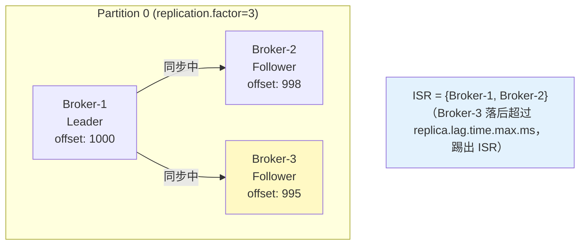
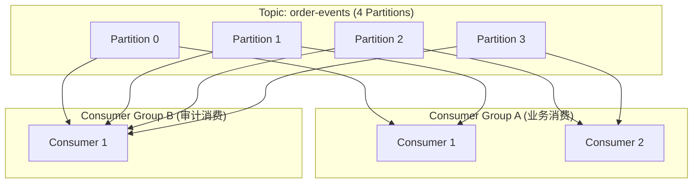
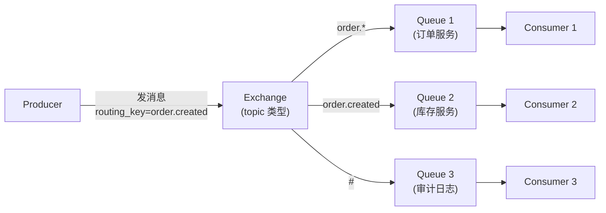
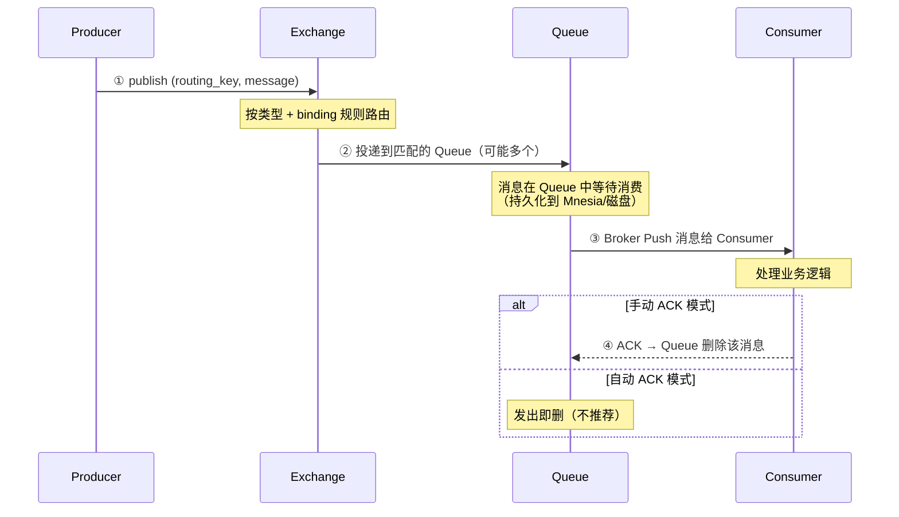
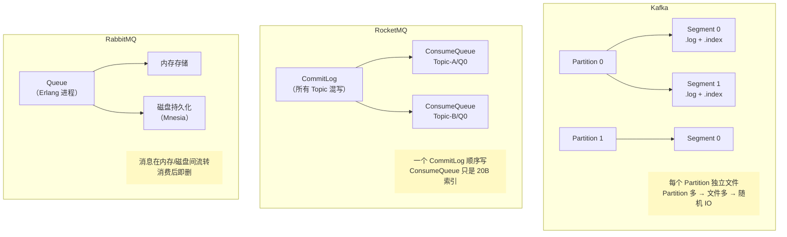

# 主流消息队列对比与选型

> 最后整理: 2026-06-08 | 来源: 对话讲解

> 关联: [RocketMQ 底层实现原理](<./RocketMQ 底层实现原理.md>) — RocketMQ 全链路深度解析

---

## §1 核心认知：三种 MQ 是三种不同的"世界观"

| MQ | 一句话定位 | 本质隐喻 |
|-----|-----------|---------|
| **Kafka** | 分布式日志 | 一本只能追加的、可重放的日记本 |
| **RocketMQ** | 业务消息总线 | 一个懂业务语义的可靠快递公司 |
| **RabbitMQ** | 消息路由器 | 一个灵活的、实时的电话交换机 |

**理解这一层差异，所有选型答案自然涌现。**

```
              Kafka           RocketMQ          RabbitMQ
设计哲学:     记录事实         投递指令          路由信号
消息身份:     日志中的一行     待投递的包裹      待路由的信号
消费者角色:   自己翻日记本     等快递送上门      等电话接进来
堆积态度:     正常（日志就该积）尽量投递完       异常（不该积）
功能复杂度:   最简             最重             中等
```

---

## §2 Kafka 工作原理

### 2.1 整体架构



**四个核心概念**：

| 概念 | 说明 | 类比 |
|------|------|------|
| **Broker** | Kafka 服务节点，存储消息 | 图书馆的一栋楼 |
| **Topic** | 消息的逻辑分类 | 图书馆的一个书架 |
| **Partition** | Topic 的物理分片，是并行度的基本单位 | 书架上的一层 |
| **Replica** | Partition 的副本（1 Leader + N Follower） | 每层书有多份复印件 |

**与 RocketMQ 的术语映射**：

| Kafka | RocketMQ | 本质 |
|-------|----------|------|
| Partition | Queue (ConsumeQueue) | 消费并行度单位 |
| Segment 文件 | CommitLog 文件 | 物理存储文件 |
| KRaft / ZooKeeper | NameServer | 元数据管理 |
| Consumer Group | ConsumerGroup | 消费者组 |
| ISR (In-Sync Replicas) | Master-Slave 同步复制 | 数据冗余机制 |

### 2.2 存储模型：Partition = 一本 append-only 的日记

**这是 Kafka 和 RocketMQ 最根本的架构差异。**

```
RocketMQ:
  所有 Topic 的消息 → 混写到一个 CommitLog → 再异步建 ConsumeQueue 索引
  （一个 Broker 一个 CommitLog 文件序列）

Kafka:
  每个 Partition → 独立的日志文件（Segment）
  （一个 Broker 上有 N 个 Partition，每个 Partition 一组文件）
```



**每个 Partition 目录下的文件结构**：

```
/data/kafka-logs/order-events-0/       ← Partition 0
├── 00000000000000000000.log           ← 消息数据文件（Segment）
├── 00000000000000000000.index         ← 稀疏偏移量索引
├── 00000000000000000000.timeindex     ← 时间戳索引
├── 00000000000000001000.log           ← 第二个 Segment（从 offset=1000 开始）
├── 00000000000000001000.index
├── 00000000000000001000.timeindex
└── leader-epoch-checkpoint
```

**与 RocketMQ 存储对比**：

| 维度 | Kafka | RocketMQ |
|------|-------|----------|
| 写入模式 | 每个 Partition 独立顺序写 | 所有 Topic 混写一个 CommitLog |
| Topic 数对写性能影响 | **大**（Topic 多 → Partition 多 → 多文件并发写 → 磁盘随机 IO） | **小**（始终是一个 CommitLog 顺序写） |
| 索引 | 稀疏索引（每隔 N 条建一条） | 全量索引（ConsumeQueue 每条 20B） |
| 消费定位 | 二分查找 Segment → 稀疏索引定位 | ConsumeQueue `offset * 20` 直接算（O(1)） |

**关键设计差异的工程后果**：

```
Kafka 的 Partition 独立存储:
  ✅ 优点: Partition 可独立迁移、独立扩缩、独立设置副本数
  ❌ 缺点: Topic/Partition 数过多时（>数千），退化为随机写

RocketMQ 的 CommitLog 混写:
  ✅ 优点: 无论多少 Topic，写入始终是一个文件顺序追加
  ❌ 缺点: 需要额外维护 ConsumeQueue 索引，Queue 无法独立迁移
```

**经验值**：单个 Kafka Broker 上 Partition 数超过 **几千个**时性能开始下降；RocketMQ 可以轻松承载 **数万个 Queue**（因为写入不受影响，只是多了索引文件）。

### 2.3 Producer 发送机制



**Kafka Producer 的三种 acks 策略**：

| acks | 含义 | 丢消息风险 | 吞吐量 | 适用场景 |
|------|------|-----------|--------|---------|
| **0** | 发了就忘，不等回复 | 高 | 最高 | 日志采集、监控打点 |
| **1** | Leader 写入就返回 | 中（Leader 挂了未同步的消息丢失） | 高 | 一般业务 |
| **all (-1)** | ISR 全部写入才返回 | 极低（除非 ISR 全挂） | 低 | 金融、订单 |

**与 RocketMQ 对比**：

```
Kafka 的 acks=all ≈ RocketMQ 的 SYNC_MASTER（同步复制）
Kafka 的 acks=1   ≈ RocketMQ 的 ASYNC_MASTER（异步复制）
Kafka 的 acks=0   ≈ RocketMQ 的 oneway 发送
```

**Kafka 独有的核心特性——攒批发送（Batching）**：

```
Producer 不是一条条发，而是先攒到内存:
  RecordAccumulator（按 Partition 分桶攒消息）
    → 满足 batch.size (16KB) 或 linger.ms (5ms) → 整批发送

为什么 RocketMQ 没有这个？
  RocketMQ 面向业务消息 → 强调单条可靠投递 + 低延迟
  Kafka 面向日志/事件流 → 吞吐优先，攒批摊薄网络 RT
```

### 2.4 ISR 机制（In-Sync Replicas）

这是 Kafka 高可用的核心，对标 RocketMQ 的主从同步。



**ISR 动态伸缩规则**：

```
ISR = 与 Leader 保持同步的副本集合（包含 Leader 自身）

踢出条件: Follower 在 replica.lag.time.max.ms（默认 30s）内
          没有向 Leader 发起 fetch 请求 → 踢出 ISR

重新加入: Follower 追上 Leader 的 LEO（Log End Offset）→ 重新加入 ISR
```

**ISR 与 RocketMQ 主从的本质区别**：

| 维度 | Kafka ISR | RocketMQ Master-Slave |
|------|-----------|----------------------|
| 副本数 | 可配（通常 3） | 固定 2（一主一从） |
| 副本角色 | Leader + Follower（动态选举） | Master + Slave（静态配置，4.x 无自动切换） |
| 写入确认 | acks=all 需 ISR **全部**确认 | SYNC_MASTER 只需 **1 个** Slave 确认 |
| 自动切换 | **Controller 自动从 ISR 中选新 Leader** | 4.x 需人工；Dledger 模式支持 Raft 选举 |
| 数据一致性 | ISR + min.insync.replicas 保证 | 取决于同步/异步复制配置 |

**关键参数组合（Kafka 数据安全的"铁三角"）**：

```
acks=all                    → Producer 等所有 ISR 确认
min.insync.replicas=2       → ISR 中至少 2 个副本才允许写入
replication.factor=3        → 总共 3 个副本

效果: 任意 1 个 Broker 挂 → 不丢消息，自动切换 Leader
     2 个 Broker 同时挂 → 不可写入（ISR < min.insync），但不丢已写入的数据
```

### 2.5 Consumer Group 与消费模型



**Kafka 与 RocketMQ 消费模型对比**：

| 维度 | Kafka | RocketMQ |
|------|-------|----------|
| 消费进度存储 | `__consumer_offsets` 内部 Topic（Broker 端） | Broker 内存 + 定期持久化 `consumerOffset.json` |
| 消费模式 | **纯 Pull**（Consumer 主动拉） | **长轮询**（表面 Push 实际 Pull，Broker 会 hold 请求 5s） |
| Rebalance 触发 | Consumer 加入/离开、Partition 变化、心跳超时 | 每 20s 定时检查 + Consumer 变化 |
| 消费失败处理 | **无内置重试**，Consumer 自己决定（提交 offset 或不提交） | 自动重试 16 次 → 死信队列 |
| 消息回溯 | **随时可回溯**（重置 offset 到任意位置或时间点） | 可按时间重置，但功能较简单 |

**Kafka 消费失败处理——为什么没有重试队列？**

```
Kafka 的设计哲学: 我是日志，不是快递公司
  → "消息"是"已发生的事实"，不需要"重新投递"
  → 消费失败 = 你的问题，不是 Kafka 的问题
  → Consumer 自己决定：跳过 / 重试 / 写入独立的 error topic

RocketMQ 的设计哲学: 我是快递公司，投递是我的职责
  → 消费失败 = 派送失败 → 退回仓库（%RETRY% topic）→ 重新派送
  → 超过 16 次 → 死信仓库（%DLQ% topic）→ 人工处理
```

### 2.6 Kafka 为什么吞吐量最高

```
四板斧（缺一不可）:

① 批量发送 (Batching)
   Producer 攒批 → 一次网络 IO 发 16KB~1MB 消息
   RocketMQ: 单条发送为主

② 真·零拷贝 (sendfile)
   Broker 读磁盘发网络: 磁盘 → Page Cache → Socket Buffer → 网卡
   CPU 拷贝次数 = 0（全部 DMA）
   RocketMQ: mmap + write，CPU 拷贝 1 次（用户态到 socket buffer）

③ Partition 级并行
   每个 Partition 独立读写 → Consumer 数 = Partition 数 = 并发度
   RocketMQ 也是 Queue 级并行，但 CommitLog 混写在高 Topic 数下更有优势

④ 消息压缩
   Producer 端压缩整个 Batch（snappy / lz4 / zstd）
   Broker 直接存压缩数据 → 不解压 → Consumer 端解压
   RocketMQ: 默认不压缩（可配但不常用）

结果: 单集群百万 TPS（vs RocketMQ 十万级、RabbitMQ 万级）
```

---

## §3 RabbitMQ 工作原理

### 3.1 AMQP 模型

RabbitMQ 基于 AMQP 协议，核心概念是 **Exchange + Binding + Queue** 三层路由模型。



**这是 RabbitMQ 与 Kafka/RocketMQ 最本质的区别——消息路由是 Broker 侧的核心能力。**

| Exchange 类型 | 路由规则 | 典型场景 |
|--------------|---------|---------|
| **direct** | routing_key 精确匹配 | 一对一任务派发 |
| **topic** | routing_key 通配符匹配（`*` 单词 / `#` 多词） | 事件分类订阅 |
| **fanout** | 广播到所有绑定的 Queue | 全局通知 |
| **headers** | 按消息 header 属性匹配 | 少用 |

**Kafka/RocketMQ 没有 Exchange 概念**——Producer 直接写 Topic/Partition，路由逻辑在 Producer 端完成。RabbitMQ 把路由逻辑放在 Broker 端，更灵活但也更重。

### 3.2 消息生命周期



**关键差异——消费即删**：

```
Kafka:   消息消费后仍保留（保留策略：7天 / 容量上限 / compact）
         → 可以反复回溯消费
RocketMQ: 消息消费后保留（默认 48h，由 fileReservedTime 配置）
         → 可以按时间回溯
RabbitMQ: 消费 ACK 后立即从 Queue 中删除
         → 不可回溯（无日志概念）
```

### 3.3 存储与性能特征

```
RabbitMQ 存储:
  ├─ 内存 Queue（默认）: 消息尽量放内存 → 超快，但内存有限
  ├─ 持久化 Queue:      声明 durable + 消息 deliveryMode=2 → 写 Mnesia/磁盘
  └─ Lazy Queue (3.6+):  消息直接写磁盘，不经内存 → 适合大堆积（但违背设计初衷）

性能瓶颈:
  单 Queue = 单 Erlang 进程 = 单线程
  → 单 Queue 吞吐量上限 ~5 万/s
  → 多 Queue 可水平扩展，但路由和绑定关系会变复杂
```

**为什么 RabbitMQ 不适合大量堆积？**

```
消息堆积时发生的事:
  ① 内存 Queue → 内存耗尽 → 触发 flow control（限流 Producer）
  ② 消息被 page out 到磁盘 → 读写性能断崖式下降
  ③ Erlang VM 的 GC 被大量消息对象拖慢

Kafka/RocketMQ 为什么不怕堆积:
  → 消息始终在磁盘（顺序写），Page Cache 加速热消息读取
  → 消费慢只是 offset 不推进，对 Broker 没有额外压力
```

### 3.4 高可用：镜像队列与 Quorum Queue

```
经典 HA（3.8 之前主流）:
  镜像队列（Mirrored Queue）
    → 所有消息同步到集群中的镜像节点
    → Master 挂了 → 自动选新 Master
    → 问题: 同步全量数据，网络开销大，脑裂时可能丢消息

现代 HA（3.8+ 推荐）:
  Quorum Queue（基于 Raft 协议）
    → 多数派写入确认 → 不丢消息
    → 类似 Kafka ISR + min.insync.replicas 的效果
    → 性能比镜像队列差一些，但一致性更强
```

---

## §4 三者架构深度对比

### 4.1 存储架构对比



### 4.2 全维度对比表

| 维度 | Kafka | RocketMQ | RabbitMQ |
|------|-------|----------|----------|
| **开发语言** | Scala + Java | Java | Erlang |
| **协议** | 自定义二进制 | 自定义二进制 | AMQP 0-9-1 |
| **元数据管理** | KRaft（新）/ ZooKeeper（旧） | NameServer（无状态，极简） | Erlang 集群 + Mnesia DB |
| **写入模型** | 每 Partition 独立顺序写 | 单 CommitLog 全局顺序写 | 队列进程内存/磁盘 |
| **消息索引** | 稀疏索引（二分查找） | 全量索引（O(1) 定位） | 无（队列内顺序消费） |
| **网络传输** | sendfile 零拷贝 | mmap + write（1 次 CPU 拷贝） | Erlang 消息传递 |
| **消息保留** | 按时间/容量保留，消费后不删 | 默认保留 48h，消费后不删 | 消费 ACK 后即删 |
| **消息回溯** | ✅ 任意 offset / 时间点 | ✅ 按时间点 | ❌ 不支持 |
| **消息路由** | Producer 端（Partitioner） | Producer 端（MessageQueueSelector） | **Broker 端（Exchange）** |
| **事务消息** | 有（Exactly-Once 语义，较复杂） | 有（Half Message，实用性强） | 有（TX 模式，性能极差） |
| **延迟消息** | ❌ 原生不支持 | ✅ 18 级固定延迟（5.x 支持任意） | ✅ TTL + 死信 Exchange 实现 |
| **消费失败重试** | ❌ 无内置机制 | ✅ 16 次递增重试 + 死信队列 | ✅ Nack + 死信 Exchange |
| **顺序消息** | ✅ Partition 内有序 | ✅ Queue 内有序 + 分布式锁 | ✅ 单 Queue 天然有序 |
| **消息堆积** | TB 级，无性能影响 | TB 级，无性能影响 | **百万级即性能断崖** |
| **单机吞吐** | 百万 TPS | 十万 TPS | 万 TPS |
| **端到端延迟** | ms ~ 百 ms（攒批代价） | ms 级 | **μs ~ ms（最低）** |
| **自动故障切换** | ✅ Controller 自动选 Leader | ❌ 4.x 人工 / Dledger 自动 | ✅ 镜像队列 / Quorum Queue |
| **运维复杂度** | 高（KRaft/ZK + 分区 + ISR） | 中（NameServer 无状态，简单） | 中（Erlang 集群管理） |

### 4.3 高可用策略对比

| 维度 | Kafka | RocketMQ | RabbitMQ |
|------|-------|----------|----------|
| 副本机制 | ISR 动态副本集 | Master-Slave（或 Dledger Raft） | 镜像队列 / Quorum Queue |
| 写入确认 | acks=all → ISR 全部确认 | SYNC_MASTER → 1 个 Slave 确认 | Publisher Confirm → 持久化完成确认 |
| 自动选主 | ✅ Controller 从 ISR 选 | ❌ 4.x 需人工 / Dledger ✅ | ✅ 自动 |
| 脑裂防护 | min.insync.replicas | 无（依赖 NameServer 路由摘除） | Quorum Queue（Raft 多数派） |
| Broker 宕机影响 | 该 Broker 上的 Leader Partition 自动切换到 Follower | 该 Broker 的 Queue 暂停（有 Slave 可读） | 该节点的 Queue Master 切换到镜像 |

---

## §5 选型决策

### 5.1 只需回答 3 个核心问题

**问题 1：消息是"事件流"还是"业务指令"？**

| 类型 | 特征 | 选择 |
|------|------|------|
| 事件流 | 记录已发生的事实，可重放，消费者自行决定处理方式 | Kafka |
| 业务指令 | 触发下游执行动作，必须可靠投递，失败要重试 | RocketMQ |

**问题 2：消费者处理不过来时，期望什么行为？**

| 期望 | 选择 |
|------|------|
| 堆积等待，恢复后从断点继续 | Kafka / RocketMQ |
| 立即通知 + 快速失败 | RabbitMQ |
| 延迟后自动重试 | RocketMQ |

**问题 3：你能容忍消息丢失或乱序吗？**

| 要求 | 选择 |
|------|------|
| 绝对不能丢 + 必须有序 | RocketMQ（同步刷盘+同步复制+顺序消息） |
| 不能丢但可乱序 | Kafka（多副本 ISR）/ RocketMQ |
| 允许极低概率丢失 | 三者都行（异步模式） |

### 5.2 决策树

```
需要 MQ →
  ├─ 日志/大数据/流计算 → Kafka（唯一选择）
  ├─ 业务系统可靠消息 →
  │   ├─ 需要事务消息 → RocketMQ（唯一选择）
  │   ├─ 需要延迟/顺序/重试 → RocketMQ（最佳）
  │   └─ 普通异步解耦 → 三者都行，看团队栈
  └─ 实时推送/极低延迟/灵活路由 → RabbitMQ
```

### 5.3 选型陷阱

| 陷阱 | 本质 |
|------|------|
| "Kafka 万能" | 它是日志系统，不是业务消息中间件；无内置重试/延迟/死信 |
| "RabbitMQ 够用" | 堆积是硬伤，日消息量过亿必崩 |
| "追求高吞吐" | 大部分系统日消息 <1 亿，不需要 Kafka 的吞吐天花板 |
| "忽略运维成本" | Kafka 的 ZK/KRaft + 分区 + ISR 运维成本最高 |
| "忽略消息丢失" | 异步模式 = 宕机可能丢数据，金融场景必须同步 |
| "只看功能不看团队" | Erlang 的 RabbitMQ 出问题时 Java 团队很难排查 |
