# 分布式事务全景

> 最后整理: 2026-07-07 | 来源: 对话讲解

> 关联: [rocketmq-internals](<./RocketMQ 底层实现原理.md>) — 事务消息是分布式事务方案之一 | [rpc-dubbo-comparison](<./Dubbo 与 RPC 框架横评.md>) — 分布式服务调用的 RPC 层

---

## §1 为什么会遇到分布式事务？

单体应用时代，一个数据库连接 + `@Transactional` 就能搞定一切。但当你面对以下场景时，本地事务失效了：

| 场景 | 典型例子 |
|------|----------|
| **跨服务调用** | 订单服务扣库存 + 支付服务扣款，两个独立 DB |
| **分库分表** | 同一业务表按 userId 分到不同物理库，跨库更新 |
| **分布式数据库（DRDS/PolarDB-X）** | SQL 路由到不同 DN（数据节点），底层自动拆分 |
| **异构系统交互** | MySQL + Redis + ES + MQ 多存储介质需要一致 |

**核心矛盾**：CAP 定理告诉我们，分布式环境下不可能同时满足强一致性 + 可用性 + 分区容错性。所以分布式事务的本质是 **在一致性和可用性之间做 trade-off**。

---

## §2 理论基础：两个阵营

```
强一致（CP）                     最终一致（AP）
─────────────────────────────────────────────────
2PC / 3PC / XA                  TCC / Saga / 本地消息表 / 事务消息

特点：                           特点：
- 同步阻塞，等所有参与者        - 异步补偿，允许中间状态
- 性能差，但逻辑简单            - 性能好，但业务侵入大
- 适合：金融转账等0容忍场景      - 适合：电商、物流等大部分互联网场景
```

**黄金法则**：能用最终一致就不用强一致。互联网业务 90%+ 用最终一致性方案就够了。

---

## §3 XA / 2PC（两阶段提交）

### 3.1 原理

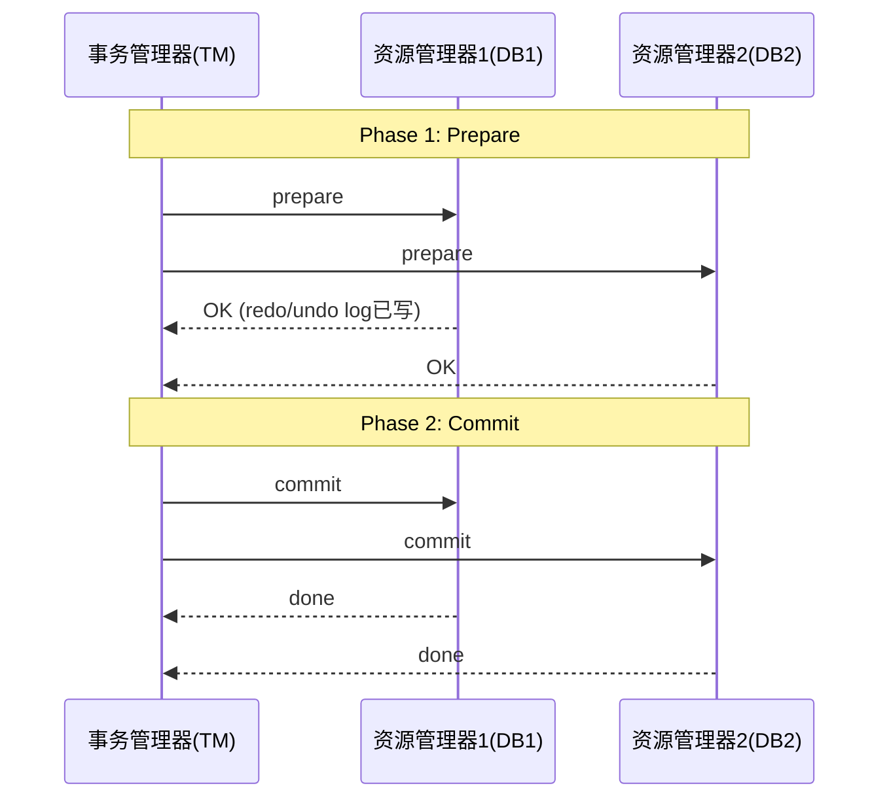

### 3.2 Java 中的实现

- **JTA 规范**（Java Transaction API）：`javax.transaction.UserTransaction`
- **Atomikos**：嵌入式 TM，Spring Boot Starter 直接集成
- **阿里云 DRDS/PolarDB-X 内置 XA**：对应用透明，SQL 层自动拆分 + 2PC

### 3.3 DRDS 分布式事务原理

```sql
-- 你写的 SQL
UPDATE account SET balance = balance - 100 WHERE user_id = 123;
UPDATE account SET balance = balance + 100 WHERE user_id = 456;

-- DRDS 内部自动做的事：
-- 1. 根据分片规则，路由到 DN1(user_id=123) 和 DN2(user_id=456)
-- 2. 对 DN1、DN2 分别执行 XA PREPARE
-- 3. 都返回 OK → 对两个 DN 执行 XA COMMIT
-- 4. 任一 PREPARE 失败 → 全部 XA ROLLBACK
```

**DRDS 事务模式选择**：

| 模式 | 特点 | 适用 |
|------|------|------|
| **强一致（XA）** | 默认模式，自动 2PC，对应用透明 | 跨分片写操作 |
| **柔性事务（最终一致）** | 基于 DRDS 全局事务日志 + 异步补偿 | 高并发、允许短暂不一致 |
| **单分片事务** | 路由到同一 DN 就是本地事务 | 单分片内操作 |

### 3.4 2PC 致命缺点

1. **同步阻塞**：Prepare 后所有资源被锁住，等 Commit
2. **单点故障**：TM 挂了，参与者一直持锁
3. **数据不一致**：Phase 2 部分 Commit 成功、部分网络断，出现脑裂
4. **性能杀手**：锁持有时间 = 整个 2PC 流程时间

---

## §4 TCC（Try-Confirm-Cancel）

### 4.1 核心思想

业务层面的 2PC，把数据库锁升级为业务锁：

```
Try:     预留资源（冻结库存、冻结余额）
Confirm: 确认执行（扣减冻结的资源）
Cancel:  取消预留（解冻）
```

### 4.2 Java 实现框架

- **Seata TCC 模式**
- **ByteTCC**
- **Hmily**

### 4.3 代码示例（Seata TCC）

```java
public interface InventoryService {

    @TwoPhaseBusinessAction(
        name = "deductStock",
        commitMethod = "confirm",
        rollbackMethod = "cancel"
    )
    boolean tryDeduct(BusinessActionContext context,
                      @BusinessActionContextParameter(paramName = "skuId") String skuId,
                      @BusinessActionContextParameter(paramName = "count") int count);

    boolean confirm(BusinessActionContext context);

    boolean cancel(BusinessActionContext context);
}

// Try: 冻结库存
@Override
public boolean tryDeduct(BusinessActionContext context, String skuId, int count) {
    // UPDATE inventory SET frozen = frozen + #{count}
    //   WHERE sku_id = #{skuId} AND available >= #{count}
    inventoryMapper.freeze(skuId, count);
    return true;
}

// Confirm: 真正扣减
@Override
public boolean confirm(BusinessActionContext context) {
    String skuId = (String) context.getActionContext("skuId");
    int count = (int) context.getActionContext("count");
    // UPDATE inventory SET frozen = frozen - #{count},
    //   stock = stock - #{count} WHERE sku_id = #{skuId}
    inventoryMapper.deductFrozen(skuId, count);
    return true;
}

// Cancel: 解冻
@Override
public boolean cancel(BusinessActionContext context) {
    String skuId = (String) context.getActionContext("skuId");
    int count = (int) context.getActionContext("count");
    // UPDATE inventory SET frozen = frozen - #{count} WHERE sku_id = #{skuId}
    inventoryMapper.unfreeze(skuId, count);
    return true;
}
```

### 4.4 TCC 三大难题

| 难题 | 场景 | 解法 |
|------|------|------|
| **空回滚** | Try 没执行就 Cancel（网络超时） | Cancel 检查 try 记录，没有则直接返回 |
| **幂等** | Confirm/Cancel 可能被重试 | 事务控制表 + 唯一键去重 |
| **悬挂** | Cancel 比 Try 先到，后来的 Try 不能再执行 | Try 前检查是否已有 cancel 记录 |

### 4.5 防御性代码

```java
// 用事务控制表防悬挂 + 空回滚
@Override
public boolean tryDeduct(BusinessActionContext ctx, String skuId, int count) {
    String xid = ctx.getXid();
    // 1. 查事务控制表，如果已有 cancel 记录 → 悬挂，直接返回
    if (txLogMapper.existsCancelRecord(xid)) {
        return false;  // 防悬挂
    }
    // 2. 插入 try 记录
    txLogMapper.insertTryRecord(xid);
    // 3. 冻结库存
    inventoryMapper.freeze(skuId, count);
    return true;
}

@Override
public boolean cancel(BusinessActionContext ctx) {
    String xid = ctx.getXid();
    // 1. 查事务控制表，如果没有 try 记录 → 空回滚
    if (!txLogMapper.existsTryRecord(xid)) {
        txLogMapper.insertCancelRecord(xid);  // 标记已 cancel，防后续悬挂
        return true;  // 空回滚，直接返回成功
    }
    // 2. 正常解冻
    inventoryMapper.unfreeze(...);
    return true;
}
```

---

## §5 Saga 模式

### 5.1 核心思想

长事务拆成多个本地事务，每个有对应的补偿操作。失败时逆序补偿：

```
正向：T1 → T2 → T3 → ... → Tn
T3 失败时逆序补偿：C2 ← C1
```

### 5.2 两种实现模式

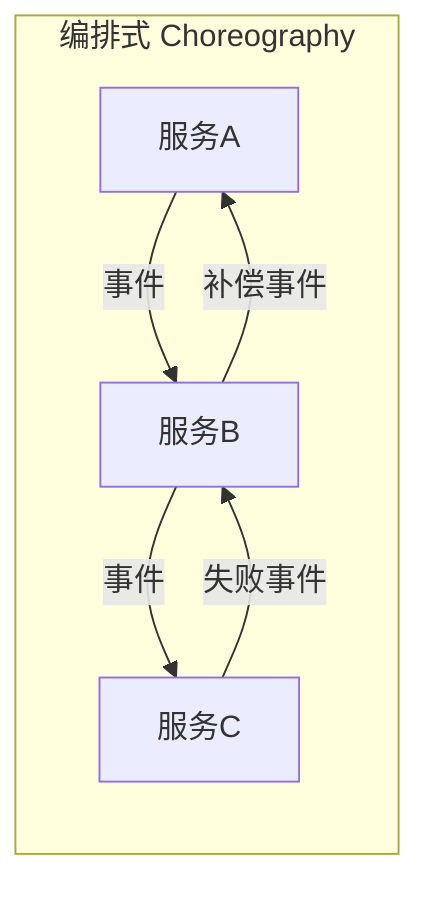

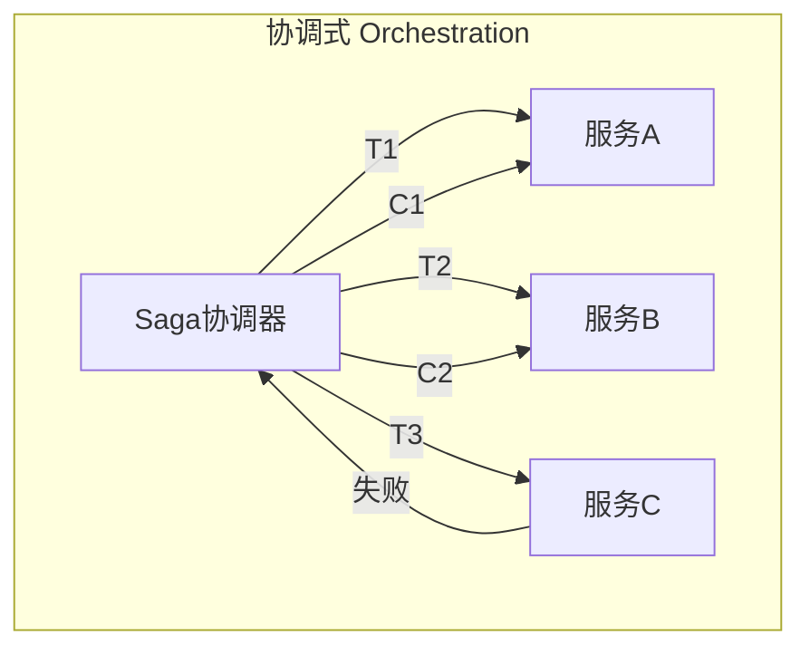

- **编排式（Choreography）**：各服务通过事件驱动，无中心协调；简单场景适用
- **协调式（Orchestration）**：中心协调器（如 Seata Saga 状态机）编排流程；复杂流程推荐

### 5.3 适用场景与代价

**适用**：
- 业务流程长（跨 5+ 服务）
- 不想侵入业务接口（不像 TCC 要拆成三个方法）
- 可以接受短暂的中间状态可见

**代价**：
- 不隔离：中间状态对外可见（"脏读"）
- 补偿逻辑复杂：不是所有操作都能补偿（如：已发短信、已调外部接口）

---

## §6 本地消息表 + 最终一致

**最经典、最实用、落地最多的方案。**

### 6.1 流程

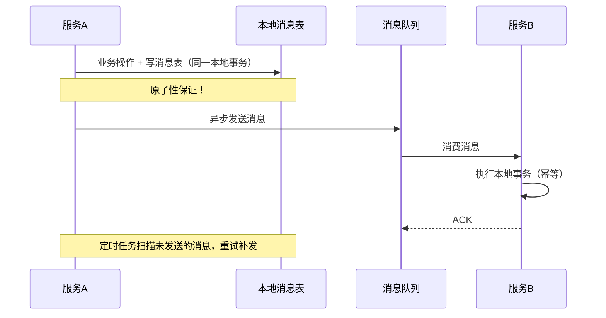

### 6.2 为什么是"最实用"

1. 不依赖任何分布式事务框架
2. 利用本地事务保证"业务+消息"的原子性
3. MQ 保证最终一定能投递
4. 下游幂等消费即可

### 6.3 核心表结构

```sql
CREATE TABLE local_message (
    id BIGINT AUTO_INCREMENT PRIMARY KEY,
    biz_key VARCHAR(128) NOT NULL,      -- 业务唯一键
    topic VARCHAR(64) NOT NULL,
    body TEXT NOT NULL,
    status TINYINT DEFAULT 0,            -- 0:待发送 1:已发送 2:已确认
    retry_count INT DEFAULT 0,
    next_retry_time DATETIME,
    create_time DATETIME DEFAULT NOW(),
    update_time DATETIME DEFAULT NOW(),
    UNIQUE KEY uk_biz_key(biz_key)
);
```

### 6.4 与 RocketMQ 事务消息的关系

本质就是**本地消息表的升级版**——把"消息表"托管给了 Broker：
- Half Message = 消息表的"待确认"状态
- Commit = 消息表的"已发送"状态
- 回查 = 定时任务扫描未确认消息

> 详见 [rocketmq-internals §5.2 事务消息](<./RocketMQ 底层实现原理.md>)

---

## §7 Seata — 阿里开源分布式事务框架

### 7.1 四种模式对比

| 模式 | 原理 | 业务侵入 | 性能 | 适用 |
|------|------|----------|------|------|
| **AT** | 自动生成 undo_log，框架拦截 SQL | 无侵入 | 中 | 90% 的 CRUD 场景 |
| **TCC** | 业务自己写 Try/Confirm/Cancel | 高侵入 | 高 | 高并发 + 需要精细控制 |
| **Saga** | 状态机编排 + 补偿 | 中等 | 高 | 长流程 |
| **XA** | 标准 XA 协议 | 无侵入 | 低 | 强一致要求 |

### 7.2 AT 模式原理（最常用）

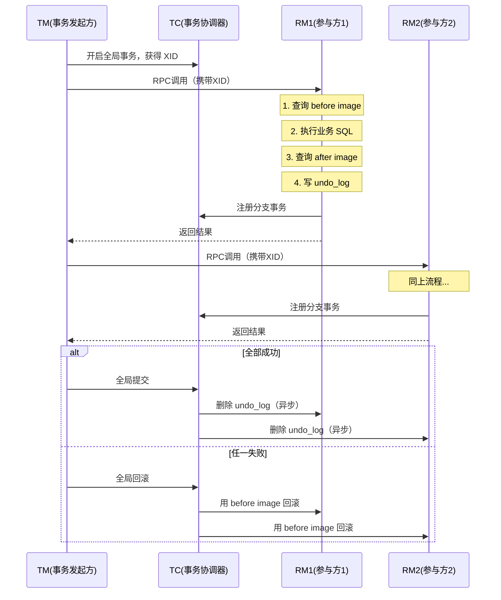

**核心流程**：
1. TM（事务发起方）开启全局事务 → 获得全局 XID
2. XID 通过 RPC 传播到各 RM（参与方）
3. RM 执行本地 SQL 前后分别生成 before/after image → 写入 undo_log 表
4. 全部成功 → TC 通知各 RM 异步删除 undo_log
5. 任一失败 → TC 通知各 RM 用 before image 做逆向回滚

### 7.3 使用示例

```java
// 使用极其简单，加一个注解
@GlobalTransactional(timeoutMills = 30000)
public void createOrder(OrderDTO dto) {
    // 1. 本地：创建订单
    orderMapper.insert(dto);

    // 2. RPC：扣库存（Seata 自动传播 XID）
    inventoryService.deduct(dto.getSkuId(), dto.getCount());

    // 3. RPC：扣余额
    accountService.debit(dto.getUserId(), dto.getAmount());
}
```

### 7.4 AT 模式的局限

- **写隔离问题**：全局锁粒度大，高并发下竞争严重
- **TC 单点**：TC Server 本身需要高可用部署（集群 + DB 持久化）
- **不支持 NoSQL**：只拦截 JDBC，Redis/ES 等无法自动纳入
- **长事务风险**：全局事务持续时间过长 → undo_log 堆积、锁占用过久

---

## §8 选型决策树

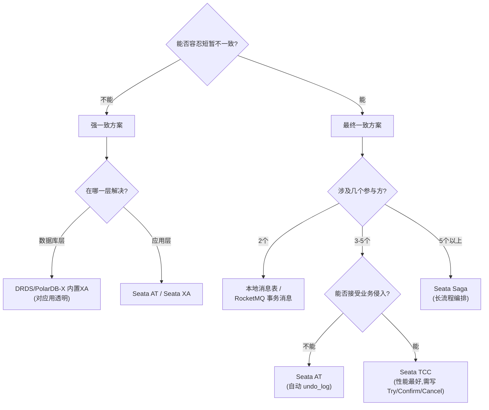

> 决策维度说明：先按"参与方数量"分流（这是硬约束：2 个直接消息表，5+ 个必走 Saga 编排）；中间 3~5 个时再用"是否接受业务侵入"二次判断（不接受走 AT，接受走 TCC）。

**极简版决策**：

| 场景 | 首选方案 |
|------|----------|
| 跨分片 SQL（DRDS） | 内置 XA，不用管 |
| 普通跨服务（2-3个） | 本地消息表 / 事务消息 |
| 高并发 + 精细控制 | TCC |
| 长流程编排（5+服务） | Saga |
| 快速接入、低侵入 | Seata AT |

---

## §9 事务消息 vs 分布式事务：定位辨析

### 9.1 两个完全不同的问题域

| | **问题 A：本地事务 + 消息发送的原子性** | **问题 B：跨多个服务/DB 的全局一致性** |
|---|---|---|
| **代表方案** | RocketMQ 事务消息 / 本地消息表 | 2PC / TCC / Saga / Seata |
| **参与方** | 2 个（你的 DB + MQ） | N 个（多个服务各自的 DB） |
| **一致性模型** | 最终一致（消息一定能发出去） | 强一致（2PC）或最终一致（TCC/Saga） |
| **谁先谁后** | 只关心"发送端"，不管下游 | 管全局，所有参与方都要一致 |

**核心结论**：RocketMQ 事务消息是**分布式事务大家族里"最终一致"分支下的一个具体手段**，它只解决"怎么可靠地把消息发出去"这一个环节，不是解决跨服务全局一致性的完整方案。

### 9.2 问题域可视化

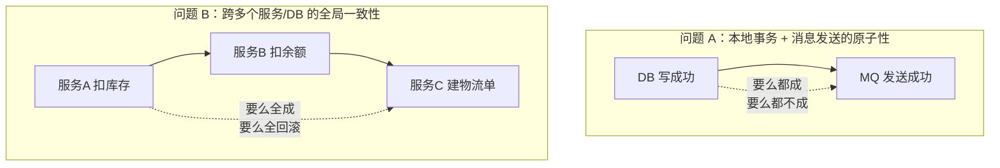

### 9.3 事务消息在分布式事务家族中的位置

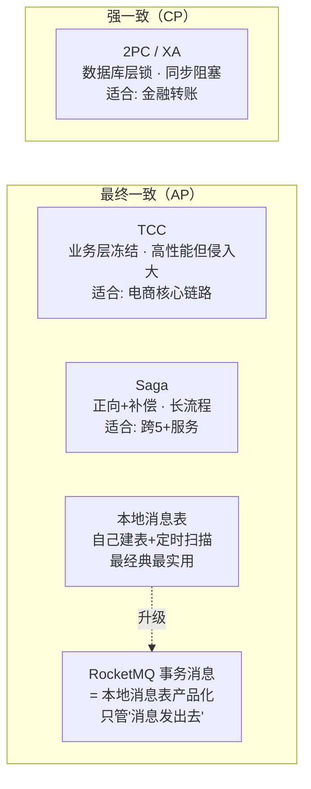

### 9.4 全景对比表

| 维度 | 2PC/XA | TCC | Saga | 本地消息表 | RocketMQ 事务消息 |
|------|--------|-----|------|-----------|-----------------|
| **一致性** | 强一致 | 最终一致 | 最终一致 | 最终一致 | 最终一致 |
| **参与方数量** | N 个 DB | N 个服务 | N 个服务 | 2 个（DB+MQ） | 2 个（DB+MQ） |
| **业务侵入** | 无 | 高（3 个接口） | 中（补偿接口） | 低（建表+扫描） | 低（Broker 托管） |
| **性能** | 差 | 高 | 高 | 高 | 高 |
| **解决的问题** | 全局一致性 | 全局一致性 | 全局一致性 | 消息可靠发送 | 消息可靠发送 |

### 9.5 协作关系（不是替代关系）

实际使用中，事务消息往往是分布式事务方案的**一个环节**：

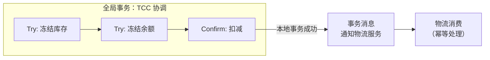

- 全局层面用 TCC 保证"库存+余额"的一致性
- 通知层面用事务消息保证"消息一定发出去"
- 下游物流服务的幂等消费保证"一定处理成功"

### 9.6 面试应答模板

> **面试官问**："RocketMQ 事务消息和 2PC/TCC 是什么关系？"
>
> **答**：它们解决的问题不同。2PC 和 TCC 解决的是"跨多个服务/数据库的全局事务一致性"——要么全成功要么全回滚。RocketMQ 事务消息解决的是更小的问题："本地数据库操作和消息发送的原子性"——保证消息一定能发出去。它是"本地消息表"方案的产品化实现，属于分布式事务"最终一致"分支的一种具体手段。实际使用中两者是协作关系——比如 TCC 协调全局事务，其中某个分支需要发通知消息时用事务消息保证可靠发送。

---

## §10 核心认知纠偏

| 误区 | 真相 |
|------|------|
| "分布式事务 = 2PC" | 2PC 只是最古老的方案，互联网极少用 |
| "用了 Seata 就万事大吉" | Seata TC 本身也是单点，需要高可用部署 |
| "RocketMQ 事务消息 = 分布式事务" | 它只保证"本地事务 + 消息发送"的原子性，下游是否成功需要自己保证幂等 |
| "DRDS XA 没有性能问题" | 跨分片 XA 的锁等待时间 >> 单分片，需要关注热点分片 |
| "补偿一定能成功" | 已发短信、已调三方支付等操作不可逆，设计时要前置考虑 |
| "幂等 = 去重表" | 幂等方案多样：唯一键、状态机、版本号、Token |
| "最终一致 = 不一致" | 不是！是"一定会达到一致，只是有时间窗口" |

---

## §11 实战 Checklist

落地分布式事务前，逐项确认：

- [ ] **真的需要分布式事务吗？** 能否通过业务设计规避（如合并到同一服务/同一库）
- [ ] **一致性要求明确了吗？** 强一致 vs 最终一致，对业务影响评估了吗
- [ ] **幂等做了吗？** 所有被调方必须幂等（唯一键 / 状态机 / 版本号）
- [ ] **超时和重试策略定了吗？** 网络抖动必然发生
- [ ] **补偿逻辑可行吗？** 有没有不可逆操作（外部 API、短信、邮件）
- [ ] **监控报警做了吗？** 悬挂事务、长时间未完成事务的告警
- [ ] **降级方案有吗？** TC 挂了 / MQ 挂了，业务怎么兜底

---

## §12 深度追问 Q&A

### 12.1 2PC Phase 2 中 DB1 提交成功、DB2 失败怎么办？

**一旦进入 Phase 2，没有退路**——DB1 已 commit 无法回滚，TM 只能无限重试 DB2。

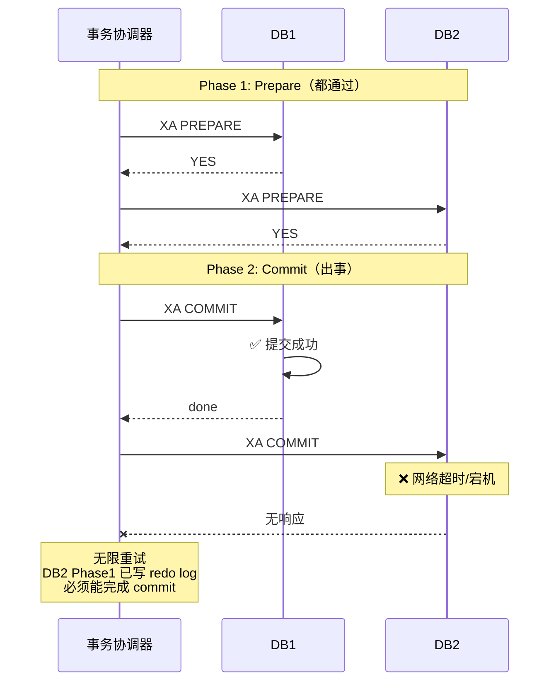

| 情况 | 结果 |
|------|------|
| DB2 短暂网络抖动 | TM 重试 → DB2 最终 commit → 一致 ✅ |
| DB2 永久宕机（磁盘完好） | 运维恢复 → TM 重试 → commit → 一致 ✅ |
| DB2 永久宕机（磁盘损坏） | DB1 已 commit 无法回滚 → **永久不一致** ❌ |
| TM 在 Phase 2 中间挂了 | DB1 已 commit；DB2 停在 PREPARE 持锁等 TM 恢复 |

**为什么 2PC 被称为"同步阻塞"**：Phase 2 窗口期内，DB2 的行锁阻塞所有其他事务，系统处于脆弱状态，直到 TM 恢复或人工干预。

### 12.2 TCC 的 INSERT 操作怎么冻结？

INSERT 操作本质上无法"冻结"——你没法冻结一条还不存在的记录。三种常见做法：

**做法一：Try 只做校验+预留，Confirm 才 INSERT**

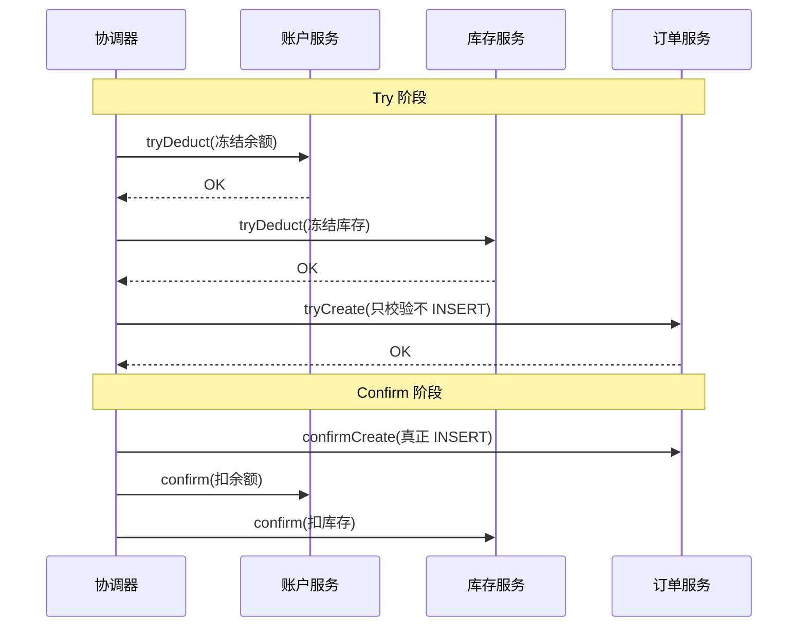

风险：Confirm 阶段 INSERT 失败 → 前面的 Confirm 已执行 → 又不一致。

**做法二：INSERT 带状态字段**

```java
// Try: 插入冻结态订单
INSERT INTO orders (order_id, status, ...) VALUES ('ORD001', 'FROZEN', ...);
// Confirm: 更新为正式
UPDATE orders SET status = 'CONFIRMED' WHERE order_id = 'ORD001';
// Cancel: 删除冻结态
DELETE FROM orders WHERE order_id = 'ORD001' AND status = 'FROZEN';
```

问题：其他线程能查到 FROZEN 记录，业务代码需自觉 `WHERE status != 'FROZEN'`。

**做法三（推荐）：把创建操作放最后，不作为 TCC 参与方**

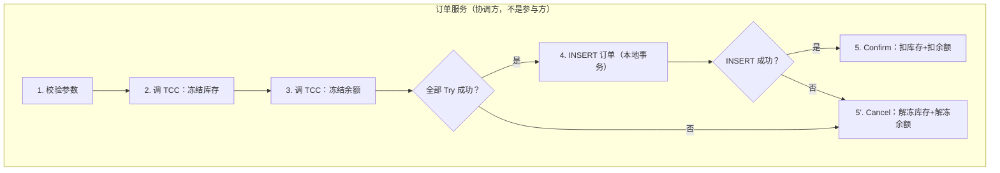

**关键洞察**：TCC 管"可冻结的资源"（余额、库存、优惠券），创建操作放在最后一步作为协调方自然执行。

### 12.3 Saga 的隔离性问题

**C 失败了，AB 会补偿——但不是 ROLLBACK，而是用反向操作修复。**

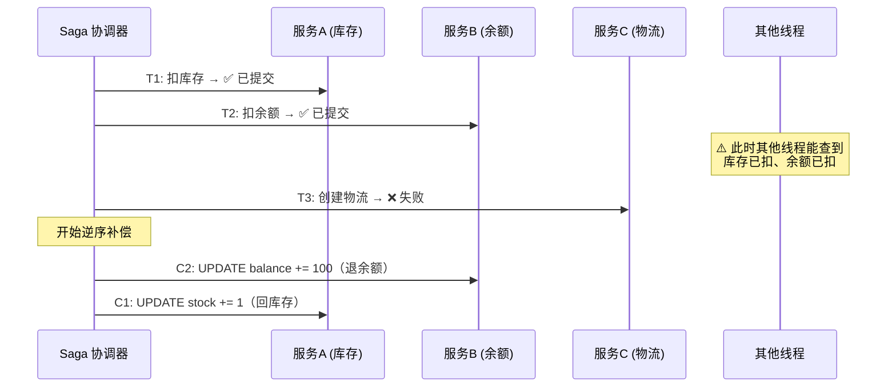

**Saga 没有隔离性**——中间态对外可见：

| 问题 | 例子 |
|------|------|
| 脏读 | 报表统计到"已扣库存"，但事务最终回滚了 |
| 级联错误 | 另一流程读到"余额已扣"，以为已付款，触发发货 |
| 用户体验 | 用户看到"已扣款"，几秒后钱又退回来 |

**缓解策略**：

| 策略 | 做法 |
|------|------|
| 语义锁 | 记录加 `saga_status = 'IN_PROGRESS'`，查询时过滤 |
| 步骤重排 | 不可逆操作（发短信、调外部 API）放最后 |
| 悲观 Saga | 引入预留机制 → 退化为 TCC |

**本质 trade-off**：Saga 用隔离性换实现简单性。不能容忍中间态可见 → 用 TCC。

### 12.4 DRDS 跨分片事务底层实现

**架构**：CN（计算节点）= 事务协调器，DN（存储节点）= MySQL 实例。

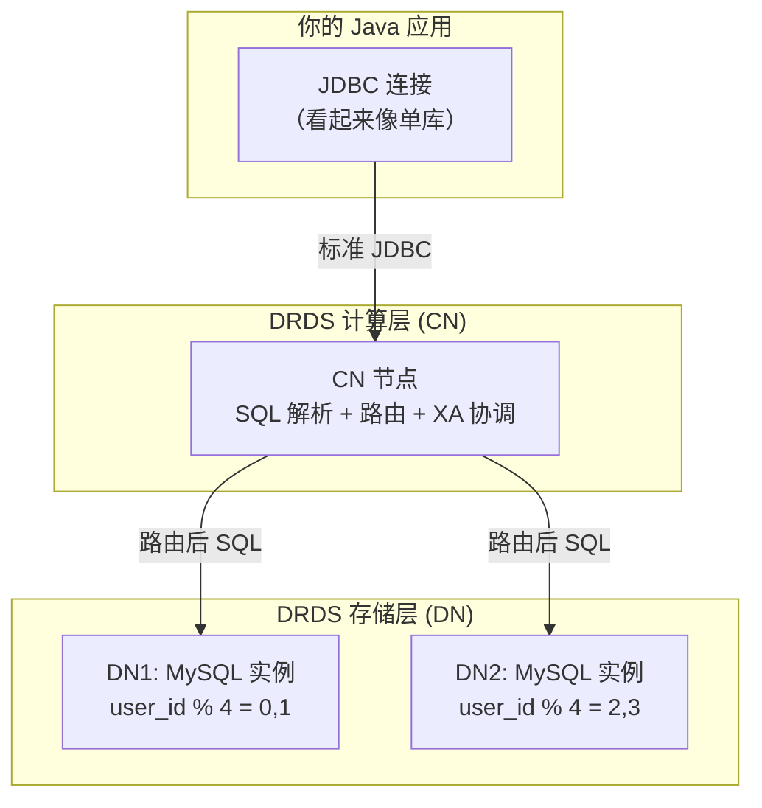

**完整流程**（以 `@Transactional` 跨分片转账为例）：

```mermaid
sequenceDiagram
    participant App as Java 应用
    participant CN as DRDS CN
    participant DN1 as DN1 (user 100)
    participant DN2 as DN2 (user 200)

    App->>CN: @Transactional BEGIN

    App->>CN: accountDao.deduct(100, amount)
    CN->>CN: 解析 → 路由到 DN1
    CN->>DN1: XA START; UPDATE account...; XA END
    DN1-->>CN: OK

    App->>CN: accountDao.add(200, amount)
    CN->>DN2: XA START; UPDATE account...; XA END
    DN2-->>CN: OK

    App->>CN: COMMIT

    Note over CN,DN2: CN 自动 XA 两阶段
    CN->>DN1: XA PREPARE
    DN1-->>CN: YES
    CN->>DN2: XA PREPARE
    DN2-->>CN: YES
    CN->>DN1: XA COMMIT
    CN->>DN2: XA COMMIT
    CN-->>App: OK
```

**底层就是 MySQL 原生 XA 协议**——DRDS CN 在 DN 上执行 `XA START → SQL → XA END → XA PREPARE → XA COMMIT`。

**对 Java 代码完全透明**：你写的就是标准 `@Transactional`，不需要引入 Seata 或任何框架。

**DRDS 事务模式选择**：

| 模式 | 底层 | 适用 | 性能 |
|------|------|------|------|
| 强一致 XA（默认跨分片） | MySQL XA 2PC | 跨分片写操作 | 较慢 |
| 单分片事务 | MySQL 本地事务 | 路由到同一 DN | 最快 |
| 柔性事务 | 全局事务日志+异步补偿 | 高并发+允许短暂不一致 | 最好 |

**性能陷阱**：
- 跨分片 XA 锁持有时间 = 所有 DN 的 PREPARE + COMMIT → 比单分片慢 3-5 倍
- **最佳实践**：A 表和 B 表用相同分片键（都按 user_id），让同一用户的账户+流水落同一 DN → 自动退化为本地事务

### 12.5 MySQL XA 事务内部机制

**核心认知**：XA 不需要业务层"冻结"——MySQL 的事务机制（redo log + undo log + MVCC）天然提供原子性和隔离性。INSERT 就正常 INSERT，事务内其他连接看不到。

#### XA 事务生命周期

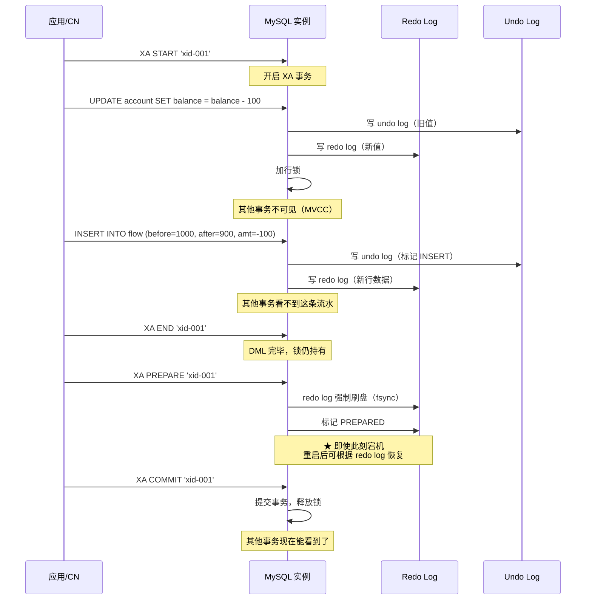

#### 各阶段状态

| 阶段 | redo log | 行锁 | 其他事务可见性 |
|------|----------|------|--------------|
| XA START → XA END | 持续写入 buffer | 持有 | 不可见（MVCC） |
| XA PREPARE | **强制刷盘** | 持有 | 不可见 |
| XA COMMIT | 标记 committed | 释放 | 可见 |

#### INSERT 在 XA 中如何保障

**与 UPDATE 完全一样——不需要特殊处理**：

| 操作 | undo log 记录 | 回滚行为 |
|------|--------------|---------|
| UPDATE | 旧值 | 恢复旧值 |
| INSERT | 新行主键 | DELETE 这行 |
| DELETE | 完整行数据 | 重新 INSERT |

#### XA vs TCC 的本质区别

| | XA（数据库层） | TCC（业务层） |
|---|---|---|
| INSERT 怎么处理 | 直接 INSERT，事务内不可见 | 需自己设计冻结方式 |
| 隔离性谁提供 | MySQL MVCC 天然提供 | 业务代码自己实现 |
| 回滚谁做 | undo log 自动做 | 你写 Cancel 接口 |
| 持久性谁保证 | redo log 刷盘 | 自己记事务控制表 |
| 代价 | 锁持有时间长 | 业务代码复杂度高 |

#### XA 宕机恢复

MySQL 重启后扫描 redo log，发现 PREPARED 状态的 XA 事务：
- 有 COMMIT 记录 → 自动完成 COMMIT
- 有 ROLLBACK 记录 → 自动完成 ROLLBACK
- 都没有（TM 也挂了） → 事务持锁等待，DBA 用 `XA RECOVER` 查看并手动处理

#### 三张表场景示例

账户底表 + 交易表 + 流水表，一次余额变动：

```sql
-- 如果三张表在同一 DN（本地事务，不需要 XA）
BEGIN;
UPDATE account SET balance = balance - 100 WHERE user_id = 100;
UPDATE trade SET status = 'SUCCESS' WHERE trade_id = 999;
INSERT INTO flow (user_id, before_bal, after_bal, amount)
VALUES (100, 1000, 900, -100);
COMMIT;

-- 如果跨 DN（DRDS 自动 XA）
-- DN1: UPDATE account + INSERT flow（同一 DN，同一 XA 事务）
-- DN2: UPDATE trade（另一 XA 事务）
-- CN 协调: XA PREPARE DN1 → XA PREPARE DN2 → XA COMMIT 两者
```

> **INSERT 流水不需要"预占"**——它在 DN1 的 XA 事务内执行，MVCC 保证其他连接看不到，undo log 保证可以回滚删除。XA PREPARE 时 redo log 刷盘保证持久性。这就是数据库层方案和业务层方案（TCC）的根本区别。
