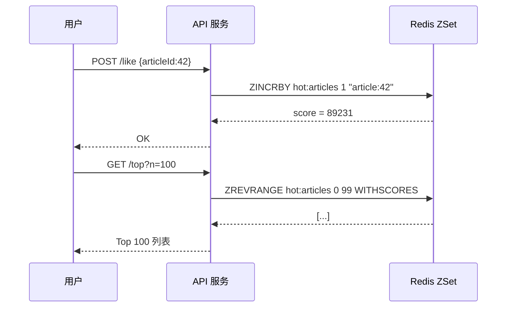
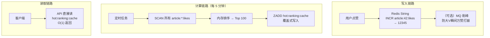
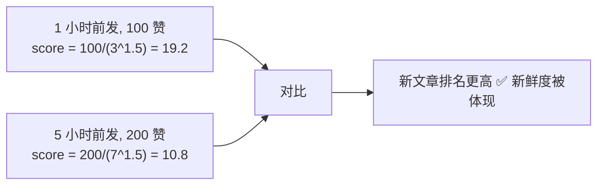
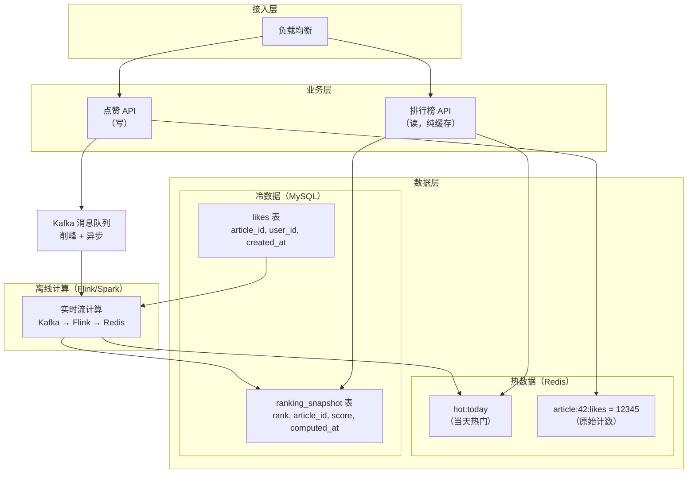
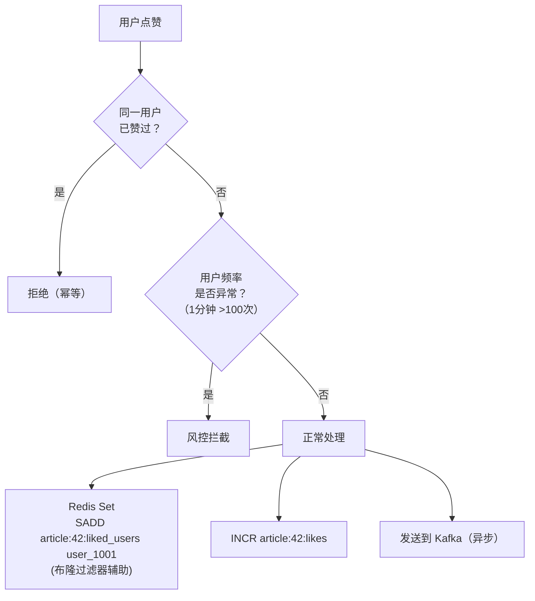

# 点赞Top排行榜设计方案

> 最后整理: 2026-07-01 | 来源: 面试题拆解

> 关联: [[./Redis 常用数据类型与使用场景.md]] — ZSet 底层实现

---

## 1. 问题拆解

"设计一个点赞 Top 排行榜"考察的是**从简单到复杂的演进能力**。核心矛盾：

```mermaid
flowchart LR
    RealTime["实时性<br/>点赞后立即反映"] vs Scale["扩展性<br/>亿级点赞"] vs Accuracy["准确性<br/>排名不丢失/不错"]
```

不同规模需要不同架构，面试的关键是**分层回答，展示递进思维**。

---

## 2. 方案一：Redis ZSet 直写（小规模，< 1 万篇文章）

```java
// 点赞
redis.zincrby("hot:articles", 1, "article:42");

// 取 Top 100
Set<ZSetOperations.TypedTuple<String>> top =
    redis.zrevrangeWithScores("hot:articles", 0, 99);
// → [{article:42=89320}, {article:17=78100}, ...]
```



- **优点**：实时、代码少、Redis 单线程天然无并发竞争
- **缺点**：大 key 问题（几十万文章的 ZSet = 上百 MB）；`ZINCRBY` 热点 key 瓶颈；数据全在内存，成本高

---

## 3. 方案二：Redis 存储 + 定时批量计算（中规模，< 100 万）



```java
// 定时任务伪代码
@Scheduled(fixedDelay = 300_000) // 每 5 分钟
void rebuildRanking() {
    // 1. 扫描所有文章点赞数
    Map<String, Long> scores = new HashMap<>();
    ScanParams params = new ScanParams().match("article:*:likes");
    String cursor = "0";
    do {
        ScanResult<String> result = redis.scan(cursor, params);
        for (String key : result.getResult()) {
            String articleId = extractId(key);
            Long likes = Long.parseLong(redis.get(key));
            scores.put(articleId, likes);
        }
        cursor = result.getCursor();
    } while (!cursor.equals("0"));

    // 2. 排序取 Top 100
    List<Map.Entry<String, Long>> top = scores.entrySet().stream()
        .sorted(Map.Entry.<String, Long>comparingByValue().reversed())
        .limit(100)
        .toList();

    // 3. 写入缓存 ZSet
    redis.del("hot:ranking:cache");
    for (var e : top) {
        redis.zadd("hot:ranking:cache", e.getValue(), e.getKey());
    }
}
```

- **优点**：读路径 O(1)（拿缓存好的结果）、点赞不经过 ZSet 瓶颈
- **缺点**：排行榜有 5 分钟延迟；SCAN 全量计数可能耗时（百万 key 要几秒）

---

## 4. 方案三：热度公式 + 时间衰减（提升新鲜度）

**Hacker News 算法的简化版**：

```java
// score = 点赞数 / (发布时间 + 2)^1.5
double calculateScore(long likes, long publishTimeSeconds) {
    double hoursOld = (System.currentTimeMillis() / 1000.0 - publishTimeSeconds) / 3600.0;
    return likes / Math.pow(hoursOld + 2, 1.5);
}

// 每次点赞更新 score
redis.zincrby("hot:articles", deltaScore, "article:42");
```



**核心原理**：`(hours + 2)^1.5`——分母随时间指数增长，旧文章的高赞数会被时间惩罚。不用物理删除旧文章，自然淘汰。

---

## 5. 方案四：大规模架构（千万~亿级）



**各层职责**：

| 层 | 职责 | 技术选型 |
|----|------|---------|
| 接入层 | 限流 + 负载均衡 | Nginx + Sentinel |
| 写入 | 点赞去重 + 计数 | Redis（去重用 Set，计数用 String/INCR） |
| 削峰 | 缓冲突发流量 | Kafka 异步 + 批量写入 |
| 计算 | 实时热度排名 | Flink（窗口聚合 + 热度公式） |
| 缓存 | 排行榜查询 | Redis ZSet（Top 100-1000 预热） |
| 持久化 | 历史记录 + 对账 | MySQL（冷热分离，按时间分表） |

---

## 6. 点赞去重与反作弊



```java
// 点赞去重（Redis Set + Lua 原子操作）
String lua = """
    local liked = redis.call('SISMEMBER', KEYS[1], ARGV[1])
    if liked == 1 then
        return 0  -- 已赞过
    end
    redis.call('SADD', KEYS[1], ARGV[1])
    redis.call('INCR', KEYS[2])
    return 1
    """;

Long result = redis.eval(lua,
    List.of("article:42:liked_users", "article:42:likes"),
    List.of("user_1001")
);
```

---

## 7. 边界 Case 自检

| 边界场景 | 影响 | 解决方案 |
|----------|------|---------|
| **文章被删除** | 排行榜出现无效文章 | 删除事件触发 `ZREM hot:articles article:42` |
| **大 V 瞬间万赞** | 单 key 并发竞争 + 带宽打满 | 批量聚合 + MQ 削峰 + 异步更新 |
| **定时任务执行超时** | 排行榜不更新 | 双 Buffer：`ranking:v1` 和 `ranking:v2` 交替写入，无锁切换 |
| **Redis 内存满** | 排行榜消失 | 设置淘汰策略 + 冷热分离（只缓存 Top 1000） |
| **刷赞脚本** | 排行榜失实 | 频率限制 + 设备指纹 + 图灵验证 + 风控规则 |
| **跨机房部署** | Redis Cluster slot 迁移 | 排行榜 key 加 hash tag 固定 slot |

---

## 8. 演进路径总结

```
10 篇文章 → 10 万 → 100 万 → 1 亿 → 10 亿
    │         │        │        │        │
    ▼         ▼        ▼        ▼        ▼
 SQL     Redis    Redis+    Redis+   Flink+
ORDER    ZSet     定时      Kafka    HBase
 BY      直写     批量     分桶     离线
```

**面试时的正确节奏**：
1. 先说最简单的 ZSet 方案（证明你能写代码）
2. 再说大规模时的瓶颈（证明你有架构思维）
3. 最后提边界 case 和反作弊（证明你有工程经验）
