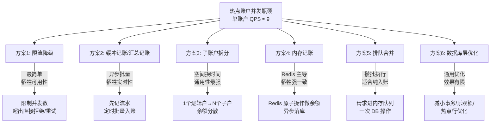
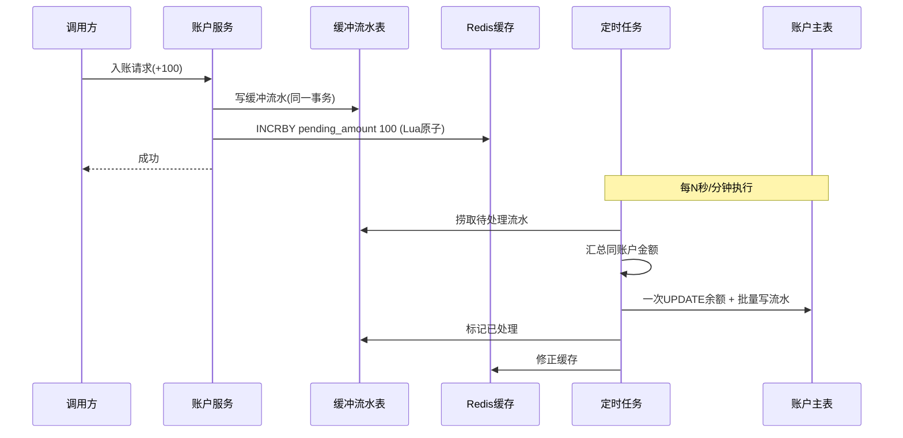
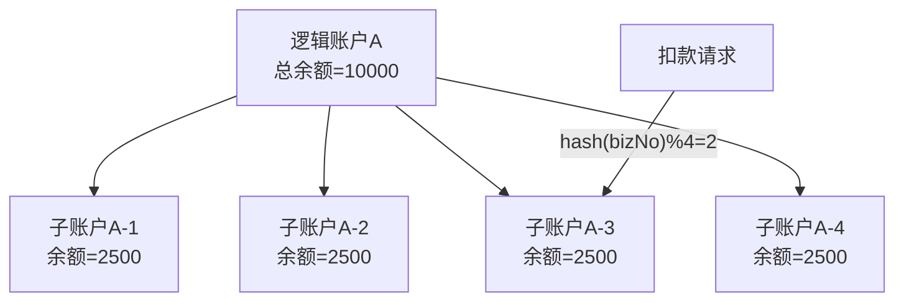
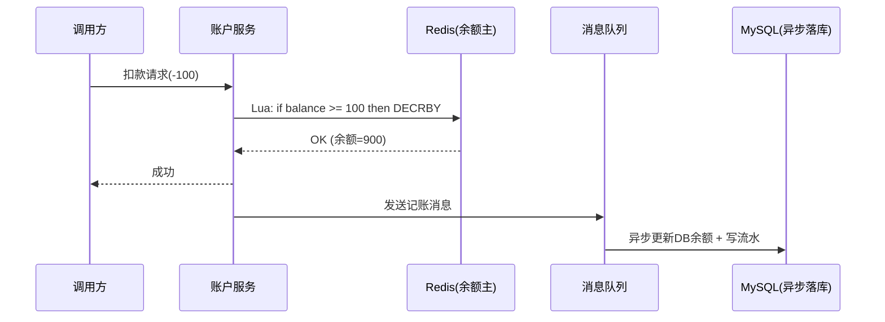
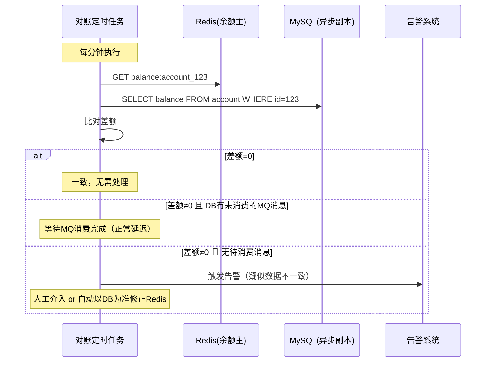
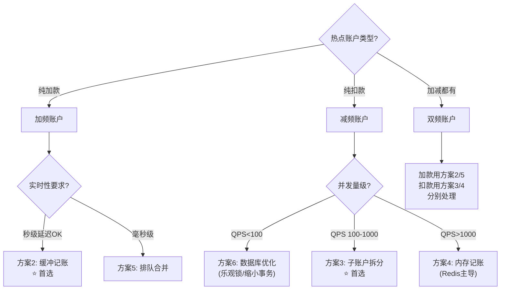
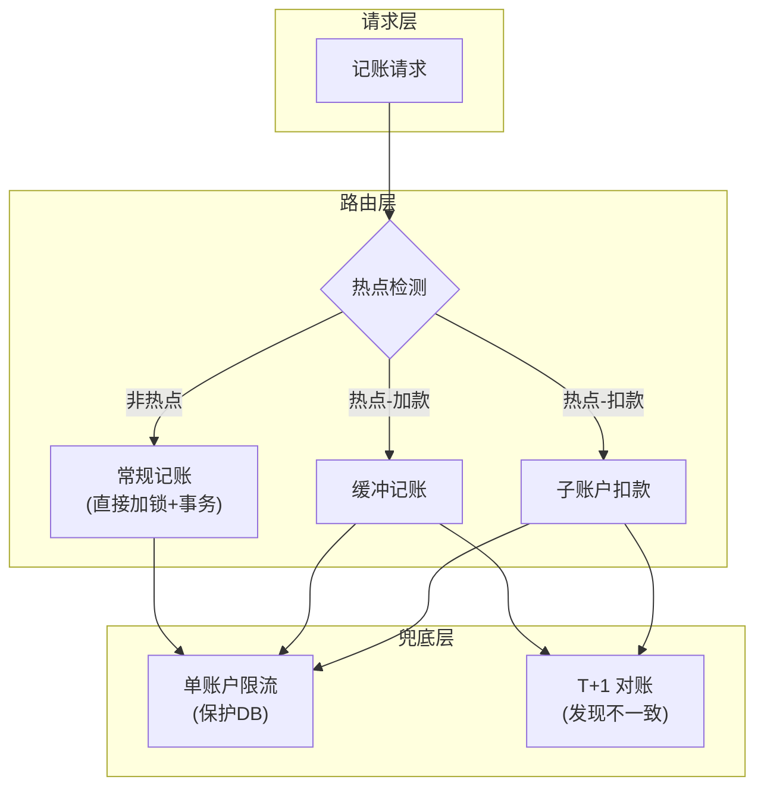
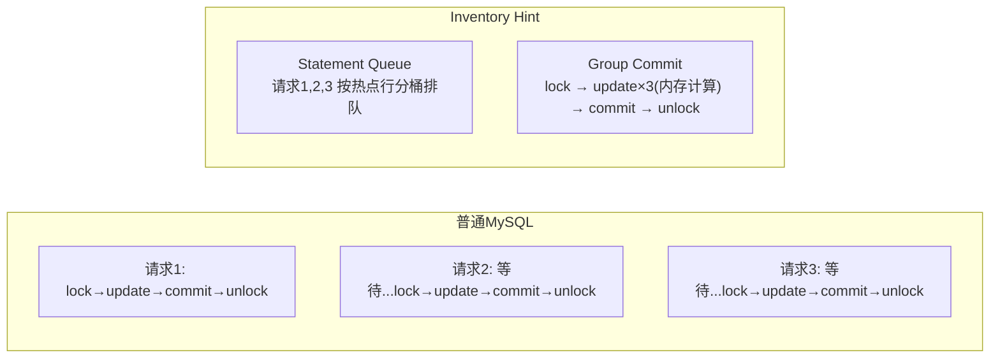

# 热点账户高并发记账方案

> 最后整理: 2026-05-20 | 来源: 对话讲解

> 关联: [分布式事务](./分布式事务全景.md) — 热点账户方案常与分布式事务结合使用

---

## §1 问题本质

### 1.1 什么是热点账户

当大量并发请求集中操作**同一个账户的余额**时，由于数据库行锁机制，对同一行的 UPDATE 操作被迫串行化，吞吐量急剧下降。

```
正常账户:  每个账户 QPS < 10，无竞争
热点账户:  单个账户 QPS >> 100，行锁排队

典型场景:
- B端收单商户账户（大量买家同时付款给同一商家）
- 平台中间户/备付金账户
- 红包活动账户（春节红包入账）
- 大促期间的营销补贴账户
```

### 1.2 性能瓶颈量化

```
假设单次记账事务耗时:
- 获取分布式锁:     ~20ms
- 开启事务:         ~5ms
- 更新余额(行锁):   ~30ms
- 写流水:           ~20ms
- 提交事务:         ~10ms
- 释放锁:           ~5ms
───────────────────────────────
总计:               ~90-120ms

理论 QPS = 1000ms / 110ms ≈ 9 笔/秒（单账户天花板）
```

**核心矛盾**：行锁的串行化 + 事务的原子性要求 → 单行写入天然是串行的。

### 1.3 三类热点账户

| 类型 | 特征 | 典型场景 | 难度 |
|------|------|----------|------|
| **加频账户** | 只加钱，不关心实时余额 | 收单商户入账、红包到账 | ★☆☆ 最简单 |
| **减频账户** | 只扣钱，需要实时余额校验 | 用户消费扣款 | ★★★ 最难 |
| **双频账户** | 加减都高频 | 平台中间户 | ★★☆ 分别处理 |

> **为什么"加频"简单？** 因为加钱不需要判断余额够不够，天然可以延迟入账。
> **为什么"减频"难？** 因为每次扣钱都要实时确认余额充足，不能延迟。

---

## §2 方案全景



---

## §3 方案1：限流降级（最简单）

### 原理

对单账户加并发控制，超出阈值的请求直接返回"系统繁忙请稍后重试"。

```java
// Guava RateLimiter 或 Redis 令牌桶
String key = "rate:account:" + accountId;
if (!rateLimiter.tryAcquire(key, 10, TimeUnit.MILLISECONDS)) {
    throw new BusinessException("系统繁忙，请稍后重试");
}
```

### 适用与局限

- **适用**：临时方案、兜底保护（防止把 DB 打挂）
- **局限**：本质上没解决问题，只是把问题转嫁给调用方；失败率高，用户体验差

---

## §4 方案2：缓冲记账 / 汇总记账

### 4.1 核心思想

**不实时变更余额，先记录变更意图，再定时批量入账。**

### 4.2 流程



### 4.3 关键设计点

**缓冲流水表结构**：
```sql
CREATE TABLE account_buffer (
    id BIGINT AUTO_INCREMENT PRIMARY KEY,
    account_id VARCHAR(64) NOT NULL,
    amount DECIMAL(18,2) NOT NULL,      -- 正数加/负数减
    biz_no VARCHAR(128) NOT NULL,        -- 业务流水号(幂等键)
    status TINYINT DEFAULT 0,            -- 0:待处理 1:已入账 2:异常
    create_time DATETIME NOT NULL,
    process_time DATETIME,
    batch_no VARCHAR(64),                -- 所属批次号
    UNIQUE KEY uk_biz_no(biz_no),
    INDEX idx_status_time(status, create_time)
);
```

**定时任务核心逻辑**：
```java
@Scheduled(fixedRate = 5000)  // 每5秒
public void batchSettle() {
    String batchNo = generateBatchNo();  // 如: "BATCH-20260520-223000-001"
    
    // 1. 抢占一批待处理记录（CAS 更新 batch_no，防止多实例重复处理）
    int claimed = bufferMapper.claimBatch(batchNo, BATCH_SIZE);
    if (claimed == 0) return;
    
    // 2. 查询本批次数据并按账户汇总
    Map<String, BigDecimal> sumMap = bufferMapper.sumByAccount(batchNo);
    
    // 3. 加锁 → 一次性更新余额 + 批量写入正式流水
    for (Map.Entry<String, BigDecimal> entry : sumMap.entrySet()) {
        String accountId = entry.getKey();
        BigDecimal totalAmount = entry.getValue();
        
        try (DistributedLock lock = lockService.lock("account:" + accountId)) {
            accountMapper.updateBalance(accountId, totalAmount);
            flowMapper.batchInsert(batchNo, accountId);
            bufferMapper.markProcessed(batchNo, accountId);
        }
    }
}
```

**claimBatch 的 SQL 实现（CAS 抢占，防止多实例重复处理）**：

```sql
-- claimBatch: 通过 CAS 方式抢占一批未处理记录
-- 关键：WHERE 条件限定 status=0 且 batch_no IS NULL，SET batch_no 实现"占位"
-- 多个实例同时执行时，MySQL 行锁保证同一行只会被一个实例抢到
UPDATE account_buffer
SET batch_no = #{batchNo},
    status = 1  -- 1:处理中
WHERE status = 0
  AND batch_no IS NULL
  AND create_time <= DATE_SUB(NOW(), INTERVAL 1 SECOND)  -- 至少1秒前的数据（避免抢走刚写入的）
ORDER BY create_time ASC
LIMIT #{batchSize};

-- 返回值 = affected rows，即本次抢占到的记录数
```

```sql
-- sumByAccount: 按账户汇总本批次金额
SELECT account_id, SUM(amount) AS total_amount, COUNT(*) AS cnt
FROM account_buffer
WHERE batch_no = #{batchNo}
GROUP BY account_id;
```

```sql
-- markProcessed: 标记本批次已处理完成
UPDATE account_buffer
SET status = 2,  -- 2:已入账
    process_time = NOW()
WHERE batch_no = #{batchNo}
  AND account_id = #{accountId};
```

**多实例竞争安全性说明**：
- `UPDATE ... WHERE status=0 AND batch_no IS NULL LIMIT N` 在 MySQL InnoDB 下，多个实例并发执行时，行锁保证同一行不会被两个事务同时更新
- 即使两个实例同时执行，各自拿到的是不同的行（先到先得）
- `batch_no` 作为每次执行的唯一标识，后续 SUM 和 markProcessed 都通过 batch_no 隔离

### 4.4 优缺点

| 优点 | 缺点 |
|------|------|
| 实现相对简单 | 余额非实时（有时间窗口） |
| 对加款场景极其友好 | **扣款场景有透支风险** |
| 并发能力大幅提升 | 对账链路变长 |
| 不依赖复杂中间件 | 定时任务本身需要高可用设计 |

### 4.5 扣款场景的透支难题

```
场景：账户余额 1000 元，定时任务间隔 5 秒

T=0s: 扣款请求A -800（Redis: pending=-800，判断 1000-800=200 ≥ 0 ✓）
T=1s: 扣款请求B -300（Redis: pending=-1100，判断 1000-1100=-100 < 0 ✗ 拒绝）

看似没问题？但如果 Redis 故障重启，pending 归零：
T=2s: Redis 恢复，pending=0
T=3s: 扣款请求C -500（Redis: pending=-500，判断 1000-500=500 ≥ 0 ✓）

实际：A(-800) + C(-500) = -1300 > 1000 → 透支！
```

**解法**：
1. Redis 持久化 + Sentinel/Cluster 保高可用
2. 定时任务频率拉高（缩短窗口）
3. 扣款前双重校验（Redis + DB 余额）
4. 对扣款场景不用缓冲记账，改用子账户拆分

---

## §5 方案3：子账户拆分（通用性最强）

### 5.1 核心思想

将一个逻辑账户拆成 N 个物理子账户，余额分散到各子账户。N 个子账户可以并行操作，并发度从 1 提升到 N。



### 5.2 入账流程（加钱）

```java
// 入账：随机选一个子账户加钱
public void credit(String accountId, BigDecimal amount, String bizNo) {
    int subIndex = Math.abs(bizNo.hashCode()) % subAccountCount;
    String subAccountId = accountId + "_" + subIndex;
    
    subAccountMapper.addBalance(subAccountId, amount);
    flowMapper.insert(accountId, subAccountId, amount, bizNo);
}
```

### 5.3 扣款流程（减钱 — 难点）

```java
// 扣款：选子账户扣钱（可能单个子账户余额不足）
public void debit(String accountId, BigDecimal amount, String bizNo) {
    // 策略1: 随机选一个，余额不足则换下一个
    List<SubAccount> subs = subAccountMapper.listByAccountId(accountId);
    Collections.shuffle(subs);
    
    for (SubAccount sub : subs) {
        // 乐观锁扣款：UPDATE SET balance = balance - #{amount}
        //              WHERE id = #{sub.id} AND balance >= #{amount}
        int affected = subAccountMapper.debit(sub.getId(), amount);
        if (affected > 0) {
            flowMapper.insert(accountId, sub.getId(), amount.negate(), bizNo);
            return;  // 成功
        }
    }
    
    // 所有子账户单独余额都不够，但总余额可能够 → 跨子账户调拨
    if (getTotalBalance(accountId).compareTo(amount) >= 0) {
        mergeAndDebit(accountId, amount, bizNo);
    } else {
        throw new InsufficientBalanceException();
    }
}
```

**跨子账户调拨扣款（mergeAndDebit）实现**：

当单个子账户余额不足以支撑扣款金额，但所有子账户总余额充足时，需要"归集再扣"：

```java
/**
 * 跨子账户调拨扣款：先将多个子账户余额归集到一个目标子账户，再执行扣款
 * 此操作需要加全局锁（因为涉及多个子账户的余额变动）
 */
@Transactional
public void mergeAndDebit(String accountId, BigDecimal amount, String bizNo) {
    // 1. 加账户级别的分布式锁（此时退化为串行，但此场景出现频率低）
    try (DistributedLock lock = lockService.lock("merge:" + accountId)) {
        
        List<SubAccount> subs = subAccountMapper.listByAccountIdForUpdate(accountId);
        
        // 2. 再次校验总余额（锁内二次确认）
        BigDecimal total = subs.stream()
            .map(SubAccount::getBalance)
            .reduce(BigDecimal.ZERO, BigDecimal::add);
        if (total.compareTo(amount) < 0) {
            throw new InsufficientBalanceException();
        }
        
        // 3. 选择一个目标子账户作为归集目标（选余额最大的）
        SubAccount target = subs.stream()
            .max(Comparator.comparing(SubAccount::getBalance))
            .orElseThrow();
        
        // 4. 从其他子账户向目标子账户调拨，直到目标子账户余额 >= amount
        BigDecimal need = amount.subtract(target.getBalance());  // 还差多少
        for (SubAccount donor : subs) {
            if (donor.getId().equals(target.getId())) continue;
            if (need.compareTo(BigDecimal.ZERO) <= 0) break;
            
            BigDecimal transfer = donor.getBalance().min(need);  // 取能转的最大值
            subAccountMapper.debit(donor.getId(), transfer);     // donor 减
            subAccountMapper.credit(target.getId(), transfer);   // target 加
            need = need.subtract(transfer);
            
            // 记录内部调拨流水（不对外暴露，仅用于对账）
            internalFlowMapper.insertTransfer(accountId, donor.getId(), 
                target.getId(), transfer);
        }
        
        // 5. 目标子账户现在余额充足，执行扣款
        subAccountMapper.debit(target.getId(), amount);
        flowMapper.insert(accountId, target.getId(), amount.negate(), bizNo);
    }
}
```

**调拨策略选择**：

| 策略 | 实现 | 适用 |
|------|------|------|
| **归集再扣**（如上） | 多个子户余额合并到一个子户再扣 | 通用，调拨流水清晰 |
| **拆单扣款** | 将一笔扣款拆成多笔分别从不同子户扣 | 避免资金搬运，但流水复杂 |
| **定时再平衡** | 低峰期自动均衡各子账户余额 | 减少运行时调拨概率 |

> **性能说明**：调拨操作需要加全局锁（退化为串行），但该场景仅在"单个子户余额不足"时触发。通过定时再平衡策略，可以大幅降低调拨频率。

### 5.4 子账户数量动态调整

**热点检测指标**：

| 监控指标 | 阈值建议 | 含义 |
|----------|----------|------|
| 单账户锁等待时间 | > 200ms（P99） | 锁竞争严重 |
| 单账户 QPS | > 当前子户数 × 9 | 已逼近当前并发天花板 |
| 调拨频率 | > 10次/分钟 | 子户余额分布不均 |

**动态扩缩容流程**：

```java
// 热点检测 + 自动拆分（定时任务，每分钟执行）
@Scheduled(fixedRate = 60000)
public void hotAccountDetect() {
    // 1. 从监控系统拉取单账户 QPS Top N
    List<HotMetric> hotList = monitorService.getHotAccounts(threshold);
    
    for (HotMetric metric : hotList) {
        String accountId = metric.getAccountId();
        int currentSubs = subAccountMapper.countByAccountId(accountId);
        int needSubs = (int) Math.ceil(metric.getQps() / 9.0);  // 每个子户 QPS≈9
        
        if (needSubs > currentSubs) {
            // 扩容：新增子账户（初始余额=0，等再平衡分配）
            int toAdd = Math.min(needSubs - currentSubs, MAX_EXPAND_PER_ROUND);
            for (int i = 0; i < toAdd; i++) {
                subAccountMapper.createSubAccount(accountId, currentSubs + i);
            }
            // 触发再平衡
            rebalanceService.triggerAsync(accountId);
        }
    }
}

// 低峰期合并（凌晨执行）
@Scheduled(cron = "0 0 3 * * ?")
public void shrinkIdleSubAccounts() {
    // 查找过去24小时 QPS < 5 且子账户数 > 1 的账户
    List<String> idleAccounts = subAccountMapper.findOverProvisioned();
    
    for (String accountId : idleAccounts) {
        // 加全局锁 → 归集余额到第一个子户 → 删除多余子户
        try (DistributedLock lock = lockService.lock("merge:" + accountId)) {
            subAccountMapper.mergeBalanceToFirst(accountId);
            subAccountMapper.deleteExcessSubs(accountId, keepCount: 1);
        }
    }
}
```

**定时再平衡（均衡各子账户余额）**：

```java
// 再平衡：将总余额按子户数均分
@Transactional
public void rebalance(String accountId) {
    List<SubAccount> subs = subAccountMapper.listByAccountIdForUpdate(accountId);
    BigDecimal total = subs.stream()
        .map(SubAccount::getBalance).reduce(BigDecimal.ZERO, BigDecimal::add);
    BigDecimal avg = total.divide(BigDecimal.valueOf(subs.size()), 2, RoundingMode.DOWN);
    BigDecimal remainder = total.subtract(avg.multiply(BigDecimal.valueOf(subs.size())));
    
    for (int i = 0; i < subs.size(); i++) {
        BigDecimal target = (i == 0) ? avg.add(remainder) : avg;  // 余数给第一个
        subAccountMapper.setBalance(subs.get(i).getId(), target);
    }
}
```

### 5.5 优缺点

| 优点 | 缺点 |
|------|------|
| **扣款场景也适用**（核心优势） | 实现复杂度高 |
| 余额实时准确 | 单子账户余额不足时需要调拨 |
| 并发度线性扩展（N倍） | 查总余额需 SUM 所有子账户 |
| 对业务语义影响小 | 子账户间余额不均衡需要再平衡 |

### 5.6 蚂蚁/支付宝实践参考

蚂蚁 2021 年发布的新一代高性能记账引擎，单账户实时记账能力峰值达 **2万笔/秒**（性能提升约 700 倍），已应用于支付宝直付通直播业务。

**核心技术拆解**（根据公开信息推断）：

| 技术点 | 说明 |
|--------|------|
| **内存计算层** | 余额变更先在内存中完成（类似本文方案4 Redis 主导，但用自研内存结构替代 Redis），保证实时性 |
| **异步持久化** | 内存中的余额变更异步批量落到 OceanBase，利用 OceanBase 的分布式事务能力保证最终一致 |
| **热点自动检测** | 监控系统实时识别热点账户（基于 QPS、锁等待等指标），动态触发拆分策略 |
| **非热点自动合并** | 低峰期将不再热点的子账户余额归集合并，降低存储和查询开销 |
| **OceanBase 支撑** | 底层分布式数据库 OceanBase 提供跨分区事务能力，双 11 峰值达 6100 万次/秒处理 |

**与普通方案的差异**：蚂蚁方案本质是"子账户拆分 + 内存计算 + 异步持久化"三者的深度融合，在保证余额实时更新无延迟的同时达到极高并发。普通企业若无自研内存计算引擎，可用 Redis Cluster 近似替代内存计算层，配合子账户拆分落地。

---

## §6 方案4：内存记账（Redis 主导）

### 6.1 核心思想

把余额的"真相"从 DB 搬到 Redis，用 Redis 原子操作完成实时扣减，DB 退化为异步持久化层。

### 6.2 流程



**Lua 脚本核心**：
```lua
-- 原子扣款
local balance = tonumber(redis.call('GET', KEYS[1]) or '0')
local amount = tonumber(ARGV[1])
if balance >= amount then
    redis.call('DECRBY', KEYS[1], amount)
    return 1  -- 成功
else
    return 0  -- 余额不足
end
```

### 6.3 Redis ↔ DB 对账补偿机制（关键）

内存记账方案中，Redis 是余额主，DB 是异步落库。两者之间必须有对账机制兜底：



**对账核心逻辑**：

```java
@Scheduled(fixedRate = 60000)  // 每分钟
public void reconcile() {
    // 1. 获取所有"内存记账模式"的账户列表
    List<String> accounts = accountConfigMapper.listMemoryModeAccounts();
    
    for (String accountId : accounts) {
        BigDecimal redisBalance = getRedisBalance(accountId);
        BigDecimal dbBalance = accountMapper.getBalance(accountId);
        
        // 2. 查询是否还有未消费的异步记账消息（MQ 消费延迟）
        int pendingMessages = mqAdminService.getPendingCount(
            "ACCOUNT_ASYNC_TOPIC", accountId);
        
        if (redisBalance.compareTo(dbBalance) != 0 && pendingMessages == 0) {
            // 3. 差异且无待处理消息 → 不一致
            BigDecimal diff = redisBalance.subtract(dbBalance);
            
            if (diff.abs().compareTo(ALERT_THRESHOLD) > 0) {
                // 大额差异 → 告警，人工介入
                alertService.fire("ACCOUNT_RECONCILE_FAIL", accountId, diff);
            } else {
                // 小额差异 → 自动修正（以流水汇总为准）
                BigDecimal flowSum = flowMapper.sumAfterLastReconcile(accountId);
                BigDecimal correctBalance = lastReconciledBalance.add(flowSum);
                redisTemplate.opsForValue().set(
                    "balance:" + accountId, correctBalance.toPlainString());
                accountMapper.updateBalance(accountId, correctBalance);
                
                reconcileLogMapper.insert(accountId, diff, "AUTO_FIX");
            }
        }
    }
}
```

**Redis 故障恢复策略**：

| 场景 | 恢复方式 |
|------|----------|
| Redis 单节点重启 | Sentinel 自动切主，无数据丢失（AOF持久化） |
| Redis Cluster 整体不可用 | 降级为"DB 直连模式"（走分布式锁+事务，性能退化但可用） |
| Redis 恢复后数据不一致 | 以 DB 流水 SUM 为准重建 Redis 余额（全量对账修正） |

```java
// Redis 不可用时的降级处理
public DebitResult debit(String accountId, BigDecimal amount) {
    if (redisAvailable()) {
        return debitViaRedis(accountId, amount);  // 正常路径：内存记账
    } else {
        // 降级路径：直接走 DB（串行化，但保证正确）
        return debitViaDatabaseWithLock(accountId, amount);
    }
}
```

### 6.4 优缺点

| 优点 | 缺点 |
|------|------|
| 性能极高（Redis 10万+ QPS） | **强依赖 Redis 可用性** |
| 余额判断实时 | Redis 宕机 → 需要降级方案 |
| 实现相对简单 | 需要 Redis 和 DB 的对账机制 |
| 扣款场景友好 | 审计合规场景难以接受"缓存是主" |

### 6.5 适用判断

- 对 Redis 集群高可用有足够信心（Sentinel / Cluster + AOF 持久化）
- 有完善的降级方案（Redis 不可用时回退到 DB 模式）
- 有定时对账 + 告警机制
- 能接受极端情况下（Redis 集群整体不可用）性能退化到 DB 模式

---

## §7 方案5：排队合并执行

### 7.1 核心思想

请求不直接执行，而是进入内存队列（或 MQ），攒一批后合并为一次 DB 操作。

### 7.2 与方案2的区别

| 维度 | 方案2 缓冲记账 | 方案5 排队合并 |
|------|---------------|---------------|
| 缓冲位置 | DB 缓冲表 + Redis | 内存队列 / MQ |
| 触发方式 | 定时任务扫描 | 攒够 N 条或到达时间窗口 |
| 响应方式 | 写缓冲表即返回 | 等待合并执行完才返回（或异步回调） |
| 数据安全 | 持久化（DB 表） | 内存队列有丢失风险 |

### 7.3 实现示例

```java
// 基于 Disruptor 或 BlockingQueue 的合并执行器
public class BatchAccountExecutor {
    private final BlockingQueue<AccountRequest> queue = new LinkedBlockingQueue<>(10000);
    
    // 提交请求
    public CompletableFuture<Result> submit(AccountRequest request) {
        CompletableFuture<Result> future = new CompletableFuture<>();
        request.setFuture(future);
        queue.offer(request);
        return future;
    }
    
    // 后台线程：攒批执行
    @Scheduled(fixedDelay = 50)  // 每50ms或攒够100条
    public void drain() {
        List<AccountRequest> batch = new ArrayList<>(100);
        queue.drainTo(batch, 100);
        if (batch.isEmpty()) return;
        
        // 按账户分组
        Map<String, List<AccountRequest>> grouped = batch.stream()
            .collect(Collectors.groupingBy(AccountRequest::getAccountId));
        
        for (Map.Entry<String, List<AccountRequest>> entry : grouped.entrySet()) {
            String accountId = entry.getKey();
            List<AccountRequest> requests = entry.getValue();
            BigDecimal totalAmount = requests.stream()
                .map(AccountRequest::getAmount)
                .reduce(BigDecimal.ZERO, BigDecimal::add);
            
            try {
                // 一次锁 + 一次DB操作
                accountService.batchSettle(accountId, totalAmount, requests);
                requests.forEach(r -> r.getFuture().complete(Result.success()));
            } catch (Exception e) {
                requests.forEach(r -> r.getFuture().completeExceptionally(e));
            }
        }
    }
}
```

### 7.4 适用场景

- 纯加款场景（不需要实时余额校验）
- 能接受 50-200ms 的额外延迟
- JVM 进程可靠（不频繁重启）

---

## §8 方案6：数据库层优化（通用底线）

不改架构，在数据库层面榨取性能：

### 8.1 减小事务粒度

```java
// 反模式：一个大事务包含所有操作
@Transactional
public void process(Request req) {
    validateBusiness(req);    // 可能耗时的校验
    updateBalance(req);       // 行锁
    insertFlow(req);          // 写流水
    notifyDownstream(req);    // RPC 调用（最不该放事务里！）
}

// 优化：事务只包裹必须原子的操作
public void process(Request req) {
    validateBusiness(req);  // 事务外
    doInTransaction(() -> {
        updateBalance(req);   // 行锁持有时间最短
        insertFlow(req);
    });
    notifyDownstream(req);  // 事务外
}
```

### 8.2 乐观锁替代分布式锁

```sql
-- 用 version 号做乐观锁，去掉分布式锁
UPDATE account 
SET balance = balance - #{amount}, version = version + 1
WHERE account_id = #{accountId} 
  AND balance >= #{amount} 
  AND version = #{expectedVersion};

-- 影响行数=0 → 冲突，重试
```

**适用**：中等并发（冲突率 < 30%）。极端热点下乐观锁重试风暴反而更差。

### 8.3 热点行更新优化（MySQL 8.0+）

```sql
-- MySQL 8.0 的 SKIP LOCKED / NOWAIT
SELECT * FROM account WHERE id = 123 FOR UPDATE SKIP LOCKED;
-- 拿不到锁立即跳过，而不是排队等待
```

---

## §9 方案选型决策



### 极简选型表

| 场景 | 首选方案 | 理由 |
|------|----------|------|
| 商户收款入账（纯加） | 缓冲记账 | 不需要实时余额，延迟入账无影响 |
| 用户消费扣款（纯减） | 子账户拆分 | 需要实时余额判断，不能延迟 |
| 红包/营销入账（纯加，超高并发） | 排队合并 / 缓冲记账 | 海量写入，批量效率最高 |
| 平台中间户（加减都有） | 子账户拆分 + 缓冲记账组合 | 加款异步入账，扣款走子户 |
| 极端场景（万级 QPS） | 内存记账(Redis) | 突破 DB 瓶颈 |

---

## §10 方案组合：生产级架构

实际生产中，往往不是选一种方案，而是**组合使用**：



**三层防线**：
1. **路由层**：识别热点 → 走对应的高并发方案
2. **兜底层**：即使高并发方案也要有限流（防止把方案本身打穿）
3. **对账层**：无论用哪种方案，T+1 对账是最后的安全网

---

## §11 方案7：数据库内核级优化（Inventory Hint）

### 11.1 背景

阿里云 RDS MySQL / PolarDB 提供了内核级的热点行优化能力——**Inventory Hint**。通过 SQL Hint 语法，在数据库内核层面对同一行的并发 UPDATE 做**组提交（Group Commit）**，把多次"加锁→更新→释放锁"合并为一次"加锁→批量更新N条→释放锁"。

**性能**：单行热点 UPDATE 从 ~9 TPS 提升到 **~31000 TPS**（约 3400 倍，阿里云官方测试数据）。

### 11.2 原理



**核心机制**：
1. **Statement Queue**：内核自动识别操作同一行的 SQL，放入同一个排队桶
2. **组提交**：队列中的多条 UPDATE 只获取一次行锁，在内存中连续执行多次加减操作，一次提交
3. **自动事务管理**：通过 Hint 指定"成功自动提交、失败自动回滚"，省去应用层 BEGIN/COMMIT 开销

### 11.3 SQL 语法

```sql
-- 普通写法（每笔独占行锁，串行等待）
BEGIN;
UPDATE account SET balance = balance - 100 WHERE account_id = 'A001' AND balance >= 100;
COMMIT;

-- Inventory Hint 写法（内核组提交，批量处理）
UPDATE /*+ COMMIT_ON_SUCCESS ROLLBACK_ON_FAIL TARGET_AFFECT_ROW 1 */
    account
SET balance = balance - 100
WHERE account_id = 'A001' AND balance >= 100;
```

**Hint 参数说明**：

| Hint | 作用 |
|------|------|
| `COMMIT_ON_SUCCESS` | affected_rows > 0 → 自动 COMMIT |
| `ROLLBACK_ON_FAIL` | affected_rows = 0（如余额不足）→ 自动 ROLLBACK |
| `TARGET_AFFECT_ROW 1` | 期望影响 1 行，不满足则触发 ROLLBACK |

### 11.4 使用限制

| 限制 | 说明 |
|------|------|
| **仅阿里云 RDS / PolarDB** | AliSQL 自研功能，开源 MySQL 不支持 |
| **单 SQL = 单事务** | `COMMIT_ON_SUCCESS` 会在当前 SQL 成功后立即提交，无法包含多条 SQL |
| **不支持多表事务** | 如果一个事务需要同时更新余额 + 写流水，不能直接用全套 Hint |

### 11.5 多表事务场景的适配

如果记账逻辑涉及"更新余额 + 写流水"两步，有三种适配方式：

| 方式 | 做法 | 效果 | 代价 |
|------|------|------|------|
| **余额独立 + 流水异步** | 余额用 Inventory Hint 单 SQL 提交，流水通过本地消息表异步写入 | 万级 TPS | 余额与流水短暂不一致（秒级） |
| **仅用 Statement Queue** | 不用 COMMIT_ON_SUCCESS，仅开启排队减少锁切换 | 3-5 倍提升 | 改动最小 |
| **PolarDB hotspot 参数** | 开启 `hotspot=ON`，内核自动识别热点行做组提交 | 显著提升 | 需迁移到 PolarDB，对应用透明 |

**方式一的实现模式（余额独立 + 流水异步）**：

```java
// 1. 余额更新：Inventory Hint，单 SQL 自动提交
jdbcTemplate.update(
    "UPDATE /*+ COMMIT_ON_SUCCESS ROLLBACK_ON_FAIL TARGET_AFFECT_ROW 1 */ " +
    "account SET balance = balance + ? WHERE account_id = ? AND balance + ? >= 0",
    amount, accountId, amount);

// 2. 流水写入：本地消息表模式（和余额更新不在同一事务，通过对账保证最终一致）
//    具体见 §12 "真相锚点"设计
```

### 11.6 选型建议

| 条件 | 方案 |
|------|------|
| 阿里云 RDS + 能接受余额与流水短暂不一致 | Inventory Hint + 流水异步（万级 TPS） |
| 阿里云 RDS + 必须余额与流水强一致 | Statement Queue（3-5 倍提升） |
| PolarDB | hotspot=ON（内核透明优化） |
| 非阿里云 / 开源 MySQL | 只能用应用层方案（缓冲记账 / 子账户拆分） |

---

## §12 缓冲记账方案的异步一致性设计

当使用缓冲记账或 Inventory Hint + 流水异步方案时，需要解决一系列异步一致性问题。

### 12.1 Redis 缓存与 DB 的双写策略

**原则：DB 是 source of truth，Redis 是加速层。**

```
写入顺序：先 DB（本地事务保证）→ 再 Redis（Best Effort）
失败处理：Redis 写失败 → 记补偿表 → 定时重试
故障恢复：Redis 重启后 → 从 DB 重建缓存数据
```

```java
// 事务提交后更新 Redis + 补偿兜底
@TransactionalEventListener(phase = TransactionPhase.AFTER_COMMIT)
public void syncToRedis(BufferInsertEvent event) {
    try {
        redisTemplate.execute(luaScript, 
            List.of("pending:" + event.getAccountId()), 
            event.getAmount().toPlainString());
    } catch (Exception e) {
        // Redis 写失败 → 写补偿表，定时任务重试
        compensateMapper.insert(event.getAccountId(), event.getAmount(), "REDIS_SYNC");
    }
}

// Redis 重启后重建：从 DB 缓冲表 SUM 恢复 pending 值
public void rebuildRedisPending() {
    List<PendingSummary> summaries = bufferMapper.sumPendingGroupByAccount();
    for (PendingSummary s : summaries) {
        redisTemplate.opsForValue().set(
            "pending:" + s.getAccountId(), s.getTotalAmount().toPlainString());
    }
}
```

### 12.2 定时合并任务的幂等与故障恢复

**状态机**：

```
缓冲流水状态: 0(待处理) → 1(已抢占) → 2(已入账) / 3(异常)
```

**孤儿批次恢复**（任务 crash 后重启）：

```java
// 查找超时的"处理中"批次 → 判断是否已入账 → 未入账则重置
@Scheduled(fixedRate = 60000)
public void recoverOrphanBatches() {
    List<String> orphans = bufferMapper.findOrphanBatches(Duration.ofMinutes(10));
    for (String batchNo : orphans) {
        boolean alreadySettled = flowMapper.existsByBatchNo(batchNo);
        if (alreadySettled) {
            bufferMapper.markProcessed(batchNo);      // 已入账，补更新状态
        } else {
            bufferMapper.resetToWaiting(batchNo);     // 未入账，重置为待处理
        }
    }
}
```

---

## §13 核心认知

### 13.1 方案选型认知

| 认知点 | 说明 |
|--------|------|
| **没有银弹** | 每种方案都有适用边界，要根据"加频/减频/双频"分别处理 |
| **一致性 vs 性能** | 缓冲记账牺牲实时性换性能；子账户拆分牺牲复杂度换性能；没有"既要又要" |
| **扣款比加款难得多** | 加款可以延迟、可以批量、无需余额校验；扣款必须实时、必须校验余额 |
| **缓存做主 ≠ 正确** | Redis 做余额主时，必须有完善的持久化 + 对账 + 降级方案 |
| **热点检测要自动化** | 不是所有账户都热点，为非热点账户增加复杂度是浪费；动态识别热点 + 动态路由 |
| **对账是最后一道防线** | 无论方案多优雅，异步场景必须有对账，发现不一致能自动/人工修复 |
| **数据库内核优化是降维打击** | 如果基础设施支持（阿里云 RDS/PolarDB），Inventory Hint 能直接把问题从应用层消解到数据库层 |

### 13.2 分布式系统的"递归终止"认知

**问题**：异步方案引入了更多组件（MQ、Redis、定时任务），每个组件都可能失败。沿着失败链追下去似乎无穷无尽——MQ 失败要重试，重试机制本身也可能失败...

**核心认知：找到"真相锚点"，递归就终止。**

```
分布式系统一致性的三层保障模型：

第一层：尽力而为（Best Effort）
  → 正常路径执行，失败立即重试 2-3 次

第二层：本地消息表（Outbox Pattern）
  → 重试仍失败 → 写入同库的补偿表（本地事务保证原子性！）
  → 定时任务持续扫描重试

第三层：对账兜底（Last Resort）
  → T+1 对账发现不一致 → 告警 → 人工/自动修复
```

**为什么能"到此为止"？**

```
关键洞察：补偿记录和核心数据放在同一个 DB → 本地事务保证原子性

这就是链条的"锚点"：
- "余额更新 + 写 outbox" 在同一个本地事务里
- 无论 MQ 挂了、Redis 挂了、定时任务挂了
- 只要 DB 不丢数据，outbox 里的记录最终一定能被处理

递归终止条件 = 将"需要保证原子性的两件事"收敛到同一个本地事务
```

**"真相锚点"设计原则**：

| 原则 | 说明 |
|------|------|
| **明确谁是 source of truth** | 任何时刻，有且只有一个组件的数据是"权威的" |
| **所有异步链条以锚点为准** | 补偿、重试、对账，最终都以锚点数据为终审依据 |
| **锚点内部用本地事务保证原子性** | 不再依赖分布式协议，用最简单可靠的机制 |
| **锚点之外允许最终一致** | 接受短暂不一致，通过补偿收敛到一致状态 |

> 任何分布式系统的一致性设计，最终都要回到一个问题：**你的"真相锚点"在哪？** 找到它，所有异步补偿链条都以它为准，对账以它为终审。不要试图让每一环都"绝对不失败"，而是让失败可恢复、可追溯、可兜底。

相关：
- [[Redis 常用数据类型与使用场景.md]] — Redis 数据类型底层实现、分布式锁、集群方案
- [[Spring IOC、DI 与 AOP 核心原理.md]] — Spring 事务管理与 AOP 在业务层的应用
