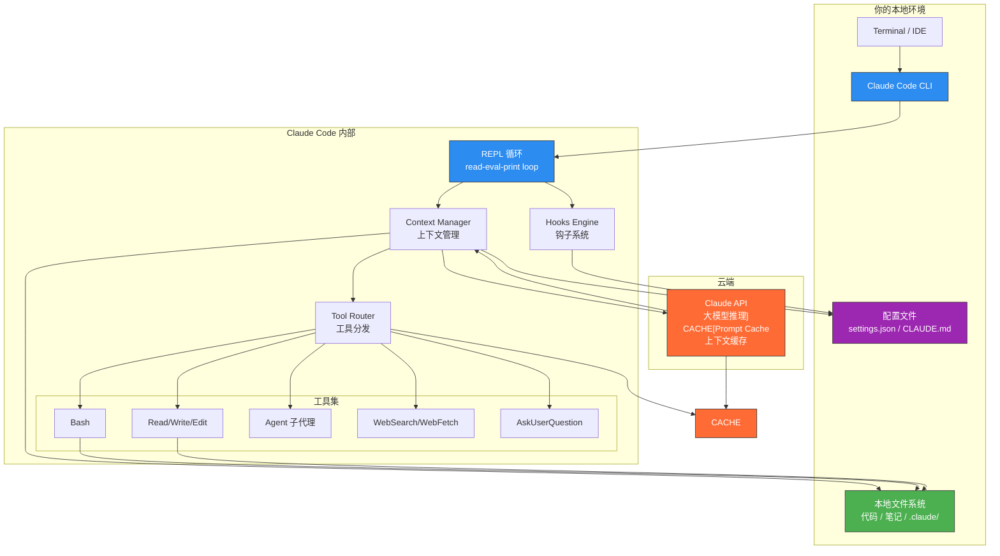
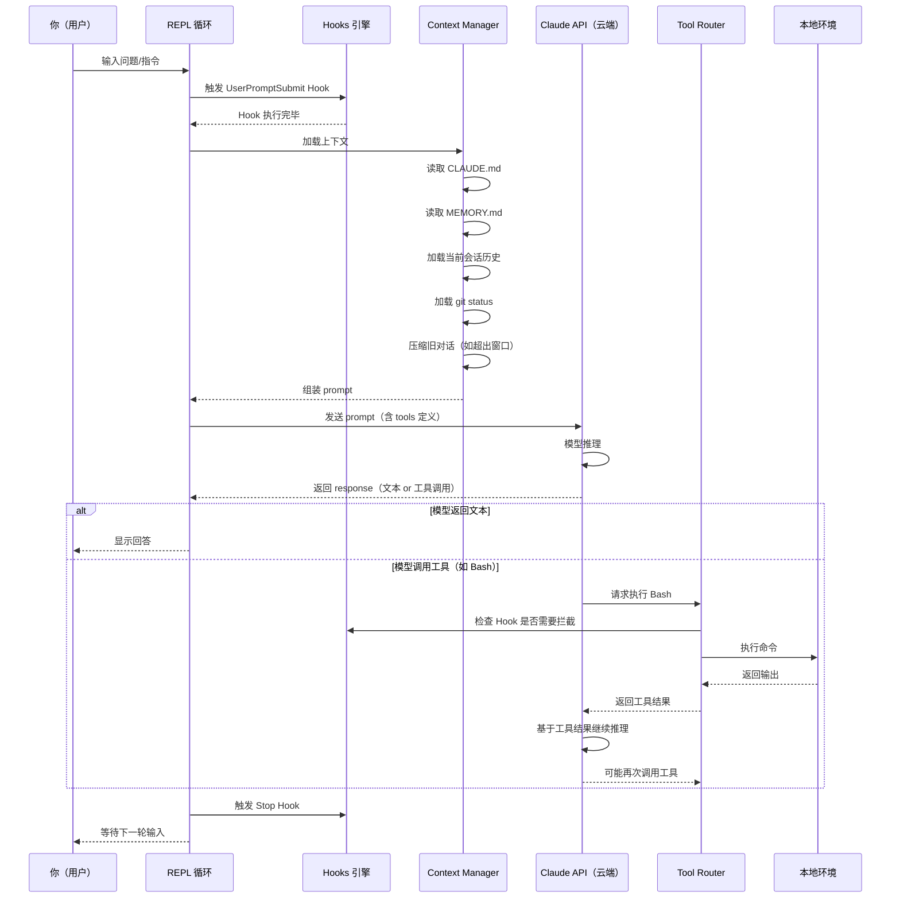
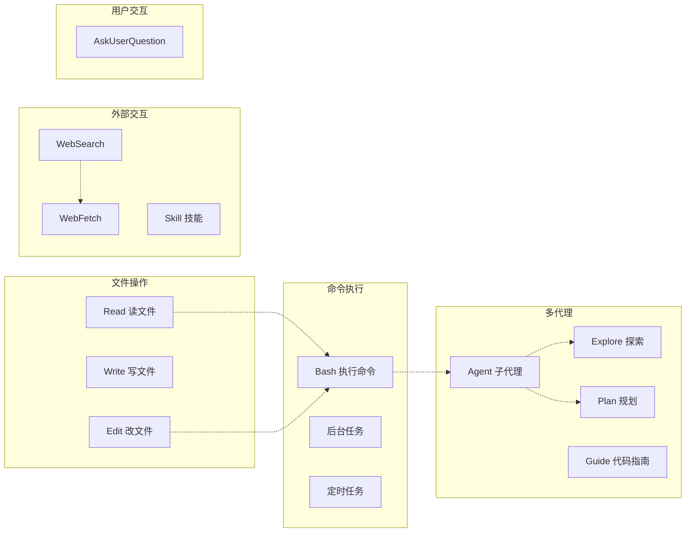
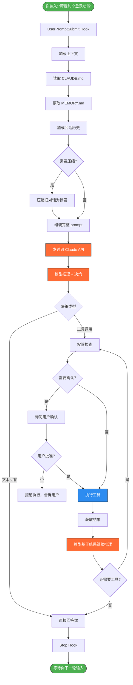
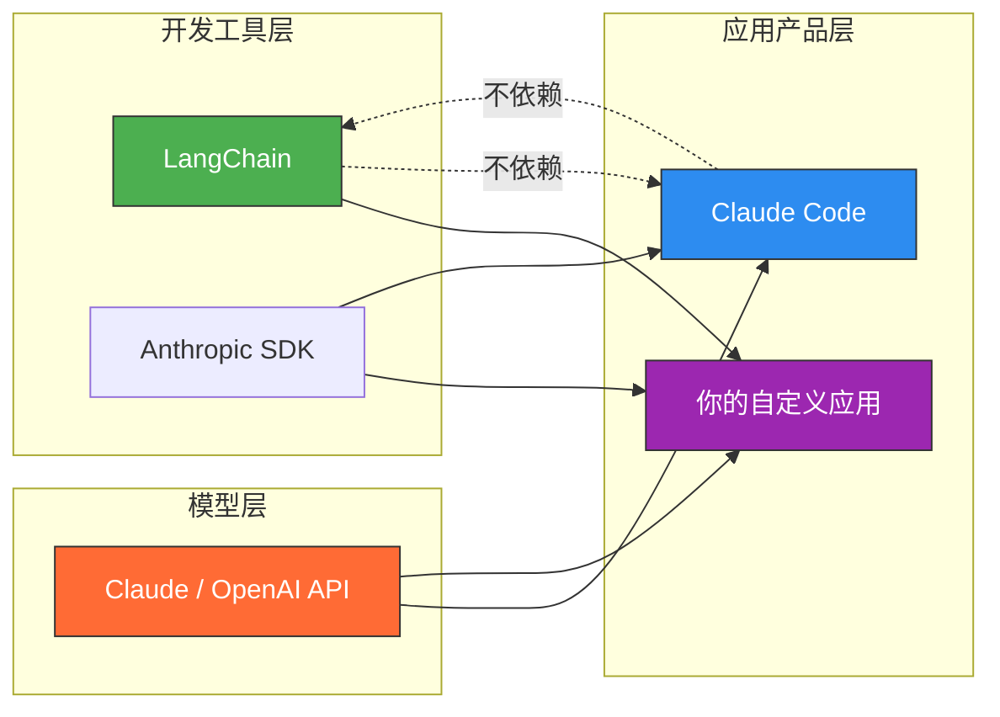

> 最后整理: 2026-05-06 | 来源: 对话 + 网络资料

## 一图总览：Claude Code 架构全景图



## 二、核心概念：用"你身边的同事"来类比

想象 Claude Code 是一个坐在你电脑前的 AI 程序员同事：

| 概念 | 类比 | 实际是什么 |
|------|------|-----------|
| **Claude API** | 大脑 | 云端大模型，负责理解意图、做决策、写代码 |
| **REPL 循环** | 对话节奏 | "你说话 → 它思考 → 它行动 → 它回答 → 等你再说"的循环 |
| **Context（上下文）** | 工作记忆 | 它能记住的对话内容 + 代码内容，有限制（~200K tokens） |
| **Tools（工具）** | 手和脚 | 能执行命令、读写文件、搜索、启动子代理 |
| **Hooks（钩子）** | 条件反射 | 每次你发话时、每轮对话结束时自动触发的脚本 |
| **CLAUDE.md** | 工作手册 | 你给这个同事的指令，告诉它应该怎么工作 |
| **Memory** | 笔记本 | 跨会话持久化的偏好、反馈、项目信息 |
| **Plugins/Skills** | 专业技能 | 额外安装的插件（如 Git LSP、代码审查） |

## 三、工作流程：一次完整对话的内部链路



## 四、分层架构详解

### Layer 1：交互层（REPL 循环）

```
REPL = Read → Evaluate → Print → Loop

┌─────────────────────────────────────────────┐
│                                             │
│   你输入: "帮我修复这个 bug"                  │
│          ↓                                  │
│   [Read]     接收用户输入                     │
│          ↓                                  │
│   [Build]    组装 prompt（上下文+工具定义）     │
│          ↓                                  │
│   [Send]     发送给 Claude API                │
│          ↓                                  │
│   [Recv]     收到模型响应                     │
│          ↓                                  │
│   [Execute]  如果是工具调用 → 执行 → 再发回模型 │
│          ↓                                  │
│   [Print]    显示最终回答                     │
│          ↓                                  │
│   [Loop]     回到开头，等下一轮                │
│                                             │
└─────────────────────────────────────────────┘
```

**关键点：** 每一轮 "模型回答 → 工具执行 → 模型再回答" 都是自动循环的。你不需要说"执行吧"——模型决定需要几个工具就调几个，直到它认为可以回答了。

### Layer 2：上下文管理（Context Manager）

```
每次你说话前，Claude Code 会自动组装一个 prompt，包含：

┌──────────────────────────────────┐
│         Prompt 组成               │
├──────────────────────────────────┤
│ 1. System Prompt（内置指令）      │
│    - 角色定义                      │
│    - 工具定义列表                   │
│    - 安全规则                      │
│                                  │
│ 2. CLAUDE.md（你的自定义指令）    │
│    - 项目规则                      │
│    - 知识库结构                    │
│    - 工作流指令                    │
│                                  │
│ 3. Memory 文件                    │
│    - 用户偏好                      │
│    - 历史反馈                      │
│    - 项目上下文                    │
│                                  │
│ 4. 当前会话历史                   │
│    - 之前的问答                    │
│    - 已经执行的操作                 │
│                                  │
│ 5. 动态上下文                     │
│    - git status                   │
│    - 当前目录                      │
│    - 环境变量                     │
│                                  │
│ 6. 你的最新输入                   │
└──────────────────────────────────┘
         ↓
   压缩/裁剪 → 控制在 token 限制内
   （旧对话自动摘要压缩，保持关键信息）
```

**你的实际感受：** 有时候我说"上次提到的那个文件"，我还记得——因为上下文里保存了之前的对话。但如果隔了很多轮，早期内容可能被压缩成摘要，细节会丢失。这就是为什么重要的东西我会写进 `memory/` 文件——那是跨会话持久化的。

### Layer 3：工具层（Tools）

这是 Claude Code 最核心的能力。模型不是"嘴上说说"——它能真正操作你的电脑：



**每个工具的能力：**

| 工具 | 能干什么 | 权限模式 |
|------|---------|---------|
| **Bash** | 执行任何 shell 命令（git、npm、grep、find...） | 根据权限模式，可能需要你确认 |
| **Read** | 读取文件内容 | 自动允许 |
| **Write** | 创建/覆盖文件 | 可能需要确认 |
| **Edit** | 精确替换文件中的字符串 | 可能需要确认 |
| **Agent** | 启动子代理（另一个 AI 同事）做并行任务 | 自动允许 |
| **WebSearch** | 搜索互联网 | 自动允许 |
| **WebFetch** | 抓取网页内容 | 自动允许 |
| **AskUserQuestion** | 弹选项让你选 | 自动允许 |
| **Skill** | 调用预定义的技能流程 | 自动允许 |

### Layer 4：Hook 系统（钩子）

Hooks 是自动触发的脚本，类似"条件反射"：

```
事件触发型 Hooks：
┌─────────────────────────────────────────┐
│                                         │
│  SessionStart  → 你刚打开 Claude Code   │
│                  执行：环境检查、状态记录  │
│                                         │
│  UserPromptSubmit → 你刚发了话           │
│                     执行：拦截、过滤、记录 │
│                                         │
│  Stop  → Claude Code 刚回答完一轮       │
│          执行：反馈收集、状态保存         │
│                                         │
│  SessionEnd  → 你关闭 Claude Code        │
│                执行：清理、保存           │
│                                         │
└─────────────────────────────────────────┘

你当前的 Hooks 配置（~/.claude/settings.json）：
- SessionStart: 阿里反馈调研脚本
- UserPromptSubmit: 阿里反馈拦截器
- Stop: 阿里反馈提示
- SessionEnd: 阿里反馈保存
```

### Layer 5：插件 & Skill 系统

```
扩展能力分层：

Plugins（插件）— 最大的扩展能力
├── MCP Servers（外部服务连接）
│   ├── LSP（代码补全/跳转）
│   ├── GitHub / Linear / Asana
│   └── Playwright / Terraform 等
├── Commands（斜杠命令）
│   ├── /review
│   └── /security-review
└── Skills（技能流程）
    ├── /brainstorming（头脑风暴）
    ├── /writing-plans（写方案）
    └── /test-driven-development（TDD）

关系：
  Plugin > Skill > 单次对话
  一个插件可以包含多个技能
  一个技能是一组预定义的对话流程 + 工具调用
```

## 五、关键机制解释

### 1. Token 与上下文窗口

```
你的对话 ≠ 无限长

每次发给 API 的内容（输入）：
├── System Prompt（~5000 tokens）
├── CLAUDE.md + Memory（几百～几千 tokens）
├── 当前会话历史（逐轮累加）
└── 你的最新输入

总窗口：~200K tokens（约等于 15 万字）

超出时怎么办？
→ 自动压缩旧对话为摘要
→ 保留最近几轮的完整内容
→ 重要信息应该写进 memory 或文件
```

### 2. Prompt Cache（缓存机制）

```
Claude API 有一种特殊的缓存机制：

Round 1: 你问 → 我把全部 prompt 发给 API（无缓存）
Round 2: 你答 → 我把上次 + 你新说的发给 API
          ↑ 上次的内容命中缓存（不重新计费）
Round 3: 你又问 → 同样，旧内容命中缓存

效果：
- 更快（不用重新理解旧内容）
- 更便宜（缓存部分计费更低）

5 分钟没说话 → 缓存过期 → 下轮对话重新计费
```

### 3. 权限模式（Permission Modes）

```
你用什么权限运行 Claude Code，决定了它有多大自由度：

┌──────────────┬────────────────────────────────────┐
│ 模式          │ 行为                                │
├──────────────┼────────────────────────────────────┤
│ Always Allow  │ 所有工具自动执行，不问              │
│              │ ⚡ 快，但文件被改了你才知道           │
├──────────────┼────────────────────────────────────┤
│ Accept-Edit   │ 读操作自动允许，写操作要确认       │
│              │ ✅ 推荐日常使用                      │
├──────────────┼────────────────────────────────────┤
│ Accept-All    │ 所有操作都要确认                    │
│              │ 🔒 最安全，但每步都要点             │
├──────────────┼────────────────────────────────────┤
│ Plan Mode     │ 只读 + 写方案，不改代码             │
│              │ 📋 适合调研/规划阶段                 │
└──────────────┴────────────────────────────────────┘
```

### 4. Git 集成（自动感知）

```
每次启动时，Claude Code 自动执行：
  git status
  git diff
  git log（最近几条）

这意味着：
- 我知道你在哪个分支
- 我看到哪些文件改了、哪些没改
- 我了解你最近的提交习惯
- 我可以直接帮你创建 commit / PR

这不是插件，是内置行为。
```

## 六、完整数据流：从你输入到我执行的完整路径



## 七、Claude Code vs LangChain：有什么区别？

### 一句话回答

Claude Code 是一个**产品**（AI 编程 IDE），LangChain 是一个**框架**（开发工具包）。Claude Code 内部**没有**使用 LangChain，是 Anthropic 自己从零写的。

### 用 Java 开发者的语言类比

| | LangChain | Claude Code |
|---|---|---|
| Java 世界的类比 | **Spring Boot**（框架） | 一个写好的 **SaaS 应用**（产品） |
| 你用它来做什么 | **写代码**，构建自己的 Agent | **直接用**，让它帮你写代码 |
| 需要会编程吗 | 需要，你是开发者 | 不需要，你是使用者 |
| 输出是什么 | 一个能运行的 AI 应用 | 代码、文件修改、Git Commit |
| 谁造的 | 社区开源项目 | Anthropic 官方 |

### Agent Loop 的封装程度对比

**LangChain** 提供的是**积木块**，你需要自己组装：

```python
# 1. 你自己定义工具
tools = [my_search_tool, my_calculator]
# 2. 你自己写 Prompt 模板
prompt = ChatPromptTemplate.from_messages([...])
# 3. 你自己组装 Agent
agent = create_openai_tools_agent(llm, tools, prompt)
# 4. 你自己决定怎么执行
executor = AgentExecutor(agent=agent, tools=tools)
result = executor.invoke({"input": "帮我查天气"})
```

**Claude Code** 本身就是**已经组装好的 Agent**：

```
Anthropic 内部已完成：
├── 工具定义（Bash, Read, Write, Edit, Agent...）
├── System Prompt（角色、规则、安全策略）
├── Agent Loop（自动循环执行工具）
├── Context Manager（上下文压缩、缓存）
├── Permission Gate（权限确认机制）
└── REPL Interface（跟你的交互界面）
```

### 一个具体例子：想做一个"查天气的 Agent"

```
用 LangChain 开发：
  1. pip install langchain
  2. 定义查天气工具（调用天气 API）
  3. 写 Prompt 模板
  4. 创建 Agent Executor
  5. 部署成服务
  6. 写前端或 CLI 让用户使用
→ 你是在"造工具"

用 Claude Code：
  你直接说："帮我写一个查天气的 Agent"
  Claude Code 自动创建 Python 文件、写代码、跑测试
→ 你是在"用工具造工具"
```

### 为什么 Claude Code 不用 LangChain？

1. **不需要** — Anthropic 有自己的 SDK（`anthropic` / `@anthropic-ai/sdk`），直接调 API 就够了
2. **更贴合自身 API** — Claude 的 tool use、prompt caching、thinking 等特性，LangChain 抽象层不一定覆盖
3. **闭源产品** — 不需要依赖外部开源框架来构建产品

### 关系图



## 八、用大白话总结

Claude Code 就是一个**带手脚的大脑**：

1. **大脑** = Claude API（云端），负责理解你说的话、做决策
2. **手脚** = 工具（Bash、Read、Write、Edit...），负责真正操作你的电脑
3. **记忆** = Context（当前会话）+ Memory（持久化），负责记住事情
4. **条件反射** = Hooks，特定事件自动触发脚本
5. **工作手册** = CLAUDE.md，你教它怎么在你这个项目里工作
6. **技能包** = Skills / Plugins，预定义的高级能力

**你每次说一句话，内部发生了什么：**
```
你说话 → 加载上下文 → 发给云端大模型 → 
大模型决定：需要读文件？→ 调用 Read 工具 → 拿到文件内容 →
大模型决定：需要改代码？→ 调用 Edit 工具 → 改完给你看 →
大模型决定：说完了 → 返回文本回答 → 等你再说
```

整个过程是循环的，直到你说"不聊了"。

> 关联: [llm-agent-mcp](../大模型/llm-agent-mcp.md) — Agent 与 MCP 协议原理 | [ai-agent-tools](./ai-agent-tools.md) — Agent 工具生态对比

## 九、关联资源

- 官方文档: [code.claude.com/docs](https://code.claude.com/docs/en/overview)
- 插件市场: [anthropics/claude-plugins-official](https://github.com/anthropics/claude-plugins-official)
- 本地配置: `~/.claude/settings.json`
- 项目指令: `CLAUDE.md`（当前项目根目录）
- 记忆系统: `~/.claude/projects/.../memory/`

Sources:
- [Claude Code Docs - Quickstart](https://code.claude.com/docs/en/quickstart)
- [Claude Code Plugins Marketplace](https://github.com/anthropics/claude-plugins-official)
