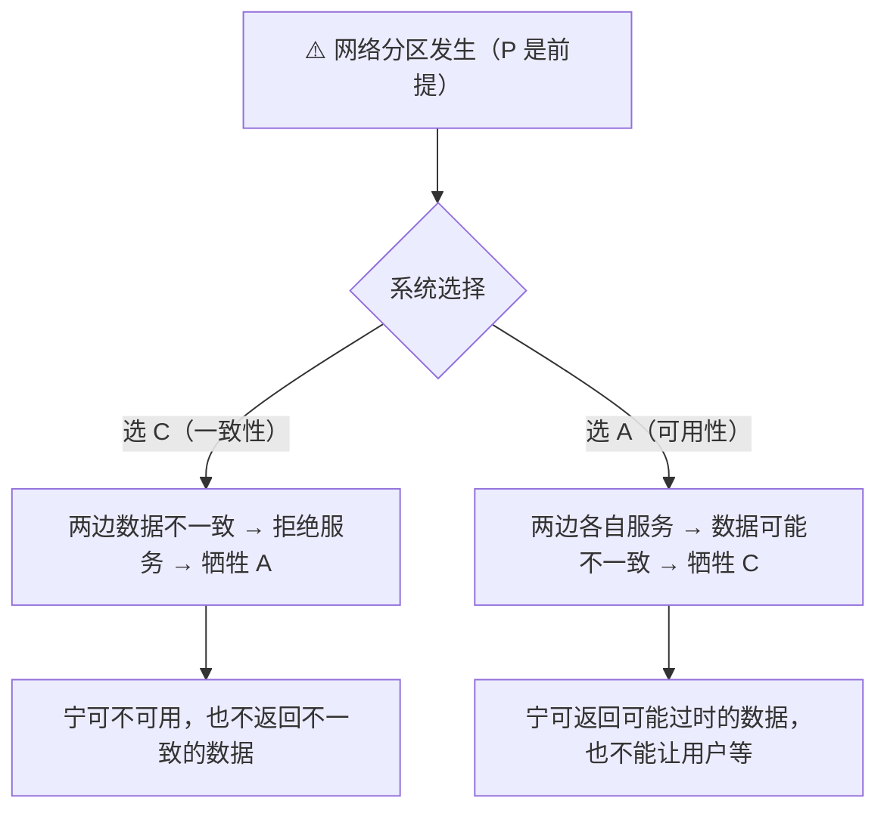
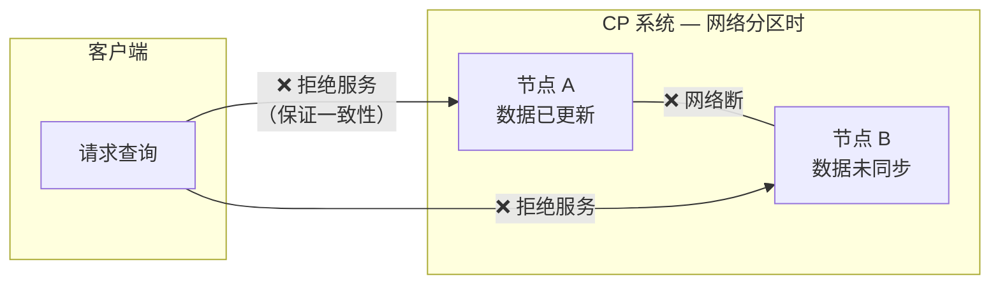
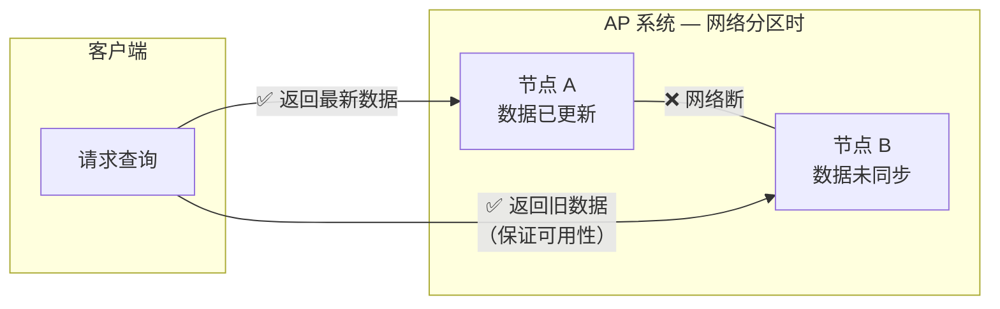
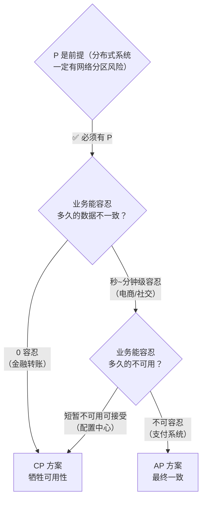
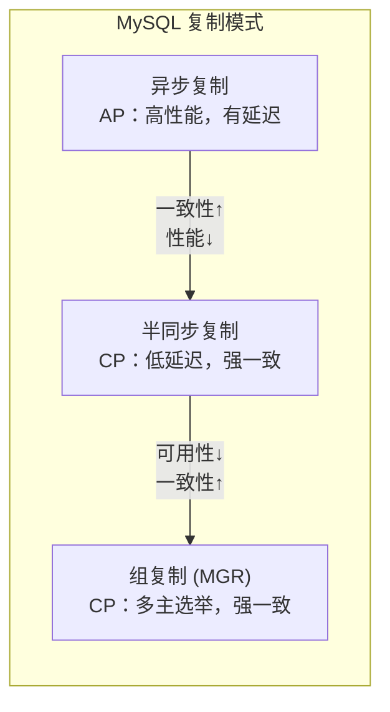
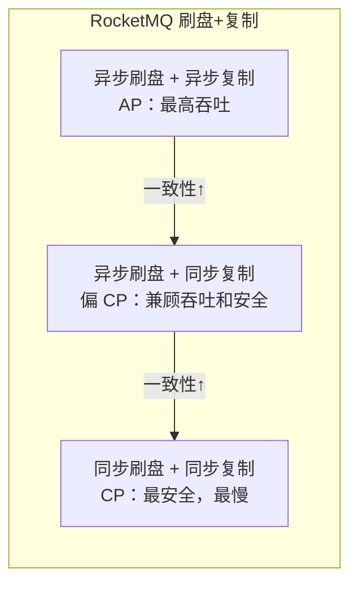
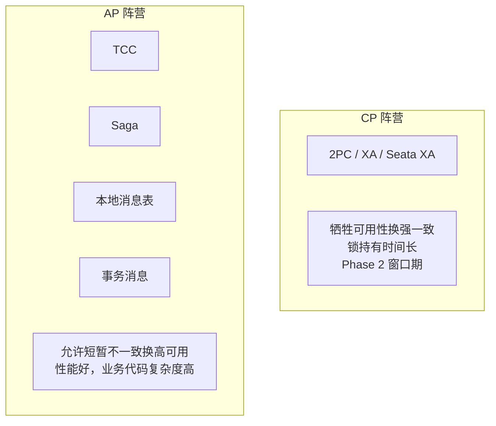

# CAP 理论与工程选型

> 最后整理: 2026-07-08 | 来源: 对话讲解

> 关联: [[../Java/分布式事务全景.md]] — 分布式事务的两大阵营就是 CAP 选择的不同体现

---

## 1. CAP 三个字母

| | 全称 | 含义 | 一句话 |
|---|---|---|---|
| **C** | Consistency | 一致性 | 所有节点在同一时刻看到相同的数据 |
| **A** | Availability | 可用性 | 每个请求都能收到一个响应（非超时/非错误） |
| **P** | Partition Tolerance | 分区容错性 | 网络分区（节点间通信中断）时系统仍能继续运行 |

**CAP 定理**（Brewer 定理，2000 年提出，2002 年被证明）：在一个分布式系统中，C、A、P 三者**最多只能同时满足两个**。

---

## 2. 为什么三者不能兼得

关键在于**网络分区（P）是分布式系统中不可避免的**——机器之间靠网络通信，网络一定会出问题（交换机故障、光纤断裂、机房隔离等）。

当分区发生时，系统面临一个二选一：

### 类比说明

你和同事各自管理一份用户表的副本，突然网络断了：

| 你的操作 | 同事那边 | 选 C 的结果 | 选 A 的结果 |
|----------|---------|------------|------------|
| 用户 A 余额 1000 → 900 | 余额还是 1000 | 用户查余额 → 503 拒绝 | 用户查余额 → 返回 1000（可能过时） |

---

## 3. 三种组合的工程含义

### 3.1 CP（放弃 A）

代表系统：**ZooKeeper、etcd、HBase**

特点：强一致，分区时宁可拒绝服务。

适用场景：
- 配置中心（配置数据必须一致，短暂不可用可接受）
- 分布式锁（锁状态必须一致，否则两个客户端同时持有锁）
- 选举 / 协调服务（leader 必须唯一）

### 3.2 AP（放弃 C）

代表系统：**Cassandra、DynamoDB、Riak**

特点：高可用，允许短暂不一致，追求最终一致。

适用场景：
- 社交 Feed（刷到新帖子晚几秒没关系）
- 购物车（商品数量暂时不准，最终对账）
- DNS（全球 DNS 传播有延迟，但最终一致）

### 3.3 CA（放弃 P）

代表系统：**传统单机房 RDBMS（MySQL 主从、Oracle RAC）**

特点：一致 + 可用，但不容忍网络分区。

适用场景：
- 单机房部署（网络分区概率极低）
- 不涉及跨机房通信的场景

> ⚠️ 严格来说 CA 在分布式系统中几乎不存在——只要你跨机房，P 就不可避免。

---

## 4. 实际工程中的选择框架

### 4.1 决策流程

### 4.2 常见系统 CAP 定位

| 系统类型 | CAP 选择 | 理由 |
|----------|---------|------|
| MySQL 主从复制 | AP（异步）/ CP（半同步） | 异步复制有延迟，半同步保证一致但牺牲可用 |
| Redis Cluster | AP | 主从异步复制，故障转移时可能丢少量数据 |
| ZooKeeper | CP | ZAB 协议保证强一致，选举期间不可用 |
| Eureka | AP | 服务注册发现，宁可返回旧数据也不拒绝查询 |
| Nacos | AP + CP 可切换 | 临时实例 AP，持久实例 CP |
| RocketMQ | AP | 异步刷盘 + 异步复制（默认），保证吞吐和可用 |
| HBase | CP | 基于 ZooKeeper，强一致 |

### 4.3 同一系统的 CAP 可调

很多系统支持在 C 和 A 之间调节：

---

## 5. 常见误区

| 误区 | 真相 |
|------|------|
| "CAP 只能选两个" | 只在分区发生时是二选一；正常情况下三者可以同时满足 |
| "选 AP 就是不要一致性" | AP 系统通常追求**最终一致**，不是完全放弃一致性 |
| "CP 比 AP 高级" | 没有高低之分，取决于业务需求 |
| "2PC 是 CP" | 2PC 在 Phase 2 存在不一致窗口，其实不完全满足 C |
| "最终一致 = 不一致" | 不是！是"一定会达到一致，只是有时间窗口" |

---

## 6. 与分布式事务的关系

分布式事务方案的两大阵营，本质上就是 CAP 选择的不同：

| 阵营 | CAP | 方案 | 代价 |
|------|-----|------|------|
| 强一致 | CP | 2PC / XA / Seata XA | 锁持有时间长，Phase 2 窗口期不可用 |
| 最终一致 | AP | TCC / Saga / 本地消息表 / 事务消息 | 性能好，但业务代码复杂度高 |

> 详见 [[../Java/分布式事务全景.md]]
