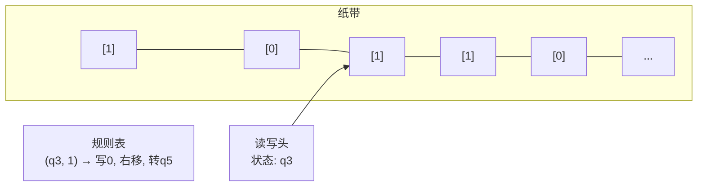
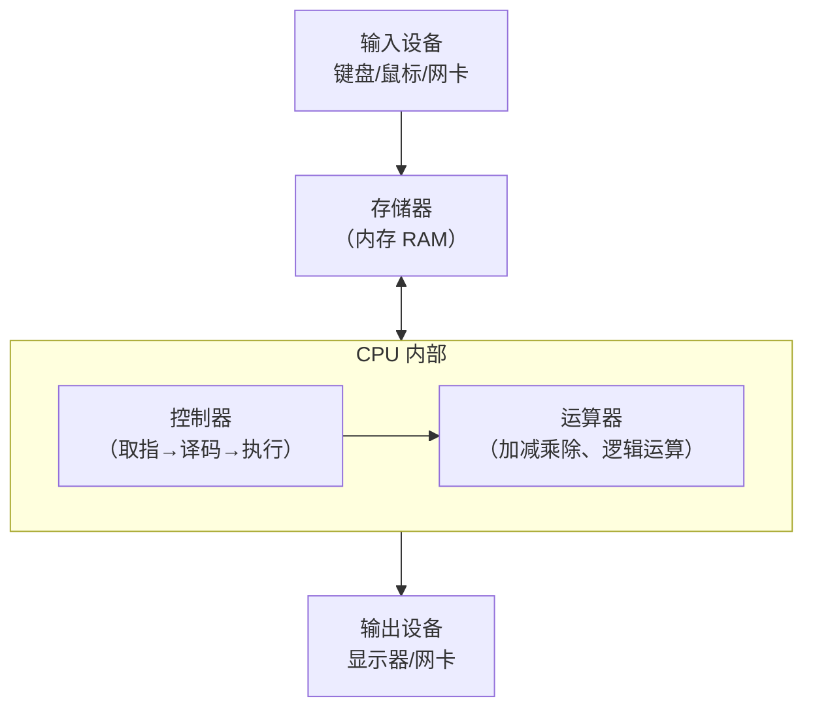

> 最后整理: 2026-05-14 | 来源: 基础概念讲解

## 2026-05-14 - 图灵机 & 冯诺依曼结构

### 图灵机 — 什么是"可计算"？

想象你有一条**无限长的纸带**，上面画着格子，每个格子里可以写一个符号（比如 0 或 1）。你还有一个**读写头**，它只能做三件事：

1. 读当前格子的符号
2. 根据**当前状态 + 读到的符号**，查一张规则表，决定：
   - 在当前格子写什么新符号
   - 向左还是向右移动一格
   - 切换到哪个新状态
3. 重复，直到进入"停机"状态



**关键洞察**：就这么简单的东西，就能计算**任何可计算的问题**。不是"图灵机很快"或"图灵机很实用"——而是只要一个问题在数学上可以被计算，就存在一台图灵机能算它。这就是**图灵完备性**的概念。你写的 Java 程序、Python 脚本，在可计算性上等价于一台图灵机。

图灵机回答的是**理论极限**问题：什么能算、什么不能算（比如停机问题就不能算）。

### 冯诺依曼结构 — 怎么把图灵机"造出来"？

图灵机是纸上的数学模型。冯诺依曼结构是**把它实际造出来的工程方案**。

核心思想：**程序和数据放在同一个存储器里**。



五大部件运行循环：

1. **输入设备** — 把程序和数据塞进存储器
2. **存储器** — 存着程序指令和数据，**不区分两者**（这是关键创新，之前的计算机程序是硬连线的）
3. **控制器** — 从存储器取指令、解码、指挥运算器干活
4. **运算器** — 做算术和逻辑运算
5. **输出设备** — 把结果送出去

这个循环就是经典的**取指-执行循环**（Fetch-Execute Cycle），现代 CPU 仍然这么工作。

### 两者关系

```
图灵机 = 理论的 "能算吗？"（可计算性理论的天花板）
冯诺依曼结构 = 工程的 "怎么造？"（几乎所有现代计算机的蓝图）

图灵机用无限纸带 + 状态转移表来做计算
冯诺依曼把它变成了 内存 + CPU（控制器 + 运算器）
```

一个类比：图灵机是理想的数学抽象，冯诺依曼结构是拿晶体管把这个抽象搭出来的施工图纸。你写的 Java 代码被编译成机器指令，在冯诺依曼结构的计算机上跑，这台计算机在理论上等价于一台通用图灵机。

> 关联: [世界的逻辑 — 读书笔记](../../读书笔记/世界的逻辑 — 马兆远.md) — 本书引言中首次触及图灵机和冯诺依曼结构
