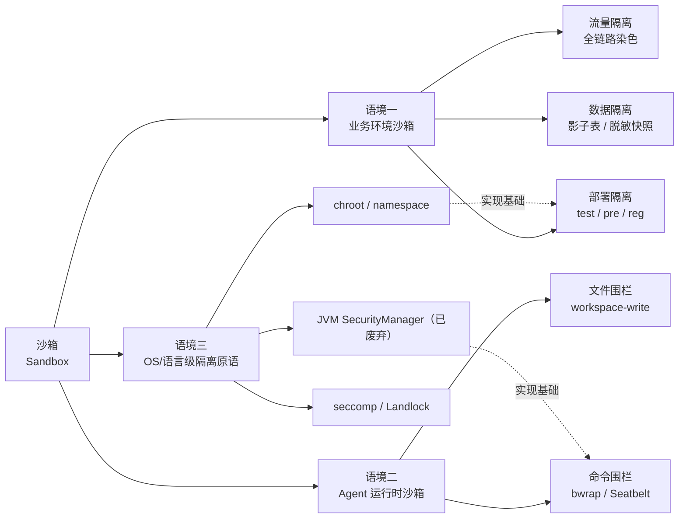
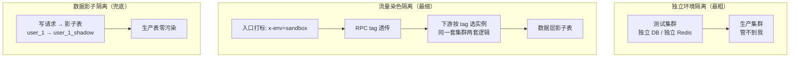
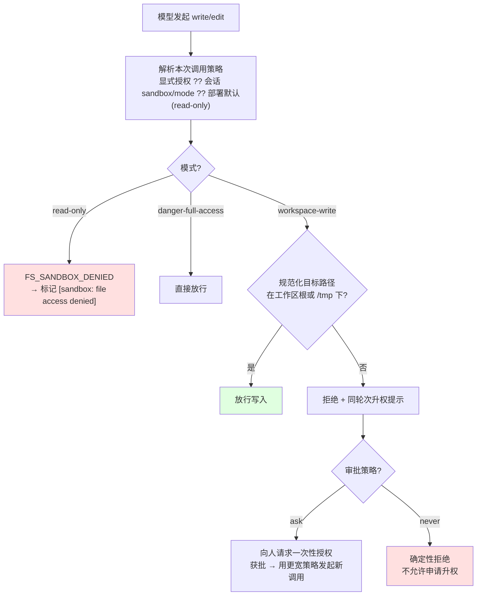

# 沙箱（Sandbox）：从进程隔离到 Agent 运行时

> 最后整理: 2026-09-11 | 来源: 对话 + DSH 源码包 README（dsh-sandbox / dsh-fs-sandbox / dsh-sandbox-local / dsh-permission-presets / dsh-user-approval）+ Claude Code·Codex 文档 + 开放平台沙箱惯例整理

> 关联: [DSH（DeepSeek Harness）插件架构与循环调度](<../../AI/AI-Coding/DSH（DeepSeek Harness）插件架构与循环调度.md>) — 沙箱在 DSH 里的源码级实现（§7 沙箱与权限双通道） | [Harness 与流程范式：SDD 落在哪一层](<../../AI/应用/Harness 与流程范式：SDD 落在哪一层.md>) — 沙箱/审批属于 Harness 的「约束层」 | [AI 编程工具：CLI Agent 与 GUI IDE 全景对比](<../../AI/AI-Coding/AI 编程工具：CLI Agent 与 GUI IDE 全景对比.md>) — Codex 的 OS 级沙箱与云端沙箱对照

## 0. 先给结论：你说的「沙箱」是哪一个

同一个词在日常有三种完全不同的指代，混在一起聊必然鸡同鸭讲：

| 你听到的说法 | 实际指什么 | 隔离的是 | 谁实施 | 典型一句话 |
|---|---|---|---|---|
| 「联调走沙箱环境」「支付沙箱」 | **业务环境隔离** | 代码版本 / 流量 / 数据 / 凭证 | 你的部署与路由系统 | 「这套环境里怎么折腾都不影响生产」 |
| 「DSH 的沙箱环境」「Agent 沙箱」 | **工具运行时约束** | 模型手里的工具（文件、命令） | Harness（DSH / Claude Code / Codex） | 「AI 的手只能伸进这个工作区」 |
| 「sandbox（技术名词）」 | **OS/语言级隔离原语** | 进程的系统调用与文件访问 | 内核或语言运行时 | 「不可信代码跑在受限的盒子里」 |

三者的**里子是同一个**：*在一个划定的边界内给出受限的能力，并且默认失败时收紧而不是放开*。差别只在"边界划在哪、谁来执行"。



## 1. 沙箱的本质：三条不变量

不管哪种语境，叫得上"沙箱"的东西必然同时满足三条。缺任何一条，它只是"另一套环境"或者"一层校验"，不是沙箱。

| 不变量 | 含义 | 反例（看着像沙箱其实不是） |
|---|---|---|
| **隔离域** | 有明确的边界，越界即失败 | 「我们有个单独的测试库」——但应用连的还是生产 Redis |
| **权限上限** | 域内能做的事实受限（只读、只能写工作区、只能调这几个接口） | 「沙箱账号」——但它其实是生产超管账号换了个名字 |
| **可丢弃/可回滚** | 炸了就扔，不需要精细恢复 | 「预发环境」——它共享生产数据库，炸了要人肉修数据 |

再加一条工程上的软约束：**失败必须朝"收紧"方向倒（fail-closed）**。DSH 的沙箱在这里做得很典型——后端不可用时它抛 `SANDBOX_UNAVAILABLE` 拒绝执行，而不是"悄悄不加限制地跑一下"：

```text
sandbox mode "<mode>" is requested but no sandbox backend is usable on this host;
refusing to run the command unconfined.
```

这句话值得记住：**宁可跑不了，也不要不受限地跑**。这是所有沙箱设计的默认姿态，也是它区别于"权限校验"的地方。

## 2. 为什么叫 sandbox：概念的来历

不是比喻拍脑袋来的，是从"给不可信代码划一块可以随便玩的活动场地"来的：

1. **1995 Java Applet**：网页里的 Java 小程序是不可信代码，JVM 用 `SecurityManager` + `AccessController` 给它一个"沙箱"——能画界面、能算数，但读写文件、开 socket 要逐项检查权限。这是"sandbox"作为计算术语的普及起点。
2. **浏览器同源策略 / iframe**：页面里的第三方 JS 同理，隔离靠的是同源策略 + 进程隔离（Site Isolation）。
3. **移动端权限模型**：Android/iOS 每个 App 一个 UID、一个私有沙箱目录。
4. **容器**：namespace + cgroup + capability 把"沙箱"工业化，成了服务端默认部署形态。
5. **Agent 工具沙箱**：2025 之后的 Coding Agent 把沙箱用在**新的对象**上——不是"不可信的第三方代码"，而是**自己模型发出的工具调用**。

Java 后端的时钟要拨一下：`SecurityManager` 这条线已经走完了。JDK 17 用 [JEP 411](https://openjdk.org/jeps/411) 把它标记为 deprecated for removal，JDK 24 用 [JEP 486](https://openjdk.org/jeps/486) 永久禁用它（`System.setSecurityManager` 直接抛 `UnsupportedOperationException`）。**"Java 沙箱"这件事，现代的做法是进程/容器级隔离，不是 JVM 内的 SecurityManager。**

```java
// 老写法（JDK 24 起已彻底不可用）：在 JVM 内给代码划权限
System.setSecurityManager(new SecurityManager());   // ❌ JEP 486 后直接抛异常

// 现代做法：把不可信代码扔进独立进程 / 容器，用内核边界兜底
ProcessBuilder pb = new ProcessBuilder("bwrap", "--ro-bind", "/", "/",
        "--bind", workspace, workspace, "--unshare-net", "java", "-jar", "untrusted.jar");
```

## 3. 技术谱系：隔离强度与代价

"沙箱"落到实现层是一串技术，强度、开销、能否挡住恶意代码差别很大：

| 层级 | 代表技术 | 拦得住什么 | 拦不住什么 | 启动开销 | 典型场景 |
|---|---|---|---|---|---|
| **语言/运行时级** | JS iframe/Worker、WASM、Python 受限 builtins、JVM SecurityManager（已废弃） | 误用 API、越权调用 | 同进程内的原生逃逸、JNI/JDK 漏洞 | 极低 | 浏览器插件、表达式引擎、规则脚本 |
| **syscall 级（同一内核）** | chroot、namespace + cgroup（容器）、seccomp-bpf、**Landlock**、**macOS Seatbelt**、Windows ACL 受限令牌 | 文件/网络/系统调用越界 | 内核漏洞逃逸；配置不完备时的旁路 | 低（毫秒级） | 容器部署、CI 任务、**Coding Agent 命令执行** |
| **硬件虚拟化级** | microVM（Firecracker / Kata）、gVisor（用户态内核）、云函数 | 内核漏洞也难逃（多一层边界） | 侧信道等极端手段 | 中高（几十~几百毫秒） | 多租户云、跑不可信代码、云端 Agent 沙箱 |

两个 Java 后端容易踩的常识点：

- **容器默认不是安全边界**。Docker 共享宿主内核，`--privileged`、挂载 `/var/run/docker.sock`、内核漏洞（Dirty Pipe 类）都能出去。容器解决的是"环境一致性"，安全隔离需要额外加固（drop capabilities、seccomp、rootless、user namespace）。
- **同内核的路径级隔离是"围栏"不是"墙"**。DSH 的 fs 沙箱 README 自己就写明了这一点：*「威胁模型：策略围栏，而非内核边界」*——检查的是"可信代码处理模型给的路径"，属于策略级拦截；挡恶意代码要靠内核级 runner。

## 4. 语境一：应用代码链路上的「沙箱环境」

### 4.1 它到底在隔离什么：四个正交维度

"沙箱环境"在大厂语境里从来不是单一方案，而是四件事的排列组合。做方案时先问"这四维各自怎么隔离"，方案就清楚了：

| 维度 | 隔离手段 | 代价 | 常见度 |
|---|---|---|---|
| **环境隔离** | 独立部署一套（test / pre / reg / 联调环境），独立配置中心 namespace、独立域名 | 机器成本高，环境易漂移 | ★★★（最基本） |
| **流量隔离** | 同一套集群里按**染色标**（RPC tag / HTTP header / MQ property）路由到指定版本的实例 | 需要全链路透传，改造面广 | ★★（进阶） |
| **数据隔离** | 影子库 / 影子表（SQL 改表名）、脱敏快照、独立 topic | 需要中间件支持，覆盖不全就串味 | ★★（最容易漏） |
| **凭证隔离** | 沙箱 AppID / 沙箱密钥 / 沙箱网关，第三方返回模拟结果 | 依赖对方平台 | ★★★（对外联调必备） |



### 4.2 真实产品里长什么样

- **支付宝开放平台沙箱**：给你一套沙箱 AppID + 沙箱买家账号，网关指向 `openapi.alipaydev.com` 而非生产网关，返回的是模拟交易结果。开发期全程不碰真钱（[环境升级说明](https://opendocs.alipay.com/common/097l48)）。
- **微信支付沙箱**：沙箱商户 + 沙箱验签密钥 + 沙箱 API 域名，需要先在商户平台申请开通（官方做过[沙箱功能升级](https://developers.weixin.qq.com/community/pay/doc/0002c437a1c6f00ba87ef1a1a5ec01)）。
- **Stripe Test Mode**：test key + 测试卡号 + Test Clocks（模拟时间推进，测订阅续费这类"要等一个月"的逻辑）。**这是"凭证隔离 + 数据隔离"最漂亮的工业实现**。
- **云厂商 OpenAPI 沙箱**：调用返回假资源 ID，不产生真实计费。

共同特征：**隔离靠"换一套凭证 + 换一个网关地址"实现**，你的业务代码几乎不用改分支逻辑，改的是配置。

### 4.3 Java 后端落地清单（含最容易漏的一条）

如果要在自己服务里落地"沙箱链路"，这几点是必须过的检查项：

```java
// ① 染色标必须透传三类通道，缺一个就断链
//    HTTP:  header（网关注入）
//    RPC:   Dubbo attachment / Spring Cloud header —— 框架自动透传要显式确认
//    MQ:    message property（不是 body！）
// ② 异步线程池是最大盲点：ThreadLocal 不过线程池
```

| 检查项 | 做法 | 漏了会怎样 |
|---|---|---|
| RPC 透传 | Dubbo `RpcContext.getContext().setAttachment("x-env","sandbox")` / 拦截器统一注入 | 下游回落生产逻辑，沙箱订单写进生产表 |
| MQ 隔离 | 用独立 topic，或至少用 message property 让消费者自己过滤 | **沙箱消息被生产消费者消费**（最经典的事故） |
| 异步线程 | `TransmittableThreadLocal` / 手动 decorate 线程池 | 主线程染色正常，异步分支丢标 |
| 数据层 | 影子表中间件（SQL 解析改表名）+ 独立缓存前缀 | 缓存 key 没加环境前缀 → 读生产缓存"串味" |
| 回调地址 | 第三方回调 URL 指向沙箱域名，别写死生产 | 沙箱链路把生产当回调目标 |
| 第三方凭证 | 沙箱 key 存在配置中心沙箱 namespace | 用生产 key 发起了真实交易 |

### 4.4 四个高频坑

1. **只隔离入口不隔离出口**：入口打了标、RPC 也透传了，但发出的 MQ 消息投到生产 topic，被生产消费者处理——污染发生在"出口"。
2. **影子表只覆盖了 MySQL**：ES / Redis / 本地缓存 / 定时任务扫表没影子，数据从旁路污染。
3. **"只是读生产库"**：只读也会拖垮生产（大查询、慢 SQL、锁）；而且读到的生产数据一旦落到沙箱表就再也擦不掉。
4. **环境漂移**：独立环境几个月没人用，配置和代码早跟生产不一致——沙箱里验通过，上线照样炸。这也是"流量染色"方案越来越受欢迎的原因：**它天然跟着生产代码走**。

## 5. 语境二：Agent 运行时的沙箱（DSH 里跑的那个）

### 5.1 你在会话里看到的原文，就是策略本体

DSH 每个会话的运行时上下文里都有一行"当前文件策略"，这不是文案，是**沙箱模式回显**。本会话的真实内容：

```markdown
Current DSH file policy: workspace-write. Any available operation enforced by the DSH file
sandbox may modify files under the session workspace: "<workspace root>".
Some platform temporary areas may also be writable.
```

三种模式的完整语义（`SandboxMode` 词汇表）：

| 模式 | 语义 | 对应审批策略（permissionPresets 默认组合） |
|---|---|---|
| `read-only` | 任何变更类操作被结构化拒绝 | 部署默认值（**故障安全**：没有配置时就是它） |
| `workspace-write` | 只能写工作区根 + 平台临时区（`/tmp`、`os.tmpdir()`） | `ask`（需要越权时问人） |
| `danger-full-access` | 不加文件围栏 | `never`（不再问，也**不允许**申请升权） |

关键设计：**模式是逐调用（per-call）解析的，不是全局开关**。同一个 DSH 进程里，bash 工具可以按 `read-only` 跑，而某个受限子 agent 保持自己的状态目录可写——策略随调用传递，不挂在提供方上。

### 5.2 两条强制通道：一个围栏、一个内核边界

这是 DSH 沙箱最值得学的一点：**"改文件"和"跑命令"走的是两套完全不同的机制，强度不同，不能混为一谈**。

| | 文件工具（`ctx.fs`） | 命令执行（`ctx.shell`） |
|---|---|---|
| 机制 | 进程内路径检查：规范化后判断目标是否在可写根下 | 重写 argv：`ctx.sandbox.confine(argv, policy)` 返回被包装的命令 |
| 后端 | 无（可信代码里的策略判断） | Linux `bwrap` → 否则 Landlock launcher；macOS `sandbox-exec`/Seatbelt；Windows ACL 受限令牌 |
| 强度 | **策略围栏**（agent 自己绕不过工具，但对抗性进程不在威胁模型内） | **内核边界**（进程及其子进程都在限制下） |
| 失败姿态 | 结构化 `FS_SANDBOX_DENIED`，渲染为 `[sandbox: file access denied under <mode> mode]` | 无可用后端则抛 `SANDBOX_UNAVAILABLE`，**拒绝执行** |
| 已知弱点 | TOCTOU（检查与系统调用之间替换祖先符号链接）——靠"写入前立即重新规范化"缩小，未消除 | Windows ACL 与旧内核 Landlock 只能报 `partial` 强制执行 |

两者共享同一个"可写集合"函数（`writableRoots`），保证 fs 围栏和 Seatbelt profile 不会各说各话——**这是防"分裂世界"的工程细节**：如果两边各算各的可写路径，就会出现"工具说能写、命令却被内核拒"的诡异现象。

### 5.3 一次文件写入在沙箱里的完整决策



注意 `D` 和 `K` 两条路：**都是 fail-closed**。审批的语义也很克制——"一次性、仅限该操作、属于当前未结束的轮次"，应答者缺失时按拒绝处理（fail closed），而不是"没人管就先放行"。

### 5.4 它到底把爆炸半径缩到了多大

- **能碰的**：会话工作区（不可变的 `SessionHeader.cwd`）+ 少量平台临时目录。
- **碰不到的**：工作区之外的一切——`~/.ssh`、`~/.mws`、`/etc`、别的项目目录。
- **典型体感**：想往 `~/.mws` 写配置会被拒，正确做法是改到工作区内，或者显式申请一次升权——**而不是换个工具（比如 base64 塞进别处）绕开围栏**。绕围栏这件事本身在工程上就等于把沙箱拆了。

对照另外两个 Agent：Codex 走的是更硬的路子（Seatbelt / Landlock / Seccomp 内核级隔离，另有"云沙箱"每个任务一个独立容器）；Claude Code 是权限三层（allow/deny/ask）+ 计划模式，`bypassPermissions` 官方建议只在容器内用。

## 6. 三者对照：一张表把概念对齐

| | 业务环境沙箱 | Agent 运行时沙箱 | OS 级隔离原语 |
|---|---|---|---|
| **要解决的问题** | 别污染生产 | 别让模型的手乱伸 | 别让不可信代码逃逸 |
| **被隔离对象** | 代码版本 / 流量 / 数据 / 凭证 | 工具调用（文件、命令） | 进程与系统调用 |
| **谁执行** | 部署系统、网关、RPC 路由、中间件 | Harness（DSH / Claude Code / Codex） | 内核（或语言运行时） |
| **失败时的表现** | 串味（数据/消息漏进生产） | 工具调用被拒 + 升权提示 | 系统调用返回 EPERM/EACCES |
| **能否"绕"** | 能（配置漂移、旁路写） | 不该绕（绕过等于拆沙箱） | 理论不可绕，实际拼内核抗性 |
| **典型强度** | 弱~中（依赖改造覆盖度） | 中（命令侧到内核级） | 强（取决于用哪层） |

一句话记忆：**业务沙箱隔离"环境"，Agent 沙箱隔离"手"，OS 沙箱隔离"进程"**。

## 7. 判据：这到底算不算一个"真沙箱"

拿到任何号称"沙箱"的东西，问这 5 个问题：

1. **它隔离的是什么？** 四个维度（环境/流量/数据/凭证）各覆盖了哪些？——答不上来通常是"一套独立部署"而已。
2. **越界时 fail-open 还是 fail-closed？** 安全设计必须 fail-closed；"backend 不可用就降级放行"等于没有沙箱。
3. **边界在哪一层？** 进程内策略检查 ≠ 内核边界。写下它的威胁模型（DSH 的做法是直接写在 README 里）。
4. **可写集合能穷举吗？** 列出所有可写路径/topic/表；列不出来说明爆炸半径不可控。
5. **越权通道是否受限且留痕？** 一次性、限操作、进审计日志——三者缺一，沙箱就是橡皮图章。

## 8. 常见误解

| 误解 | 现实 |
|---|---|
| "沙箱 = 虚拟机" | 容器类沙箱共享内核，只是 namespace 隔离；只有 microVM/gVisor 那层才是硬件/用户态内核级 |
| "沙箱 = 测试环境" | 测试环境可能直连生产库；沙箱的核心是**受限**，不是**另开一套**。很多公司内部把预发叫"沙箱"，那是语境一的一种实现 |
| "有沙箱就安全了" | 策略围栏 ≠ 内核边界；Landlock/Windows ACL 只报 `partial` 强制执行；macOS Seatbelt 依赖 Apple 已标注 deprecated 的 `sandbox-exec` |
| "AI 被拒了就该全放开" | 升权是**一次性、按操作**的，不是关掉沙箱；`never` 策略下连申请都不允许，确定性拒绝 |
| "只读模式随便跑" | 只读挡住了写，但挡不住信息泄露与资源消耗；对陌生仓库跑 agent 仍要配合网络与进程限制 |

遇到 `[sandbox: file access denied under <mode> mode]` 的标准处理顺序：**① 改路径到工作区内** → ② 产物放 `os.tmpdir()` → ③ 确实必须外部路径时，显式申请一次升权（并说明理由）。不要试图用别的工具绕过去。

## 9. 相关与延伸

- [DSH（DeepSeek Harness）插件架构与循环调度](<../../AI/AI-Coding/DSH（DeepSeek Harness）插件架构与循环调度.md>) §7 — 沙箱与审批在 DSH 里的源码级实现（seam 拆分、permissionPresets、会话事件持久化）
- [Harness 与流程范式：SDD 落在哪一层](<../../AI/应用/Harness 与流程范式：SDD 落在哪一层.md>) — sandbox/approval 是 Harness「约束层」的两个旋钮
- [AI 编程工具：CLI Agent 与 GUI IDE 全景对比](<../../AI/AI-Coding/AI 编程工具：CLI Agent 与 GUI IDE 全景对比.md>) — Codex 的 OS 级沙箱 / 云端沙箱与 Claude Code 权限模型对比
- [CLI Coding Agent 系统架构：从 REPL 到自主编程](<../../AI/应用/CLI Coding Agent 系统架构：从 REPL 到自主编程.md>) — Safety Layer 在 Agent 架构中的位置
- 开放平台沙箱：[支付宝环境升级说明](https://opendocs.alipay.com/common/097l48)、[微信支付沙箱功能升级](https://developers.weixin.qq.com/community/pay/doc/0002c437a1c6f00ba87ef1a1a5ec01)
- Java 沙箱史：[JEP 411（deprecate SecurityManager）](https://openjdk.org/jeps/411)、[JEP 486（永久禁用）](https://openjdk.org/jeps/486)
