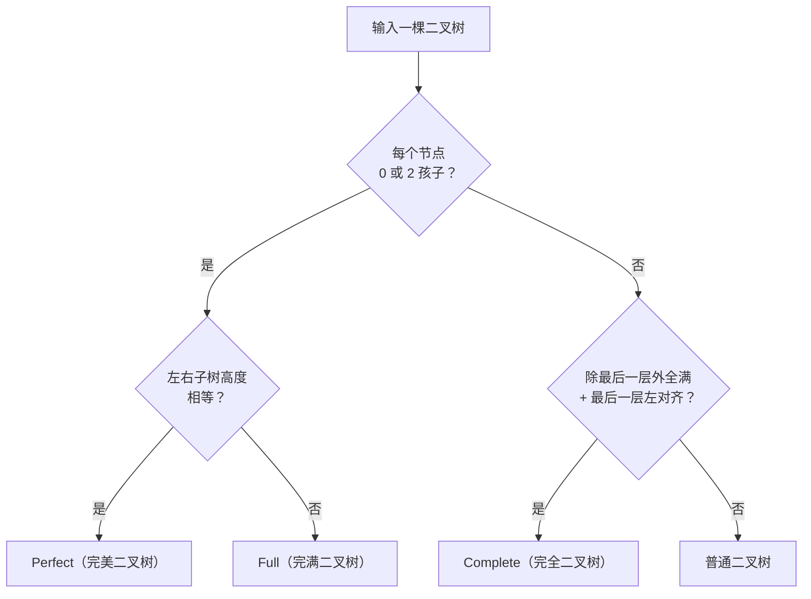

# 满二叉树判定算法

> 最后整理: 2026-09-11 | 来源: 面试题拆解

> 关联: [[../Java/Redis 常用数据类型与使用场景.md]] — 跳表的层数期望与树高估算同属"结构高度 vs 节点数"的量化分析

---

## 1. 定义澄清（面试前必须对齐）

不同教材对"满二叉树"的术语不统一，面试时**第一件事是和面试官确认定义**：

| 术语 | 中文 | 定义 | 节点数公式 |
|------|------|------|-----------|
| **Full Binary Tree** | 完满二叉树 | 每个节点有 0 或 2 个孩子（不能只有一个孩子） | 无固定公式 |
| **Perfect Binary Tree** | 满二叉树 / 完美二叉树 | 每层全满，所有叶子在同一层 | 2^h - 1 |
| **Complete Binary Tree** | 完全二叉树 | 除最后一层外全满，最后一层从左到右连续 | 无固定公式 |

**最常见的面试题考察的是 Perfect Binary Tree（完美二叉树）**——每层全满、总共 2^h-1 个节点。

---

## 2. 解法一：递归（推荐，最简洁）

**思路**：满二叉树 = 左右子树都是满二叉树 + 左右子树高度相等。

```go
type TreeNode struct {
    Val   int
    Left  *TreeNode
    Right *TreeNode
}

// 返回 (高度, 是否满二叉树)
func checkFull(node *TreeNode) (int, bool) {
    if node == nil {
        return 0, true
    }
    leftH, leftFull := checkFull(node.Left)
    rightH, rightFull := checkFull(node.Right)
    return max(leftH, rightH) + 1, leftFull && rightFull && leftH == rightH
}

func isFullTree(root *TreeNode) bool {
    _, ok := checkFull(root)
    return ok
}
```

```java
// Java 版本
class Result {
    int height;
    boolean isFull;
    Result(int h, boolean f) { height = h; isFull = f; }
}

Result checkFull(TreeNode node) {
    if (node == null) return new Result(0, true);
    Result left = checkFull(node.left);
    Result right = checkFull(node.right);
    return new Result(
        Math.max(left.height, right.height) + 1,
        left.isFull && right.isFull && left.height == right.height
    );
}

boolean isFullTree(TreeNode root) {
    return checkFull(root).isFull;
}
```

时间复杂度 O(n)，空间复杂度 O(h)（递归栈，h = log n）。

---

## 3. 解法二：BFS + 验证（适合非递归场景）

**思路**：层次遍历，用 `null` 标记空节点。如果遇到 null 后还有非空节点 → 不是满二叉树。

```go
func isFullTreeBFS(root *TreeNode) bool {
    if root == nil { return true }

    queue := []*TreeNode{root}
    foundNull := false

    for len(queue) > 0 {
        node := queue[0]
        queue = queue[1:]

        if node == nil {
            foundNull = true
            continue
        }

        if foundNull {
            return false // null 之后不应再有非空节点
        }

        queue = append(queue, node.Left, node.Right)
    }
    return true
}
```

这个方法其实判定的是 **Complete Binary Tree（完全二叉树）**，不是满二叉树。需要额外验证节点数。

---

## 4. 解法三：计数法（有坑，容易忽视）

```go
func isFullTreeByCount(root *TreeNode) bool {
    if root == nil { return true }

    total, maxDepth := 0, 0
    var dfs func(*TreeNode, int)
    dfs = func(node *TreeNode, depth int) {
        if node == nil { return }
        total++
        if depth > maxDepth { maxDepth = depth }
        dfs(node.Left, depth+1)
        dfs(node.Right, depth+1)
    }
    dfs(root, 1)
    return total == (1<<maxDepth)-1
}
```

**这个解法有漏洞**：如果一棵树每层都缺右子树但缺得恰到好处——节点数碰巧等于 2^h - 1，但它不是满二叉树。反例：

```
    1
   / \
  2   3
 / \   \
4   5   7

节点数 7 = 2^3 - 1 ✓（看起来像满二叉树）
但实际上第 3 层不都是叶子（3 有孩子 7）→ 不是满二叉树 ✗
```

**结论**："节点数 = 2^h - 1"是必要条件但不是充分条件。真正的满二叉树还必须满足"每个节点 0 或 2 孩子 + 所有叶子同层"。

---

## 5. 复杂度对比

| 解法 | 时间复杂度 | 空间复杂度 | 可靠性 |
|------|-----------|-----------|--------|
| 递归 | O(n) | O(h) | ✅ 最可靠 |
| BFS + 计数验证 | O(n) | O(n) | ⚠️ 需要额外验证 |
| 纯计数 | O(n) | O(h) | ❌ 有反例 |

**面试推荐用递归解法**——代码最短、逻辑最清晰、无坑。

---

## 6. 延伸：三种二叉树的判定对比



> ⚠️ 下面这段 Go 代码的逻辑已用等价实现跑到 6 组用例全 PASS（单节点 / 完美 7 节点 / 完满非完美 / 仅左子 / 仅右子 / 左重链状），但**未过 Go 编译器**（编写环境无 go 工具链）。照抄进项目前请本地 `go build` / `go vet` 跑一遍。

```go
// 一键三判定
type TreeType int
const (
    Normal   TreeType = iota
    Full              // 完满：每个节点 0 或 2 孩子
    Complete          // 完全：除最后一层外全满 + 左对齐
    Perfect           // 完美：每层全满
)

// checkAll 一次遍历算出三种判定所需的全部信息
// 返回 (节点数, 是否完满, 是否完全, 是否完美)
func checkAll(root *TreeNode) (int, bool, bool, bool) {
    if root == nil {
        return 0, true, true, true
    }

    // 完美：直接复用 §2 的 checkFull（左右子树高度相等且子树都完美）
    _, isPerfect := checkFull(root)

    isFull, isComplete, count := true, true, 0
    // 层序 BFS，把空孩子也入队：一旦出队遇到 nil，后面不允许再出现非 nil
    queue := []*TreeNode{root}
    seenNil := false
    for len(queue) > 0 {
        node := queue[0]
        queue = queue[1:]
        if node == nil {
            seenNil = true
            continue
        }
        if seenNil {
            isComplete = false // 空缺之后还有节点 → 不是"最后一层左对齐"
        }
        count++
        // 只有一个孩子（左空右不空 / 左不空右空）→ 违反"0 或 2 个孩子"
        if (node.Left == nil) != (node.Right == nil) {
            isFull = false
        }
        queue = append(queue, node.Left, node.Right)
    }
    return count, isFull, isComplete, isPerfect
}

func classifyTree(root *TreeNode) TreeType {
    if root == nil { return Perfect }
    _, isFull, isComplete, isPerfect := checkAll(root)
    if isPerfect { return Perfect }
    if isFull    { return Full }
    if isComplete{ return Complete }
    return Normal
}
```
