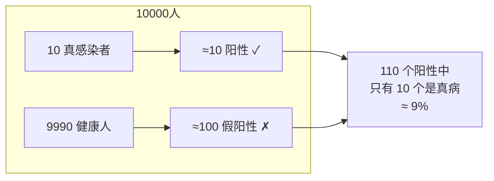
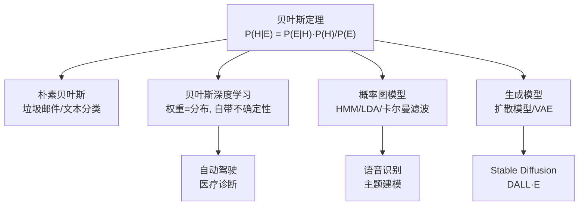

> 最后整理: 2026-05-14 | 来源: 基础概念讲解

## 2026-05-14 - 贝叶斯统计 & 与 AI 的关系

### 核心直觉：用新证据更新旧信念

传统统计（频率学派）问："如果硬币公平，连续扔出 3 次正面的概率是多少？"

贝叶斯统计反过来问："我已经扔出了 3 次正面，硬币是公平的概率是多少？"

```
先验信念（Prior）  +  观察到的证据（Evidence）→ 后验信念（Posterior）

后验 = 似然 × 先验 / 证据
P(H|E) = P(E|H) × P(H) / P(E)
```

### HIV 检测例子 — 为什么先验这么重要

> 你去体检，HIV 检测结果阳性。检测准确率 99%，人群中 HIV 感染率是 0.1%。你真的有 99% 的概率得了 HIV 吗？

先验: 随机一个人得 HIV 的概率 = 0.1%（极低）
证据: 检测阳性

来算后验——

10000 个人里：
- 10 个真感染者 → 10 × 99% ≈ 10 个阳性
- 9990 个健康人 → 9990 × 1% ≈ 100 个假阳性

所以检测阳性后，真正得病的概率 ≈ 10 / (10 + 100) ≈ **9%**，不是 99%。



**核心直觉**：当基础概率极低时，即使测试很准，阳性结果也大概率是假的。先验很重要。

### 与 AI 的关系 — 四处关键交集

#### 1. 朴素贝叶斯分类器

最直接的落地。垃圾邮件过滤器：

```
P(垃圾|"免费"+"点击"+"赢取") ∝ P("免费"|垃圾) × P("点击"|垃圾) × P("赢取"|垃圾) × P(垃圾)
```

"朴素" = 假设每个词独立出现（显然不对，但效果意外地好）。

#### 2. 贝叶斯深度学习 — 权重是分布，不是数字

传统 NN: 权重是一个固定数字，w₁ = 0.37
贝叶斯 NN: 权重是一个分布，w₁ ~ N(0.37, 0.05²)

这意味着贝叶斯网络知道自己什么时候不确定——对自动驾驶、医疗诊断这种不能出错的应用至关重要。

```
传统 NN → 输出 "这是猫，概率 0.92"
贝叶斯 NN → 输出 "这是猫，概率 0.92，但我对这个数字的信心只有 ±0.15"
```

#### 3. 概率图模型

隐马尔可夫模型（HMM）、LDA 主题模型、卡尔曼滤波器——全是贝叶斯框架下的产物。核心思想：

```
有一组隐藏变量 → 观察到一些数据 → 反推隐藏变量的分布
```

#### 4. 生成模型

Stable Diffusion、DALL·E 学的是一个 P(图像|文字) 的条件分布。扩散模型的去噪过程带着贝叶斯推断的味道。

### 关系全景



> 关联: [LLM（大语言模型）](../AI/大模型/LLM（大语言模型）.md) · [生成式 AI](../AI/大模型/生成式 AI.md) · [Transformer](../AI/基础/Transformer.md)
