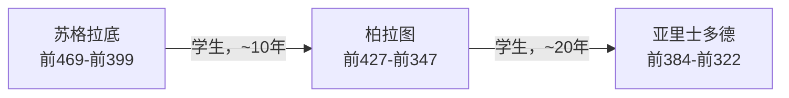
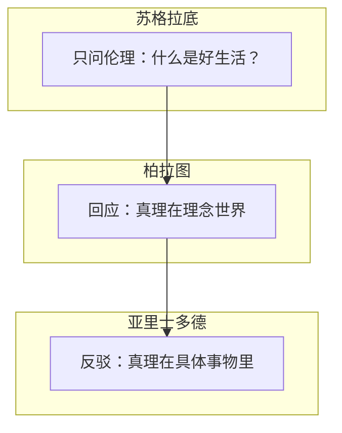

# 世界的逻辑 — 马兆远

> 最后整理: 2026-06-07 | 来源: 多轮对话

## 2026-06-07 - 全书结构 + 古希腊哲学三人

### 这本书到底在讲什么

初看以为是 AI/技术书，实际上是**一部人类认知方法的演变史**。核心命题：人类如何用理性应对不确定性？

全书三部分：

| 部分 | 章节 | 主线 |
|------|------|------|
| 一：确定性追求 | 第1-2章（语言、宗教） | 从古埃及语言到一神教，人类早期如何建立确定性 |
| 二：理性认知基础 | 第3-5章（希腊哲学、古典逻辑、理性巅峰） | 从苏格拉底到牛顿，理性"确定性机器"建成 |
| 三：应对不确定性的武器 | 第6-13章（实践论→数学危机→哥德尔→AI→混沌→概率→量子） | 确定性崩塌后，人类开发的新武器 |

AI 只占第 10 章。全书的叙事弧线是：人类怎么从"求神问卜"进化到"理性推演"，又怎么从"追求绝对真理"进化到"拥抱不确定性"。AI 只是这条线的最新一站。

### 苏格拉底、柏拉图、亚里士多德

三人是直接的**师徒三代**。读第 3 章希腊哲学时做的梳理：

**苏格拉底**：把哲学从天上拉回人间。之前哲学家追问"宇宙由什么构成"，他说先搞明白"人怎么活"。核心方法是反诘追问——在街头逮住人问"什么是勇敢？"直到对方发现自己其实不知道。死于雅典民主投票（"腐蚀青年"罪）。

**柏拉图**：亲眼看着"全雅典最正义的人"被民主投票处死，终其一生对民主充满怀疑。提出**理型论**：现实世界只是理念世界的影子。"圆的理念"完美，画的圆总有缺陷。哲学家的工作是通过理性看见理念世界。《理想国》主张哲学家当国王。

**亚里士多德**：反驳老师——没有独立存在的"猫的理念"，共性就在每只具体的猫身上。从经验观察出发，开创了生物分类学、形式逻辑（三段论）、比较政治学、物理学雏形。"吾爱吾师，吾更爱真理。"

三代构成正反合，柏拉图 vs 亚里士多德的争论（理性指向理念 vs 经验世界）一直打到今天的符号 AI vs 统计学习。

---

## 引言 — 图灵机与冯诺依曼结构

阅读引言时接触到图灵机和冯诺依曼结构这两个核心概念，做了系统梳理。

- **图灵机**：理论模型，用无限纸带 + 状态转移表定义"可计算性"的边界。→ [图灵机与冯诺依曼结构](../技术/计算机基础/图灵机与冯诺依曼结构.md)
- **冯诺依曼结构**：把图灵机的理论模型工程化实现——程序和数据存在同一个存储器里，五大部件（输入/输出/存储/控制/运算）协同工作。→ [冯诺依曼结构](../技术/计算机基础/图灵机与冯诺依曼结构.md)
