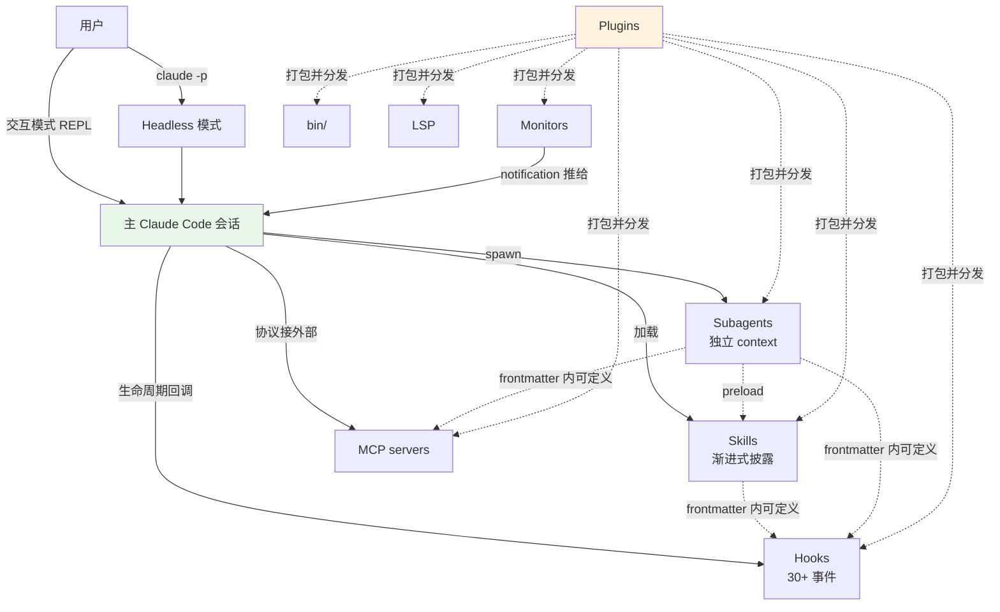

# Claude Code 工程化实战 黄佳

> 最后整理: 2026-06-08 | 来源: 极客时间课程 + 官方文档交叉验证

> 这个文件是**学习驾驶舱**：narrative 形式记录学习节点、对应专题文件、个人疑问。
> 各机制的深度讲解在专题文件里，链接见下。

---

## §1 学习日志

| 日期 | 章节/主题 | 状态 | 关键收获 |
|------|---------|------|---------|
| 2026-06-08 | 百舸争流：多任务并行探索与流水线编排 | ✅ | 并行探索 vs 流水线编排两种模式 + Handoff Contract 交接契约 + 混合模式 + 实践：给现有 subagent 加结构化契约 |
| 2026-06-06 | 去芜存菁：高噪声任务处理——测试运行器与日志分析器 | ✅ | Sub-Agent 作为信息漏斗，三种配方（test-runner/log-analyzer/build-watcher）+ 输出契约 + 模型降级策略 |
| 2026-06-06 | 量体裁衣：从 Sub-Agents 到 Multi-Agent 的工程指南 | ✅ | 四种模式（Skills/Sub-Agents/Handoffs/Router）+ Supervisor 详解 + 生产部署实例 + 当前项目选型验证 |
| 2026-06-02 | Q&A round 1：subagents/skills/hooks/MCP/headless/plugins/方法论 | ✅ | 建了 6 个机制专题 + 1 个方法论文件，文档级深度 |

> 后续学习按日期追加在 §1 表格顶部。每次只填关键收获 1-2 句，详细内容写到对应专题文件。

---

## §2 机制专题文件总索引

| 主题 | 专题文件 | 一句话定位 |
|------|---------|----------|
| **并行探索与流水线编排** | [并行探索与流水线编排](<../技术/AI/Claude-Code/并行探索与流水线编排.md>) | 两种编排拓扑 + 独立性判定 + 交接契约 + 失败回退 + 混合模式决策树 |
| **Multi-Agent 工程指南** | [从 Sub-Agent 到 Multi-Agent 的工程指南](<../技术/AI/Claude-Code/从 Sub-Agent 到 Multi-Agent 的工程指南.md>) | 四种模式 + 升级决策 + 生产部署 + Supervisor 详解 |
| **子智能体（subagents）** | [子智能体（subagents）机制与实战](../技术/AI/Claude-Code/子智能体（subagents）机制与实战.md) | 寄生在主进程内、独立 context 的一次性 LLM 调用 |
| **Skills** | [Skills 渐进式披露架构](<../技术/AI/Claude-Code/Skills 渐进式披露架构.md>) | 给 Claude 的"按需加载的小书"，三层渐进式披露 |
| **Hooks** | [Hooks 事件全景与拦截机制](<../技术/AI/Claude-Code/Hooks 事件全景与拦截机制.md>) | Claude Code 生命周期中 30+ 个事件的回调机制 |
| **MCP** | [MCP 集成实战（含 Spring AI）](<../技术/AI/Claude-Code/MCP 集成实战（含 Spring AI）.md>) | 给 AI 用的 USB-C，标准协议接外部工具/数据 |
| **Headless 模式** | [Headless 模式与 Agent SDK](<../技术/AI/Claude-Code/Headless 模式与 Agent SDK.md>) | `claude -p` 非交互模式，CI/cron/subprocess 入口 |
| **Plugins** | [Plugins 插件体系](<../技术/AI/Claude-Code/Plugins 插件体系.md>) | 把 skills+agents+hooks+MCP+monitors+bin 打成可发布包 |
| **方法论** | [识别自动化机会的方法论](./识别自动化机会的方法论.md) | 训练"看出哪些重复任务可自动化"的元能力 |
| **2026 上半年新特性** | [Claude Code 2026 上半年新特性与项目实践](<../技术/AI/Claude-Code/Claude Code 2026 上半年新特性与项目实践.md>) | Agent View/Teams/Auto Mode/Dynamic Workflows + 项目落地分析 |

---

## §3 知识图谱：六大机制怎么互相联动

**Plugin 是分发载体**，包住其他五种机制；**Skills/Subagents/Hooks/MCP 是 Claude Code 的四个原生扩展点**。

---

## §4 课程 Q&A round 1：十问十答精炼

第一轮覆盖了课程开篇的核心概念。每个问题的**深度答案在专题文件**，这里只留**一句话 takeaway**。

### Q1：怎么自定义子智能体？能不能项目级共享？

**Takeaway**：`.claude/agents/<name>.md` 是 project 级，可 commit 进 git 团队共享。frontmatter `name`+`description` 必填，`tools`/`model` 等可选。完整字段表见 [子智能体 §4](../技术/AI/Claude-Code/子智能体（subagents）机制与实战.md)。

### Q2：Skills 渐进式披露是怎么实现的？

**Takeaway**：三层。Layer 1 是 frontmatter（启动即加载，每 skill ~100-200 token）；Layer 2 是 SKILL.md body（调用时进主 context，留到 session 结束）；Layer 3 是 supporting files（按需 Read/Bash）。100 倍杠杆。详见 [Skills §2](<../技术/AI/Claude-Code/Skills 渐进式披露架构.md>)。

### Q3：配置 agent 跟开发 agent 是同一个吗？跟 skill 像？

**Takeaway**：Claude Code 的 "agent" = subagent（寄生在主进程的独立 context）。和 Agent SDK 的 agent（独立 Python/TS 程序）完全不同。和 skill 形式相似（都是 yaml+markdown），运行机制完全不同——skill 进主 context，subagent 开新 context。详见 [子智能体 §2](../技术/AI/Claude-Code/子智能体（subagents）机制与实战.md)。

### Q4：subagent 怎么手动触发？怎么写？

**Takeaway**：三种触发——自然语言（描述任务）、@-mention（强制指定）、`--agent` 全局接管。`/agents` 命令打开管理 UI。最小 hello-world 见 [子智能体 §12](../技术/AI/Claude-Code/子智能体（subagents）机制与实战.md)。

### Q5：主子 agent 怎么交互？能流水线吗？

**Takeaway**：主用 `Agent` 工具 spawn 子，子跑完返回 final message 给主。**编排逻辑在主 agent 脑子里**，没有 orchestration engine。流水线靠主 agent 看 reviewer 反馈决定再派给 coder。详见 [子智能体 §8](../技术/AI/Claude-Code/子智能体（subagents）机制与实战.md)。

### Q6：Hook 能设在哪些地方？任意行为前后？

**Takeaway**：30 个事件，按 8 类分（会话/对话/工具/子代理/MCP/上下文/文件系统/通知）。绝大多数能阻断（exit 2）或修改。完整事件表 + 三档阻断机制见 [Hooks §2](<../技术/AI/Claude-Code/Hooks 事件全景与拦截机制.md>)。

### Q7：Headless 是啥？

**Takeaway**：`claude -p "prompt"` 非交互一次性运行。CI 推荐 `--bare` 跳过 auto-discovery 保证可重现。`--output-format json/stream-json` 给结构化输出。详见 [Headless 模式](<../技术/AI/Claude-Code/Headless 模式与 Agent SDK.md>)。

### Q8：MCP 怎么配？Spring AI MCP 能接吗？

**Takeaway**：`claude mcp add` 命令，4 种 transport（HTTP/SSE/stdio/WS）+ 3 级 scope。Spring AI 1.0+ 内置 MCP server starter，**完全能接**——用 webflux starter 起 SSE。完整 Spring 端 + Claude 端步骤见 [MCP §5](<../技术/AI/Claude-Code/MCP 集成实战（含 Spring AI）.md>)。

### Q9：Plugins 是啥？

**Takeaway**：把 skills+agents+hooks+MCP+monitors+bin 打成一个可发布、可版本管理的目录。`manifest.json` + 各种子目录。`/plugin install <name>@<marketplace>` 一键装。详见 [Plugins](<../技术/AI/Claude-Code/Plugins 插件体系.md>)。

### Q10：怎么训练识别自动化机会？

**Takeaway**：复述检测法 + 三次法则 + 倒序考古 + Stop hook 自动收集 + 触发器思维。决策树：知识用 memory、动作要 Claude 判断用 skill/subagent、机械动作用 hook、跨系统用 MCP、要分享用 plugin。详见 [方法论](./识别自动化机会的方法论.md)。

---

## §5 个人疑问/待深入

学习过程中冒出的问题，等课程后续章节或自己实践后回填：

| 疑问 | 优先级 | 状态 |
|------|--------|------|
| Agent Teams 怎么用？多个 agent 并发跑、互相通信的实战模式 | ⭐⭐ | ✅ 已整理到 [2026 上半年新特性 §3.2](<../技术/AI/Claude-Code/Claude Code 2026 上半年新特性与项目实践.md>) |
| Background agents（agent-view）和 background subagent 区别 | ⭐⭐ | ✅ 已整理到 [2026 上半年新特性 §3.1](<../技术/AI/Claude-Code/Claude Code 2026 上半年新特性与项目实践.md>) |
| Plugin 分发到私有 git repo 的完整 marketplace 配置 | ⭐ | 待真正要分发时 |
| `CLAUDE_CODE_FORK_SUBAGENT=1` fork 模式在哪些实际场景更优 | ⭐⭐ | 待试用 |
| Channels 机制（`--channels` flag）怎么用 | ⭐ | 文档简略 |
| `/btw` 命令——主对话内的"侧问"——和 skill 的边界 | ⭐ | 待实操对比 |

---

## §6 与本项目（ans-ai-auto-notes）的对照

本项目本身就是个 Claude Code 重度用户的产物。学课程时可以**对照看本项目已经用了什么、缺什么**：

| 课程概念 | 本项目用了吗 | 怎么用的 / 为什么没用 |
|---------|------------|------------------|
| Skills | ✅ | 3 个：kb-content-style、kb-tdd-discipline、auto-commit-discipline |
| Subagents（自定义） | ✅ | 3 个：idea-extractor、kb-auditor、plan-executor，已加 Handoff Contract 结构化交接 |
| Hooks | ✅ | SessionStart（preflight + arch-lint）、Stop（exit-check 多项） |
| MCP | ❌ | 零依赖原则；skill 系统已覆盖类似需求 |
| Headless | ❌ | 全部交互模式 |
| Plugins | 部分 ✅ | superpowers 是外部 plugin；自己没打 plugin（无分发需求） |
| Memory | ✅ | 已有 8 个 memory 文件 + MEMORY.md 索引 |

**短期可能补的**：
- 流水线：content-parser + cross-checker 两个并行子代理，拼成"课程笔记摄入流水线"（Fan-out→Fan-in + kb-auditor 收尾）
- skill：写一个 `/append-to-course` 帮课程笔记自动 link

**短期不会动的**：MCP、headless、plugin——还没到那个体量。

---

## §7 扩展阅读

| 资源 | 用途 |
|------|------|
| [Claude Code 整体架构 & 工作流程](<../技术/AI/Claude-Code/Claude Code 整体架构 & 工作流程.md>) | 主架构鸟瞰，搭配本课程笔记看更立体 |
| [Claude Code 进阶工作流：从能用到高效](<../技术/AI/Claude-Code/Claude Code 进阶工作流：从能用到高效.md>) | 实战 workflow 集合 |
| [Harness Engineering：AI Agent 时代的工程范式](<../技术/AI/Claude-Code/Harness Engineering：AI Agent 时代的工程范式.md>) | 约束工程三层模型，hook/skill/subagent 在其中的角色 |
| [Superpowers TDD Skill 工作流拆解](<../技术/AI/Claude-Code/Superpowers TDD Skill 工作流拆解.md>) | 单个 skill 怎么把"纪律"注入 Claude 的具体拆解 |
| [Claude Code 远程操控：Remote Control 与 cc-connect](<../技术/AI/Claude-Code/Claude Code 远程操控：Remote Control 与 cc-connect.md>) | 移动端远程操控 |
| [Agent 与 MCP](<../技术/AI/大模型/Agent 与 MCP.md>) | MCP 协议本身的概念 |
| 官方文档 [code.claude.com/docs](https://code.claude.com/docs/) | 最权威，遇到课程信息和文档冲突以文档为准 |
